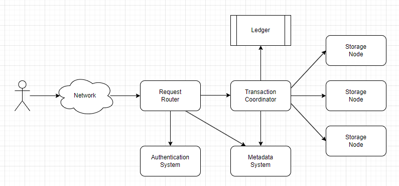

Amazon DynamoDB is one of the most prominent fully-managemed NoSQL database service offering, which advertises a predictable performance with high availablity and high scalability. Recently DynamoDB has added the support for distributed transactions with the help of timestamp ordering protocol. The transactions are atomic in nature, and combining isolation with this ensures that developers don't have to worry about concurrent requests or any partial execution of transactions. In this blog post, we would explore on the technique that Amazon has employed to support transactions on DynamoDB.

### Key Natures of Transactions:
1. DynamoDB transactions contain a set of operations and are submitted as a single request, which either gets succeeded or failed without blocking any requests
2. The transactional requests rely on a transactional co-ordinator for the two-phase protocol, whereas the non-transactional requests are directly sent to the associated storage node
3. Transactions update items in place. MVCC(Multi-Version Concurrency Control) is one of the most prominent ways to make sure the read operations are reading the old version of data, whereas the transaction can proceed with updating the items with newer versions. Due to storage cost, this approach is avoided in DynamoDB, however, due to this read-only and read-write operations can conflict.
4. DynamoDB transactions don't acquire a lock. Locking restricts the possible concurrency, and also might get into a deadlock scenario, for which one more module is needed to recover from it. DynamoDB uses an optimistic concurrency control mechanism to avoid locking.
5. Transactions are serially ordered using timestamps. 

### APIs:
1. Non-transactional Operations: PutItem, GetItem, UpdateItem, DeleteItem
2. Transactional Operations:
    - TransactGetItems: Performs read operation (GetItem) on a set of items from a consistent snapshot 
    - TransactWriteItems: Performs read and write operations (PutItem, GetItem, UpdateItem, DeleteItem) on a set of items including CheckItem
    - CheckItem: Verifies that the latest value of an item satisfies the provided condition


Both TransactGetItems and TransactWriteItems are synchronous and idempotent. If there's any read or write operation on an item when it's getting modified by another operation, the request is rejected. Also, a Client Request Token is used with each transaction to ensure idempotency.


### Transaction Routing



All the DynamoDB operations are sent to a fleet of front-end hosts named request routers. The request route authenticates the requests and redirects the non-transactional requests to the storage node containing the key. The key-range information is stored in the metadata system. The transaction requests have got one extra hop. The request routers forward the transactional request to the transactional coordinator, which then breaks the transaction, and co-ordinates with the associated storage nodes to complete the transaction in a two-phased way.

### Write transaction protocol:

```
TransactWriteItem(TransactWriteItems input):
    # Prepare all the items
    TransactionState = PREPARING
    for operation in input:
        sendPrepareAsyncToStorageNode(operation)
    
    waitForAllPreparesToComplete()

    # Evaluate whether to commit or cancel the transaction
    if all prepares succeeded:
        TransactionState = COMITTING
        for operation in input:
            sendCommitAsyncToStorageNode(operation)
        waitForAllCommitsToComplete()
        TransactionState = COMPLETED
        return Success
    else:
        TransactionState = CANCELLING
        for operation in input:
            sendCancellationAsyncToStorageNode(operation)
        waitForAllCancellationsToComplete()
        TransactionState = COMPLETED
        return ReasonForCancellation
```
In the first phase, the transactional coordinator prepares the items to be impacted due to the transaction, in the second phase if all the items are prepared successfully, the operations are performed.

```
def processPrepare(PrepareInput input):
    item = readItem(input)

    if item is not None:
        if evaluateConditionsOnItem(item, input.conditions)
            AND evaluateSystemRestrictions(item, input)
            AND item.timestamp < input.timestamp
            AND item.ongoingTransactions == NONE:
                item.ongoingTransactionId = input.TransactionId
                return SUCCESS
        else:
            return FAILED
    else: # Item does not exists
        item = new Item(input.item)
        if evaluateConditionsOnItem(item, input.conditions)
            AND evaluateSystemRestrictions(item, input)
            AND partition.maxDeleteTimestamp < input.timestamp
            AND item.ongoingTransactions == NONE:
                item.ongoingTransactionId = input.TransactionId
                return SUCCESS
        else:
            return FAILED
```

When an item is deleted, the latest delete operation timestamp is stored on the partition level as maxDeleteTimestamp. And DynamoDB rejects any operation for non-existing items if the transaction time is earlier than it. Though this approach incurs some cancellation compared to the approach of maintaining tombstones for delete operations, however, that would also incur some extra overhead in terms of storage and garbage collection.

Once all the storage nodes have accepted the prepared statements, the transaction coordinator commits the transaction. This second phase is the one where all the write operations take place. For each successful write operation, the item timestamp is also updated with the transaction timestamp.

It's to be noted that all the write operations irrespective of transactional or non-transactional, updates the item timestamp.


### Read transaction protocol:

Read transactions also follow a similar two-phase protocol, albeit in a write-less way. In the first phase, the transaction coordinator reads all the items from the associated storage nodes. In case there's any conflict with any write operation, the read operation is rejected. If the read operation is succeeded, the storage node sends the current committed Log Sequence Number(LSN) of the storage node. If all the operations are succeeded in the first phase, the same operations are again performed in the second phase. If the LSN of the associated storage nodes hasn't changed, then the read transaction is marked as successful, and the values are returned.

It's to be noted that for both successful and failure scenarios, the LSN of the storage node is returned. And LSN increases monotonically. Thus the transaction coordinator can re-drive the operations with some cool-off time again, rather than aborting the transaction.

### Recovery and Fault Tolerance:
The transaction coordinator is not aware of any failover of storage nodes. If any of the storage nodes goes down, the leadership takes care of that and fails over to a different storage node. However, as the transaction-related information is already persisted and replicated, hence the ongoing transaction doesn't see any interruption due to node failure.

However there's still one bottleneck for transactions, and it's the transaction coordinator itself. The transaction coordinator maintains a persistent record of all the transactions and the outcomes in a ledger. There's a recovery manager who periodically checks for a probable stalled transaction, by checking if the transaction waited for a longer time, and reassigns them to a different transaction coordinator to resume the transaction. Multiple recovery manager scans the ledger, and they start scanning the centralized ledger from a random index and up to a thousand transactions. Even if the same transaction is picked up by multiple transaction coordinators, then also it's fine, as the same write requests are ignored by the storage nodes.

Storage nodes also can invoke the recovery manager by providing the transaction id, in case it gets a read or write request on a pending item and a significant time is passed after the transaction is initiated. 


### To explore:
- How Client Request Tokens are used to ensure idempotency?
- How storage nodes use LSN? And how it's used for fault-tolerance of the storage node?

### References:
1. Idziorek, Joseph, Alex Keyes, Colin Lazier, Somu Perianayagam, Prithvi Ramanathan, James Christopher Sorenson III, Doug Terry, and Akshat Vig. "Distributed Transactions at Scale in Amazon {DynamoDB}." In 2023 USENIX Annual Technical Conference (USENIX ATC 23), pp. 705-717. 2023.
