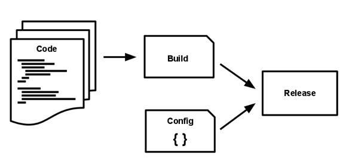

Twelve-Factor App provides an overview of how a modern distributed system is supposed to work. It provides guidelines to standardize the process to ensure the distributed nature of the application. 

### The 12 Factors:
1. **Codebase**
- Codebase is always tracked through a version control system
- 1:1 mapping between repository and system
	- If multiple repos involved, then it supposed to be a distributed system
- There can be multiple deployment stages, but only one repo

2. **Dependency**
- Never assume any implicit dependency, always declare the dependencies independently 
- Helps in containerizing the app

3. **Config**
- Have all the attributes that can vary based on deployments in a config file
	- Such attributes include resource and credentials
- Litmus Test: Even if source code gets leaked, none of the credentials gets compromised

4. **Backing services**
- Backing service: Any service that the app consumers as part of operational activities
- Treat backing services as attached resource
- Resources can be swapped without making any explicit changes in the codebase
- Info related to attached resources is supposed to be on config files

5. **Build, release, run**
- Have strict separation between the build, release & run stages
	- Build: Convert repo to executable binaries 
    - Release: Take the build and deploy using the configuration
    - Run: Launches the app, and ready for executions
    
    
 
6. **Process**
- Execute the app as one or more stateless processes and should share-nothing
- Any data that needs to be stored, must be retained in persistent storage as part of the backing services
- Stateless process also denotes the removal of sticky sessions from load-balancers

7. **Port binding**
- App is completely self-contained and doesn't rely on runtime injection of the system to create a web-server
- User-facing services are created entirely on the user space, within the app's code

8. **Concurrency**
- Scale out via the process model
- The share-nothing, horizontally partitionable nature of twelve-factor app processes means that adding more concurrency is a simple and reliable operation

9. **Disposability**
- Processes are disposable: they can be started or stopped at a moment's notice.
- Robustness against sudden failure: even for hardware, a queing system might be helpful here

10. **Dev/prod parity**
- Keep development, staging, and production as similar as possible
- Resist the urge to use different backing services between development and production

11. **Logs**
- Treat logs as event streams
- Never concerns itself with routing or storage of its output stream
- The event stream for an app can be routed to a file, or watched via real-time tail in a terminal. Most significantly, the stream can be sent to a log indexing and analysis system, or a general-purpose data warehousing system

12. **Admin processes**
- Run admin/management tasks as one-off processes

For more information on the 12-Factor-App, please check the [link here: 12factor.net](https://12factor.net/).
