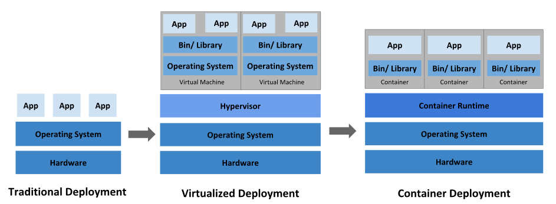
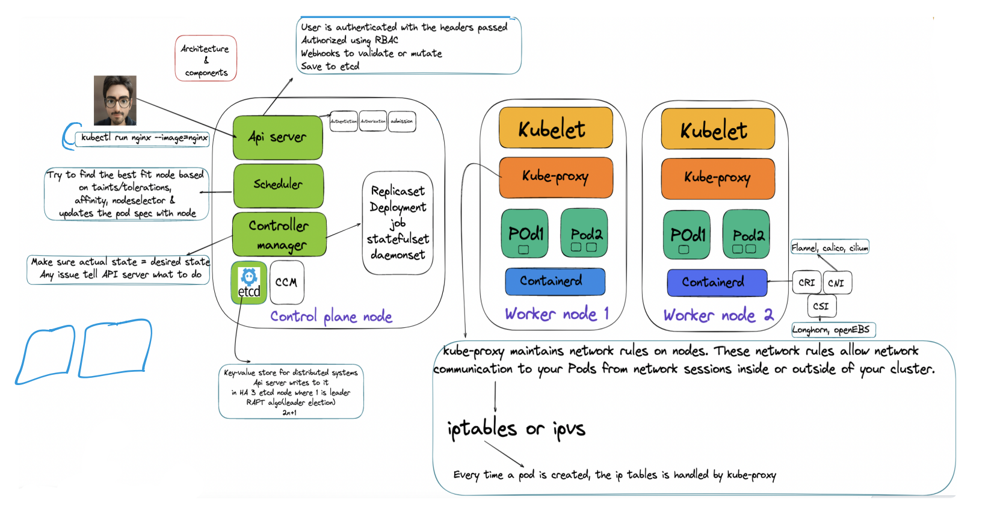
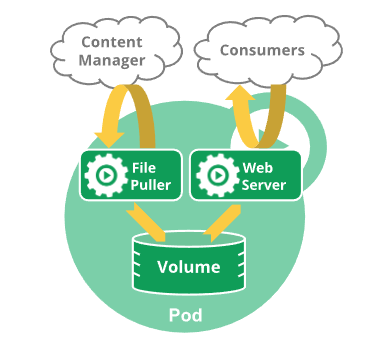

Kubernetes provides an option to manage containerized workloads. In this document, we will study the components of Kubernetes to get an overview of it, and how it enables us to serve a large number of requests.

## Background:
Earlier in the traditional deployment era, all the applications were used to run on the same physical server, thus all applications were using the same set of libraries, and in case there was some issue with the dependencies or one application can hog the system resources thus restricting rest of the application from serving requests. Virtualized deployment provided a solution to this, by spreading applications throughout multiple VMs. Containerization of applications provides another layer of optimization, where the need to use different OS is diminished, thus using the same Operating System for all the containerized applications. The containerized application contains only the package's code and dependencies.




## Kubernetes Components
Kubernetes cluster consists of a **Control plane** and **worker nodes**. Worker nodes host the PODs, unit of containerization, and consist of one or multiple containers. The control plane manages the worker nodes and can run in multiple nodes for fault tolerance and high availability.

Each container executes a container image that contains the application binary along with the libraries and runtime needed to execute the application.



Two ways to interact with Kubernetes:
  1. Imperative object configuration by specifying configuration details directly through the kubectl command
  2. Declarative object configuration by specifying configuration in YAML or JSON file


### Label Selectors: 
Labels are key-value pairs attached to resources, and multiple resources can have the same key-value pair, which also helps group similar resources by use of selectors

Two types of selectors:
  1. Equality based selector:
        ```yaml
          apiVersion: v1
          kind: Pod
          metadata:
            name: cuda-test
          spec:
            containers:
              - name: cuda-test
                image: "registry.k8s.io/cuda-vector-add:v0.1"
                resources:
                  limits:
                    nvidia.com/gpu: 1
            nodeSelector:
              accelerator: nvidia-tesla-p100
        ```

  2. Set based selector:
      ```yaml
        selector:
          matchLabels:
            component: redis
          matchExpressions:
            - {key: tier, operator: In, values: [cache]}
            - {key: environment, operator: NotIn, values: [dev]}
      ```


##### Question: Does the selectors work with and or or by default?


### Namespaces: 
Provides a mechanism, a scope for the name of the resources, to isolate a group of resources within the same cluster. Resource names should be unique in a particular namespace. Namespaces cannot be nested inside one another and each Kubernetes resource can only be in one namespace.

  ```bash
    kubectl get ns
    kubectl create ns <insert-namespace-name-here>
    kubectl config set-context --current --namespace=<insert-namespace-name-here>
    kubectl get pods --namespace=<insert-namespace-name-here>
  ```


### Container: 
imagePullPolicy: IfNotPresent/Always/Never

```yaml
  apiVersion: v1
  kind: Pod
  metadata:
  name: foo
  namespace: awesomeapps
  spec:
  containers:
      - name: foo
      image: janedoe/awesomeapp:v1
  imagePullSecrets:
      - name: myregistryke
```

###### To make sure the Pod always uses the same version of a container image, you can specify the image's digest; replace ```<image-name>:<tag> with <image-name>@<digest>``` (for example, image@sha256:45b23dee08af5e43a7fea6c4cf9c25ccf269ee113168c19722f87876677c5cb2).

### POD:
A Pod (as in a pod of whales or pea pod) is a group of one or more containers, with shared storage and network resources, and a specification for how to run the containers. A Pod's contents are always co-located and co-scheduled and run in a shared context.

```yaml
apiVersion: v1
kind: Pod
metadata:
name: nginx
spec:
containers:
- name: nginx
  image: nginx:1.14.2
  ports:
  - containerPort: 80
```

Rather than creating pods individually, it's better to use a controller. The controller handles the replication and rollout mechanisms. For example, in case a node goes down, the replication rule will ensure the required number of PODs is up. For example, you might have a container that acts as a web server for files in a shared volume, and a separate "sidecar" container that updates those files from a remote source, as in the following diagram:



##### Question: How containers inside POD can comminucate with each other?

### Container States: Waiting/Running/Terminated

### Container probes: 
Mechanisms:
  1. exec: Executes specified command in the container, and is successful only if the return code is 0
  2. grpc:
  3. httpGet: GET request to the specified URL and port returns http status code on the range of 2xx and 3xx
  4. tcpSocket: checks a TCP connection against specified port 

Probe Outcome: Success/ Failure/ Unknown

Types of probes:
1. livenessProbe: determines whether container is running
2. readinessProbe: determines whether container is ready to accespt incoming requests
3. startupProbe: indicates application is ready, all other probes wait for startupProbe to get completed

##### Question: What happens of each type of probe is failed with practical example?

### Init Container:
Init containers are exactly like regular containers, except:
- Init containers always run to completion.
- Each init container must complete successfully before the next one starts.

If a Pod's init container fails, the kubelet repeatedly restarts that init container until it succeeds. However, if the Pod has a restartPolicy of Never, and an init container fails during startup of that Pod, Kubernetes treats the overall Pod as failed.

Also, init containers do not support lifecycle, livenessProbe, readinessProbe, or startupProbe because they must run to completion before the Pod can be ready. If you specify multiple init containers for a Pod, kubelet runs each init container sequentially. Each init container must succeed before the next can run. When all of the init containers have run to completion, kubelet initializes the application containers for the Pod and runs them as usual.

```
apiVersion: v1
kind: Pod
metadata:
  name: myapp-pod
  labels:
    app.kubernetes.io/name: MyApp
spec:
  containers:
  - name: myapp-container
    image: busybox:1.28
    command: ['sh', '-c', 'echo The app is running! && sleep 3600']
  initContainers:
  - name: init-myservice
    image: busybox:1.28
    command: ['sh', '-c', "until nslookup myservice.$(cat /var/run/secrets/kubernetes.io/serviceaccount/namespace).svc.cluster.local; do echo waiting for myservice; sleep 2; done"]
   - name: init-mydb
     image: busybox:1.28
     command: ['sh', '-c', "until nslookup mydb.$(cat /var/run/secrets/kubernetes.io/serviceaccount/namespace).svc.cluster.local; do echo waiting for mydb; sleep 2; done"]
```

```bash
kubectl apply -f myapp.yaml
kubectl get -f myapp.yaml
kubectl describe -f myapp.yaml
```

##### Question: How pods and namespaces are related? How selectors work on namespaces?


### Annotations: 
This is used to add metadata to the resource like labels, however unlike labels annotations are not used to idenitify and select resources.
```json
"metadata": {
    "annotations": {
        "key1" : "value1",
        "key2" : "value2"
    }
}
```
Note: The keys and the values in the map must be strings. 
###### Question: Can labels have non-string value?

```yaml
apiVersion: v1
kind: Pod
metadata:
  name: annotations-demo
  annotations:
    imageregistry: "https://hub.docker.com/"
spec:
  containers:
  - name: nginx
    image: nginx:1.14.2
    ports:
    - containerPort: 80
```
##### Question: Can one pod definition have both labels and annotations?


### ReplicaSet: 
Ensures that a stable number of PODs are always running, gurantees availablity

    apiVersion: apps/v1
    kind: ReplicaSet
    metadata:
      name: frontend
      labels:
        app: guestbook
        tier: frontend
    spec:
      # modify replicas according to your case
      replicas: 3
      selector:
        matchLabels:
          tier: frontend
      template:
        metadata:
          labels:
            tier: frontend
        spec:
          containers:
          - name: php-redis
            image: gcr.io/google_samples/gb-frontend:v3

    kubectl get rs

    Need to make sure bare PODs doesn't have labels which matches with the selectors specified in the replicaset. As the PODs not having Controller (or any object) as their owner reference and match the selector of the frontend ReplicaSet, they will immediately be acquired by it.
 

Deployments: Higher abstraction to replica sets, provides a mechanism to change to desired state in a controlled way through replica sets.

      apiVersion: apps/v1
      kind: Deployment
      metadata:
        name: nginx-deployment
        labels:
          app: nginx
      spec:
        replicas: 3
        selector:
          matchLabels:
            app: nginx
        template:
          metadata:
            labels:
              app: nginx
          spec:
            containers:
            - name: nginx
              image: nginx:1.14.2
              ports:
              - containerPort: 80


    Note: You must specify an appropriate selector and Pod template labels in a Deployment (in this case, app: nginx). Do not overlap labels or selectors with other controllers (including other Deployments and StatefulSets). Kubernetes doesn't stop you from overlapping, and if multiple controllers have overlapping selectors those controllers might conflict and behave unexpectedly.

    Pod-template-hash label: This label ensures that child ReplicaSets of a Deployment do not overlap. It is generated by hashing the PodTemplate of the ReplicaSet and using the resulting hash as the label value that is added to the ReplicaSet selector, Pod template labels, and in any existing Pods that the ReplicaSet might have.


    Rollover: If you update a Deployment while an existing rollout is in progress, the Deployment creates a new ReplicaSet as per the update and start scaling that up, and rolls over the ReplicaSet that it was scaling up previously -- it will add it to its list of old ReplicaSets and start scaling it down. For example, suppose you create a Deployment to create 5 replicas of nginx:1.14.2, but then update the Deployment to create 5 replicas of nginx:1.16.1, when only 3 replicas of nginx:1.14.2 had been created. In that case, the Deployment immediately starts killing the 3 nginx:1.14.2 Pods that it had created, and starts creating nginx:1.16.1 Pods. It does not wait for the 5 replicas of nginx:1.14.2 to be created before changing course.

    Question: Does rollout occurs immediately after the configuration change is applied?

    Label Selectors Update: It is generally discouraged to make label selector updates and it is suggested to plan your selectors up front. In any case, if you need to perform a label selector update, exercise great caution and make sure you have grasped all of the implications.

    Note: A Deployment's revision is created when a Deployment's rollout is triggered. This means that the new revision is created if and only if the Deployment's Pod template (.spec.template) is changed, for example if you update the labels or container images of the template. Other updates, such as scaling the Deployment, do not create a Deployment revision, so that you can facilitate simultaneous manual- or auto-scaling. This means that when you roll back to an earlier revision, only the Deployment's Pod template part is rolled back.

    Note: The Deployment controller stops the bad rollout automatically, and stops scaling up the new ReplicaSet. This depends on the rollingUpdate parameters (maxUnavailable specifically) that you have specified. Kubernetes by default sets the value to 25%.


    kubectl describe deployment
    kubectl rollout history deployment/nginx-deployment
    kubectl rollout status deployment/nginx-deployment

    kubectl rollout undo deployment/nginx-deployment
    kubectl rollout undo deployment/nginx-deployment --to-revision=2
    kubectl get deployment nginx-deployment


    Pausing and Resuming a rollout of a Deployment: When you update a Deployment, or plan to, you can pause rollouts for that Deployment before you trigger one or more updates. When you're ready to apply those changes, you resume rollouts for the Deployment. This approach allows you to apply multiple fixes in between pausing and resuming without triggering unnecessary rollouts.

        kubectl rollout pause deployment/nginx-deployment
        kubectl rollout resume deployment/nginx-deployment

    Failed deployment: Deployment may get stuck trying to deploy its newest ReplicaSet without ever completing. One way you can detect this condition is to specify a deadline parameter in your Deployment spec: (.spec.progressDeadlineSeconds). .spec.progressDeadlineSeconds denotes the number of seconds the Deployment controller waits before indicating (in the Deployment status) that the Deployment progress has stalled.

    Kubernetes takes no action on a stalled Deployment other than to report a status condition with reason: ProgressDeadlineExceeded. Higher level orchestrators can take advantage of it and act accordingly, for example, rollback the Deployment to its previous version. If you pause a Deployment rollout, Kubernetes does not check progress against your specified deadline. You can safely pause a Deployment rollout in the middle of a rollout and resume without triggering the condition for exceeding the deadline.


StatefulSet:
    Like a Deployment, a StatefulSet manages Pods that are based on an identical container spec. Unlike a Deployment, a StatefulSet maintains a sticky identity for each of their Pods. These pods are created from the same spec, but are not interchangeable: each has a persistent identifier that it maintains across any rescheduling.

    Practical Example??
    How statefulSet works with volumes & storage class?
    How statefulSet works with headless Service?


Job: A Job creates one or more Pods and will continue to retry execution of the Pods until a specified number of them successfully terminate. As pods successfully complete, the Job tracks the successful completions. When a specified number of successful completions is reached, the task (ie, Job) is complete. Deleting a Job will clean up the Pods it created. Suspending a Job will delete its active Pods until the Job is resumed again.

      Example?

CronJob:  CronJob creates Jobs on a repeating schedule. One CronJob object is like one line of a crontab (cron table) file. It runs a job periodically on a given schedule, written in Cron format. 
        apiVersion: batch/v1
        kind: CronJob
        metadata:
          name: hello
        spec:
          schedule: "* * * * *"
          jobTemplate:
            spec:
              template:
                spec:
                  containers:
                  - name: hello
                    image: busybox:1.28
                    imagePullPolicy: IfNotPresent
                    command:
                    - /bin/sh
                    - -c
                    - date; echo Hello from the Kubernetes cluster
                  restartPolicy: OnFailure


          # ┌───────────── minute (0 - 59)
          # │ ┌───────────── hour (0 - 23)
          # │ │ ┌───────────── day of the month (1 - 31)
          # │ │ │ ┌───────────── month (1 - 12)
          # │ │ │ │ ┌───────────── day of the week (0 - 6) (Sunday to Saturday;
          # │ │ │ │ │                                   7 is also Sunday on some systems)
          # │ │ │ │ │                                   OR sun, mon, tue, wed, thu, fri, sat
          # │ │ │ │ │
          # * * * * *


Enter text in [Markdown](http://daringfireball.net/projects/markdown/). Use the toolbar above, or click the **?** button for formatting help.
