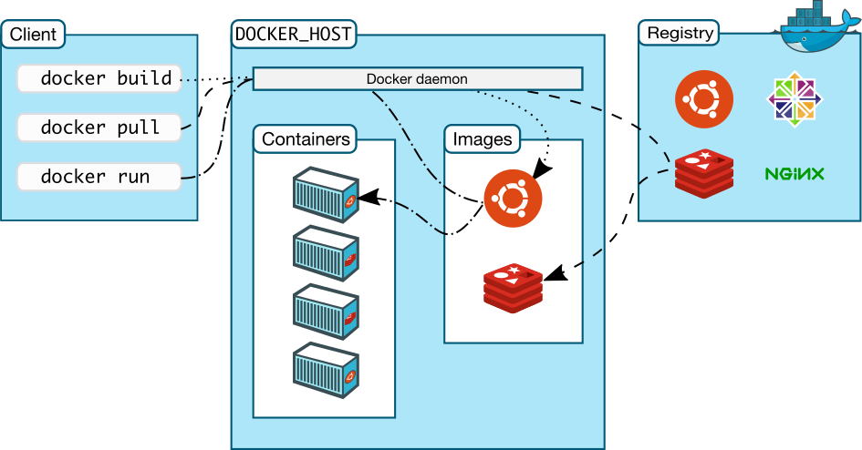
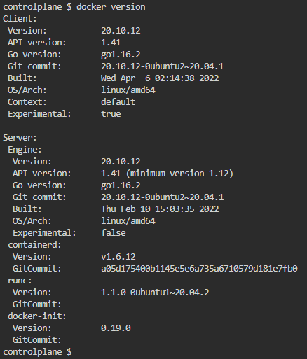
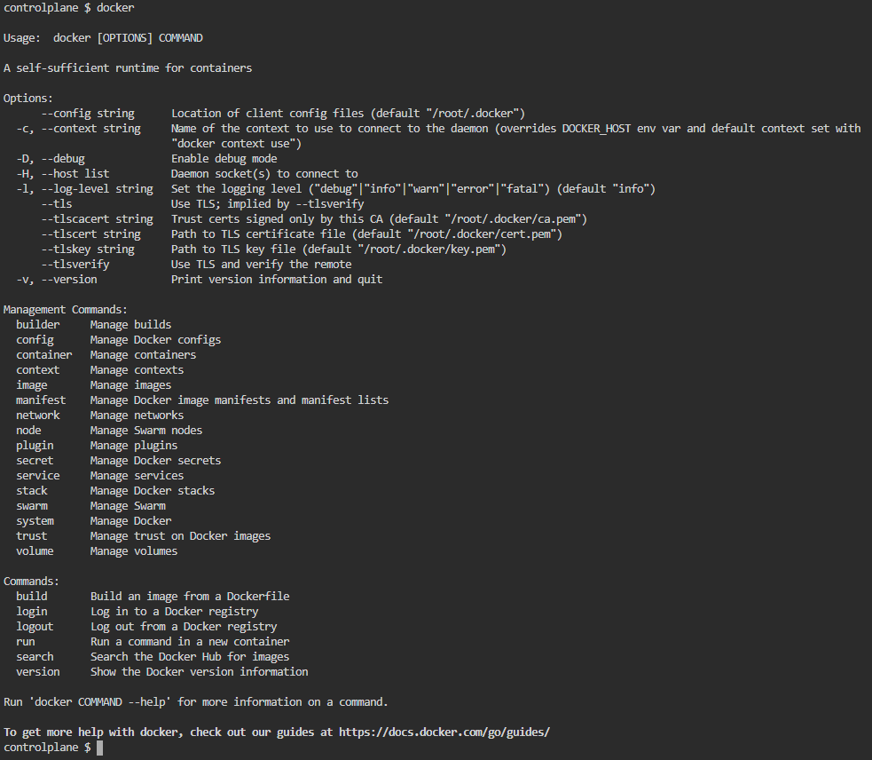

Docker provides an platform to build and deploy application on an isolated environment. The main technology behind the docker is containerization, which dictates that all the containers are self-sufficient run-time of the application, having it's own filesystem, network stack. The post here covers the fundamentals of docker, the goal here is to understand the basics, to have some experience with the docker client to create, run, inspect containers.


#### Comparision with Virtualization:

Virtualization is also a competitive technology compared to containers. However virtualization provides an abstraction on the hardware level, it slices the resources like compute, memory, and filesystem, and then installs a guest OS with the slices resources. Hence each VM has got its boot process. 

On the other hand container usees OS provided features to isolate the run-times on the process level, making it more light-weight to run a container. More on this would be explored as part of another blog post in near future.




#### Docker client:

Docker CLI is having a specific set of commands called management commands. Each such command referes to specific resource that the docker daemon manages.



Note: The majority of the docker client commands are legacy, just there for backward compatibility, and generally discouraged for new learners. These commands can be hidden by using the environemnt variable:
```sh
export DOCKER_HIDE_LEGACY_COMMANDS=true
```

#### Docker Images:
Docker images are packages that contains all the dependencies along with the application itself. It works as template to containers. Docker images are stored on the repository. The images can be pushed with the push command or can be pulled from the repostiroty using pull command. It's be noted that inorder to push the image, the image is needed to be tagged properly first. Docker repositories are more populary called as registry. There are couple of docker registries available, including the public ones supported by Docker Inc like Docker Hub, Docker Store etc, also there're some third-party Docker registry providers as well, like quay.io.

The following section provides a small example of creating a docker image from a template:

```Dockerfile
FROM debian:buster-slim

ARG NGINX_PKG_TYPE=full
ENV NGINX_PKG=nginx-${NGINX_PKG_TYPE:-full}

RUN apt-get update \
      && apt-get install -y $NGINX_PKG \
      && rm -rf /var/lib/apt/lists/* \
      && rm /var/log/nginx/access.log \
      && rm /var/log/nginx/error.log \
      && ln -s /dev/stdout /var/log/nginx/access.log \
      && ln -s /dev/stderr /var/log/nginx/error.log

COPY ./html/ /var/www/html/

CMD ["/usr/sbin/nginx", "-g", "daemon off;"]

EXPOSE 80

STOPSIGNAL SIGQUIT
```
Note: ADD is an interesting docker template instruction, which is having more functionality compared to copy, it can be used to fetch remote files, to extract compressed files automatically. More on the docker template instructions can be found here at https://docs.docker.com/engine/reference/builder/

Note: Docker provides support for ignoring files and directories to be included as part of docker image creation through the .dockerignore file

```sh
docker image build -t tisan/nginx:latest .
```

Some useful commands to manage container images:
```sh
docker image ls
docker image prune
docker image pull [OPTIONS] NAME[:TAG|@DIGEST]
docker image push [OPTIONS] NAME[:TAG]
docker image rm [OPTIONS] IMAGE [IMAGE...]
docker image tag SOURCE_IMAGE[:TAG] TARGET_IMAGE[:TAG]
```


#### Container:
Docker container is the unit of application deployment and execution runtime, which contains all the dependencies along with the executable, which ensures the application can be run in isolated environment reliably.

```sh
docker container ls
docker container run -d -p 80:80 nginx
docker container rm $(docker image ls -aq)
docker container stop 569
```
-- exec command
-- How sigkill works?

Environment variables
```sh
docker container run -it -e "PS1=val1" nginx
docker container run --env-file app.env alpine:latest
docker container run -d -e "POSTGRES_USER=myuser" -e "POSTGRES_PASSWORD=mypass" posrgres:9.6.6-alpine
```

Docker issues SIGKILL to stop the running container, and after 10 secs if the container still not stopped, SIGTERM command is used to stop it. Please check the following taken from docker wiki:
Unlike the shell form, the exec form does not invoke a command shell. This means that normal shell processing does not happen. For example, CMD [ "echo", "$HOME" ] will not do variable substitution on $HOME. If you want shell processing then either use the shell form or execute a shell directly, for example: CMD [ "sh", "-c", "echo $HOME" ]. When using the exec form and executing a shell directly, as in the case for the shell form, it is the shell that is doing the environment variable expansion, not docker.

#### Persistence Storage:
Even though docker containers are preferred to be stateless, however there's certain scenarios, where a container might need to access some external data stored on disk drive, or else might need to store some persisting data. Docker provides support for these scenarios as well.


##### 1. Bind mounts:
In this kind of mount, a directory under the host node is mounted into the container. The filesystem is managed from the host-OS directly, and not by the docker container. 

``` sh
 docker run -d --name broken-container \
  --mount type=bind,src=/tmp,dst=/usr \
  nginx:latest
  
  docker run -d -it --name devtest \
  --mount type=bind,src="$(pwd)"/target,dst=/app,readonly \
  nginx:latest
  
  docker run -d -it --name devtest \
  --mount type=bind,src="$(pwd)"/target,dst=/app \
  --mount type=bind,src="$(pwd)"/target,dst=/app2,readonly,bind-propagation=rslave \
  nginx:latest
  
```
Please note that, as these volumes are managed by the OS itself, these volumes are not listed and can't be managed by the volume management commands

##### 2.Volumes:
Volumes are another kind of persistent storage that is managed by Docker itself, unlike bind mounts.
Volumes can be easily backedup, managed either on remote hosts and cloud services, can be encrypted as well.

```sh
docker run -d \
  --name devtest \
  --mount src=myvol2,dst=/app \
  nginx:latest
```

```sh
docker volume create my-vol
docker volume ls
docker volume inspect my-vol
docker volume rm my-vol
```
Note: Inorder to check which container is associated with which volume ```docker inspect <container>``` command can be used. 

Note: Besides creating and attaching volumes at runtime, volume mount point can be added in the Dockerfile template as well using the VOLUME instruction.

More on the Docker volumes can be found at https://docs.docker.com/storage/volumes/

#### Network:
Docker not only provides the mechanism to containerize the applications, to run them on isolated environment, but it also provides mechanism to communicate with each other through network. Docker abstracts the networks on the OS-layer and provides a platform-agnostic way to manage the network, and let the containers communicate with each other, as well as communicating to the external network if required.

Docker supports different types of driver. However, bridge type is the most famous one, default one as well. Bridge networks are generally used when application running on standalone containers need to communicate. It's to be noted that the default bridge network doesn't have naming resolution enabled, however the user-defined bridge networks are having this facility.

Docker template specifies the intended port to be exposed, however docker container runtime doesn't expose them by default. The ports are exposed only when they're bound to the ports of the host. 
```sh
docker container run -d -p 80:80 -p 81:81 nginx
docker container run -d -p 80-99:80-99 nginx
docker container run -p 80 nginx ==> bind port to any random port of host
docker container run -P nginx ==> publish all ports to the random ports of host
```

```sh
docker network create mynet
docker network ls
docker network inspect mynet
docker container run -d --network mynet nginx
docker network rm mynet
```

Docker network also provides support for network alias in the context of a particular network, which is resolved at run-time. It's to be noted that this automatic name resolution feature is only available through the User Defined Networks. This particular functionality can be used as a load-balancing service. Example:

Step 01: Running 3 docker containers with the alias webserver under mynet bridge network:
```sh
controlplane $ docker network create mynet
d33eaac93f4cb0161f3b8050b11f2a6a6f4e3ca1647fdc94505884cc1be1a1cb
controlplane $ 
controlplane $ docker container run -d -p 8080:80 --network mynet --network-alias webserver nginx
e69f3a1ab0ef97540d6e10c4ab2c32f449facdde909f41e1f59e9f5e0c3fceb4
controlplane $ docker container run -d -p 8081:80 --network mynet --network-alias webserver nginx
4f56391bfd76e78ff6866dc4dd67b5c26f8254c6834bc48f9c1debf59716e800
controlplane $ docker container run -d -p 8082:80 --network mynet --network-alias webserver nginx
9543c33aea2f59d28c587754591b6a1e8b3618661fc5d9a3ac0aafdf4f361f41
controlplane $
```

Step 02: The configured alias is not resolved from container attach to other networks:
```sh
controlplane $ docker container run -it alpine sh
Unable to find image 'alpine:latest' locally
latest: Pulling from library/alpine
8921db27df28: Pull complete 
Digest: sha256:f271e74b17ced29b915d351685fd4644785c6d1559dd1f2d4189a5e851ef753a
Status: Downloaded newer image for alpine:latest
/ # ping webserver
ping: bad address 'webserver'
/ # ping webserver^C
/ # exit
controlplane $
```

Step 03: The configured alias is resolved from the container attached to the same mynet bridge network, and resolving to one of the associated container in round-robin fashoin:
```sh
controlplane $ docker container run --network mynet -it alpine sh
/ # ping webserver
PING webserver (172.18.0.4): 56 data bytes
64 bytes from 172.18.0.4: seq=0 ttl=64 time=0.084 ms
64 bytes from 172.18.0.4: seq=1 ttl=64 time=0.062 ms
^C
--- webserver ping statistics ---
2 packets transmitted, 2 packets received, 0% packet loss
round-trip min/avg/max = 0.062/0.073/0.084 ms
/ # ping webserver
PING webserver (172.18.0.3): 56 data bytes
64 bytes from 172.18.0.3: seq=0 ttl=64 time=0.160 ms
64 bytes from 172.18.0.3: seq=1 ttl=64 time=0.065 ms
64 bytes from 172.18.0.3: seq=2 ttl=64 time=0.059 ms
^C
--- webserver ping statistics ---
3 packets transmitted, 3 packets received, 0% packet loss
round-trip min/avg/max = 0.059/0.094/0.160 ms
/ # ping webserver
PING webserver (172.18.0.4): 56 data bytes
64 bytes from 172.18.0.4: seq=0 ttl=64 time=0.058 ms
64 bytes from 172.18.0.4: seq=1 ttl=64 time=0.076 ms
64 bytes from 172.18.0.4: seq=2 ttl=64 time=0.053 ms
^C
--- webserver ping statistics ---
3 packets transmitted, 3 packets received, 0% packet loss
round-trip min/avg/max = 0.053/0.062/0.076 ms
/ # ping webserver
PING webserver (172.18.0.2): 56 data bytes
64 bytes from 172.18.0.2: seq=0 ttl=64 time=0.089 ms
64 bytes from 172.18.0.2: seq=1 ttl=64 time=0.057 ms
^C
--- webserver ping statistics ---
2 packets transmitted, 2 packets received, 0% packet loss
round-trip min/avg/max = 0.057/0.073/0.089 ms
/ # ping webserver
PING webserver (172.18.0.2): 56 data bytes
64 bytes from 172.18.0.2: seq=0 ttl=64 time=0.086 ms
64 bytes from 172.18.0.2: seq=1 ttl=64 time=0.086 ms
^C
--- webserver ping statistics ---
2 packets transmitted, 2 packets received, 0% packet loss
round-trip min/avg/max = 0.086/0.086/0.086 ms
/ # exit
controlplane $
```

