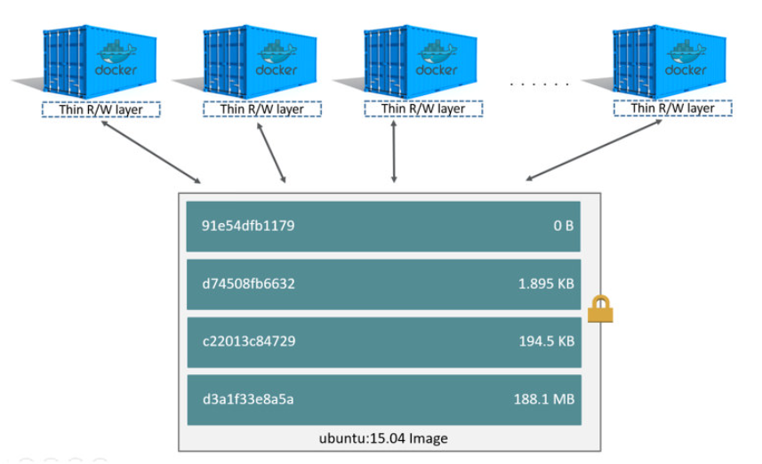
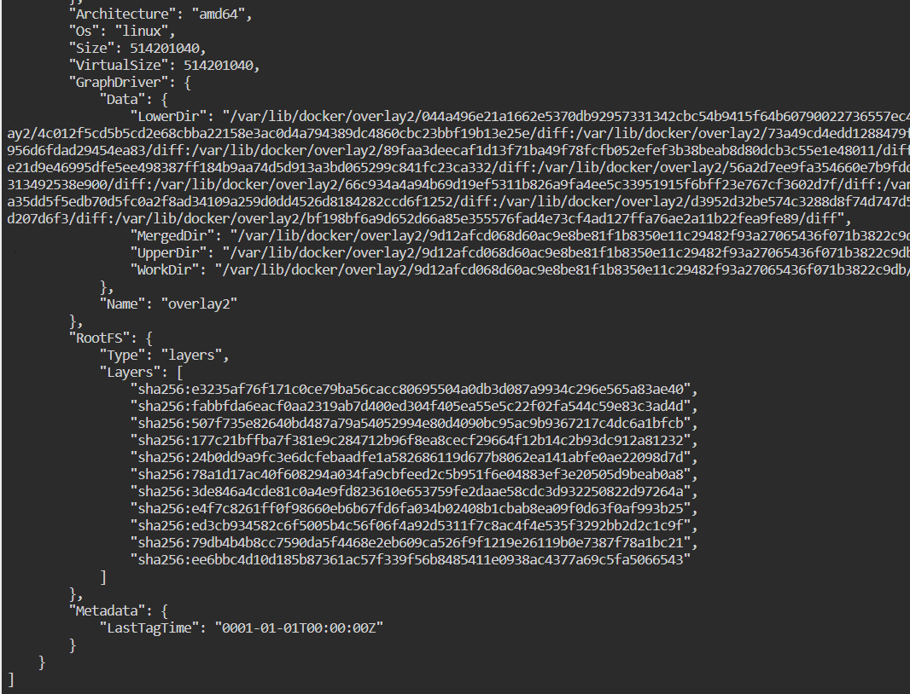
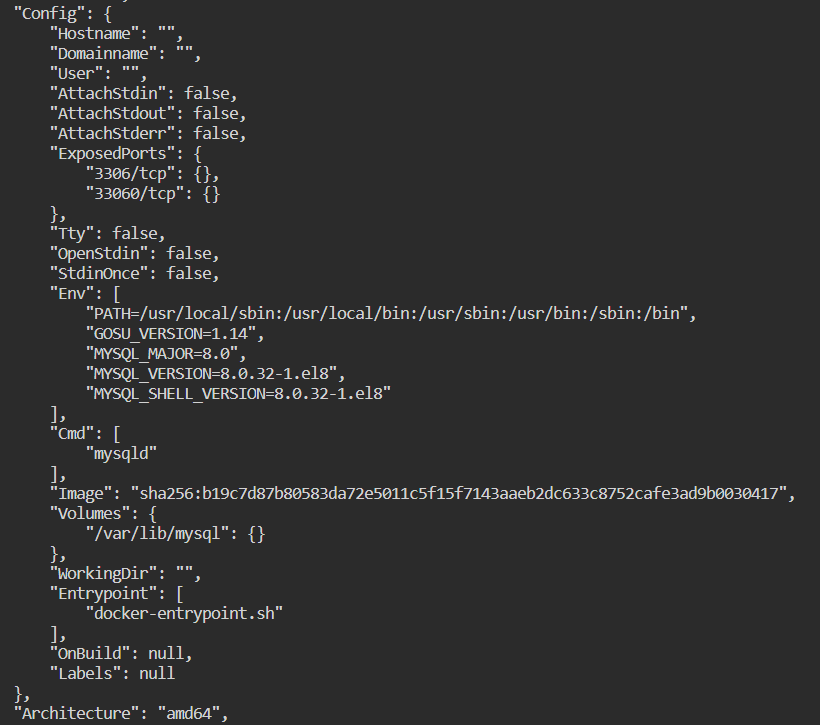
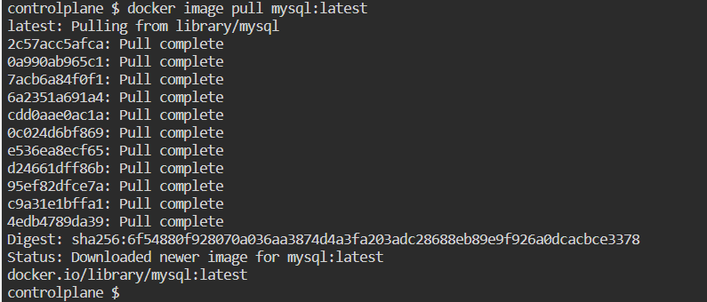
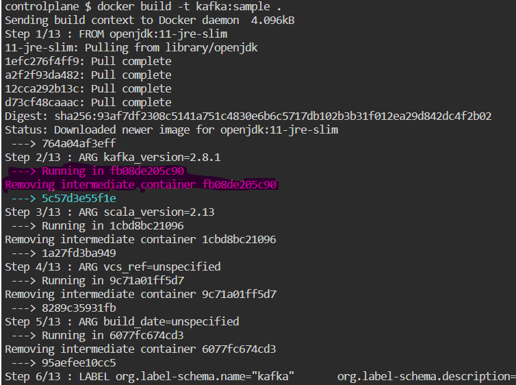

This blog post is written to jot down several concepts of Docker, which are generally not needed for day-to-day activities for the majority of the tasks, however, these concepts provide an overview of the working principles of Docker.

#### Concept 01: Docker Image is built with layers
Dockerfile provides a template, a set of instructions, to create an image. For each instruction that changes the file system, the resultant file system with the change is stored as a layer. It's to be noted that only RUN, ADD, and COPY instructions are the one that makes changes to the file system. 


Docker image contains the SHA of the layers:


The instructions that are not updating the filesystem are stored as metadata and are generally can be inspected as part of the config portion of the image.



Note: Remote images do also contain intermediate steps, however, those intermediate layers aren't generally pulled from the repository.

Docker ImageIDs are nothing but SHA-256 of the image configuration along with metadata.

Pulling image pulls all the file-system layers used while creating the image:



##### Chaining Instruction:
Chaining multiple instructions into one leads less number of intermediate layer generation

```Dockerfile
RUN addgroup --gid 10001 --system nonroot \
    && adduser  --uid 10000 --system --ingroup nonroot --home /home/nonroot nonroot
```

#### Concept 02: Docker images are built using containers

While building images, docker looks into the cache to check whether the resultant file-system layer is already present. In case it's available, Docker directly uses the layer unless ```--no-cache``` option is specified. Otherwise, the image layer is built using a container.




##### Dangling Image:

Dangling images are those images that don't have a tag and are not getting used by any of the child images. 
This is generally observed, when the same image is built multiple times, on the same system. Now due to some changes, earlier intermediate layers generated are ignored, and new image layers are built. In those cases the earlier intermediate layers get dangled. The same can be observed for non-intermediate images as well.

```sh
docker image prune
docker image prune -a
```

Following is one example of dangling images, which are removed by ```prune``` command:

```sh
controlplane $ docker image ls 
REPOSITORY   TAG            IMAGE ID       CREATED          SIZE
nginx        local-latest   e0a214320b0a   5 seconds ago    19.8MB
<none>       <none>         3b72215145a7   15 seconds ago   19.8MB
<none>       <none>         5b586e746dad   14 minutes ago   19.8MB
mysql        latest         b939d379d46e   3 days ago       514MB
alpine       latest         042a816809aa   12 days ago      7.05MB
controlplane $ docker image ls -a
REPOSITORY   TAG            IMAGE ID       CREATED          SIZE
nginx        local-latest   e0a214320b0a   6 seconds ago    19.8MB
<none>       <none>         692111866638   6 seconds ago    19.8MB
<none>       <none>         fe53b7599675   6 seconds ago    19.8MB
<none>       <none>         59585342f7e0   8 seconds ago    7.11MB
<none>       <none>         c3c5c3cad310   8 seconds ago    7.11MB
<none>       <none>         2a4d5fd1a76d   10 seconds ago   7.05MB
<none>       <none>         3b72215145a7   16 seconds ago   19.8MB
<none>       <none>         7eeb365c8a5f   16 seconds ago   19.8MB
<none>       <none>         c2677c186ca0   16 seconds ago   19.8MB
<none>       <none>         7b5c296fa9be   18 seconds ago   7.11MB
<none>       <none>         40a5849bc1e3   18 seconds ago   7.11MB
<none>       <none>         73a04ac046c6   20 seconds ago   7.05MB
<none>       <none>         5b586e746dad   14 minutes ago   19.8MB
<none>       <none>         89e953680cf6   14 minutes ago   19.8MB
<none>       <none>         a8928b23706c   14 minutes ago   19.8MB
<none>       <none>         c497367d2392   14 minutes ago   7.11MB
<none>       <none>         c6c8b4695b12   14 minutes ago   7.11MB
<none>       <none>         308ff6acf99b   14 minutes ago   7.05MB
mysql        latest         b939d379d46e   3 days ago       514MB
alpine       latest         042a816809aa   12 days ago      7.05MB
controlplane $ docker image prune 
WARNING! This will remove all dangling images.
Are you sure you want to continue? [y/N] y
Deleted Images:
deleted: sha256:5b586e746dad33dde3e10535f87e49bf17499ecd53d583926f3d5bcac5df8293
deleted: sha256:89e953680cf6c9726a6e6e975a02993e965529fb3fb0172e5dbbbaae8c7d795a
deleted: sha256:a8928b23706cbea83407a9d8400a1dbb2829188c70cf0ac82e88fb233ed2bac5
deleted: sha256:049caba1440e93de8b09e09a615e273ddd749386052725e3505e09dacdb83b3a
deleted: sha256:c497367d2392524594d36903af2aeb3f2fcd44ee384c15ff45ff6885d2439ded
deleted: sha256:c6c8b4695b125e8adac1e1448869626393f53e6869e161892a513cb8f78c3cd2
deleted: sha256:b863e257c4d12566cbf3aa1c4db63603018a7c216f11fa40c9c38da27b97eaff
deleted: sha256:308ff6acf99bcdfc3e995969f6b553c72573694291bffac1d80299c57555fea4
deleted: sha256:11b99bf502e60c91f77834a7fccc81702e60766bf3fe5f22e36fe5bdf0738fee
deleted: sha256:3b72215145a7fe9687109c165d653139d5237d7754c90f52edf8e8a72de20b8d
deleted: sha256:7eeb365c8a5f79965422f6682fb3e10ea86729d7bf79e91082c3a262d7576934
deleted: sha256:c2677c186ca0e1cc0322414348d139112b655fcaad1e0ec34185aa065f5c6721
deleted: sha256:865eb417729972f7cd94e148dd995959c18b371c5e4e2cbc63613007864ad8e1
deleted: sha256:7b5c296fa9be292eb7dea2582e37f48f22e277d1d24f7d26038be134a8261364
deleted: sha256:40a5849bc1e36728b78db5e7c90121597141731b136ad2c8484af101d258b738
deleted: sha256:1bd8d7662cf391b015b83b2c0945215f869b566052da049cf71637b27216ff59
deleted: sha256:73a04ac046c655612c7862255e884d52ef3e608a933c6933ebd7529cf9575b4c
deleted: sha256:da45afb71dfbd25a44a5ff11bf7c0df5a67436de1932640a0f762b5de75ff9fa

Total reclaimed space: 25.44MB
controlplane $ docker image ls   
REPOSITORY   TAG            IMAGE ID       CREATED          SIZE
nginx        local-latest   e0a214320b0a   20 seconds ago   19.8MB
mysql        latest         b939d379d46e   3 days ago       514MB
alpine       latest         042a816809aa   12 days ago      7.05MB
controlplane $ docker image ls -a
REPOSITORY   TAG            IMAGE ID       CREATED          SIZE
<none>       <none>         fe53b7599675   23 seconds ago   19.8MB
nginx        local-latest   e0a214320b0a   23 seconds ago   19.8MB
<none>       <none>         692111866638   23 seconds ago   19.8MB
<none>       <none>         59585342f7e0   25 seconds ago   7.11MB
<none>       <none>         c3c5c3cad310   25 seconds ago   7.11MB
<none>       <none>         2a4d5fd1a76d   27 seconds ago   7.05MB
mysql        latest         b939d379d46e   3 days ago       514MB
alpine       latest         042a816809aa   12 days ago      7.05MB
controlplane $ 
```
#### Concept 03: Workdir & Volume:

```Dockerfile
WORKDIR /path/to/workdir
```

The WORKDIR instruction sets the working directory for any RUN, CMD, ENTRYPOINT, COPY and ADD instructions that follow it in the Dockerfile. If the WORKDIR doesn’t exist, it will be created even if it’s not used in any subsequent Dockerfile instruction.

The WORKDIR instruction can be used multiple times in a Dockerfile. If a relative path is provided, it will be relative to the path of the previous WORKDIR instruction. For example:

```Dockerfile
WORKDIR /a
WORKDIR b
WORKDIR c
RUN pwd
```


A volume is a persistent data stored in /var/lib/docker/volumes/...

You can either declare it in a Dockerfile, which means each time a container is started from the image, the volume is created (empty), even if you don't have any -v option.

You can declare it on runtime ```docker run -v [host-dir:]container-dir```
combining the two (VOLUME + docker run -v) means that you can mount the content of a host folder into your volume persisted by the container in /var/lib/docker/volumes/...

docker volume create creates a volume without having to define a Dockerfile and build an image and run a container. It is used to quickly allow other containers to mount said volume.

If you had persisted some content in a volume, but since then deleted the container (which by default does not deleted its associated volume, unless you are using docker rm -v), you can re-attach said volume to a new container (declaring the same volume).


```ARG <name>[=<default value>]```
The ARG instruction defines a variable that users can pass at build-time to the builder with the docker build command using the ```--build-arg <varname>=<value>``` flag. If a user specifies a build argument that was not defined in the Dockerfile, the build outputs a warning.

A Dockerfile may include one or more ARG instructions. For example, the following is a valid Dockerfile:

```Dockerfile
FROM busybox
ARG user1=someuser
ARG buildno=1
# ...
```

Warning: It is not recommended to use build-time variables for passing secrets like GitHub keys, user credentials, etc. Build-time variable values are visible to any user of the image with the docker history command. Refer to the RUN --mount=type=secret section to learn about secure ways to use secrets when building images.

An ARG instruction can optionally include a default value. If an ARG instruction has a default value and if there is no value passed at build-time, the builder uses the default.

#### Concept 04: Container resources:

```sh
docker container stats 
```

The stats command shows the host resource uses by an individual container. It's to be noted that one container can consume all the system resources, thus restricting other containers from executing or resulting in throwing Out-Of-Memory errors. To restrict the resources utilization, the following commands can become handy:
```sh
docker container run --memory 256M --cpus 0.25 -d nginx:latest
docker container run --memory-reservation 256M --cpu-shares 10 -d nginx:latest
```

The quanta of the CPU is defined by the host OS. Depending upon the host operating system, it can either be a core or physical CPU, or hyper thread. 
Also, the PID column of the stats output shows the processes and kernel threads created inside the container. So in case the PID count and ps command output doesn't match, it means certain processes have resulted into creating multiple threads. 

#### Concept 05: Temporary volumes:


```sh
$ docker run -d \
  -it \
  --name tmptest \
  --mount type=tmpfs,destination=/app --read-only \
  nginx:latest
```
tmpfs-size:	Size of the tmpfs mount in bytes. Unlimited by default.

Example: Default Writable storage layer persists data until it's deleted
```sh
controlplane $ docker image pull alpine:latest
latest: Pulling from library/alpine
8921db27df28: Pull complete 
Digest: sha256:f271e74b17ced29b915d351685fd4644785c6d1559dd1f2d4189a5e851ef753a
Status: Downloaded newer image for alpine:latest
docker.io/library/alpine:latest
controlplane $ docker container run -it alpine:latest
/ # vi /var/tisan
/ # cat /var/tisan 
This is a sample file!
/ # exit
controlplane $ docker container ls
CONTAINER ID   IMAGE     COMMAND   CREATED   STATUS    PORTS     NAMES
controlplane $ docker container ls -a
CONTAINER ID   IMAGE           COMMAND     CREATED          STATUS                     PORTS     NAMES
283a5fccd2c3   alpine:latest   "/bin/sh"   29 seconds ago   Exited (0) 5 seconds ago             adoring_albattani
controlplane $ docker container start 283
283
controlplane $ docker container ls -a
CONTAINER ID   IMAGE           COMMAND     CREATED          STATUS         PORTS     NAMES
283a5fccd2c3   alpine:latest   "/bin/sh"   40 seconds ago   Up 3 seconds             adoring_albattani
controlplane $ docker container attach 283
/ # ls -l /var/tisan
-rw-r--r--    1 root     root            23 Jan 22 11:51 /var/tisan
/ # cat /var/tisan
This is a sample file!
/ # exit
controlplane $ 
```

Example: tmpfs storage layer persists data until it's stopped
```sh
controlplane $ docker container run --mount type=tmpfs,dst=/var -it alpine:latest sh
/ # vi /var/tisan
/ # ls -l /var/tisan 
-rw-r--r--    1 root     root            23 Jan 22 12:04 /var/tisan
/ # cat /var/tisan 
This is a sample file!
/ # exit
controlplane $ docker container ls
CONTAINER ID   IMAGE     COMMAND   CREATED   STATUS    PORTS     NAMES
controlplane $ docker container ls -a
CONTAINER ID   IMAGE           COMMAND   CREATED          STATUS                     PORTS     NAMES
5293d15d9b3d   alpine:latest   "sh"      31 seconds ago   Exited (0) 8 seconds ago             adoring_albattani
controlplane $ docker container start 529
529
controlplane $ docker container ls   
CONTAINER ID   IMAGE           COMMAND   CREATED          STATUS         PORTS     NAMES
5293d15d9b3d   alpine:latest   "sh"      44 seconds ago   Up 5 seconds             adoring_albattani
controlplane $ docker container attach 529
/ # ls -l /var
total 0
/ # exit
controlplane $
```

As tmpfs storage is placed in-memory, it's more performance efficient as compared to the default writeable storage, as there's no disk writing involved with this.

#### Concept 06: Security: To be updated


