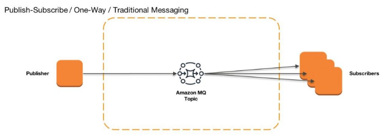

The most common way to design loosely coupled components in microservice architectures is to expose a well-designed standardized set of APIs, which will be invoked by the upstream service. REST APIs are generally designed with a synchonous communication approach, where the communication between the services are real-time, and the upstream caller expects reponse for each and every requests triggered. 

However due to this real-time dependency, there's couple of scenarios where it's beneficial to consider asynchonous communication over a synchronous one, where the processing and final response isn't immediately expected:
1. Higher processing time: Certain requests might take more time to process, and in-general web servers are expected to provide a response in a very specific time-window, otherwise Gateway Timeout is reported. In these cases, it's better to provide an ID for the request submitted through which the status of the request can be checked.
2. Cascading failures: In case one of the downstream service is offline, or faced any internal issue, all the upstream service depending upon it, or communicating to it syncrhonously also gets hit, thus having cascading failures. As in case asynchonous communication, the request is supposed to be processed later, the requests are generally stored persistentnly, and can be processed when the consumer comes back.

Now that we've got an overview on the asynchonous communication, and learnt about the scenarioes on where having a asynchonous communication benefits more, we will go ahead and learn some of the messaging communication techniques used.

### Messaging Channels:
1. Point-to-point Channel: Messages are generated by a producer, and is expected to be consumed by only one consumer. Message Queues are most prominent example of this. There's several offerings which implements message queue service, like ActiveMQ queue, SQS etc. Queues make sure that a particular message is consumed only once, and in case it's not consumed by any of the receivers, message queues ensures that the message persists for some longer time.

    Major benefits of message queues:
    - a. Depending upon the message queue load, the number of message receivers can be scaled
    - b. Message queues flatten the requests sent to the receivers, thus acting as buffering space in case of spike or peak load

2. Publish/Subscribe Channel: Another type of message channel, where the publisher sends a message, and the message is read by all the subscribers to the channel. This is more of a "notification" kind of messaging, where whenever a message is sent to the channel also known as a topic, it's forwarded to all the subscribers. Even though certain notification services do provide some sort of retry mechanism in case some message pushing fails, however, the messages are not stored in persistence storage, unlike message queues.

### Drawbacks:
1. Eventual consistency: Asynchonous communication by nature is doesn't following strong consistency. However it's expected for all the messages sent to be eventually consumed, hence asynchonous communication supports eventual consistency.
2. Broker is the Single Point of Failure
3. Harder to trace the flow of a particular message

### References:
1. [Implementing enterprise integration patterns with AWS messaging services: point-to-point channels](https://aws.amazon.com/blogs/compute/implementing-enterprise-integration-patterns-with-aws-messaging-services-point-to-point-channels/)
2. [Implementing enterprise integration patterns with AWS messaging services: publish-subscribe channels](https://aws.amazon.com/blogs/compute/implementing-enterprise-integration-patterns-with-aws-messaging-services-publish-subscribe-channels/)
3. [Whitepaper on Implementing Microservices on AWS](https://docs.aws.amazon.com/whitepapers/latest/microservices-on-aws/microservices-on-aws.html)
