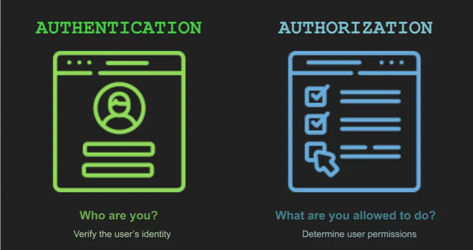
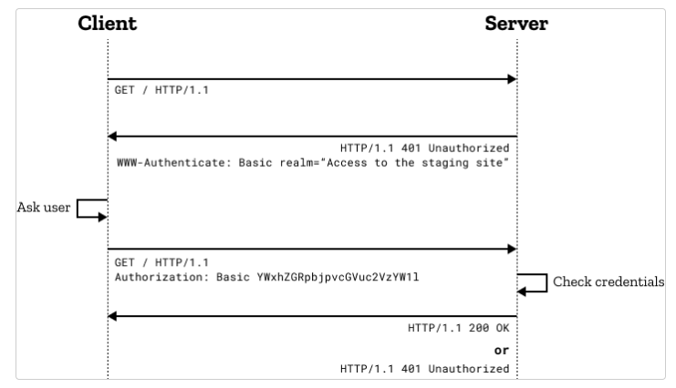

Authentication and authorization is one of the corner stones of designing services. As both the terms used together, it gives the idea that both these two terms are exactly same. However it's far from the truth; theoretically they handle two different aspect of security. Authentication verifies the user identity, however, authroization validates the access level. This blog post provides an introduction on the authorization portion, an overview on OAuth, one of the most popular authorization mechanism available today.


  
Before delving deep into OAuth, we would briefly discuss some other authentication mechanisms as well:

## HTTP Basic Auth:
HTTP Basic Auth is the most rudimentary type of authorization, where the client has to provide the credentials in the request itself. When the client sends the request wihtout any credential, the server responds with a 401 (Unauthorized) status code, and along side, it sends the following header:
```
WWW-Authenticate: <type> realm=<realm>
```
The WWW-Authenticate header denotes the type of authentication that needs to be used, "Basic" in this case. The realm attribute value specifies the segment of resources, for which the credentials will be used. Not all the users would've access permission for all sets of resources, hence the endpoint expects credentials that have access permission of the specified realm.
  
The credential is supposed to be provided in the request header section as follows:

```
  Authorization: Basic Base64Encoding(userid:password)
```

Different servers have different sets of mechanisms for implementing HTTP Basic Auth. For the NGINX web server, need to create a htpasswd file with the credentials, and then specify it with the auth_basic directives, by specifying the realm.
```
  location /api {
    auth_basic           "Administrator’s Area";
    auth_basic_user_file /etc/apache2/.htpasswd; 
  }
```


It's to be noted that as credentials are transferred over a network call in this case, a secure layer like HTTPS is needed to ensure the credentials are safe from eavesdropping or man-in-the-middle attack.

## API Keys:
API keys are another commonly used authentication mechanism, where the end-user has to create an API key beforehand by registering, and then including the API_KEY as part of the request. It's to be noted that even though HTTPS encrypts both query parameters and headers, before transmitting over the network, it's advised to use the API Key in the header section, as the majority of the web server logs the request with the query parameters, and hence compromising logs of the web-server may leak the API key as well.
  
```curl
   curl -X POST \
    -H "Authorization: Bearer $(gcloud auth print-access-token)" \
    -H "X-goog-api-key: API_KEY" \
    -H "Content-Type: application/json; charset=utf-8" \
    -d @request.json \
    "https://translation.googleapis.com/language/translate/v2"
```
  
## OAuth:
OAuth is one of the most commonly used authorization mechanisms. It's an authorization mechanism, in a sense, that it's targeted to validate the access permission, rather than identifying the user or validating credentials. OAuth specifies the use of an access token to verify the access permission. The RFC doesn't specify any specific format for the OAuth, even though JWT is the most used format. The access tokens are not meant to be understood by the client requesting access to the protected resource. It's only meant to be understood by the resource server and the OAuth server. However, before going deep, we've to understand different actors or roles as mentioned by OAuth to understand the authorization flow better.
  
  
### OAuth Roles:
- Resource Owner: The user or the system that owns the protected resource
- User-Agent: The device which is used to access the protected resource
- OAuth Client: The application, that is requesting access to the protected resource
- Resource Server: The API or the server that is hosting the protected resource. It accepts and validates the access token. 
- Authorization Server: The OAuth server that validates the user credentials, and issues the access tokens. The OAuth server also has the facility of revoking the access tokens.

### OAuth Client Types:
 - Public Client: The applications that can't hold any secrets or credentials, like mobile app, single page app. Basically the applications which resides on user controlled devices. The main reason these kind of applications can't hold any secret or credentials, as they can be easily debugged or reverse engineered. 
 - Confidential Client: These are the application that can hold secrets or credentials. Basically all the server side applications belong to this category, as the executables are not directly accessible by the end-users, and can't be easily debugged.

### Communication Channels:
- Front Channel: The data is passed through the user's address bar
- Back Channel: Server directly sends the requests over a secured network call
  
### Registering the Client:
The first stage is of using OAuth is to register the client, i.e. the application, which needs the access to the protected resource. During the registration, depending upon the type of application, client ID and client secret is assigned. A list of redirect URIs are also provided, they're the same pages where the user will be redirected once authentication is successful. This also provides an additional security layer on the OAuth, where even though a rouge service can redirect to the authorization server, however they won't be abld to redirect the targeted user to their own site. It's advised not to provide any wildcard or any way for partial matching, which may help malicous attacker. It's to be noted that the generated client ID and client secret is needed to be treated as username and password, and hence the client secret should only be used with confidential clients, which can't be easily debugged or reversed-engineered.
  
  
### OpenID Connect:
An extension of the OAuth specification, it includes some small info about the users. The token associated with OpenID Connect is termed an ID token, which is provided in JWT format. It's to be noted that the ID token is stored on different storage media at certain times or sent through the front channel, hence it's recommended never to use any sensitive or protected data in the ID token. Also in case the ID token is stored on the client side, or in some untrusted location, need to validate the token locally, to ensure no data is changed. Also anytime the application accepts an ID token other than from authroization server, it needs to be validated.

### Access Token Type:
- Reference token: These are access tokens that don't store any meaningful information on themselves, rather they can be thought of as a pointer to such data. Reference tokens are useful if the access token needs to store some sensitive data, and it's also very easy to revoke the access token, however, the primary disadvantage lies in scaling up the OAuth server, as comparatively a larger storage space would be needed. Besides, the application has to invoke the OAuth server each time to validate the token, which adds a network call, thus significantly increasing the latency.
- Structured token: These are the self-encrypted or self-encoded tokens, which store some human-readable information. The content of the access token can be read easily, hence no sensitive data should be part of this token. JWT token is one such implementation of a structured token. The main benefit is that these tokens can be locally validated, even though the OAuth server provides support for Token Introspection Endpoint. One of the major hiccups with these kinds of tokens is to check for revoked access tokens, which would need a network call to check through the Token Introspection Endpoint.

### Token Lifetime:
The general convention is to have a shorter access token lifetime and a longer lifetime associated with the refresh token. This way, even though the access token is expired, the application can request a new access token using the refresh token, and it's also verified that the requested user is still having proper permission on the resource. These lifetime values are generally determined with the help of policy, and policies can also be associated with a certain device type. This way, in case a mobile device is used, the refresh token can have a longer lifetime, as a shorter refresh token would mean the user will be redirected to an in-app browser, which is quite a slow process for mobile applications, and would impact user experience.
  
Also, the lifetime can be changed depending on the type of user also:
- Admin User: Access token lifetime: 1hr, refresh token lifetime: 24hr => login once in a day
- Consumer User: Access token lifetime: 24 hr, refresh token lifetime: unlimited => login only once
- Privileged Scope: Access token lifetime: 4hr, refresh token lifetime: None => Require auth for sensitive operations

### Handling Revoked and Invalidated Access Token
There are several reasons why an access token is needed to be revoked and invalidated. Operations like account deactivation, user revoking permission for application, updating the password, and updating token lifetime; are a few of the examples for which the OAuth server needs to revoke the active token. It's the responsibility of the API to validate the access tokens. Even though the local validation provides speed and efficiency, however, it still needs to use the Token Introspection Endpoint to validate that the access token is not invalidated.
It's to be noted that the OAuth server provides a Revocation Endpoint, to revoke the access token from the application side as well.


### Local Validation of JWT Access token:
1. Check the key ID and algorithm used from the header of the JWT payload, and validate that the signature is matching with the header and content.
2. Check the claims are intended for this particular application:
    i. iss: Issuer OAuth Server
    ii. aud: Audience, generally client_id is provided
    iii. iat ,exp: Issuance time and Expiration time, the current time should be in-between these two timestamps
    iv. nounce: Check the nounce value with the earlier request

### Scope:
OAuth specification doesn't recommend any particular values for scope, however, this is used to denote the access level of the protected resource. If no scope value is provided, then by default it's understood to have full access to the resource requested. The scope is the concept of permission, grouping, and roles, and is dependent upon which kind of API the application intends to invoke. Eg:
  photos:read
  photos:write
  
It's recommended to have at least two different scopes for a read-only and a read-write mode to be available. Also, these scope details are shown on the user consent screen.
  
### Authorization Code Flow:


### Client Credentials Grant Flow:
It's mainly used for machine-to-machine communication, no user interaction is needed. Primary usecase lies in an application trying to fetch it's own resource.

```curl
  POST https://api.authorization-server.com/token
  grant_type=client_credentials
  scope=contacts&
  client_id=<CLIENT_ID>&
  client_secret=<CLIENT_SECRET>&
```

```json
  {
    access_token:
    expires_in:
    scope:
  }
```
It's to be noted that refresh token isn't issued for client credentials grant flow, as this is mainly used by service accounts, that is for programmatic access, where the application itself is the resource owner.

  
### References:
1. [HTTP Authentication Framework](https://developer.mozilla.org/en-US/docs/Web/HTTP/Authentication)
2. [NGINIX: Restricting Access with HTTP Basic Authentication
](https://docs.nginx.com/nginx/admin-guide/security-controls/configuring-http-basic-authentication/)
3. [HTTP Basic Authentication](https://www.ibm.com/docs/en/cics-ts/5.4?topic=concepts-http-basic-authentication)
4. [Basic Authentication](https://www.twilio.com/docs/glossary/what-is-basic-authentication)
5. [API Key](https://cloud.google.com/docs/authentication/api-keys)
6. [What is OAuth 2.0](https://auth0.com/intro-to-iam/what-is-oauth-2)
7. [The Nuts and Bolts of OAuth 2.0](https://www.udemy.com/course/oauth-2-simplified/)
