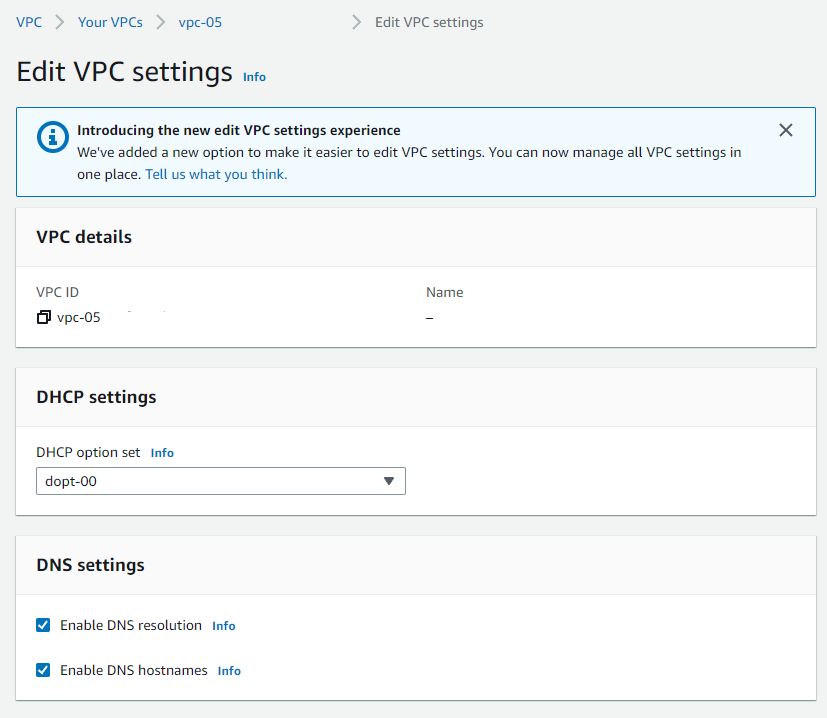
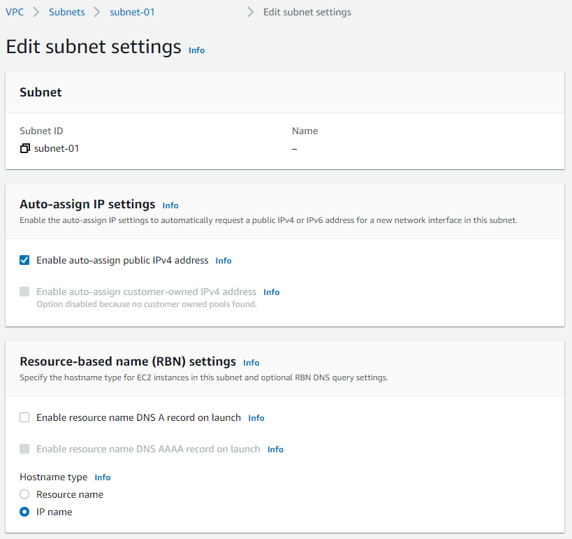
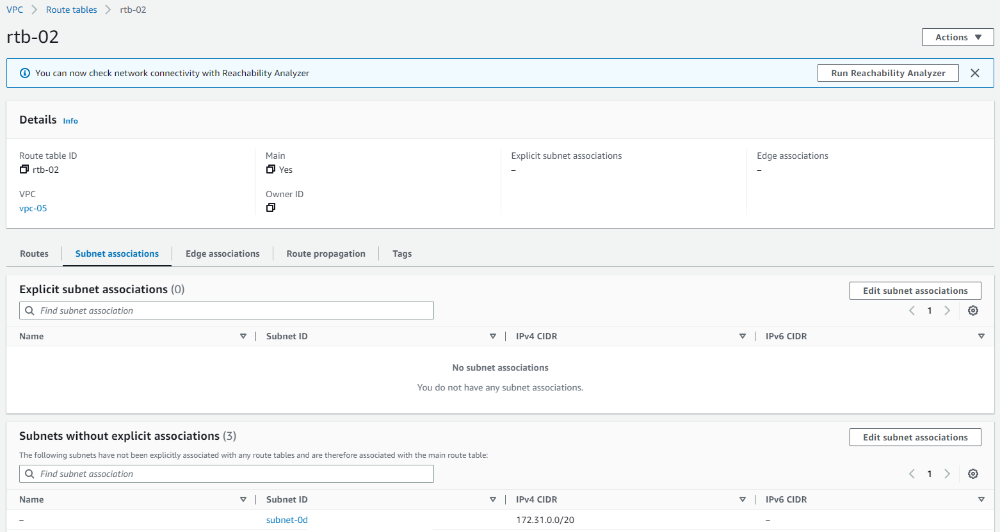
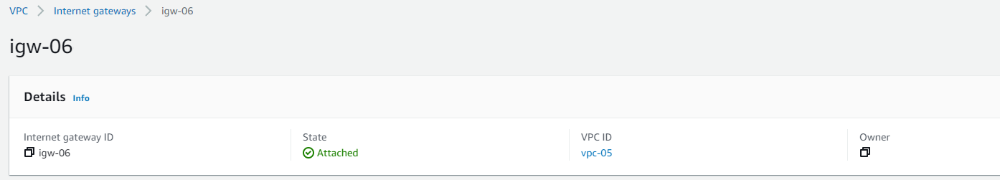
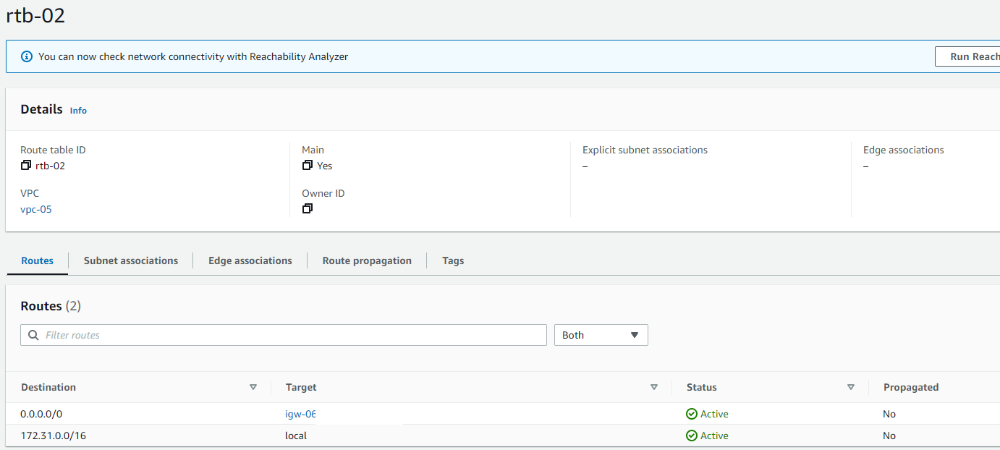
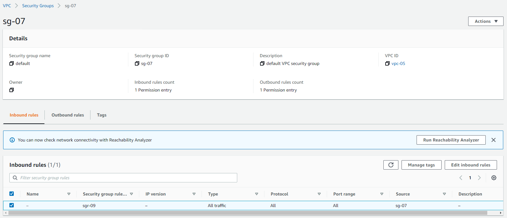
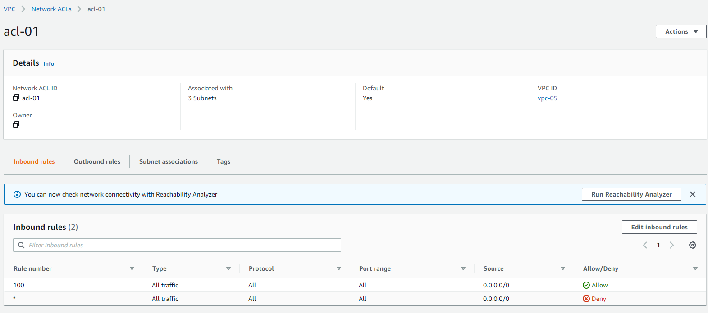
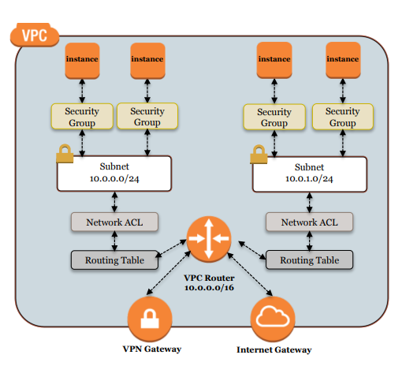
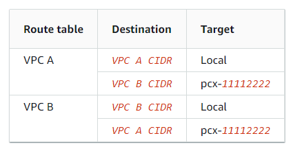
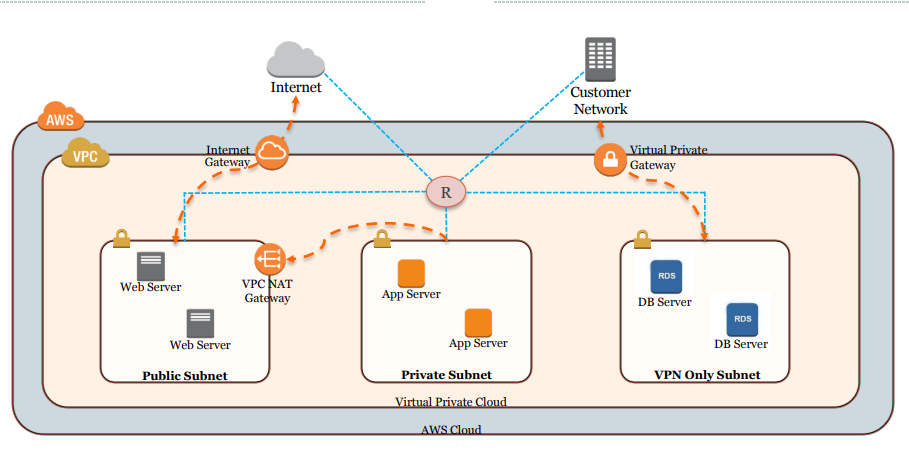

In this blog post, we're going to learn about VPC, a basic building block of creating a network infrastructure in cloud environments. Even though we're going see some examples specific to the AWS platform, this is supported by all the major cloud service providers, including the terminology and nomenclature, however, for sure, depending upon the cloud service providers, there are a couple of restrictions imposed and conditions uplifted here and there. The basic understanding of VPC remains the same across all the platforms.

### VPC Basics:

VPC, Virtual Private Cloud, allows the deployment of a logically isolated network infrastructure, on top of which different AWS resources can be deployed. It's to be noted that not all the services can be deployed on the VPC. As a rule of thumb, the serverless services, i.e. deployment, and scaling is automated by the cloud service provider, and can not be deployed on the isolated network provided VPC. 

A VPC contains an IP address range, determined at the time of creation. For the AWS platform, the VPC is bound to a particular region. The IP address range can not be modified at a later point in time, hence need to consider the future scope and requirements as well before deciding the IP range to be associated with.

### Subnet & Router Association:
Subnet is a logical split of the IP address range associated with the VPC. In the case of AWS, one particular subnet belongs to a specific Availability Zone, and all resources deployed under the subnet are deployed to that particular AZ. Subnet IP address range within a VPC are not allowed to overlap.

Each VPC has got a router implicitly. The router isn't directly accessible, however, the route table entries can be modified. The primary route table associated with the VPC has the main flag set. It is to be noted that each subnet can be associated with only a route table, however, the same route table can be associated with multiple subnets across different AZs. In case a particular subnet is not having a route table explicitly assigned, the main route table implicitly gets associated with it.

### Internet Gateway vs NAT Gateway:
The Internet gateway is a VPC component that allows public internet connectivity from and to the VPC resources. The subnets for which the route table redirects to the internet gateway are called public subnets, and the ones not having any route to the internet gateway are termed private subnets. One VPC can be In case an EC2 instance has got a public IP but is placed under a private subnet, anybody from the internet wouldn't be able to directly connect to this instance. It's to be noted that one Internet Gateway can be attached to only one VPC.

Similar to Internet Gateway, there's a NAT gateway, which provides outward connectivity to the public internet only from the private subnet. Here it's to be noted that the NAT instance itself is to be placed under a public subnet, and the route table entry of the private subnet is supposed to point to the NAT gateway. Also, the NAT gateway, being a managed instance, is deployed on a specific AZ, and hence to ensure high availability, it's recommended to deploy NAT gateway in the same AZ the private subnet is created. Besides, being an AWS-managed instance, NAT gateways incur hourly costs.

### Traffic Privacy:
Security Group:
- Applied at the network interface level of the resources
- Spans across multiple AZ, multiple subnets
- Stateful nature: allows the return traffic automatically
- Supports allow rule only, implicitly denies all the traffic not matching with any rules
- Multiple Security Groups can be applied to the same resource: the rules get aggregated

Network ACL:
- Enforced on a subnet level
- One subnet can only be associated with one NACL at a time
- Multiple subnets can use the same NACL
- Besides having allow rule, NACL supports deny rule as well unlike the Security Group
- Stateless: doesn't keep track of responses, needs to explicitly allow the outgoing traffic for incoming ones
- Rules are processed in order, if one rule is matched, then no further rule is checked

### Overall security at VPC:

### VPC Peering:
VPC peering provides a networking capability to enable the resources across two VPCs to communicate with each other through private IP addresses. The VPC pair can be across different regions, even across different AWS accounts. In case the VPC peering is configured for the VPC pair present in different AWS accounts, a peering request is pushed to the target AWS account and is needed to be accepted within an acceptable time. 

It's to be noted that VPC peering doesn't support transitive routing. Hence in case the need to interconnect multiple VPCs, then a full mesh topology with VPC peering is needed to be established.

### VPC Endpoint:
Enables to connect to supported AWS services through a private connection. The traffic doesn't leave the Amazon network. We would also explore more on this later, as part of a different project.

### Transit Gateway: 
Transit gateway is advertised as the cloud router in AWS. This follows the hub-and-spoke model, where the transit gateway serves as the central hub and manages the network to different private networks. This is also one of the resources which costs per hour basis. We would learn different use cases of transit gateway in a different blog post.

### Three-Tier Architecture:

### References:
1. [AWS VPC Beginner to Pro - Virtual Private Cloud Tutorial](https://www.youtube.com/watch?v=g2JOHLHh4rI)
2. [Talk on AWS VPC](https://wit-hdip-comp-sci-2018.github.io/devops/topic-06-AWS-VPC/unit-1-AWS-VPC//talk-1-AWS-VPC/AWS-VPC.pdf)
2. [AWS VPC User Guide](https://docs.aws.amazon.com/vpc/latest/userguide/what-is-amazon-vpc.html)
3. [AWS VPC Peering](https://docs.aws.amazon.com/vpc/latest/peering/what-is-vpc-peering.html)
4. [AWS PrivateLink Concepts](https://docs.aws.amazon.com/vpc/latest/privatelink/concepts.html)
5. [AWS Transit Gateway](https://docs.aws.amazon.com/vpc/latest/tgw/what-is-transit-gateway.html)
