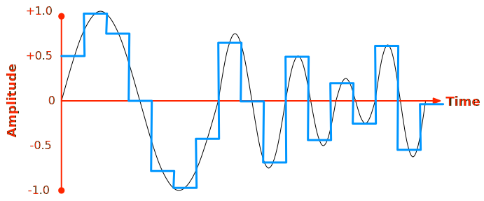
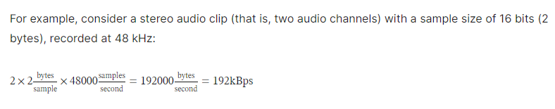
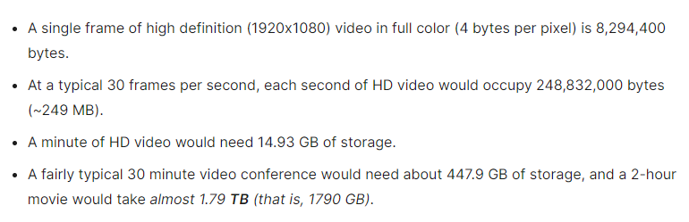

Video streaming has become one of the most popular form of consuming content on the Internet. Because of this, even though Internet was started as method of transferring textual data, the audio-visual segment is currently responsible for majority of Internet traffic. To handle such traffic efficiently different protocols for video streaming is developed. In this blog, we will learn about some video streaming protocols.

### Audio Concept:
Audio or sound is a natural pheniomenon. The sound travels through a medium as the particles in the medium vibrates and vibration of one partcile causes the next particle also to vibrate, and thus creating a wave though the medium. Like any kind of wave, sound wave also can be thought of a function of two parameters: the amplitude i.e. how futher the particles vibrate and the frequency i.e how many times they vibrate on a unit time. Computers however being digital in nature, need to convert this natural pehnomenon in analog signal to digital signal using A/D converter. The main principle here is sampling, where the audio is sampled at periodic interval:


One of the main property of sampling is sample rate, which denotes the number of times the audio is sampled in a second. And each such sample denotes the amplitude of the signal at that specific time, each sample is stored using integer or floating data type, and stream of samples create a channel. There can multiple channels, for eg majority of the audio sources contains 2 sources: left and right. 5.1 type of another popular one, having total 6 channels.

Human ear operates on the frequency range of 20-20000 Hz, and based on Nyquist-Shannon sampling theorem, the audio should be sampled at at-least 40kHz frequency to accurately recreate. Also having some more frequency bandwidth helps to avoid distortion, hence 44.1 kHz is the most popular sample rate. 



Thus based on the above calculation, 192KBps only for a single audio is too huge, and thus needs compression and decompression techniques(codec). It's to be noted that once codecs are used, we need to ensure the erronous or dropped packets are recovered, otherwise the decompression might get failed. Due to which TCP connections are preferred over UDP ones for majorrity of the codecs.

### Video Concept:
The following calculation shows the massive requirement of bandwidth if the videos are transmitted uncompressed


Also this is the same reason why lossy compresssions are preferred over the lossless compresession atleast for video media types.

The videos are generally encoded with either RGB color system or with YUV color encoding system.

Reccomended codec: 
- A WebM container using the VP9 codec for video and the Opus codec for audio
- An MP4 container and the AVC (H.264) video codec, ideally with AAC as your audio codec


### DASH:
DASH (Dynamic Adaptive Streaming over HTTP) is an adaptive bitrate protocol, which supports video streaming over an HTTP web server. The video file is partitioned into multiple segments, each segment contains a short interval playback time, each partitioned content is available under different bit rates, and an MPD file containing the information regarding all the segments corresponding to a video. DASH supports live stream video as well. The DASH client uses an Adaptive Bit Rate (ABR) algorithm to select the segment with the highest bit rate, and seamlessly adapts the resolution depending upon changing network behaviour.

DASH uses two different profies: Live profile for live streaming, and On-demand profile for rest of the videos. All these profiles have the audio seggregrated, and contains segments with different bit-rates, and everyhing having stiched by the MPD file, and the HTML points to the MPD file, rather than pointing to individual video file.

```html
<video>
  <source src="my.mpd" type="application/dash+xml" />
  <!-- fallback -->
  <source src="my.mp4" type="video/mp4" />
  <source src="my.webm" type="video/webm" />
</video>
```
As there are different web-servers which provides support for DASH out-of-the-box, we would not go into details of how MPD files can be created, rather we would explore on the changes needed to be done on the web server side, to support DASH.

NGINX provides support for DASH through RTMP module, 

```
$ sudo apt install libpcre3-dev libssl-dev zlib1g-dev
$ sudo yum groupinstall pcre-devel zlib-devel openssl-devel


$ cd /path/to/build/dir
$ git clone https://github.com/arut/nginx-rtmp-module.git
$ git clone https://github.com/nginx/nginx.git
$ cd nginx
$ ./auto/configure --add-module=../nginx-rtmp-module
$ make
$ sudo make install

```

```conf
rtmp { 
    server { 
        listen 1935; 
        application live { 
            live on; 
            dash on; 
            dash_path /tmp/dash; 
            dash_fragment 15s; 
        } 
    } 
} 
 
http { 
    server { 
        listen 80; 
        location /tv { 
            root /tmp/dash; 
        } 
    }
 
    types {
        text/html html;
        application/dash+xml mpd;
    } 
}
```

### Referencfes:
1. [Digital Audio Concepts](https://developer.mozilla.org/en-US/docs/Web/Media/Formats/Audio_concepts)
2. [Digital Video Concepts](https://developer.mozilla.org/en-US/docs/Web/Media/Formats/Video_codecs)
3. [Web video codec guide](https://developer.mozilla.org/en-US/docs/Web/Media/Formats/Video_codecs)
4. [DASH Adaptive Streaming for HTML 5 Video](https://developer.mozilla.org/en-US/docs/Web/Media/DASH_Adaptive_Streaming_for_HTML_5_Video)
5. [Setting up adaptive streaming media sources](https://developer.mozilla.org/en-US/docs/Web/Guide/Audio_and_video_delivery/Setting_up_adaptive_streaming_media_sources)
6. [Enabling Video Streaming for Remote Learning with NGINX and NGINX Plus](https://www.nginx.com/blog/video-streaming-for-remote-learning-with-nginx/)
7. [TCP Congestion Control](https://book.systemsapproach.org/congestion/tcpcc.html)
8. [NGINX Dash configuration](https://gist.github.com/shivasiddharth/30b998189c3dc76fdea4227f29e9dcf7)

