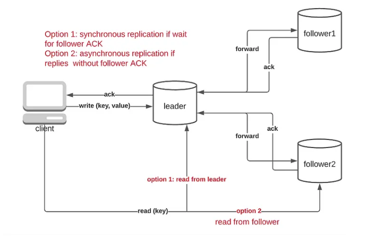
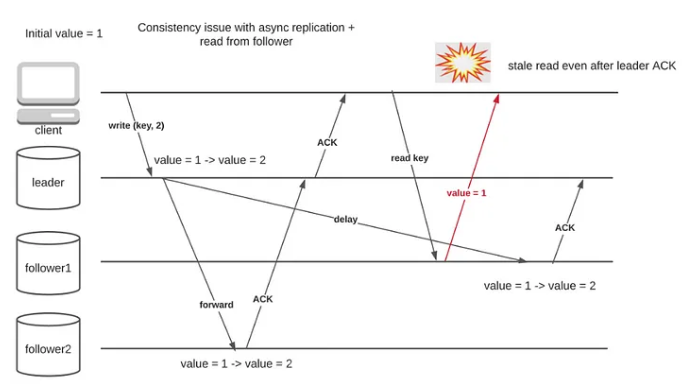
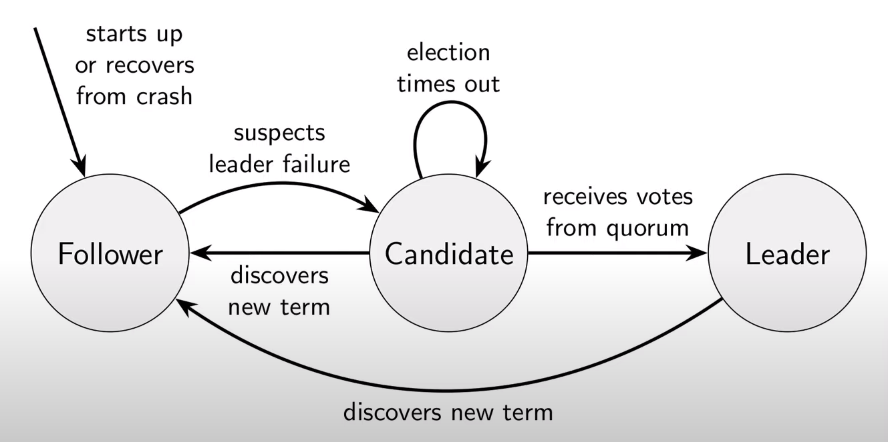
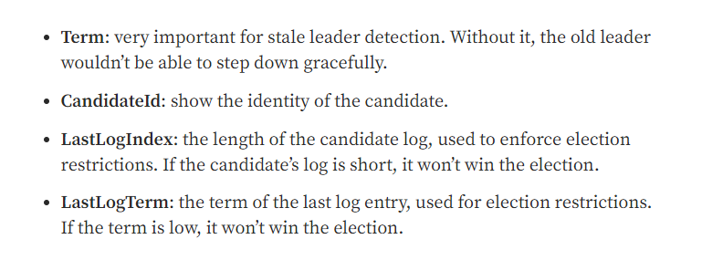
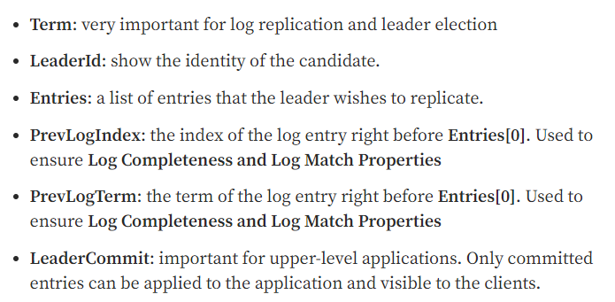

One of the foundation problems of designing a distributed system is how to store some data in a distributed system. One basic approach is to share or duplicate all the data between the nodes. However the complexity arises when multiple nodes can operate independently, and in case some node goes down the complexity arises by multiple folds. In this blog post, we will learn about Raft: one of the most commonly used consensus algorithms. We would briefly touch on the generic replication technique of the database replication as well.

Each distributed system caters to a large number of requests, which ultimately boils down to either read requests or write requests. The intended use of the write requests is to persist the data so that at a later point in time the same can be fetched and used. Filesystem and Database are the most commonly used persistent storage, however, database wins here by a huge margin, due to the fact that the majority of the data can be thought of as transactional records, and databases provide a certain layer of reliability and robustness over the filesystem. Hence here we will mainly focus on the use of the database.

Now, even though from the application perspective, the database interface layer points to a single database, however, databases also consist of several nodes connected through a network, and it's the responsibility of the distributed database to ensure data can be retrieved even if a couple of nodes goes down. This is where the data replication among the nodes comes into the picture.

One of the most commonly used approaches here is to use a single leader replication, where the write operations are catered by the leader node only. As and when the write operations are done, they are replicated to the other nodes. And depending upon the configuration, the read operations can be served by the followers also. Two types of replication policies can be used:
1. Synchronous replication: Wait for acknowledgment from the follower nodes first, before committing data
2. Asynchronous replication: Trigger replication, however not to wait for acknowledgment from the follower nodes before committing data

The asynchronous replication technique has one drawback: the consistency for read-after-write requests can't be guaranteed. 

There are certain workarounds to this issue, for example storing updated timestamps on the client side to read the updated data after the specific timestamp, or utilizing sticky routing, however, none of them still guarantees strong consistency. So distributed systems not requiring strong consistency can take this approach. However, based on the CAP theorem, which we would explore in a later post, the CP and CA systems wouldn't be able to rely on the async data replication technique.

Single-leader replication failure contains two major drawbacks:
1. How to handle a node going down: If a node goes down, and joins back again, how to have the updated data replicated?
2. What if a leader goes down: How to elect a new leader? Also, would there be a possibility of two leaders operating simultaneously?

This is where a consensus algorithm like Raft comes into the picture. The consensus algorithms not only provide the procedure to elect a leader in case the current leader goes down, but it also provides a way to ensure that the logs are consistent by using a majority acknowledgment approach.

The primary concept behind the Raft algorithm is that each node can either be a leader, follower, or candidate node during an election:

The transition rules are pretty much self-evident. When the system is initialized, an external force is needed to select the initial leader. However, once the leader is elected, it remains the leader until it goes down, or gets disconnected from the majority of the servers, which denotes a partitioned network. The leader node periodically sends a heartbeat signal to the rest of the nodes. 

If one of the nodes sees that it's not receiving any heartbeat from the leader nodes for a pre-configured period, it becomes a candidate node, proposes itself to be a leader node, and broadcasts a voting request to other nodes. Now, there's a concept of term number, an increasing number to denote the term for which election is going on, and when a leader is selected it uses the term number to replicate and store the logs in persistence storage. The Raft algorithm only allows append operation on logs. Hence when a leader is selected, it's assumed all the logs till the previous term are already committed, and need no further intervention.

Now, leader selection is a vital process. To ensure that not all the nodes become a candidate at the same time, a randomized election timeout is used. Also, there's one more vital issue for the leader election. The leader node should have all the entries updated, hence before casting vote, the follower node check whether the candidate node is up-to-date both in terms of the term number, and the log index of the previous term and also returns these values to the leader. If the leader finds out it's missing an updated log, then it cancels the election and goes back to being a follower node. Also, a follower node can cast its vote for only one node for a given term. The candidate node becomes the leader if it has got the votes for the majority of the nodes.

The appendLog is the second type of message broadcasted by the leader. Now, as only append operation is allowed on the logs i.e. the data modification, the out-of-sync appending isn't allowed. It's always assumed that logs are appended in the same order leader is having. To enforce this, prevLogIndex value is maintained along with prevLogTerm, which denotes the index and the term of the latest updated log. And in case the node gets some logs that are out-of-sync, i.e. more recent logs, the node discards them and waits to get the intended logs. These arguments are sent by the leader node, and the follower verifies whether needs to append the logs or reject and wait for older messages to get appended or in case of conflicting entries with the leader node specific to the current term, then update it. Now from the above discussion, it's clear that the leader node has to broadcast the entries multiple times, and is generally broadcasted periodically.

Following are the arguments to the appendEntry/appendLog command:

Once the leader gets acknowledgment from the majority of the nodes for a specific logIndex, it updates the commitIndex, denoting that the logs or transactions till that index is already committed. This is a way to let the higher-level application know that the transaction is already committed. Now in case the leader goes down abruptly, the client will know that the rest of the data isn't committed to the system.

It's to be noted that, there's still a possibility of having multiple leader nodes, in case the earlier leader is disconnected from the rest of the nodes, due to which it remains an isolated node, and isn't aware of the latest term. However, in this case, the obsolete leader will not have an acknowledgment from the majority of the nodes, hence commit will not occur. There is also some improvement proposed on top of vanilla Raft, by using a commit timeout, where in case no further commit happens within a stipulated time, then it's assumed that the leader is disconnected, and goes back to being a follower node, to let another round of election take place.

As soon as this node gets connected to the current leader node, it understands that its term is of a preceding term, and hence relegates to the follower state. In this case, the logs from the earlier terms can be lost from this particular node, however, as the data is already committed to the majority of the nodes, and each read also needs the majority consensus, this scenario wouldn't cause any issue.

### References:
1. [Advantages of DBMS over File system](https://www.geeksforgeeks.org/advantages-of-dbms-over-file-system/)
2. [Database Replication Explained](https://towardsdatascience.com/database-replication-explained-5c76a200d8f3)
3. [Distributed Systems: Raft](https://www.youtube.com/watch?v=uXEYuDwm7e4&list=PLeKd45zvjcDFUEv_ohr_HdUFe97RItdiB&index=18)
4. [Raft Algorithm Explained: Part 1](https://towardsdatascience.com/raft-algorithm-explained-a7c856529f40)
5. [Raft Algorithm Explained: Part 1](https://towardsdatascience.com/raft-algorithm-explained-2-30db4790cdef)
6. [Improving Raft When There Are Failures](https://tik-db.ee.ethz.ch/file/17210168ce3be9d0e6a5e3f846fb1b29/Improving_RAFT_When_There_Are_Failures.pdf)
