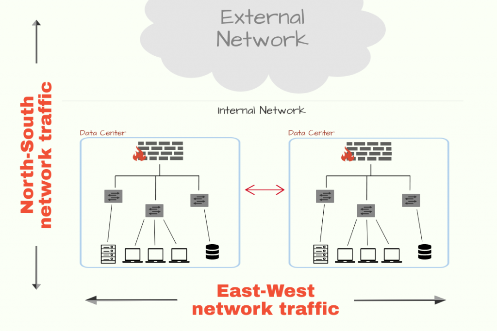
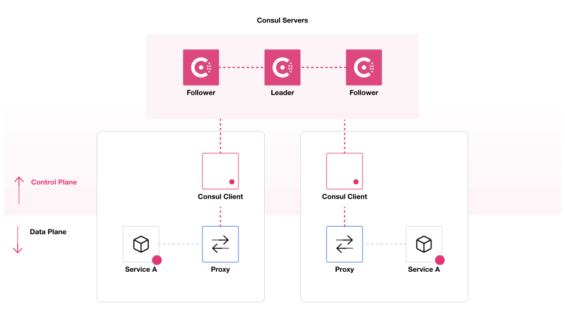
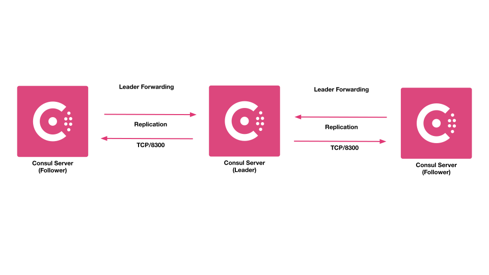
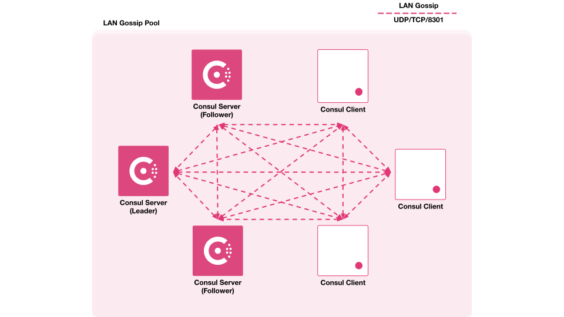
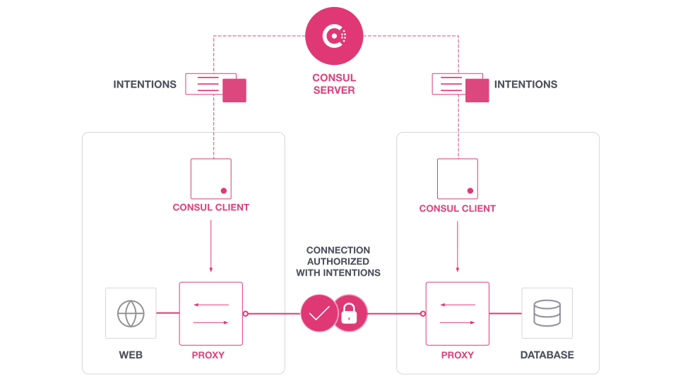
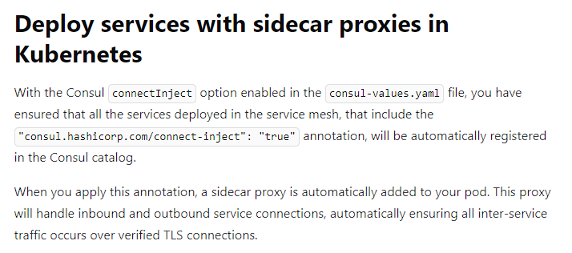

With the advent of microservices, the networking got more complicated. Earlier, with the monolithic approach, the vertical scalability was pretty much simplistic. The applications were viewed as 3-tier applications and a majority of the traffic flow was north-south, i.e. majority of the data flow consisted of client requests and responses, which may be in the form of browser requests or may be in the form of direct API requests. Event the networking configuration was also simpler due to the nature of these 3 tiers, where the network flow was allowed from the downstream layer to the immediate upstream layer, and there a load balancer is usually placed, which works as a reverse proxy server to the external users.



However, with the advent of microservices, the complexity of the deployment infrastructure is only increased. The first issue with microservices lies in the deployment portion itself, which can spread across multiple regions, and multiple instances of the service can be online or go down, which makes networking harder. The load balancing also needs to be dynamic. Thus it produces three distinct categories of problems which service mesh tries to neutralize:
1. Service Discovery: How to discover the services over the network, so that the intended services can connect to them without much overhead
2. Configuration: How to update the service configuration on a large scale
3. Network Segmentation: How to simplify the firewall rules, and abstract them to the service level

All the above categories are related to service-to-service communication and service mesh implements a low-latency multi-platform networking solution for service-to-service communication. There are a couple of enterprise-level solutions offered by different service providers including Istio service mesh by Ishito, Consul by Hashicorp, etc. Here, we would have some overview and hands-on on the Consul service mesh, however, the theory behind the service mesh remains the same, and applicable to the other service meshes as well.

### Consul Architecture:
Consul consists of two planes:
1. Control Plane:
        - controls data packet flow between the services
        - maintains service registry: keeps track of all the services along with their IP and health checks
        - services are registered with the control plane
        - configuration specific to a particular service is pushed to the key-value store, which in turn is propagated to all the existing instances of that particular  service
         - rules:
         - responsible for maintaining the service mesh
2. Data Plane: 
        - forwards the actual data packets
        - handles the communication between services



##### Consul agents:
Consul control place consists of two types of agents- server agent and client agent. The server agent initializes a data center, which consists of only one leader server agent, and the rest of the server agents are marked as followers. The server agents are the ones that store all the service-related info and do the heavy lifting operations of enforcing service discovery and access rules. It's generally advised to have 3 or 5 server agents, beyond which the overhead for consensus might negatively impact the performance. To improve the resiliency of the Consul cluster, it's advised to have the server agents distributed across multiple availability zones, and also to have a backup server agent ready, so that in case one server agent goes down, the backup server agent in the same availability zone can take its place.

However, there's no such restriction on the client agents, large no of organizations follows datacenters with 5000 client agents, and a couple of organization even maintains datacenter with tens of thousands of client agent.

The leader among the server agents is selected based on a specific consensus algorithm. All the queries and transactions are processed by the leader, the followers forward the requests received from the client agents to the leader, and the leader in-turn replicates all the updations to the followers.



##### LAN gossip pool:
All the server and client agents participate in a LAN gossip pool. Agents in the pool propagate the health check information across the cluster. Agent gossip communication occurs on port 8301 using UDP. Agent gossip falls back to TCP if UDP is not available. 



##### Zero trust network policy:
Consul service mesh follows a zero trust network policy. No network communication is trusted automatically. All the communications must be authenticated and authorized. Service authenticity is verified using mTLS and service operations are authrorized based on intentions.

Intentions on the consul controls traffic communication between services. The L4 traffic intentions can control network traffic based on the identity encoded in mTLS certificates, and the L7 traffic intentions can enforce access based on application aware request attributes along with the usual identity based access. The proxy or natively-integrated application enforces intentions on inbound connections or requests. Only one intention can control authorization between a pair of services at any single point in time.

All the consul agents cahches the intentions for the registered services. The client agents have a long polling connection established to the server agent, which allows to propagagte any change in intention immediately. Even certain proxies also locally caches the same. This provides additional layer of resiliency. This allows the proxies directly allow or deny the incoming requests, without connecting to the server agent each and every time. It's to be noted that any change in intention is applicable to only the new requests, already established or serving requests are not terminated. The intentions are processed depending upon precedence and match order. The intentions can have both allow and deny policies.




### Consul useful commands
##### Initialize a consul cluster:
```sh
[root@ip-172-31-45-208 consul]# cat conf.hcl
{
    "datacenter":"Consul-SG",
    "data_dir": "/opt/consul",
    "log_level": "INFO",
    "node_name": "sample-node-name",
    "server": true,
    "addresses": {
        "http":"0.0.0.0"
    },
    "ports":{
        "http":8500
    }
}
[root@ip-172-31-45-208 consul]# cat counting.hcl
service {
    name = "counting"
    id = "counting-1"
    port = 9003

    connect{
        sidecar_service{}
    }
    
    check{
        id = "counting-check"
        http = "http://localhost:9003/health"
        method = "GET"
        interval = "1s"
        timeout = "1s"
    }
}
[root@ip-172-31-45-208 consul]# cat dashboard.hcl
service{
    name = "dashboard"
    port = 9002
    
    connect{
        sidecar_service{
            proxy{
                upstreams = [
                    {
                        destination_name = "counting"
                        local_bind_port = 5000
                    }
                ]
             }
        }
    }
    
    check {
        id = "dashboard-check"
        http = "http://localhost:9002/health"
        method = "GET"
        interval = "1s"
        timeout = "1s"
    }
}
[root@ip-172-31-45-208 consul]#

consul agent -dev -enable-script-checks -config-dir=/root/consul
```


##### Consul envoy proxy setup for service:
```sh
consul connect envoy -sidecar-for dashboard -ignore-envoy-compatibility &
```


##### Create intention and catalog:
```sh
consul intention create dashboard counting

consul intention list

[root@ip-172-31-45-208 consul]# consul catalog --help
Usage: consul catalog <subcommand> [options] [args]

  This command has subcommands for interacting with Consul's catalog. The
  catalog should not be confused with the agent, although the APIs and
  responses may be similar.

  Here are some simple examples, and more detailed examples are available
  in the subcommands or the documentation.

  List all datacenters:

      $ consul catalog datacenters

  List all nodes:

      $ consul catalog nodes

  List all services:

      $ consul catalog services

  For more examples, ask for subcommand help or view the documentation.

Subcommands:
    datacenters    Lists all known datacenters
    nodes          Lists all nodes in the given datacenter
    services       Lists all registered services in a datacenter
[root@ip-172-31-45-208 consul]#
```
  

##### Consul key-value storage:
```sh
consul kv get --recurse  
consul kv put redis/config/devops value
consul kv get redis/config/devops
```


#### References:
1. [Three-tier architecture](https://docs.aws.amazon.com/whitepapers/latest/serverless-multi-tier-architectures-api-gateway-lambda/three-tier-architecture-overview.html)
2. [Istio service mesh](https://istio.io/latest/about/service-mesh/)
3. [Consul Documentation](https://developer.hashicorp.com/consul/docs)
4. [Consul Architecture](https://developer.hashicorp.com/consul/docs/architecture)
5. [Fault Tolerance](https://developer.hashicorp.com/consul/docs/architecture/improving-consul-resilience)
6. [Service intentions overview](https://developer.hashicorp.com/consul/docs/connect/intentions)
7. [Sidecar pattern](https://learn.microsoft.com/en-us/azure/architecture/patterns/sidecar)
