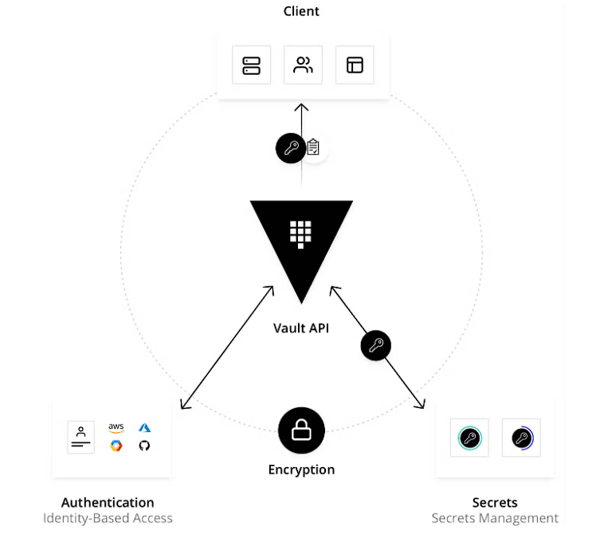
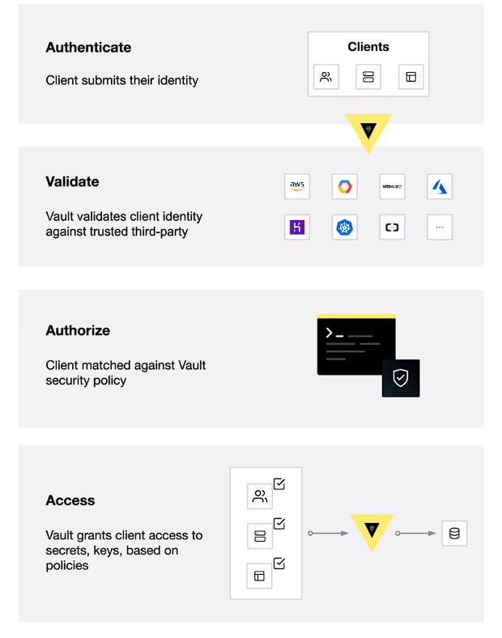
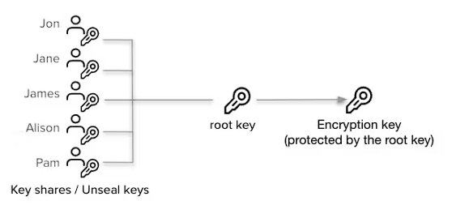
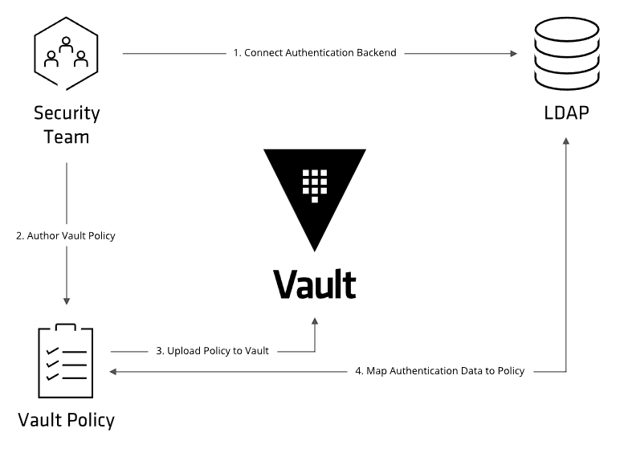
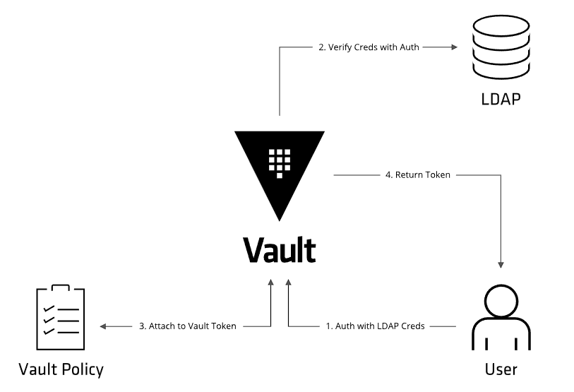

With the rapid adaption of microservice architectural patterns, one of the major issues has arisen related to secret management. With the microservices pattern, teams have become quite independent, and they interact through a set of well-defined endpoints, and apart from the API contract, the service is treated as a black box by the downstream services. As each team becomes independent, the independent nature is also reflected in different aspects: starting from selecting the tech stack to design patterns used. And thus it increases the complexity of following a uniform core-security principle. And one major concern regarding this is the leaking of security credentials. Storing security credentials on the codebase or setting them as environment variables from the deployment pipeline, even though seems to allow teams to quickly build features, however, should be highly discouraged. To solve this kind of credential sprawling, an enterprise-level centralized credential management system is needed, and Hashicorp provides one such solution with Hashicorp Vault.



### Workflow


### Secret Engine:
The secret engine provides the capability to store and retrieve secrets from different types of storage devices. The secret engines are enabled at different path prefixes, and the read-write requests are redirected to the appropriate secret engine depending on the path prefix.

Following are some useful commands:
```sh
export VAULT_ADDR='http://127.0.0.1:8200'
export VAULT_TOKEN=""
vault kv put path1/path2/path3/path4/path5 key3=value3 key4=value4
vault kv get path1/path2/path3/path4/path5
vault secrets enable -path=aws aws
vault secrets list
```


### Seal/Unseal
All the data stored in the vault is encrypted with encryption keys. And the vault needs access to the encryption key to decrypt the data. The encryption key is stored along with data, in a keyring. The encryption key is again encrypted with a root key and stored on the device. The root key is encrypted with the unseal key, and the vault doesn't store the unseal key. This key is either provided when the vault service is configured and it's stored in memory to continue serving incoming requests. The unseal key is provided by the user for the unsealing operation, and unless the unseal operation is performed, the vault service is rendered useless. This process also provides the benefit to seal the service quickly in case a security compromise is detected.

By default, Vault uses Shamir secrets sharing to distribute the root key over multiple nodes, and a specific quorum of nodes is needed to recreate back the root key. This provides an additional layer of security, as the penetrator needs to take control of a quorum of nodes, to get access to all the data.



It's to be noted that Vault supports auto-unsealing operation, where the Vault connects to an external service during startup, requesting to decrypt the root key.

### Policies

It's to be noted that just like secrets policies are also path based. All the requests are validated against the set of policies applicable to the token, to verify whether the requester has permission to operate. Unless the policy doesn't dictate access, all the requests are denied by default.





### References:
1. https://developer.hashicorp.com/vault/docs/what-is-vault
2. https://developer.hashicorp.com/vault/docs/secrets
3. https://developer.hashicorp.com/vault/docs/concepts/seal
4. https://developer.hashicorp.com/vault/docs/concepts/policies
5. https://developer.hashicorp.com/vault/docs/concepts/storage
6. https://www.youtube.com/playlist?list=PL7iMyoQPMtAP7XeXabzWnNKGkCex1C_3C
7. https://medium.com/@othillo/encryption-as-a-service-with-vault-61b0e652685f

