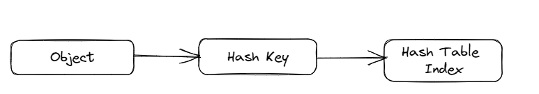
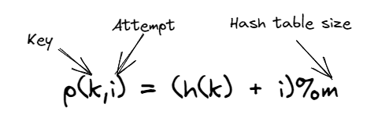
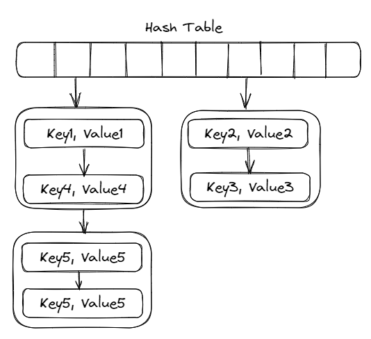

The hash table is one of the most important data structures, which is used for fast insertion, retrieval, and deletion of key-value pairs. We get introduced to this Hash data structure pretty early in our engineering journey, however, the internal designing of the hash table is quite entangled with multiple designs to choose from depending upon application-specific behavior. The full extent of the hash table implementation may be grasped by the fact that even the programming language runtime also depends on it, as it's quite extensively used for classes and member attribute lookup for languages supporting OOPS, and variable lookup table in case of procedural languages. In this blog post, we would explore the fundamental concepts behind the hash table, how collisions are resolved, performance, and certain optimizations.

### Ideas:

##### Idea 01: Application key to hash key [0,N):
We can't put anything as a key in the hash table. It's limited to a set of a specific set of types eg. string, int, tuple, etc. We can also use custom types as keys if they implement a hash function that provides an integer corresponding to the custom type or object. For some native types, the hash function is implicitly defined.
##### Idea 02: Mapping hash key in the smaller range:
The hash table size is generally quite smaller compared to the range of the application key, which requires an additional hash to reduce the range to distribute over the holding array. As and when the holding array gets populated, the holding array may need to be resized, and redistribution of the application key needs to be done.

### Collision in Hash Table:
In case different objects map to the same application key, or a different application key gets mapped to the same hash table key, the collision needs to be resolved. There are two different types of collision resolution: Chainigin and Open addressing

##### Chaining:
The collided keys are placed in a data structure pointed by the hash table key. The basic implementation is to form a chain of keys with the use of a linked list that is mapped to the same hash table key.

Chaining with linked list:
- The hash table is an array of pointers to a linked list. Each slot of the array contains a pointer to the head of the linked list
- Each node of the list contains a pointer to the actual data (key and the value) and a pointer to the next node in the list

Chaining with other data structures:
- Self-balancing binary tree: Insertion and lookup is O(h)
- Useful when the collision rate is high, and could not resize the holding table

##### Open addressing:
Instead of using some auxiliary data structure like chaining, utilize the empty slots when the keys collided, and find a way to look for the available slots in a deterministic way. 
Probing: function for finding the next available slot. A good probing function should generate permutations to cover the entire space eventually.

For adding or lookup, we need to continuously probe until an empty slot is encountered or all the slots are checked. Hence while deleting a key, it needs to be a soft delete, otherwise, the lookup would miss existing keys.

Linear probing:

- Search linearly from the hash index until the end of the table, then wrap from the start
- If empty slot, then the key is not present
- Advantage: localized access: OS caches the whole block, hence neighboring element access becomes very fast
- Challenges:
    - Bad hash function would make linear probing a full table search
    - Linear probing suffers from clustered collision

Quadratic probing:

- Clustered and cascaded collisions are reduced as collided keys are placed further away from each other
- Offset is increased quadratically

Double hashing:

- Use a secondary hash function to offset collision 
- Unlike quadratic probing, offset for double hashing follows a linear pattern
- The secondary hash function should never return 0 and should cycle through the entire table, and should be fairly simple to compute

### Resizing hash table:
Aggressive resizing would lead to too frequent resizing, which is a time-consuming process, and can't also be too lenient with resizing, as that would degrade performance. The general rule of thumb is to expand the holding array once the load factor is increased to 0.5 and shrink it once the load factor is reduced to 0.125.

Also, one more point to be noted that having the hash table sized to be an exponent of 2, as the hash functions extensively rely upon mod operation. And the mod operation is compute-heavy if division operation is used. However with bit manipulation, AND operation with (2^n-1) would also result in equivalent mod operation.

Load factor = number of keys/number of slots

##### One of the major optimization over chaining to introduce localized access:

- To use an array of linked list for chaining, rather than adding one node at a time for each time new key is encountered

### References:
1. [Hash Table Internals](https://www.youtube.com/playlist?list=PLsdq-3Z1EPT2UnueESBLReaVSLIo_BuAc)
