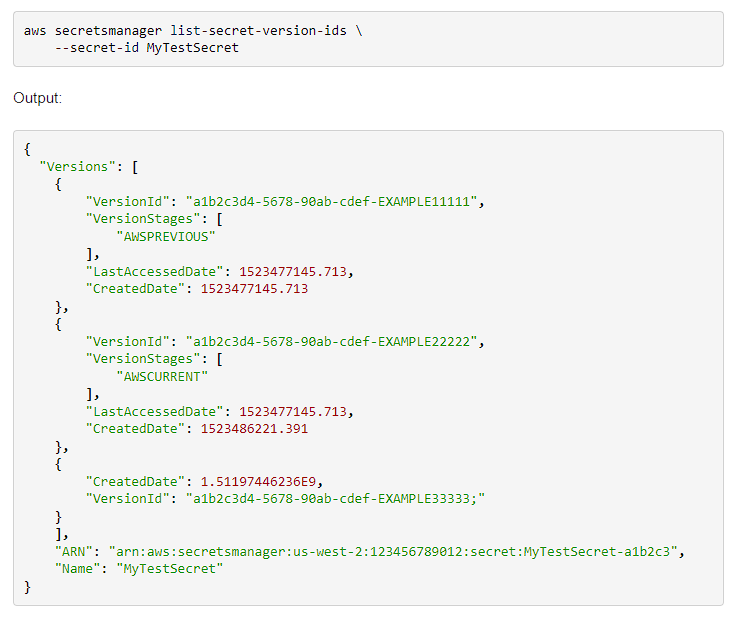
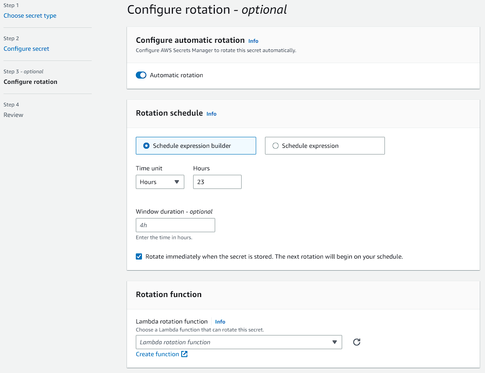
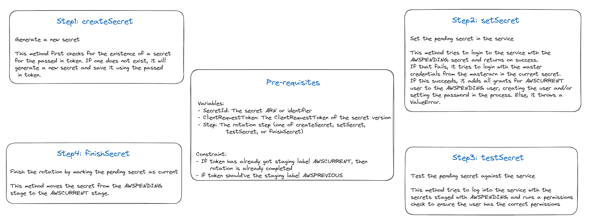

AWS secrets Manager is a secrets management service, whose primary goal is to securely store a secret, and to provide ways to retrieve and allow authorized users to rotate the secret. This enables applications to retrieve the secrets at runtime rather than hardcoding them, thus improving the security aspect. There's different type of secrets an application can use: application specific keys, database credentioals, OAuth tokens, API keys are some of them, and each one of them can be stored on Secrets Manager in the form of key-value pair.


#### Secrets:
A secret is confidential info. Secrets Manager stores some metadata info also alongside a secret. Secret value can be of binary data or string. Multiple values can be store in the same secret by using the key-value format of JSON structure.
```json
{
  "host"       : "ProdServer-01.databases.example.com",
  "port"       : "8888",
  "username"   : "administrator",
  "password"   : "EXAMPLE-PASSWORD",
  "dbname"     : "MyDatabase",
  "engine"     : "mysql"
}
```

The secret metadata stores the information regarding the version, label and the key used for encryption. The rotation schedules is also maintained on the secret level ie. each secret has got it's own rotation schedule. 


#### Version:
Secret has versions, whenever a secret is created or rotated or updated, a new version is created. A specific version of secret is identified as version Id. However secrets managers doesn't store the history of secrets. By default it keeps track of three different versions by marking them the following labels:
- The current version as AWSCURRENT
- The previous version as AWSPREVIOUS
- The pending version for rotation as AWSPENDING

Apart from these, manual labelling is also supported by AWS. Each version of secret can have multiple staging labels, however one staging label can be applied to only one specific version. The unlabelled versions are considered as deprecated, and the labelled versions are not. The deprecated versions are deleted by Secrets Manager internally. And also AWS doesn't remove the versions created within last 24 hours.

```sh
C:\Users\Tisan>aws secretsmanager get-secret-value --secret-id sample-secret
{
    "ARN": "arn:aws:secretsmanager:ap-south-1:653981763904:secret:sample-secret-eJF34f",
    "Name": "sample-secret",
    "VersionId": "a7d5bc19-6b8c-43f2-8286-b8cab07af17b",
    "SecretString": "{\"key1\":\"value1\",\"key2\":\"value2\"}",
    "VersionStages": [
        "AWSCURRENT"
    ],
    "CreatedDate": 1685116715.118
}

C:\Users\Tisan>aws secretsmanager get-secret-value --secret-id sample-secret
{
    "ARN": "arn:aws:secretsmanager:ap-south-1:653981763904:secret:sample-secret-eJF34f",
    "Name": "sample-secret",
    "VersionId": "13ba7fd1-673c-41ed-88e0-d812c2cbedfc",
    "SecretString": "{\"key1\":\"value3\",\"key2\":\"value2\"}",
    "VersionStages": [
        "AWSCURRENT"
    ],
    "CreatedDate": 1685117482.767
}

C:\Users\Tisan>
```



#### Deletion:
To ensure that a critical secrets isn't removed by haste, secrets aren't immeidiately deleted, rather they becomes inaccessible and scheduled for deletion after a cool-off period, typically varying betweeen 7 days to 30 days. The secret can be restored if wished between this recovery window, however once this recovery window is over the secret is deleted parmanently. Also a specific version of a secret is only deleted if all the staging labels are removed. And in case the secret has got a replica in other region, the replicas needed to be deleted first, then only the primary secret can be scheduled for deletion. It's to be noted that the replica secrets are immediately deleted.


#### Replica secrets:
Secrets can be replicated to multiple AWS regions. The replica contains the same secret values as of the primary secret, and some new secret key-value pair can also be added on top of that. The replica secrets doesn't have any spearate rotation schedule. And with automatic rotation enabled, whenever the primary secret gets rotated, it's propagated to all the associated replica secrets.
It's to be noted that the replicas can have it's own KMS key.
The replica secrets can't be updated independently, except for the encryption key. Promoting a replica to standalone severs the connection with the primary secret, and after that the secret can have it's own rotation schedule as well. This is useful for disaster recovery scenarios.

note: secret promoted can be demoted??


#### Secret Rotation:
Rotation is the process of updating the secret. The rotation procedure takes care of updating the credential in the associated service with the help of a lambda function, thus maintaing a consistent set of secret, allowing the dependent services to consistently use it. The lambda function can't invoke another lambda function to update the secret.

It's to be noted that auto-rotation schedule considers manual rotation as well, and schedules the next rotation based on it.



Certain AWS servies like RDS and Aurora offers managed rotation, where the service itself rotates the secret. The primary advantage being, the service manages the lambda function for secret rotation.

The lambda rotation function consists of four distinct steps:
1. create_secret: create a new version of secret and mark it with staging label AWSPENDING
2. set_secret: update service credential with the newly generated credential and it may create new user depending upon the rotation strategy
3. test_secret: verify the newly created credential by using it to access service
4. finish_secret: AWSCURRENT staging label is applied to the one with AWSPENDING and AWSPREVIOUS version is associated with the previous version of secret



If any step is failed, the entire rotatin process is retried multiple times. On a successful rotation the AWSPENDING staging label might be alloted to the same version getting pointed by the staging label AWSCURRENT, or the AWSPENDING staging label might not be attached to any version. In case the lambda function finds any other situation, it's considered as previous rotation request is still under-progress, and hence returns error. For managed rotation, no need to specify the lambda function and corresponding AWS service takes care of the whole rotation process.

Rotation Strategy:
- Single user rotation strategy: there's a low risk of denying call when the service credential is getting rotated
- Alternating user rotation strategy: each time the secret is rotated, it alternates which user's password is updated, thus avoiding the denying issue 


#### Security:
- Encryption in transit: The data in transit is encrypted as all the API calls are required to be signed by X.509 certificates
- Encryption at rest: AWS KMS is used to store the secret in encrypted form.

Secret Manager invokes AWS KMS GenerateDataKey request for 256bit AES symmetric key whenever a new secret value is to be updated. AWS KMS returns the plaintext data key and the copy pf encrypted data key. Secret Manager uses AES along with the plaintext data key to encrypt the secret value, and discards the data key as soon as the operation is completed. The encrypted data key is stored along side the secret for decrypt. While decrypting the encrypted data is decrypted first with the help of AWS KMS and the encrypted data is then decrypted with the decrypted data key. It's to be noted that rotating AWS KMS key doesn't impact the decryption facility of Secrets Manager, as AWS KMS stores the linear history of KMS key versions.


### References:
1. [What is AWS Secrets Manager?](https://docs.aws.amazon.com/secretsmanager/latest/userguide/intro.html)
2. [AWS Secrets Manager concepts](https://docs.aws.amazon.com/secretsmanager/latest/userguide/getting-started.html#term_secret)
3. [Replicate an AWS Secrets Manager secret to other AWS Regions](https://docs.aws.amazon.com/secretsmanager/latest/userguide/create-manage-multi-region-secrets.html)
4. [Promote a replica secret to a standalone secret in AWS Secrets Manager](https://docs.aws.amazon.com/secretsmanager/latest/userguide/standalone-secret.html)
5. [Managed rotation for AWS Secrets Manager secrets](https://docs.aws.amazon.com/secretsmanager/latest/userguide/rotate-secrets_managed.html)
6. [Set up automatic rotation for AWS Secrets Manager secrets using the AWS CLI](https://docs.aws.amazon.com/secretsmanager/latest/userguide/rotate-secrets-cli.html)
7. [Set up automatic rotation for Amazon RDS, Amazon Redshift, or Amazon DocumentDB secrets using the console](https://docs.aws.amazon.com/secretsmanager/latest/userguide/rotate-secrets_turn-on-for-db.html)
8. [Secret encryption and decryption in AWS Secrets Manager](https://docs.aws.amazon.com/secretsmanager/latest/userguide/security-encryption.html)
9. [Secret rotation lambda function for SecretsManagerRDSMariaDBRotationMultiUser](https://github.com/aws-samples/aws-secrets-manager-rotation-lambdas/blob/master/SecretsManagerRDSMariaDBRotationMultiUser/lambda_function.py)
10. [Secret rotation lambda function for SecretsManagerRDSMySQLRotationMultiUser](https://github.com/aws-samples/aws-secrets-manager-rotation-lambdas/blob/master/SecretsManagerRDSMySQLRotationMultiUser/lambda_function.py)
11. [Rotating AWS KMS keys](https://docs.aws.amazon.com/kms/latest/developerguide/rotate-keys.html)
