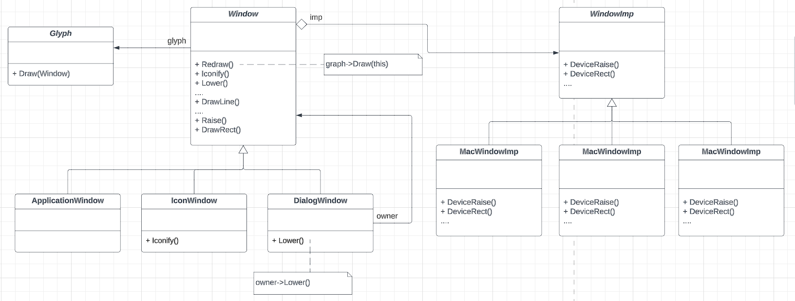
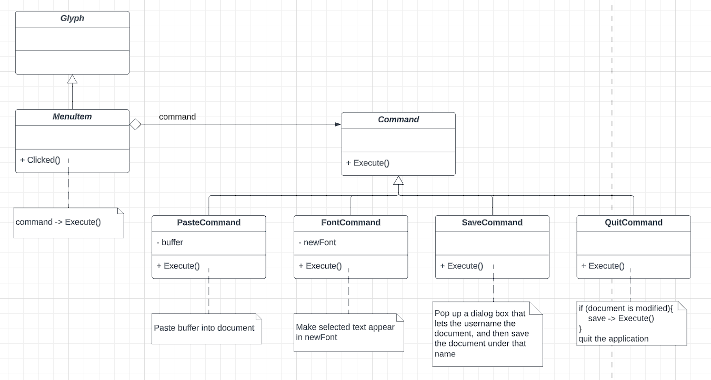
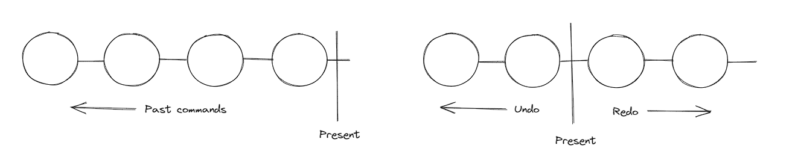
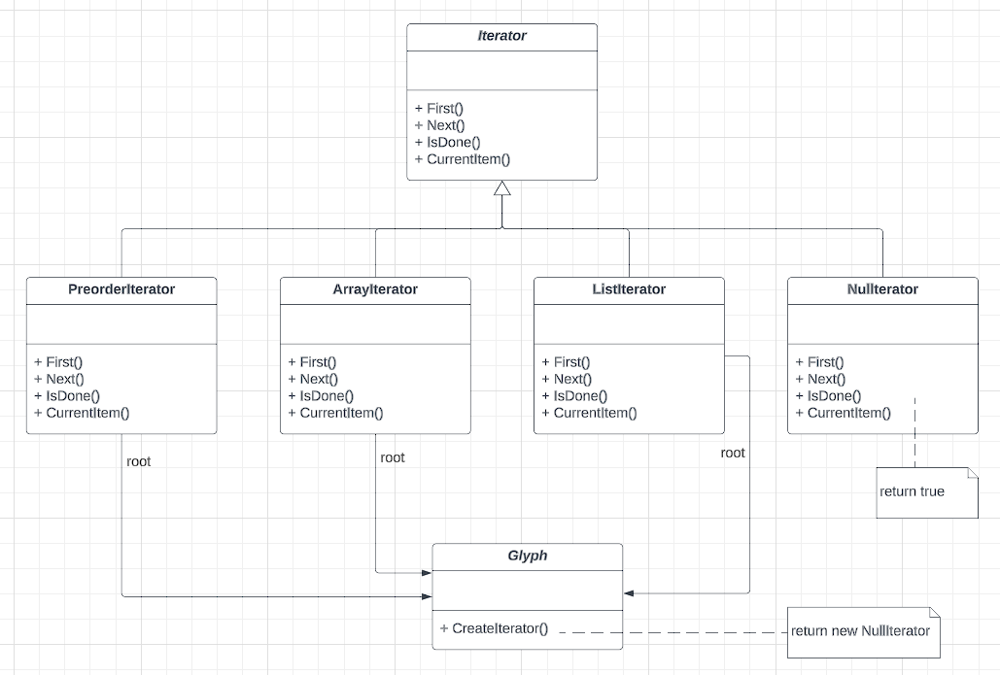
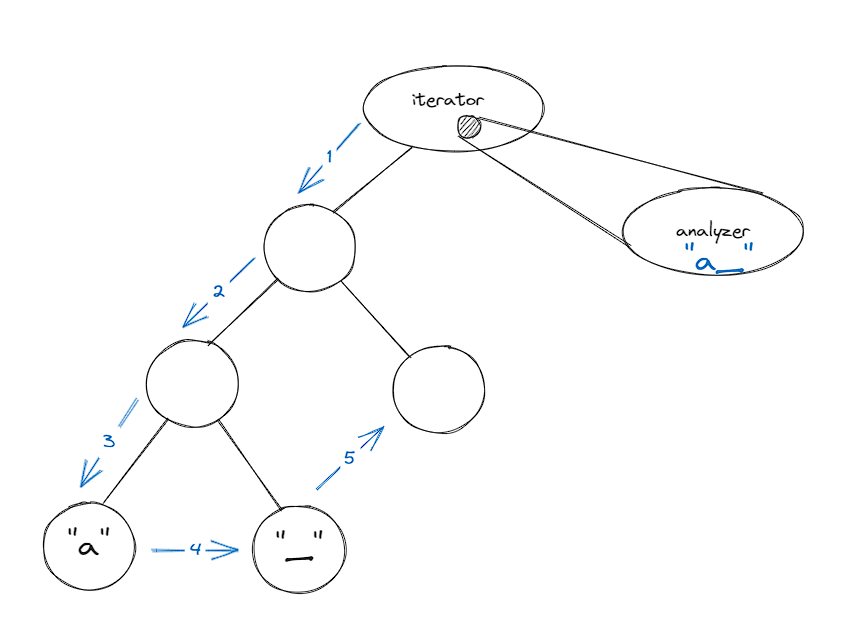
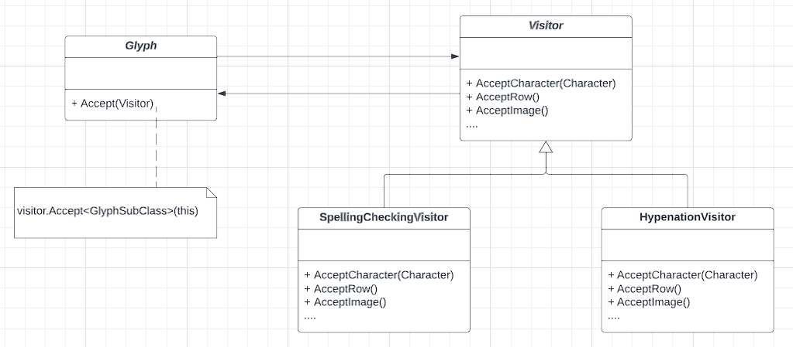

Design patterns are the blueprints of commonly encountered problems in software design and architecture. Each pattern provides a template tailored to solve a specific type of problem with a specific intent. Here we would explore only on the design patterns of object oriented problems, however, it's to be noted there's a complete different set of patterns for different aspects like concurrent, distributed programming and real-time programming. Design pattersn from object oriented programming perspective provides a way of communicating classes and objects that are customized to solve a gneric design problem in a particular context. Here in this blogpost, we would explore on some of the preliminary design patterns with the intention of creating a WYSIWYG(What-You-See-Is-What-You-Get) editor.

Let's start with the design aspect of WYSIWYG editor:
- Formatting: How the text and graphics are going to be arranged?
- Embellishing UI: UI to support scroll bars, borders, drop shadows. More of such embelishments are likely to get added later, which would require our editor to evolve.
- Supporting multiple look-and-feel standards
- Independent of different window system
- User operations: Buttons and drop-down menus are scattered through the UI. There should be a uniform mechanism for accessing this scattered functionality and undoing the affects
- Spell checking and hyphenation: How to minimize the changes to introduce a new analytical operation?


### Document Structure
A document consists of basic graphical elements such as characters, lines, polygons and other shapes. Besides, users are allowed to use these basic structure freely, and they can create complex structure by nesting one type of element in another element with certain set of arragement.

A common way to represent such hierarchial document is with the help of recursive composition, where increasinginly complex structure can be created with the help of simpler units. For an example, multiple characters are arranged from left-to-right to form a line, multiple lines are arranged from top-to-bottom to create a complete wiki. Also there can be shapes within shapes along with texts.
We can represent such physical structure by devoting an object to each important element. This includes the structural elements as well like lines, rows, columns beside the visible elements like characters. The result is an object structure like following:


We can define a abstract class called Glyph for all the objects that may appear in a document structure. The subclasses define both the primitive elements (like characters and images) and structural elements (like rows and columns).


Composite pattern captures the essence of recursive composition in object oriented terms. It is used to represent any potentially complex hierachial structure through tree of structures and then work with these structures. This is also useful when the client code treats both simple and complex elements uniformly.


### Formatting:
The document structure discussed in the previous section provides a way to represent the underlying physical structure, however it doesn't tell us how to format the document i.e how the text is broken down into lines, how the variation in margin width, indentation impacts the overall formatting of the document. There're variety of formatting algorithm with different strengths and weakness. Hence it's desirable to make it independent of document structure.


The formatting algorithm is encapsulated under a compositor class. The glyphs it formats are the children of a special Glyph subclass called composition. When composition needs formatting it invokes compositor's Compose() operation, which inturn iterations through the children of composition.
Encapsulating an alogirhtm in an object is the intent of the strategy pattern. It consists of strategy objects (compositor) and the context in which they operate. The context should be general enough to support new algorithms 


### Embellishing UI:
We can start with two types of embelishment: borders and scrollbar. From programmer perspective embelishment involves extending over the existing codes. However achieving this functionality by extending exiting compoistion class would result into explosion of classes. 
Border and scrollbar class has got some appearance, which suggests they should be subclass of Glyph, however, clients shouldn't care whether a glyph is having border or not, hence embellishment class should have the same interface of the Glyph.


The decorator pattern captures class and object relationship that support embellishment by attaching new behaviours to object by placing these objects under special wrapper class.


### Supporting multiple look-and-feel standards
We assume 2 set of widget Glyph classes:
1. A set of abstract Glyph subclasses for each category of widget graph. Eg: ScrollBar, Button, Menu etc
2. A set of concrete subclasses for each abstract subclass that implement the different look-and-feel


Abstract factory pattern consists of two key participants: factories and products. This pattern captures how to create families of related product objects without instantiating objects directly.

```cpp
    GUIFactory* guiFactory;
    const char* styleName = getenv("LOOK_AND_FEEL")

    if (strcmp(styleName, "Motif") == 0) {
        guiFactory = new MotifFactory()
    } else if (strcmp(styleName, "Presentation_Manager") == 0) {
        guiFactory = new PMFactory();
    } else {
        guiFactory = new DefaultGUIFactory();
    }
```

```cpp
    Scrollbar* sb = guiFactory->CreateScrollBar(); 
```


### Supporting multiple window system
Supporting multiple window system is very different compared to look-and-feel aka theme standards. There exists several window system largly incompatible with one another. At a first glance, the problem looks similar to the earlier one, where abstract factory can be used, however, as the different window system provide different set of interfaces, making it difficult to ensure all the operations covered by a single set of interface.



Encapsulate the concept that varies. What varies here is system specific implementation. WindowImp class hierarchy is defined to hide different window system implementations. WindowImp is an abstract class to abstract system-dependent code.


```cpp
    void Rectange::Draw(Window* w) {
        w -> DrawRect(_x0, _y0, _x1, _y1);
    }

    void Window::DrawRect(Coord x0, Coord y0, Coord x1, Coord x2) {
        _imp -> DeviceRect(x0, y0, x1, y1);
    }
```

```cpp
    class WindowSystemFactory{
        public:
            virtual WindowImp* CreateWindowImp() = 0;
            virtual ColorImp* CreateColorImp() = 0;
            virtual FontImp* CreateFontImp() = 0;

            // a "Create" operation for all window system resources
    }

    class PMWindowSystemFactory : public WindowSystemFactory{
        virtual WindowImp* CreateWindowImp(){
            return new PMWindowImp;
        }
    }

    class XWindowSystemFactory : public WindowSystemFactory{
        virtual WindowImp* CreateWindowImp(){
            return new XWindowImp;
        }
    }

    Window::Window(){
        _imp = windowSystemFactory->CreateWindowImp();
    }
```

The relationship between Window and WindowImp is an example of the Bridge pattern. The intent behind bridge pattern is to allow separate class hierarchies to work together even as they evolve independetly.


### User Operation
THe user operations are performed through the menu items, buttons and keyboard shortcuts. However, as the same operation can be performed in different ways for example through the menu, and also through the keyboard shortcut. 

The request can be encapsulated, with the help of Command abstract class to provide an interface for issuing a request. Subclasses implements the execute in different ways to fulfill different requests. MenuItem simply invokes execute() on it's Command object to carry out the requests.


To support undo-redo functionality, need to define a command list executed. Conceptually the command history looks like following:

It's to be noted that undo and redo functionality should be meaningful. For example, if same operation was perfoemed multiple times consecutively, the undo-redo operation should do the changes as a whole, rather than having user perfom the operation the exact same number of times.

The command pattern pescribes a unifrom interface for issuing requests, allows the client to handle multiple requests with same set of operations. The interface shields client from request implementation.


### Spelling checking and Hypenation:
Both spelling check and hypentation depends upon textual analysis. The problem is similar to the formatting problem, as multiple algorithm exists to for these problem. However it's slightly different in a way, as there's two piece to the puzzle:
1. Accessing information scattered over glyphs
2. Analysis

##### 1. Accessing infromation scattered over glyphs: Encpsulate access and traversal
By using an abstract class Iterator, a general interface of access and traversal is defined.



The glyph subclass that has children overrides the CreateIterator to return an instane of different Iterator subclass, which subclass depends on the structure that stores the children.

```cpp
    Iterator<Glyph*>* Row::CreateIterator(){
        return new ListIterator<Glyph*> (_children)
    }
```

The analysis class can access the children of glyph structure without knowing the representation:
```cpp
    Glyph *g;
    Iterator<Glyph*>* i = g->CreateIterator();

    for(i->First(); !i->IsDone(); i->Next()){
        Glyph* child = i->CurrentItem();
        // Do some operation with the current child
    }
```

```cpp
    void PreorderIterator::First(){
        Iterator<Glyph*>* i = _root->CreateIterator()
        if(i){
            i -> First();
            _iterators.RemoveAll();
            _iterators.Push(i);
        }
    }

    Glyph PreorderIterator::CurrentItem() const{
        Glyph* g = 0;
        if(_iterators.Size()>0){
            g = _iterators.Top()->CurrentItem();
        }
        return g;
    }

    void PreorderIterator::Next(){
        Iterator<Glyph*>* i = _iterators.Top()->CurrentIterator();
        i->First();
        while(_iterators.Size()>0 && _iterators.Top()->IsDone()){
            delete _iterators.Pop();
            _iterators.Top()->Next();
        }
    }
```
The iterator pattern provides a mechanism to traverse composite structures and collections without exposing the internal object structure to the client.

##### 2. Traversal Action
The Glyph, iterator and Analyzer all have separate responsibilities, hence it's better to have them encapsulated into different set of objects.
An instance of this analyzer class would work in conjuntion with an appropriate iterator like following:


SpellingChecker's checking operation:
```cpp
    void SpellingCheckingVisitor::AcceptCharacter(Character* c){
        const char ch = c->GetCharCode();
        if (isalpha(ch)){
            // Append alphabetic character to _currentWord
        } else {
            // Non alphabetic character is encountered
            if(IsMisspelled(_currentWord)){
                _misspellings.Append(strdup(_currentWord));
            }
            _currentWord[0] = '\0';
        }
    }
```

```cpp
    void GlyphSubclass::Accept(Visitor& visitor){
        visitor.AcceptSubclass(this);
    }
```

Analyzer:
```cpp
    SpellingCheckingVisitor spellingChecker;
    Composition* c;

    //...

    Glyph* g;
    PreorderIterator i(c);
    for (i.First(); !i.IsDone(); i.Next()){
        g = i.CurrentItem();
        g->Accept(spellingChecker)
    }
```



The visitor pattern discussed here provides a way to allow an open-ended number of algorithms for a specific problem.

### References:
1. 
2. https://refactoring.guru/design-patterns/decorator
3. https://refactoring.guru/design-patterns/abstract-factory
4. https://refactoring.guru/design-patterns/bridge
5. https://refactoring.guru/design-patterns/command
6. https://refactoring.guru/design-patterns/iterator
7. https://refactoring.guru/design-patterns/visitor


