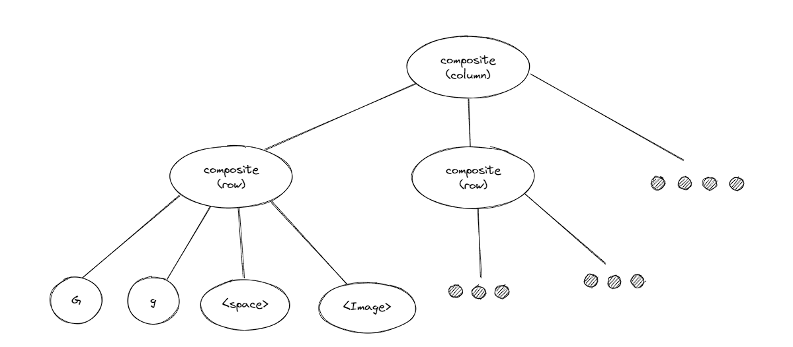
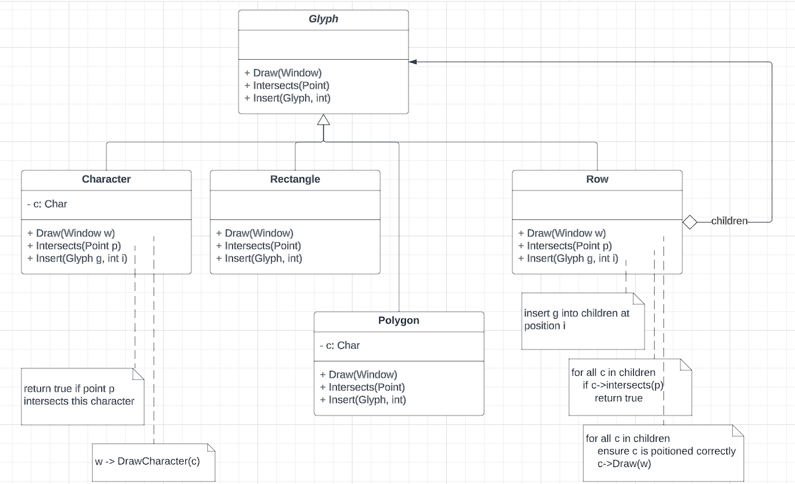
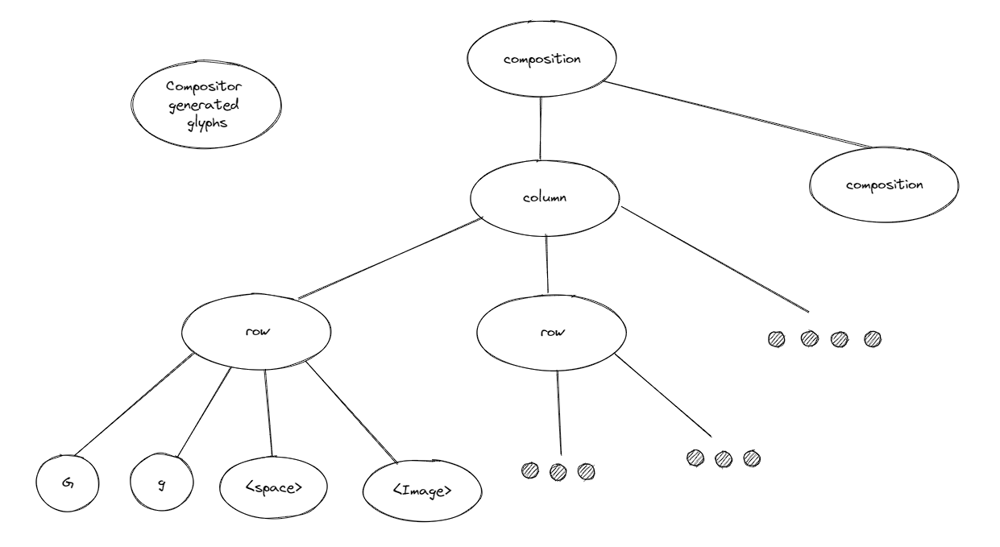
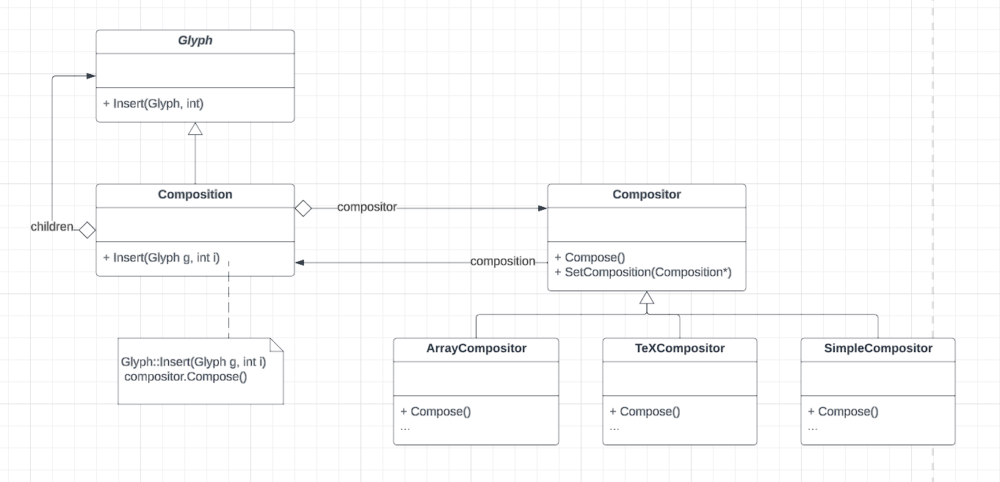
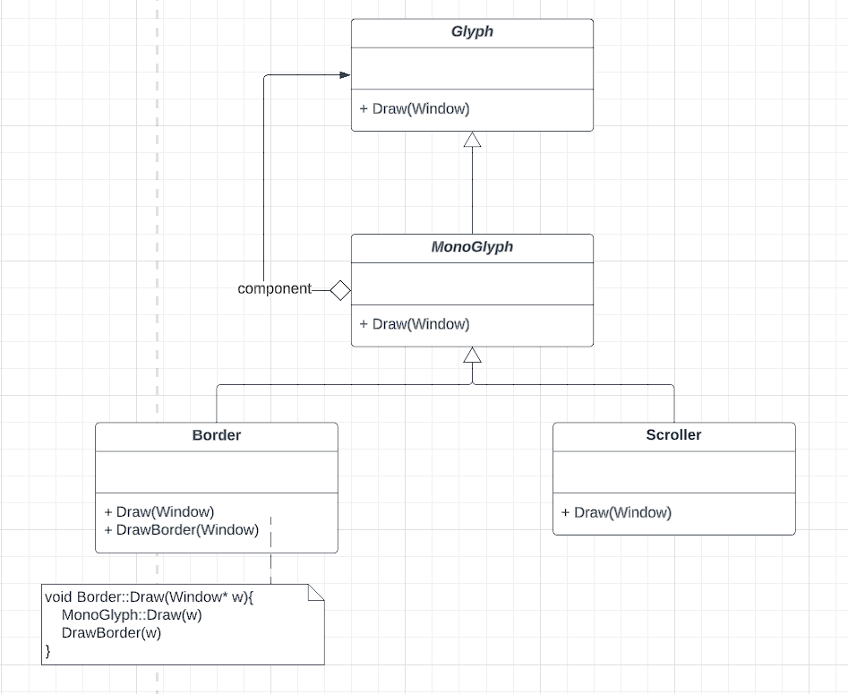
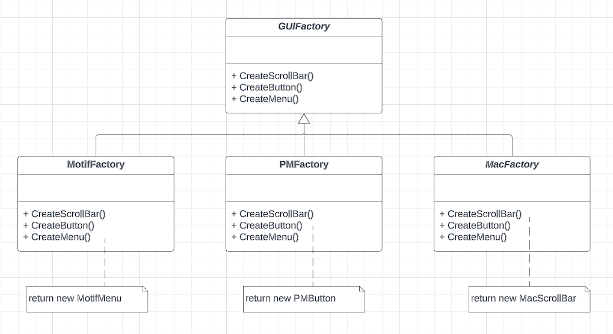
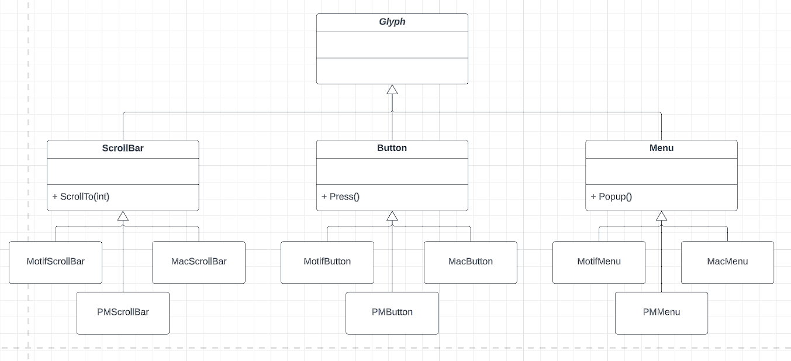

Design patterns are the blueprints of commonly encountered problems in software design and architecture. Each pattern provides a template tailored to solve a specific type of problem with a specific intent. Here we would explore only on the design patterns of object oriented problems, however, it's to be noted there's a complete different set of patterns for different aspects like concurrent, distributed programming and real-time programming. Design pattersn from object oriented programming perspective provides a way of communicating classes and objects that are customized to solve a gneric design problem in a particular context. Here in this blogpost, we would explore on some of the preliminary design patterns with the intention of creating a WYSIWYG(What-You-See-Is-What-You-Get) editor.

Let's start with the design aspect of WYSIWYG editor:
- Formatting: How the text and graphics are going to be arranged?
- Embellishing UI: UI to support scroll bars, borders, drop shadows. More of such embelishments are likely to get added later, which would require our editor to evolve.
- Supporting multiple look-and-feel standards
- Independent of different window system
- User operations: Buttons and drop-down menus are scattered through the UI. There should be a uniform mechanism for accessing this scattered functionality and undoing the affects
- Spell checking and hyphenation: How to minimize the changes to introduce a new analytical operation?


### Document Structure
A document consists of basic graphical elements such as characters, lines, polygons and other shapes. Besides, users are allowed to use these basic structure freely, and they can create complex structure by nesting one type of element in another element with certain set of arragement.

A common way to represent such hierarchial document is with the help of recursive composition, where increasinginly complex structure can be created with the help of simpler units. For an example, multiple characters are arranged from left-to-right to form a line, multiple lines are arranged from top-to-bottom to create a complete wiki. Also there can be shapes within shapes along with texts.
We can represent such physical structure by devoting an object to each important element. This includes the structural elements as well like lines, rows, columns beside the visible elements like characters. The result is an object structure like following:


We can define a abstract class called Glyph for all the objects that may appear in a document structure. The subclasses define both the primitive elements (like characters and images) and structural elements (like rows and columns).



Composite pattern captures the essence of recursive composition in object oriented terms. It is used to represent any potentially complex hierachial structure through tree of structures and then work with these structures. This is also useful when the client code treats both simple and complex elements uniformly.


### Formatting:
The document structure discussed in the previous section provides a way to represent the underlying physical structure, however it doesn't tell us how to format the document i.e how the text is broken down into lines, how the variation in margin width, indentation impacts the overall formatting of the document. There're variety of formatting algorithm with different strengths and weakness. Hence it's desirable to make it independent of document structure.



The formatting algorithm is encapsulated under a compositor class. The glyphs it formats are the children of a special Glyph subclass called composition. When composition needs formatting it invokes compositor's Compose() operation, which inturn iterations through the children of composition.
Encapsulating an alogirhtm in an object is the intent of the strategy pattern. It consists of strategy objects (compositor) and the context in which they operate. The context should be general enough to support new algorithms 



### Embellishing UI:
We can start with two types of embelishment: borders and scrollbar. From programmer perspective embelishment involves extending over the existing codes. However achieving this functionality by extending exiting compoistion class would result into explosion of classes. 
Border and scrollbar class has got some appearance, which suggests they should be subclass of Glyph, however, clients shouldn't care whether a glyph is having border or not, hence embellishment class should have the same interface of the Glyph.



The decorator pattern captures class and object relationship that support embellishment by attaching new behaviours to object by placing these objects under special wrapper class.


### Supporting multiple look-and-feel standards
We assume 2 set of widget Glyph classes:
1. A set of abstract Glyph subclasses for each category of widget graph. Eg: ScrollBar, Button, Menu etc
2. A set of concrete subclasses for each abstract subclass that implement the different look-and-feel



Abstract factory pattern consists of two key participants: factories and products. This pattern captures how to create families of related product objects without instantiating objects directly.

```cpp
    GUIFactory* guiFactory;
    const char* styleName = getenv("LOOK_AND_FEEL")

    if (strcmp(styleName, "Motif") == 0) {
        guiFactory = new MotifFactory()
    } else if (strcmp(styleName, "Presentation_Manager") == 0) {
        guiFactory = new PMFactory();
    } else {
        guiFactory = new DefaultGUIFactory();
    }
```

```cpp
    Scrollbar* sb = guiFactory->CreateScrollBar(); 
```


### References:
1. https://refactoring.guru/design-patterns/decorator
2. https://refactoring.guru/design-patterns/abstract-factory
