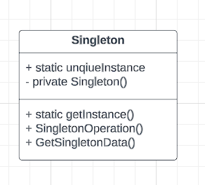
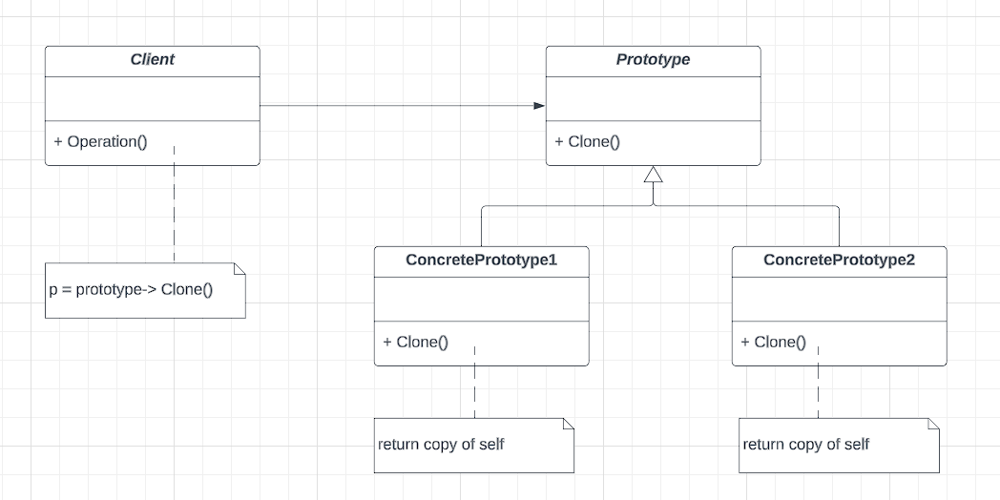
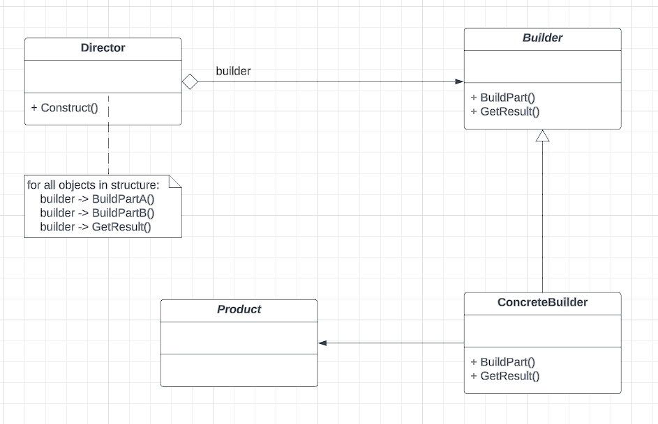
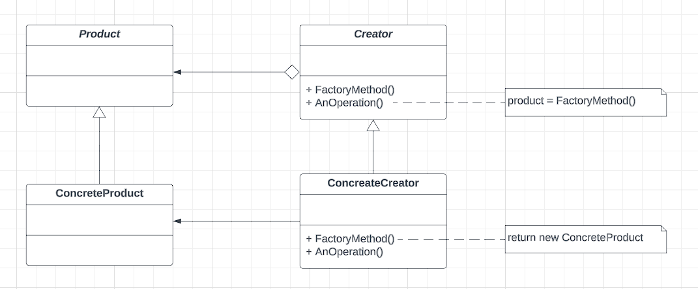
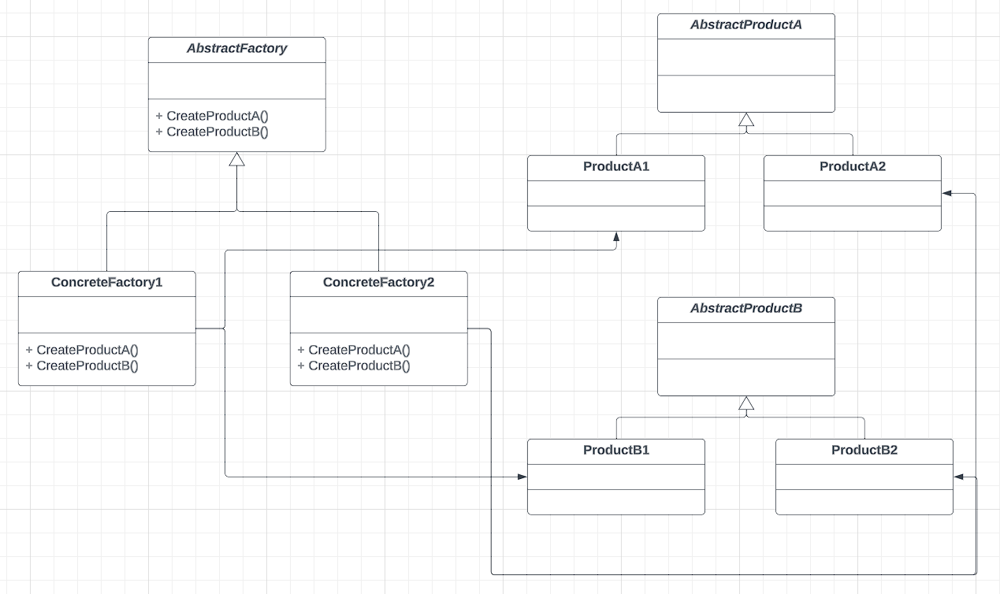

Creational design pattern handles the object instantiation process. They provide an abstract way to make the client independent of how objects are instantiated, which objects are getting instantiated, and how they're represented. For smaller applications, the objects are instantiated in a hard-coded way, as the type of object has remained fixed. However, as the application gets evolved, there comes the requirement of the same application or client to accommodate different sets of objects to be handled similarly, and thus the need of defining a smaller set of behavior arises, which then can be extended into different types of objects. Here the creational design pattern tries to achieve two goal:
1. To encapsulate the knowledge of which concrete classes the application uses
2. How the instances of these concrete classes are created and composed

## Singleton Pattern:
Intent: Ensure a class has only one instance, and provide a global point of access to it
- Generally used in logging, caches, thread pools, config setting, device driver objects
- Used in conjecture with Factory design pattern

###### Class Diagram:



Notes:
1. Private constructor is used to prevent anybody else to instantiate the singleton class
2. Static public method provides a global access point to the Singleton object
3. The implementation should also consider thread safety: generally achieved by using a global mutex lock 

###### Implementation:

```go
package singleton

import (
	"fmt"
	"sync"
)

type SingletonStruct struct{}

var uniqueInstance *SingletonStruct

type SingletonIface interface {
	GetInstance() *SingletonStruct
}

func NewSingleTonThreadUnsafe() SingletonIface {
	return &SingletonThreadUnsafe{}
}

func NewSingleTonThreadSafe() SingletonIface {
	return &SingletonThreadSafe{}
}

type SingletonThreadUnsafe struct {
}

func (ins *SingletonThreadUnsafe) GetInstance() *SingletonStruct {
	if uniqueInstance == nil {
		fmt.Println("Instantiating singleton struct")
		uniqueInstance = &SingletonStruct{}
	}
	return uniqueInstance
}

type SingletonThreadSafe struct{}

var lock = &sync.Mutex{}

func (ins *SingletonThreadSafe) GetInstance() *SingletonStruct {
	lock.Lock()
	defer lock.Unlock()
	if uniqueInstance == nil {
		fmt.Println("Instantiating singleton struct")
		uniqueInstance = &SingletonStruct{}
	}
	return uniqueInstance
}
```

## Prototype Pattern:
Intent: Specify the kinds of objects to create using a prototypical instance, and create new objects by copying this prototype
- Create new objects by cloning other objects to improve performance
- Use when the creation of the object is costly or complex eg: An object created out of a complex join query 

###### Class Diagram:



###### Implementation:

```go
package prototype

import (
	"bytes"
	"encoding/gob"
	"fmt"
)

type Prototype interface {
	Clone() Prototype
	Print()
}

type Window struct {
	WindowName string
	OpenedFile *File
}

func NewWindowPrototype() Prototype {
	return &Window{WindowName: "window1", OpenedFile: &File{Name: "file1"}}
}

func (window *Window) Clone() Prototype {
	return window.shallowCopy()
	// return window.DeepCopy()
}

// ---- ShallowCopy
func (window *Window) shallowCopy() Prototype {
	fmt.Println("---> Going for a shallow copy!")
	return &Window{
		WindowName: window.WindowName,
		OpenedFile: window.OpenedFile,
	}
}

// --- Deep copy: Copy through serialization
func (window *Window) DeepCopy() Prototype {
	fmt.Println("---> Going for a deep copy!")
	buf := bytes.Buffer{}

	enc := gob.NewEncoder(&buf)
	err := enc.Encode(window)
	fmt.Println("Error occurred while encoding: ", err)

	var newWindow Window
	dec := gob.NewDecoder(&buf)
	err = dec.Decode(&newWindow)
	fmt.Println("Error occurred while decoding: ", err)
	return &newWindow
}

func (window *Window) Print() {
	fmt.Printf("Memory loc: window:%p windowName:%p, openedFile:%p\n",
		window, window.WindowName, window.OpenedFile)
	fmt.Printf("Value: window:%+v windowName:%+v, openedFile:%+v\n",
		window, window.WindowName, window.OpenedFile)
}

type File struct {
	Name string
}
```

## Builder Pattern:
Intent: Separate the construction of a complex object from its representation so that the same construction process can create a different representation
- Build complex objects using simple objects and using a step-by-step procedure
- The process of constructing complex objects should be generic enough to be used to create objects with different representations


###### Class Diagram:



###### Implementation:

```go
package builder

import (
	"fmt"
)

type Product struct{}

type IBuilder interface {
	BuildPart1()
	BuildPart2()
	BuildPart3()
	GetResult() *Product
}

type ConcreteBuilder1 struct{}

func NewConcreteBuilder1() IBuilder {
	return &ConcreteBuilder1{}
}

type ConcreteProduct1 struct{}

func (builder *ConcreteBuilder1) BuildPart1() {
	fmt.Println("building part1")
}

func (builder *ConcreteBuilder1) BuildPart2() {
	fmt.Println("building part2")
}

func (builder *ConcreteBuilder1) BuildPart3() {
	fmt.Println("building part3")
}

func (builder *ConcreteBuilder1) GetResult() *Product {
	return &Product{}
}

```

## Factory Pattern:
Intent: Define an interface for creating an object, but let the subclasses decide which class to instantiate
- Create an object without exposing creation logic to the client and refer to the newly created object using a common interface
- At runtime, we get an object of a similar type based on the parameter passed

###### Class Diagram:



###### Implementation:

```go
package factory

import "fmt"

type IProduct interface {
	GetProductName() string
}

type Product1 struct {
	ProductName1 string
}

func (product *Product1) GetProductName() string {
	return "product1"
}

type Product2 struct {
	ProductName2 string
}

func (product *Product2) GetProductName() string {
	return "product2"
}

type ICreator interface {
	FactoryMethod() IProduct
	Operation()
	GetProduct() IProduct
}

type ConcreteCreator1 struct {
	Product1 Product1
}

func NewConcreteCreator1() ICreator {
	return &ConcreteCreator1{Product1: Product1{}}
}

func (creator *ConcreteCreator1) FactoryMethod() IProduct {
	fmt.Println("going to create the object")
	return &creator.Product1
}

func (creator *ConcreteCreator1) Operation() {
	fmt.Println("operation: ", creator.Product1.GetProductName())
}

func (creator *ConcreteCreator1) GetProduct() IProduct {
	return &creator.Product1
}

type ConcreteCreator2 struct {
	Product2 Product2
}

func NewConcreteCreator2() ICreator {
	return &ConcreteCreator2{Product2: Product2{}}
}

func (creator *ConcreteCreator2) FactoryMethod() IProduct {
	fmt.Println("going to create the object")
	return &creator.Product2
}

func (creator *ConcreteCreator2) Operation() {
	fmt.Println("operation: ", creator.Product2.GetProductName())
}

func (creator *ConcreteCreator2) GetProduct() IProduct {
	return &creator.Product2
}

```

## Abstract Factory Pattern:
Intent: Provide an interface for creating families of related or dependent objects without specifying their concrete classes 
- Super factory which creates other factories. Also known as the "factory of factories"

###### Class Diagram:



###### Implementation:

```go
package abstractFactory

type IWindow interface {
	GetWindow() IWindow
}

type IButton interface {
	GetButton() IButton
}

type IMenu interface {
	GetMenu() IMenu
}

type WinWindow struct {
	WindowsWindow string
}

func (window *WinWindow) GetWindow() IWindow {
	return &WinWindow{WindowsWindow: "windows window"}
}

type MacWindow struct {
	MacWindow string
}

func (window *MacWindow) GetWindow() IWindow {
	return &MacWindow{MacWindow: "mac window"}
}

type WinButton struct {
	WindowsButton string
}

func (button *WinButton) GetButton() IButton {
	return &WinButton{WindowsButton: "windows Button"}
}

type MacButton struct {
	MacButton string
}

func (button *MacButton) GetButton() IButton {
	return &MacButton{MacButton: "mac button"}
}

type WinMenu struct {
	WindowsMenu string
}

func (menu *WinMenu) GetMenu() IMenu {
	return &WinMenu{WindowsMenu: "windows menu"}
}

type MacMenu struct {
	MacMenu string
}

func (menu *MacMenu) GetMenu() IMenu {
	return &MacMenu{MacMenu: "mac menu"}
}


type IWidgetFactory interface {
	CreateWindow() IWindow
	CreateButton() IButton
	CreateMenu() IMenu
}

type WinWidgetFactory struct{}

func NewWinWidgetFactory() IWidgetFactory {
	return &WinWidgetFactory{}
}

func (factory *WinWidgetFactory) CreateWindow() IWindow {
	return &WinWindow{WindowsWindow: "windows window 1"}
}
func (factory *WinWidgetFactory) CreateButton() IButton {
	return &WinButton{WindowsButton: "windows button 1"}
}
func (factory *WinWidgetFactory) CreateMenu() IMenu {
	return &WinMenu{WindowsMenu: "windows menu 1"}
}

type MacWidgetFactory struct{}

func NewMacWidgetFactory() IWidgetFactory {
	return &MacWidgetFactory{}
}

func (factory *MacWidgetFactory) CreateWindow() IWindow {
	return &MacWindow{MacWindow: "macintosh window 1"}
}
func (factory *MacWidgetFactory) CreateButton() IButton {
	return &MacButton{MacButton: "macintosh button 1"}
}
func (factory *MacWidgetFactory) CreateMenu() IMenu {
	return &MacMenu{MacMenu: "macintosh menu 1"}
}

```

### References:
1. Design Patterns: Elements of Reusable Object-oriented Software
2. [Abstract Factory in Go](https://refactoring.guru/design-patterns/abstract-factory/go/example)
3. [Golang — Abstract Factory Pattern](https://medium.com/@MTrax/golang-abstract-factory-pattern-ec9132b589ab)
4. [An Easy Guide to Learn Abstract Factory in Golang](https://levelup.gitconnected.com/a-easy-guide-to-learn-abstract-factory-in-golang-6e27c1453999)
5. [Factory Method in Go](https://refactoring.guru/design-patterns/factory-method/go/example)
6. [Design Patterns in Golang- Factory](https://devcharmander.medium.com/design-patterns-in-golang-factory-6164c4e0b43f)
7. [Design patterns in Golang — The Builder](https://devcharmander.medium.com/design-patterns-in-golang-the-builder-dac468a71194)
8. [Builder in Go](https://refactoring.guru/design-patterns/builder/go/example)
9. [Prototype in Go](https://refactoring.guru/design-patterns/prototype/go/example)
10. [Design pattern in Golang — Prototype](https://devcharmander.medium.com/design-pattern-in-golang-prototype-e864522e4eeb)
11. [Singleton in Go](https://refactoring.guru/design-patterns/singleton/go/example)
12. [How singleton pattern works with Golang](https://medium.com/golang-issue/how-singleton-pattern-works-with-golang-2fdd61cd5a7f)

