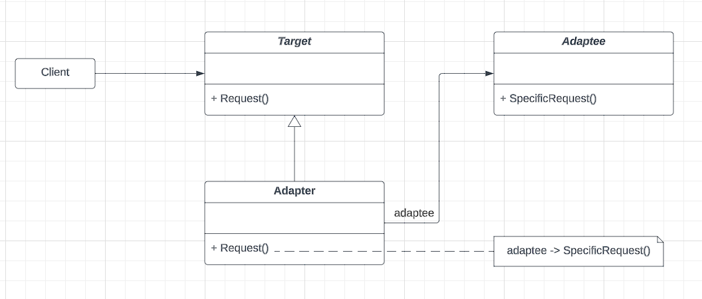
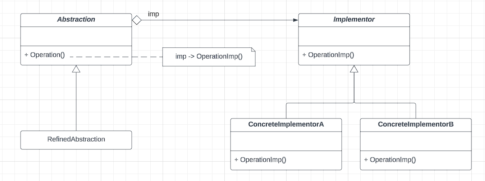
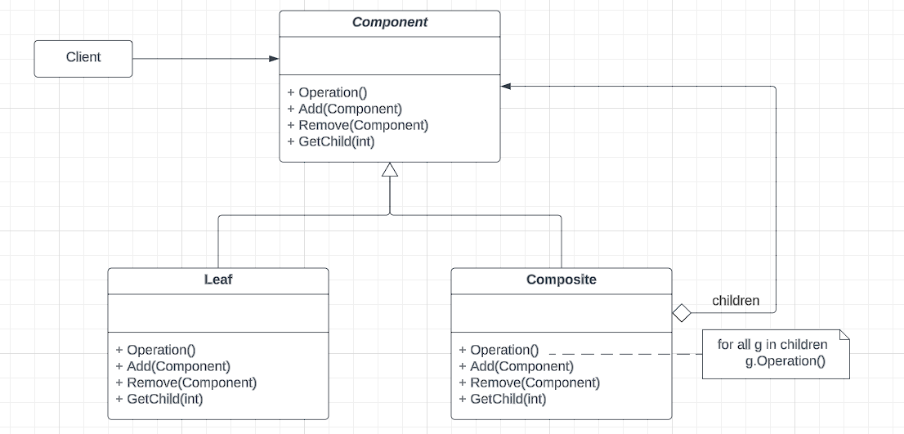
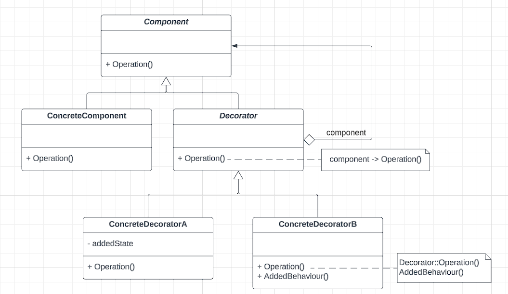
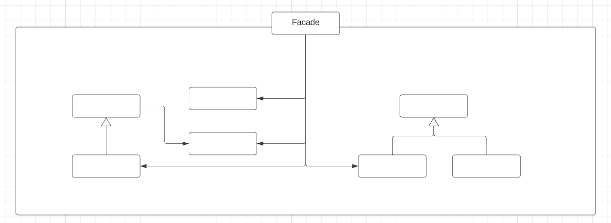
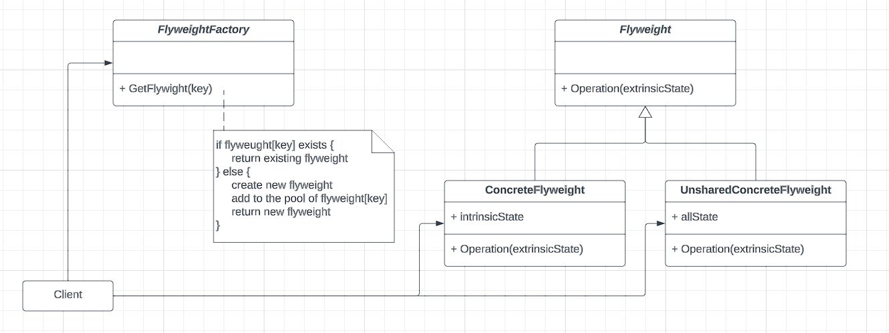
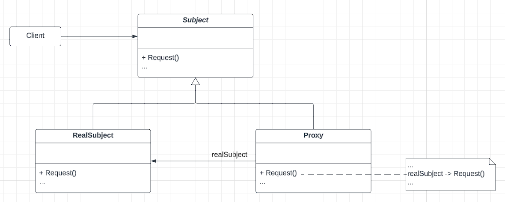
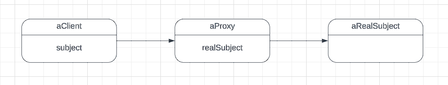

In the last blog post, we've explored on the creational design patterns. In this blog post, we would explore a different set of design patterns: the structural ones. The structural design patterns are concerned with how classes and objects are composed to form even larger structure. The primary objective here is to compose the components in a flexible and extensible way, so that change can be made in specific parts of the structure without changing the entire structure.


## Adapter Pattern:
Intent: Covert the interface of a class into another interface clients expect. Adapter lets classes work together that couldn't otherwise due to incompatible interfaces.

###### Class Diagram:


###### Implementation:
```go
package adapter

import (
	"fmt"
)

// -- Adaptee ---
type Adaptee interface {
	SpecificRequest()
}

func NewAdaptee() Adaptee {
	return &adaptee{}
}

type adaptee struct{}

func (adptr *adaptee) SpecificRequest() {}

// -- Target ---
type Target interface {
	Request()
}

func NewTarget() Target {
	return &target{}
}

type target struct{}

func (tgt *target) Request() {}

// -- Adapter ---

func NewAdapter() Target {
	return &adapter{adaptee: NewAdaptee()}
}

type adapter struct {
	adaptee Adaptee
}

func (adpt *adapter) Request() {
	fmt.Println("Using the requesst specific method for adaptee!")
	adpt.adaptee.SpecificRequest()
}
```

## Bridge Pattern:
Intent: Decouple an abstraction from its implementation so that it can vary independently

###### Class Diagram:


###### Implementation:
```go
package bridge

import (
	"fmt"
)

type Abstraction interface {
	Operation()
}

type Implementor interface {
	OperationImp()
}

func NewRefinedAbstraction(imp Implementor) Abstraction {
	return &refinedAbstraction{imp: imp}
}

type refinedAbstraction struct {
	imp Implementor
}

func (abs *refinedAbstraction) Operation() {
	abs.imp.OperationImp()
}

func NewConcreteImplementorA() Implementor {
	return &ConcreteImplementorA{}
}

type ConcreteImplementorA struct{}

func (impl *ConcreteImplementorA) OperationImp() {
	fmt.Println("Inside operationImp of concrete implementor A")
}
```

## Composite Pattern:
Intent: Compose objects into tree structures to represent part-whole hierarchies. Composite lets clients treat individual objects and compositions of objects uniformly.

###### Class Diagram:


## Decorator Pattern:
Intent: Attach additional responsibilities to an object dynamically. Decorator provides a flexible alternative to subclassing for extending functionality.

###### Class Diagram:


## Facade Pattern:
Intent: Provide a unified interface to a set of interfaces in a subsystem. Facade defines a higher-level interface that makes the subsystem easier to use.

###### Class Diagram:


## Flyweight Pattern:
Intent: Use sharing to support large numbers of fine-grained objects efficiently.

###### Class Diagram:


###### Object Diagram:


## Proxy Pattern:
Intent: Provide a surrogate or placeholder for another object to control access to it.

###### Class Diagram:


###### Object Diagram:


### References:
1. Design Patterns: Elements of Reusable Object-oriented Software
2. [Structural Design Pattern](https://www.scaler.com/topics/design-patterns/structural-design-pattern/)

