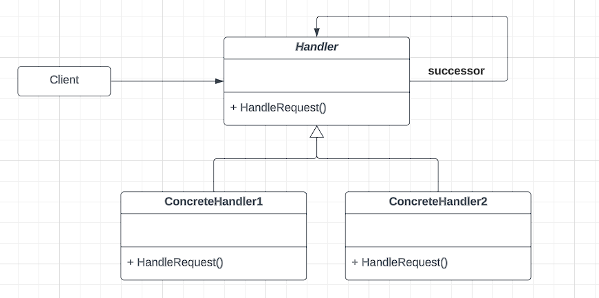
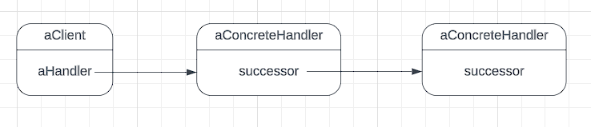
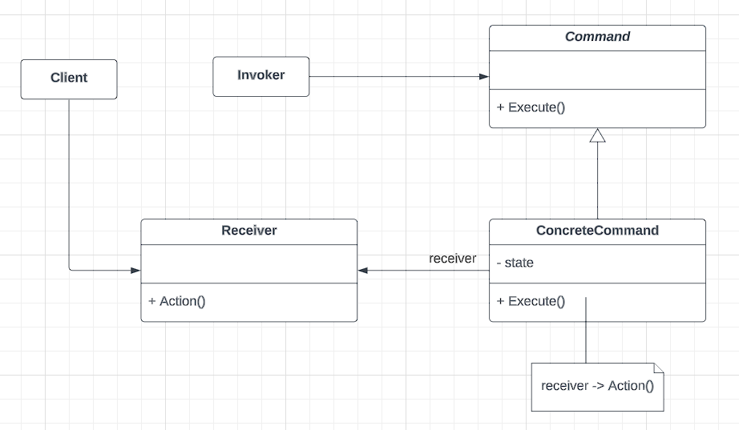
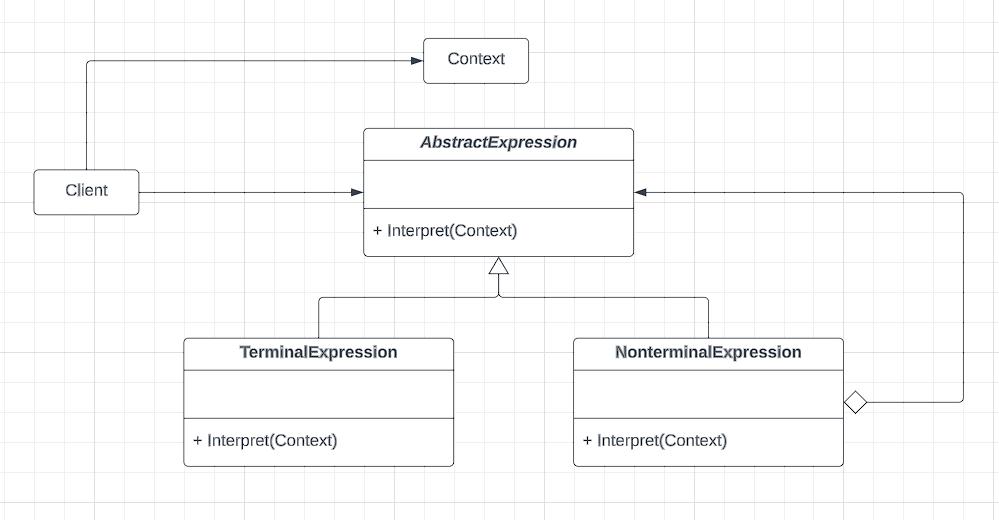
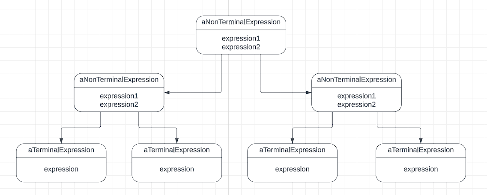
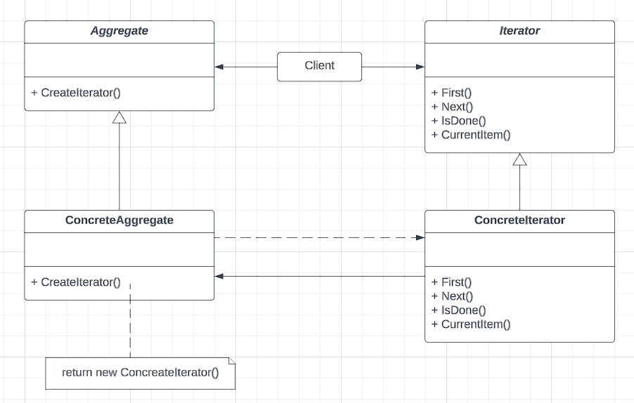
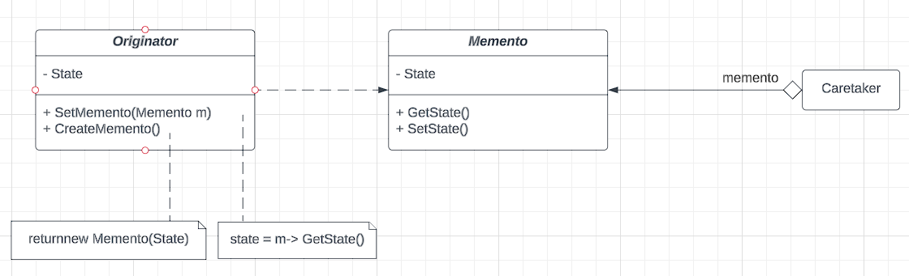
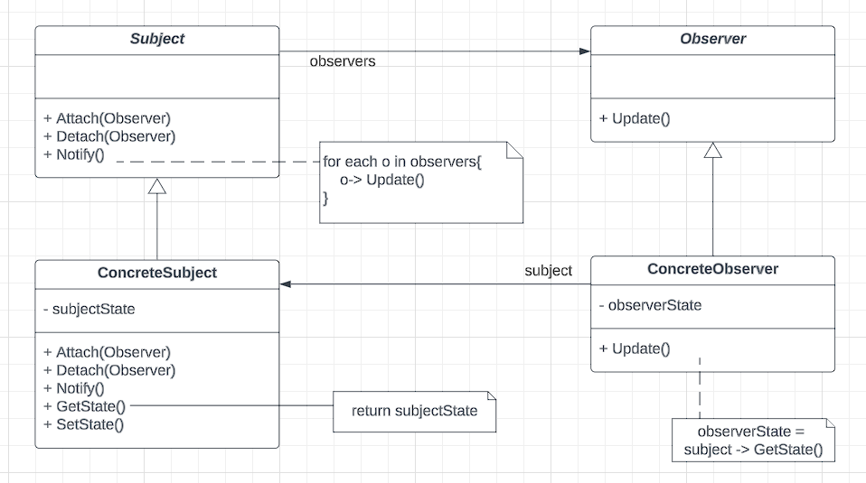
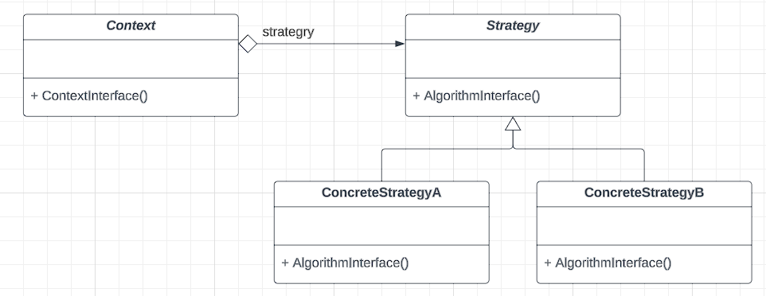
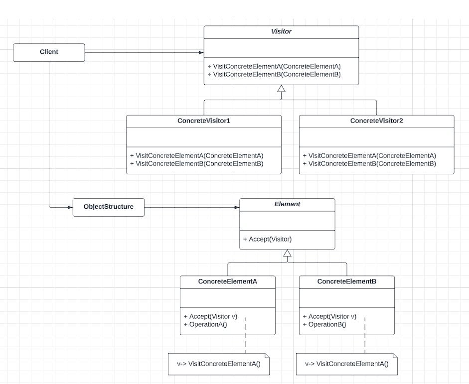

In the earlier blog posts, the creational and structural design patterns were explored, and here we would explore the behavioral design patterns. Behavioral design patterns are concerned with algorithms and the arrangement of responsibilities among different sets of classes and objects. The primary objective here is to have the interaction distributed over different sets of objects in such a way that they can communicate with each other while still being loosely coupled.

## Chain of responsibility:
Intent: Avoid coupling the sender of a request to its receiver by giving more than an object a chance to handle the request. Chain the receiving objects and pass the request along the chain until an object handles it.

NB:
- The client that issued the request may not have any direct reference to the object that ultimately fulfills it
- Object that made the request has no explicit knowledge of what will handle it (Implicit receiver)

###### Class Diagram:


###### Object Diagram:


###### Implementation
```go
package behavioral_patterns

import (
	"fmt"
)

type OrderHandler interface {
	SetNext(OrderHandler)
	Execute(*Task)
}

type Task struct {
	isOrderProcessed    bool
	isPackageProcessed  bool
	isBillingProcessed  bool
	isShipmentProcessed bool
}

type OrderProcessor struct {
	nextAction OrderHandler
}

func (proc *OrderProcessor) SetNext(orderHandler OrderHandler) {
	proc.nextAction = orderHandler
}

func (proc *OrderProcessor) Execute(task *Task) {
	if !task.isOrderProcessed {
		fmt.Println("Processing the order!")
		task.isOrderProcessed = true
		proc.nextAction.Execute(task)
	} else {
		fmt.Println("Order is already processed!")
		proc.nextAction.Execute(task)
	}
}

type PackageProcessor struct {
	nextAction OrderHandler
}

func (proc *PackageProcessor) SetNext(orderHandler OrderHandler) {
	proc.nextAction = orderHandler
}

func (proc *PackageProcessor) Execute(task *Task) {
	if !task.isPackageProcessed {
		fmt.Println("Processing the package!")
		task.isPackageProcessed = true
	} else {
		fmt.Println("Package is already processed!")
	}
	if proc.nextAction != nil {
		proc.nextAction.Execute(task)
	}
}

type BillingProcessor struct {
	nextAction OrderHandler
}

func (proc *BillingProcessor) SetNext(orderHandler OrderHandler) {
	proc.nextAction = orderHandler
}

func (proc *BillingProcessor) Execute(task *Task) {
	if !task.isBillingProcessed {
		fmt.Println("Processing the billing!")
		task.isBillingProcessed = true
	} else {
		fmt.Println("Billing is already processed!")
	}
	if proc.nextAction != nil {
		proc.nextAction.Execute(task)
	}
}

type ShipmentProcessor struct {
	nextAction OrderHandler
}

func (proc *ShipmentProcessor) SetNext(orderHandler OrderHandler) {
	proc.nextAction = orderHandler
}

func (proc *ShipmentProcessor) Execute(task *Task) {
	if !task.isShipmentProcessed {
		fmt.Println("Processing the shipment!")
		task.isShipmentProcessed = true
	} else {
		fmt.Println("Shipment is already processed!")
	}
	if proc.nextAction != nil {
		proc.nextAction.Execute(task)
	}
}
```
## Command:
Intent: Encapsulate a request as an object, thereby letting you parameterize clients with different requests, queue or log requests, and support undoable operations

###### Class Diagram:


###### Implementation:
```go
package behavioral_patterns

import "fmt"

type TvDevice struct {
	state bool
}

// Invoker
type Button struct {
	toggleState Command
}

func (button *Button) press() {
	button.toggleState.Execute()
}

// Command interface
type Command interface {
	Execute()
}

// TODO: how to have constructor??
type RemoteController struct {
	tvDevice *TvDevice
}

func (remoteCon *RemoteController) SetDevice(tvDevice *TvDevice) {
	remoteCon.tvDevice = tvDevice
}

func (remoteCon *RemoteController) Execute() {
	remoteCon.tvDevice.state = !remoteCon.tvDevice.state
	fmt.Println("TV state flipped to: ", remoteCon.tvDevice.state)
}

```

## Interpreter:
Intent: Given a language, define a representation for its grammar along with an interpreter that uses the representation to interpret sentences in the language

###### Class Diagram:


###### Object Diagram:


###### Implementation:
```go
package behavioral_patterns

import "fmt"

type Expression interface {
	Evaluate() float64
	Interpret() string
}

type Number struct {
	Value float64
}

func (num *Number) Evaluate() float64 {
	return num.Value
}

func (num *Number) Interpret() string {
	return fmt.Sprintf("%f", num.Value)
}

type Plus struct {
	Expr1, Expr2 Expression
}

func (plus *Plus) Evaluate() float64 {
	return plus.Expr1.Evaluate() + plus.Expr2.Evaluate()
}

func (plus *Plus) Interpret() string {
	return fmt.Sprintf("(%s + %s)", plus.Expr1.Interpret(), plus.Expr2.Interpret())
}

type Minus struct {
	Expr1, Expr2 Expression
}

func (minus *Minus) Evaluate() float64 {
	return minus.Expr1.Evaluate() - minus.Expr2.Evaluate()
}

func (minus *Minus) Interpret() string {
	return fmt.Sprintf("(%s - %s)", minus.Expr1.Interpret(), minus.Expr2.Interpret())
}

```

## Iterator:
Intent: Provide a way to access the elements of an aggregate object sequentially without exposing its underlying representation

###### Class Diagram:


###### Implementation:
```go
package behavioral_patterns

type User struct {
	FirstName string
	LastName  string
}

// Iterator
type Iterator interface {
	HasNext() bool
	GetNext() interface{}
}

type UserIterator struct {
	currentIndex int
	UserArray    []User
}

func (userItr *UserIterator) HasNext() bool {
	return userItr.currentIndex < len(userItr.UserArray)
}

func (userItr *UserIterator) GetNext() interface{} {
	if !userItr.HasNext() {
		return nil
	}
	user := userItr.UserArray[userItr.currentIndex]
	userItr.currentIndex++
	return &user
}

// Collection
type Collection interface {
	CreateIterator() Iterator
}

type UserCollection struct {
	UserArray []User
}

func (collection *UserCollection) CreateIterator() Iterator {
	return &UserIterator{UserArray: collection.UserArray}
}

```

## Memento:
Intent: Without violating encapsulation, capture and externalize an object's internal state so that the object can be restored to this state later.

###### Class Diagram:


###### Implementation:
```go
package behavioral_patterns

type Observer struct {
	PrivateStr string
}

func (obs *Observer) CreateMemento() *ObserverMemento {
	return &ObserverMemento{privateStr: obs.PrivateStr}
}

func (obs *Observer) SetMemento(memento *ObserverMemento) {
	obs.PrivateStr = memento.privateStr
}

// ObserverMemento methods should be accessible from Observer only
type ObserverMemento struct {
	privateStr string
}

func (memento *ObserverMemento) getState() string {
	return memento.privateStr
}

func (memento *ObserverMemento) setState(str string) {
	memento.privateStr = str
}

// Place in different package to make sure observerMemento methods are inaccessible to Caretaker
type Caretaker struct {
	mementoList []*ObserverMemento
}

func (caretaker *Caretaker) AppendMemento(memento *ObserverMemento) {
	caretaker.mementoList = append(caretaker.mementoList, memento)
}

func (caretaker *Caretaker) GetMementoIndex(index int) *ObserverMemento {
	return caretaker.mementoList[index]
}
```

## Observer:
Intent: Define a one-to-many dependency between objects so that when one object changes state, all its dependents are notified and updated automatically 

###### Class Diagram:


###### Implementation:
```go
package behavioral_patterns

import "fmt"

type Subject interface {
	Attach(IObserver)
	Detach(IObserver)
	Notify()
}

type ConcreteSubject struct {
	observerList []IObserver
}

func (subject *ConcreteSubject) Attach(observer IObserver) {
	subject.observerList = append(subject.observerList, observer)
}

func (subject *ConcreteSubject) Detach(observer IObserver) {
	for i, obs := range subject.observerList {
		if observer == obs {
			subject.observerList = append(subject.observerList[:i], subject.observerList[i+1:]...)
		}
	}
}

func (subject *ConcreteSubject) Notify() {
	for _, obs := range subject.observerList {
		obs.Update()
	}
}

type IObserver interface {
	Update()
}

type ConcreteObserver struct {
	Id int
}

func (obs *ConcreteObserver) Update() {
	fmt.Printf("Received update: %v\n", obs)
}

```

## Strategy:
Intent: Define a family of algorithms, encapsulate each one, and make them interchangeable. Strategy lets the algorithm vary independently from the clients that use it

###### Class Diagram:


###### Implementation:
```go
package behavioral_patterns

import "fmt"

type EvictionAlgo interface {
	Evict(*Cache)
}

type Cache struct {
	mappedElem  map[string]string
	algo        EvictionAlgo
	capacity    int
	maxCapacity int
}

func (cache *Cache) InitCache(algo EvictionAlgo) {
	cache.capacity = 0
	cache.maxCapacity = 2
	cache.algo = algo
	cache.mappedElem = make(map[string]string)
}

func (cache *Cache) Add(key, value string) {
	if cache.capacity == cache.maxCapacity {
		cache.algo.Evict(cache)
	}
	cache.capacity++
}

type FifoEvictionAlgo struct{}

func (algo *FifoEvictionAlgo) Evict(cache *Cache) {
	fmt.Println("Evicting through Fifo policy")
	cache.capacity--
}

type LSTEvictionAlgo struct{}

func (algo *LSTEvictionAlgo) Evict(cache *Cache) {
	fmt.Println("Evicting through LST policy")
	cache.capacity--
}

```

## Visitor:
Intent: Represent an operation to be performed on the elements of an object structure. Visitor lets you define a new operation without changing the classes of the elements on which it operates

###### Class Diagram:


###### Implementation:
```go
package behavioral_patterns

import "fmt"

type Shape interface {
	GetType() string
	Accept(Visitor)
}

type Square struct {
	Side int
}

func (square *Square) GetType() string {
	return "square"
}

func (square *Square) Accept(visitor Visitor) {
	visitor.VisitSquare(square)
}

type Circle struct {
	Radius int
}

func (circle *Circle) GetType() string {
	return "circle"
}

func (cirlce *Circle) Accept(visitor Visitor) {
	visitor.VisitCircle(cirlce)
}

type Visitor interface {
	VisitSquare(*Square)
	VisitCircle(*Circle)
}

type AreaCalculator struct{}

func (area *AreaCalculator) VisitSquare(square *Square) {
	fmt.Printf("Going to calculate area for square: %+v\n", square)
}

func (area *AreaCalculator) VisitCircle(circle *Circle) {
	fmt.Printf("Going to calculate area for circle: %+v\n", circle)
}

```

### References:
1. Design Patterns: Elements of Reusable Object-oriented Software
2. [Behavioral Design Patterns: Javapoint](https://www.javatpoint.com/behavioral-design-patterns)
3. [Behavioral Design Patterns: Refactoring Guru](https://refactoring.guru/design-patterns/behavioral-patterns)


