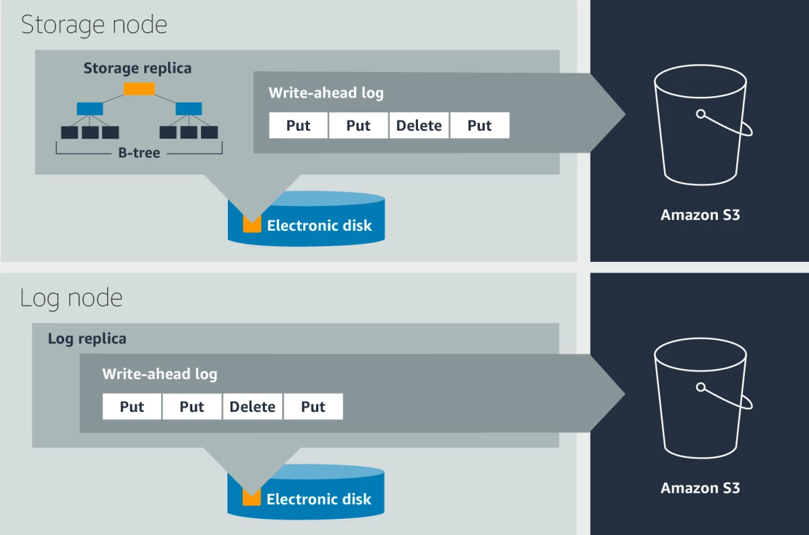
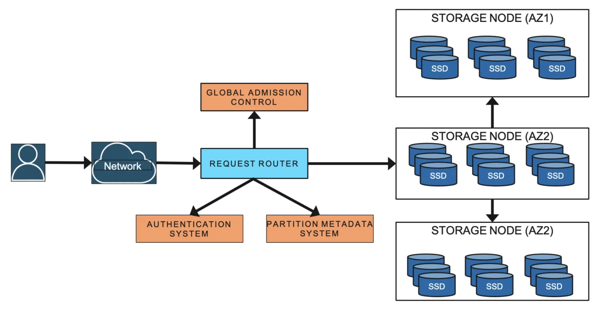

DynamoDB is a fully-managed serverless NoSQL database service provided by Amazon to provide consistent performance across any scale. What makes DynamoDB truly unique is the advertised single-digit millisecond latency withstanding issues like traffic imbalance, monitoring, and automated system-related operations. Here in this blog post, we would explore the architecture of DynamoDB, would understand where this

DynamoDB is a fully-managed multi-tenant service, which denotes that users consume database service without actively managing the service and without regard for where the data is stored. DynamoDB may store data from different customers on the same physical system.

DynamoDB replicates data across multiple data centers spread across different availability zones. The global tables are replicated across multiple regions for availability. There's no predefined limit on the size of tables, and as the tables grow larger, it's split into partitions to meet the throughput requirements.

It's to be noted that the read operations can be set to either to be strong consistent or eventually consistent.

## Architecture Overview:

The DynamoDB table is a collection of items, and each item is a collection of attributes. Each item can be uniquely identified with the primary key schema. A primary key schema consists of a partition key and optionally a sort key. The partition key is used along with an internal hash to determine the partition to place the item, and the sort key if exists determines the order. DynamoDB also supports secondary indexes.

The DynamoDB table is divided into multiple partitions to handle throughput requirements. Each partition of the table hosts a disjoint and contiguous part of the key range, and the same partition is replicated across multiple availability zones. The replicas of a partition form a replication group, and a consensus algorithm Paxos is used to determine the leader node. Each leader node also has a leadership lease, and in case one replica is unable to connect to the leader node, it can trigger the leader election process, and when a new leader is selected, it waits till the earlier leadership lease is expired. All the write operations under the partition are served by the leader node and are committed by Write-Ahead-Log by the quorum of replicas, then only the leader node acknowledge write is successful. DynamoDB read item operations can either be strongly consistent, which is served by the leader node, or can be eventually consistent, in which case it would be served by any replica. The replicas are typically placed under different AZs, and in the case of global tables, the replicas are placed under different regions to increase availability further.

Each replica of a partition consists of a write-ahead log and a B-tree that stores the key-value data. However, as the same B-tree can be generated from the write-ahead log, hence only the leader node maintains the B-tree.

Metadata service stores the routing information about tables, indexes, and replication groups for keys for a given table or index. 

All resource creation, update, and data definition requests are routed to the auto-admin service. It's responsible for fleet health, partition health, scaling of tables, and execution of all control plan requests.

Even though DynamoDB is a NoSQL database, it supports ACID transactions as well.

## Performance Throughput:
DynamoDB uses Read Capcity Unit(RCU) and Write Capcity Unit(WCU) to measure throughput. The on-demand provisioning model determines the throughput requirement on a real-time basis, or it can be fixed in the provisioned capacity mode. One RCU allows one strongly consistent read or two eventually consistent reads per second for an item up to the size of 4KB, and one WCU allows one write operation per second for an item up to the size of 1 KB. This throughput, once determined, is distributed across all the partitions, and as the table grows, new partitions are created, and the throughput capacity is distributed across the partitions of the table.

Given that one storage node can host different partitions from different tables from multiple customers, admission control ensures that the storage node can accommodate performance throughput for all the partitions. It checks whether the sum of the throughput requirement of all the partitions hosted by a specific node is below the performance throughput of the node. New partitions are created either when the table size grows larger, or the throughput capacity is changed, and the overall throughput capacity of the table is distributed uniformly across all the partitions of it. It's to be noted that each partition has a maximum throughput, and if it is exceeded, new partitions are created.

The uniform distribution of throughput across all partitions can result in hot portions of the partitions having less performance whereas the throughput of the cold partitions is getting unused. To accommodate these scenarios, DynamoDB has introduced two concepts: burst capacity & adaptive capacity.

#### Burst Capacity:
The unused capacity on the partition level is retained for up to 300 seconds and gets utilized when the consumed capacity exceeds the provisioned capacity of the partition. This approach is useful, especially to absorb short-lived spikes. As multiple partitions are hosted at the same storage node, DynamoDB also has to ensure the overall throughput capacity doesn't exceed the capacity of the node. For this a tow bucket policy is applied, where a partition-level bucket contains the tokens for unused capacity and a node-level bucket contains tokens for the node. The incoming read or write requests are served only if a token exists and can be deducted from both the partition level bucket and node level bucket. The same approach is followed in both leader and replica partitions. 
Once it's observed to have overall used throughput exceeding a certain threshold capacity depending upon the storage node, a few partitions are moved into different storage nodes.

#### Adaptive Capacity:
If a table experiences throttling, but the table level throughput isn't exceeded, then the throughput capacity of the impacted partition is increased with the help of a proportional control algorithm. Once the table starts consuming more throughput than the provisioned capacity, then boosted capacity is decreased. This technique allows us to absorb the long-lived spike or skewness in the data access patterns.

## Durability:
The write-heated log is the central point of providing durability and crash recovery. These logs are periodically archived into S3, and the non-archived logs are generally in the size of a few hundred MBs. When one node goes down, healing may a couple of minutes, however adding a new replica by replicating the write-ahead log takes only a couple of seconds. Hardware failure may also cause corrupted data written, which is difficult to capture. DynamoDB uses checksums at different layers to detect this kind of silent error. For each data transfer between two nodes, data integrity is checked through checksum. Log archival agents run on all the nodes, and it also does various checks before uploading data to S3. When one log agent finds out a log file is already archived from the leader, the log agent running on the replica nodes downloads the data from S3 and verifies the integrity by comparing it with the local log file.

## Failure Detection:
A newly elected leader can't accept any new write request until the lease of the old leader expires. There's also a possibility of reporting false-positive failures, where a replica of a partition is unable to communicate with the leader. The overcome this issue, the follower replica sends a message to the other follower replicas to fetch the communication status of them with the leader node. If the other replicas send a healthy leader message, then the impacted follower node backs off from triggering the leader election process.

## Metadata availability:
DynamoDB utilizes an in-memory distributed datastore called MemDS, which stores all the metadata in memory and replicates it across the MemDS fleet. MemDS scales horizontally to accommodate all the requests coming from the request routers. It's to be noted that even a cache hit also triggers an asynchronous call to refresh the cache. All the partition membership updates are pushed from the storage node to the MemDS.

### To explore:
- How formal methods are used to prove the usefulness of algorithms
- Database vs table in dynamoDB. Where do we mention throughput capacity?
- Can splitted partitions be merged if throughput capacity is reduced?
- What is best-effort basis and how this is used for burst capacity and adaptive capacity
- What is proportional control algorithm?
- How Global Admission Control manages adaptive capacity across all the partitions for a table?
- Why snapshot restore on DynamoDB doesn't impact availability
- How DynamoDB encrypts data
- MemeDS architecture
- Implement B-tree and WAL

### References:
1. Elhemali M, Gallagher N, Tang B, Gordon N, Huang H, Chen H, Idziorek J, Wang M, Krog R, Zhu Z, Lazier C. Amazon {DynamoDB}: A Scalable, Predictably Performant, and Fully Managed {NoSQL} Database Service. In2022 USENIX Annual Technical Conference (USENIX ATC 22) 2022 (pp. 1037-1048).
2. [How Amazon DynamoDB adaptive capacity accommodates uneven data access patterns](https://aws.amazon.com/blogs/database/how-amazon-dynamodb-adaptive-capacity-accommodates-uneven-data-access-patterns-or-why-what-you-know-about-dynamodb-might-be-outdated/)
3. [Example on DynamoDB Burst Capacity and Adaptive Scaling](https://stackoverflow.com/questions/55262755/dynamodb-burst-capacity-and-adaptive-scaling)

