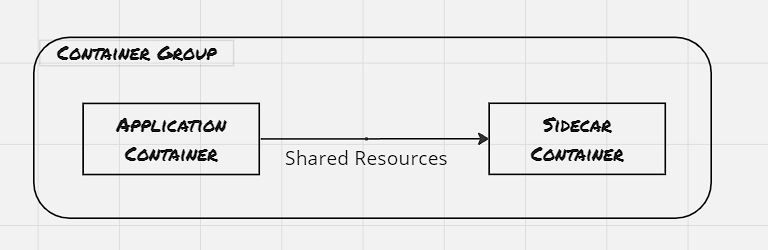
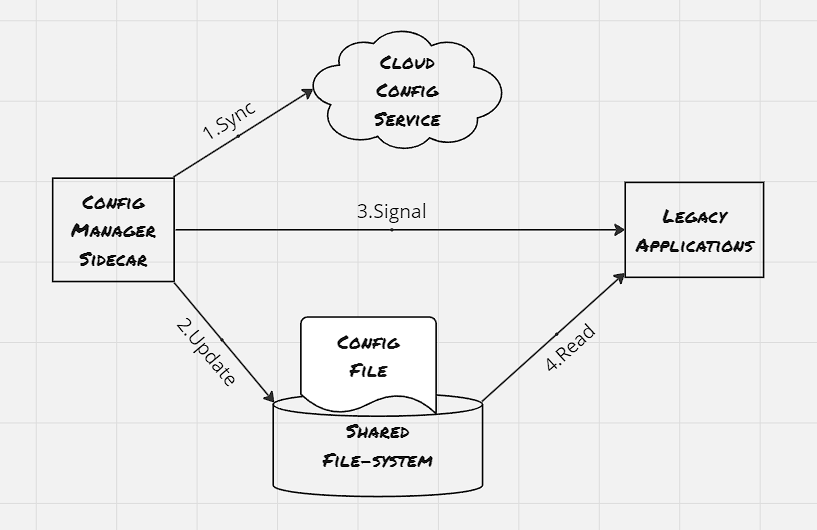
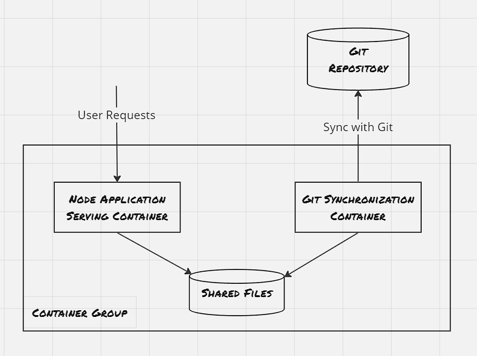
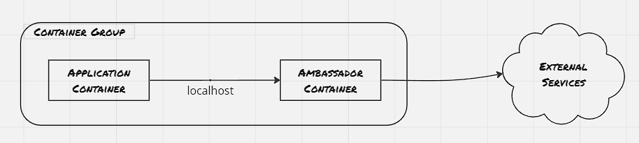
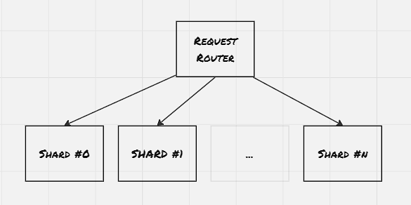
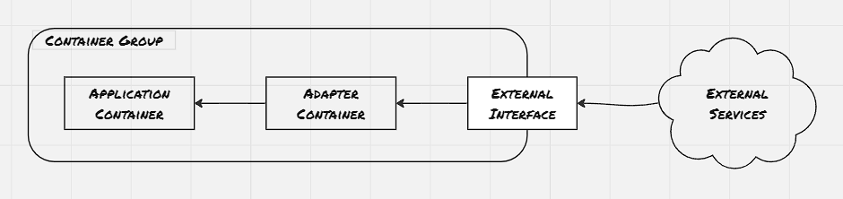

Containers and container orchestrators have introduced a great deal of flexibility in designing distributed systems. Earlier the programs were developed to be distributed over a handful of nodes, however, with the help of container orchestrators, scaling has become a quite straightforward activity, and within a couple of seconds, the program can be scaled to ten of thousands of instances. And with this, certain specific patterns and practices, which has found usage across organizations. Identifying such patterns provide a common vocabulary to discuss repetitive set of problems, and encourage reuse. Here in this blog post, we would discuss the single node patterns, where multiple containers are needed to be co-scheduled in the same node, with the understanding that the containers need to share resources between containers. Different orchestrators have different names for this type of tightly grouped container. In Kubernetes, it's called a Pod, other orchestrators also have native support, though the term would be different.


### Sidecar Pattern:
A sidecar container is attached to the application container to add functionalities that might otherwise be difficult to improve.



##### Example 01: Adding HTTPS layer to a legacy service:
New development on legacy applications is significantly more challenging compared to adding an NGINX ingress which terminates the SSL connectivity and redirects the request to the legacy application.


##### Example 02: Dynamic configuration:
Earlier applications were written with the understanding that the configuration file would reside on the filesystem. However, with the advent of cloud computing, it's easier to use API to update the configuration. This provides a way to do a dynamic push of configuration without the need to log into each node and then update the configuration file through some command. 

```sh
docker run --pid:container:${APP_ID} -p 8080:8080 brendanburns/topz:db0fa58 \
        /server -address=0.0.0.0:8080
```



##### Example 03: Building Simple PaaS:




The sidecar container should be reusable across a wide variety of applications and deployments. During the development, focus on the following areas:
- Parametrizing the containers
- Creating the API surface of the container: Take special care not to break existing operations
- Documenting the operation of the container: User proper labels, expose the ports even if it's optional, also provide comments explaining the use of ports and environment variables

### Ambassadors:
Ambassador container brokers interactions between the application container and the rest of the world.



##### Example 01: Shard a service:
Sharding splits a layer into multiple disjoint places, each hosted by a different node. Generally, the sharding logic is built into the sharding service itself, and the sharding service uses a stateless load balancer to route the request to the appropriate shard



##### Example 02: Service brokering:
Service discovery is a way for Microservices to discover each other over a network. The process is called service discovery, and the service that performs this discovery and links microservices is called service broker.


```sh
controlplane $ cat prod-deploy.yaml 
apiVersion: apps/v1
kind: Deployment
metadata:
  labels:
    app: prod
  name: prod
  namespace: default
spec:
  replicas: 2
  selector:
    matchLabels:
      app: prod-pod
  strategy: {}
  template:
    metadata:
      creationTimestamp: null
      labels:
        app: prod-pod
    spec:
      containers:
      - image: nginx
        name: nginx
        resources: {}
status: {}
controlplane $ cat svc-prod.yaml 
apiVersion: v1
kind: Service
metadata:
  creationTimestamp: null
  labels:
    app: svc-prod
  name: svc-prod
  namespace: default
spec:
  ports:
  - name: 8082-80
    port: 8082
    protocol: TCP
    targetPort: 80
  selector:
    app: prod-pod
  type: NodePort
status:
  loadBalancer: {}
controlplane $ cat exp-deploy.yaml 
apiVersion: apps/v1
kind: Deployment
metadata:
  labels:
    app: exp
  name: exp
  namespace: default
spec:
  replicas: 2
  selector:
    matchLabels:
      app: exp-pod
  strategy: {}
  template:
    metadata:
      creationTimestamp: null
      labels:
        app: exp-pod
    spec:
      containers:
      - image: nginx
        name: nginx
        resources: {}
status: {}
controlplane $ cat svc-exp.yaml 
apiVersion: v1
kind: Service
metadata:
  creationTimestamp: null
  labels:
    app: svc-exp
  name: svc-exp
  namespace: default
spec:
  ports:
  - name: 8083-80
    port: 8083
    protocol: TCP
    targetPort: 80
  selector:
    app: exp-pod
  type: NodePort
status:
  loadBalancer: {}
controlplane $ cat nginx.conf 

worker_processes 5;

events{
  worker_connections 1024;
}

http {
  upstream backend {
    ip_hash;
    server svc-prod:8082 weight=9;
    server svc-exp:8083;
  }

  server {
    listen localhost:80;
    location / {
      proxy_pass http://backend;
    }
  }
}
controlplane $ cat splitter.yaml 
apiVersion: apps/v1
kind: Deployment
metadata:
  labels:
    app: splitter
  name: splitter
  namespace: default
spec:
  replicas: 1
  selector:
    matchLabels:
      app: splitter-pod
  strategy: {}
  template:
    metadata:
      creationTimestamp: null
      labels:
        app: splitter-pod
    spec:
      containers:
      - image: nginx
        name: nginx
        volumeMounts:
        - name: config-volume
          mountPath: /etc/nginx/
      volumes:
      - name: config-volume
        configMap:
          name: config-volume 
status: {}
controlplane $ 
```

### Adapters:
Adapter container transforms the output of the application container so that it conforms to the standard other containers are expecting it to be.



##### Example 01: Monitoring:

``` sh
oot@log-example-6dd84f84dd-bhssj:/# nginx -V
nginx version: nginx/1.25.2
built by gcc 12.2.0 (Debian 12.2.0-14) 
built with OpenSSL 3.0.9 30 May 2023
TLS SNI support enabled
configure arguments: --prefix=/etc/nginx --sbin-path=/usr/sbin/nginx --modules-path=/usr/lib/nginx/modules --conf-path=/etc/nginx/nginx.conf --error-log-path=/var/log/nginx/error.log --http-log-path=/var/log/nginx/access.log --pid-path=/var/run/nginx.pid --lock-path=/var/run/nginx.lock --http-client-body-temp-path=/var/cache/nginx/client_temp --http-proxy-temp-path=/var/cache/nginx/proxy_temp --http-fastcgi-temp-path=/var/cache/nginx/fastcgi_temp --http-uwsgi-temp-path=/var/cache/nginx/uwsgi_temp --http-scgi-temp-path=/var/cache/nginx/scgi_temp --user=nginx --group=nginx --with-compat --with-file-aio --with-threads --with-http_addition_module --with-http_auth_request_module --with-http_dav_module --with-http_flv_module --with-http_gunzip_module --with-http_gzip_static_module --with-http_mp4_module --with-http_random_index_module --with-http_realip_module --with-http_secure_link_module --with-http_slice_module --with-http_ssl_module --with-http_stub_status_module --with-http_sub_module --with-http_v2_module --with-http_v3_module --with-mail --with-mail_ssl_module --with-stream --with-stream_realip_module --with-stream_ssl_module --with-stream_ssl_preread_module --with-cc-opt='-g -O2 -ffile-prefix-map=/data/builder/debuild/nginx-1.25.2/debian/debuild-base/nginx-1.25.2=. -fstack-protector-strong -Wformat -Werror=format-security -Wp,-D_FORTIFY_SOURCE=2 -fPIC' --with-ld-opt='-Wl,-z,relro -Wl,-z,now -Wl,--as-needed -pie'
root@log-example-6dd84f84dd-bhssj:/# 


root@log-example-6dd84f84dd-sp86t:/# cat /etc/nginx/nginx.conf 

user  nginx;
worker_processes  auto;

error_log  /var/log/nginx/error.log notice;
pid        /var/run/nginx.pid;


events {
    worker_connections  1024;
}


http {
    include       /etc/nginx/mime.types;
    default_type  application/octet-stream;

    log_format  main  '$remote_addr - $remote_user [$time_local] "$request" '
                      '$status $body_bytes_sent "$http_referer" '
                      '"$http_user_agent" "$http_x_forwarded_for"';

    access_log  /var/log/nginx/access.log  main;

    sendfile        on;
    #tcp_nopush     on;

    keepalive_timeout  65;

    #gzip  on;

    include /etc/nginx/conf.d/*.conf;
}
root@log-example-6dd84f84dd-sp86t:/# cat /etc/nginx/conf.d/default.conf 
server {
    listen       80;
    listen  [::]:80;
    server_name  localhost;

    #access_log  /var/log/nginx/host.access.log  main;

    location / {
        root   /usr/share/nginx/html;
        index  index.html index.htm;
    }

    location /status {
        stub_status;
    }

    location /metrics {
        stub_status;
    }

    #error_page  404              /404.html;

    # redirect server error pages to the static page /50x.html
    #
    error_page   500 502 503 504  /50x.html;
    location = /50x.html {
        root   /usr/share/nginx/html;
    }

    # proxy the PHP scripts to Apache listening on 127.0.0.1:80
    #
    #location ~ \.php$ {
    #    proxy_pass   http://127.0.0.1;
    #}

    # pass the PHP scripts to FastCGI server listening on 127.0.0.1:9000
    #
    #location ~ \.php$ {
    #    root           html;
    #    fastcgi_pass   127.0.0.1:9000;
    #    fastcgi_index  index.php;
    #    fastcgi_param  SCRIPT_FILENAME  /scripts$fastcgi_script_name;
    #    include        fastcgi_params;
    #}

    # deny access to .htaccess files, if Apache's document root
    # concurs with nginx's one
    #
    #location ~ /\.ht {
    #    deny  all;
    #}
}

root@log-example-6dd84f84dd-sp86t:/# 


controlplane $ ls -l
total 8
lrwxrwxrwx 1 root root   1 Aug  8 10:39 filesystem -> /
-rw-r--r-- 1 root root 289 Aug 18 14:54 log-svc.yaml
-rw-r--r-- 1 root root 429 Aug 18 14:50 log_example.yaml
controlplane $ cat log-svc.yaml 
apiVersion: v1
kind: Service
metadata:
  creationTimestamp: null
  labels:
    app: log-svc
  name: log-svc
  namespace: default
spec:
  ports:
  - name: 80-80
    port: 8090
    protocol: TCP
    targetPort: 80
  - name: 91-91
    port: 8091
    protocol: TCP
    targetPort: 9113
  selector:
    app: log-example
  type: NodePort
status:
  loadBalancer: {}
controlplane $ cat log_example.yaml 
apiVersion: apps/v1
kind: Deployment
metadata:
  creationTimestamp: null
  labels:
    app: log-example
  name: log-example
  namespace: default
spec:
  replicas: 1
  selector:
    matchLabels:
      app: log-example
  strategy: {}
  template:
    metadata:
      creationTimestamp: null
      labels:
        app: log-example
    spec:
      containers:
      - image: nginx
        name: nginx
        resources: {}
        ports:
        - containerPort: 80
        volumeMounts:
          - name: nginx-configure
            mountPath: /etc/nginx/nginx.conf
            subPath: nginx.conf
          - name: nginx-configure
            mountPath: /etc/nginx/conf.d/default.conf
            subPath: default.conf
      - image: nginx/nginx-prometheus-exporter
        name: nginx-prometheus-exporter
        args:
          - '-nginx.scrape-uri=http://localhost:80/status'
        ports:
        - containerPort: 9113
      volumes:
        - name: nginx-configure
          configMap:
            name: nginx-conf
status: {}
controlplane $ 
```

##### Example 02: Logging:
Different application container might log information in different format. The adapter container is useful in transforming them into a structured pattern that can be consumed by log aggregator. Fluentd is one such popular logging agents available.

### References:
1. Designing Distributed Systems: Patterns & Paradigms for Scalable, Reliable Services
