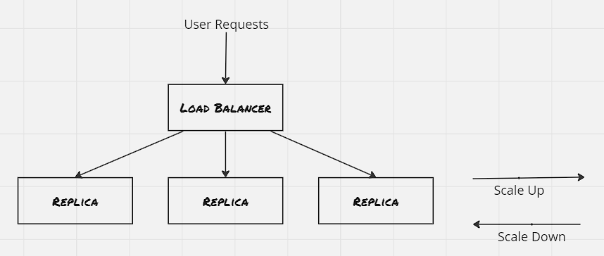

In the last blog post, we discussed about the generic patterns used to create co-scheduled containers. However, that is only a small portion in designing distributed systems. With the help of container orchestrators, and the API contract between microservices that defines a clear surface area which the microservices agrees upon, the microservices are scaled rapidly across nodes. Here we will discuss two of the most used serving (i.e. multi-node) patterns- replicated load-balanced services and sharded services.


### Replicated Load-balanced Services:

The simplest of the serving design patterns is the replicated load-balanced service, where every server is identical and capable of serving traffic, and the requests are routed through a load-balancer placed in front of the servers.



##### Probes:
Utilize readiness probe so that load-balancer is aware when the server is ready to serve requests. This is crucial where the server needs some set of operations to perform as part of start up. Besides this, liveness probe specifies the health check mechanism, which informs the load-balancer regarding it's inability to serve requests. Each container orchestrator got it's own layer to manage the probes, Kubernetes uses the service layer to manage this.

##### Hands On: Deploy a replicated load-balanced service: 
```sh
controlplane $ k create deployment -name dictionary-server-depl --image=brendanburns/dictionary-server --dry-run=client -o yaml > dictionary-server-deply.yaml
controlplane $ cat dictionary-server-deply.yaml 
apiVersion: apps/v1
kind: Deployment
metadata:
  creationTimestamp: null
  labels:
    app: dictionary-server-depl
  name: dictionary-server-depl
  namespace: default
spec:
  replicas: 3
  selector:
    matchLabels:
      app: dictionary-server
  strategy: {}
  template:
    metadata:
      creationTimestamp: null
      labels:
        app: dictionary-server
    spec:
      containers:
      - image: brendanburns/dictionary-server
        name: dictionary-server
        ports:
        - containerPort: 8080
        readinessProbe:
          httpGet:
            path: /ready
            port: 8080
          initialDelaySeconds: 5
          periodSeconds: 5
        resources: {}
status: {}
controlplane $ 


controlplane $ k create service nodeport -name dictionary-svc --tcp 8090:8080 --dry-run=client -o yaml > dictionary-svc.yaml
controlplane $
controlplane $ cat dictionary-svc.yaml 
apiVersion: v1
kind: Service
metadata:
  creationTimestamp: null
  labels:
    app: dictionary-svc
  name: dictionary-svc
  namespace: default
spec:
  ports:
  - name: 8090-8080
    port: 8090
    protocol: TCP
    targetPort: 8080
  selector:
    app: dictionary-server
  type: NodePort
status:
  loadBalancer: {}
controlplane $


controlplane $ k apply -f dictionary-svc.yaml 
service/dictionary-svc created
controlplane $ k get all
NAME                                          READY   STATUS    RESTARTS   AGE
pod/dictionary-server-depl-5d94b48cd5-892ml   1/1     Running   0          8m6s
pod/dictionary-server-depl-5d94b48cd5-b6gld   1/1     Running   0          8m6s
pod/dictionary-server-depl-5d94b48cd5-mp6jv   1/1     Running   0          8m6s

NAME                     TYPE        CLUSTER-IP    EXTERNAL-IP   PORT(S)          AGE
service/dictionary-svc   NodePort    10.97.44.25   <none>        8090:32160/TCP   22s
service/kubernetes       ClusterIP   10.96.0.1     <none>        443/TCP          17d

NAME                                     READY   UP-TO-DATE   AVAILABLE   AGE
deployment.apps/dictionary-server-depl   3/3     3            3           8m6s

NAME                                                DESIRED   CURRENT   READY   AGE
replicaset.apps/dictionary-server-depl-5d94b48cd5   3         3         3       8m6s
controlplane $ 


controlplane $ k exec -it dictionary-server-depl-5d94b48cd5-892ml -- curl dictionary-svc:8090/cat
An animal of various species of the genera Felis and Lynx. Thedomestic cat is Felis domestica. The European wild cat (Felis catus)is much larger than the domestic cat. In the United States the namewild cat is commonly applied to the bay lynx (Lynx rufus) See Wildcat, and Tiger cat.controlplane $ 
```

##### Session Tracked Services:
The servers in the above example are stateless in nature. However often time we would like the same user to land on the same server for the next set of requests, to have a consistent experience. In that case a session tracked service ensures that the request from a specific user is redirected to the same server. There's different type of session tracking mechanism available. IP-based session tracking is easy to implement, however can quickly get messy if cache is used. Also with the usage of NAT in cloud environment, the IP-based session tracking loses it edge. Due to this, application level tracking (like cookies) is more preferred.


##### Caching Layer:
Certain times the computation required for serving the requests is expensive. Caching can be used here to inspect the requests and to send the response if it's a cache hit. There's different types of cache depending upon the application. The most used cache is of type web proxy, which caches the HTTP response.

Even though the most simple way to manage cache is to place it alongside each server. However it has it's own disadvantage. If the requests are not routed properly then each cache may populate similar response, thus reducing the effecive of cache. Hence, the caching layer is generally deployed as a seperate layer, and also it's preferred to have smaller number of cache instance with large capacity.

Also, as the caching layer is placed above the actual application layer, hence it can break session tracking if IP-adress based affinitiy is used. IP adress affinity will ensure load-balancer sends the traffic to the same cache, but not dicatates about underlying application server. Hence it's recommended to use cookies or HTTP headers for session tracking.

##### Hands On: Deploy Varnish Cache:
```sh
controlplane $ cat default.vcl 
vcl 4.0;
backend default {
  .host = "dictionary-svc";
  .port = "8090";
}
controlplane $ k create configmap -name varnish-config -n default --from-file=default.vcl
configmap/varnish-config created
controlplane $ 


controlplane $ k apply -f varnish-cache-depl.yaml 
deployment.apps/varnish-cache-depl created
controlplane $ cat varnish-cache-depl.yaml 
apiVersion: apps/v1
kind: Deployment
metadata:
  creationTimestamp: null
  labels:
    app: varnish-cache-depl
  name: varnish-cache-depl
  namespace: default
spec:
  replicas: 2
  selector:
    matchLabels:
      app: varnish-cache-depl
  strategy: {}
  template:
    metadata:
      creationTimestamp: null
      labels:
        app: varnish-cache-depl
    spec:
      containers:
      - name: cache
        resources:
          requests:
            memory: 250Mi
        image: brendanburns/varnish
        command:
        - varnishd
        - -F
        - -f
        - /etc/varnish-config/default.vcl
        - -a
        - 0.0.0.0:8080
        - -s
        # This should match the 'memory' request above.
        - malloc,250M
        ports:
        - containerPort: 8080
        volumeMounts:
        - name: varnish
          mountPath: /etc/varnish-config
        - name: varnish
          mountPath: /etc/varnish/
      volumes:
      - name: varnish
        configMap:
          name: varnish-config
status: {}
controlplane $ 

controlplane $ k apply -f varnish-svc.yaml 
service/varnish-svc created
controlplane $ cat varnish-svc.yaml 
apiVersion: v1
kind: Service
metadata:
  creationTimestamp: null
  labels:
    app: varnish-svc
  name: varnish-svc
  namespace: default
spec:
  ports:
  - name: 8070-8080
    port: 8070
    protocol: TCP
    targetPort: 8080
  selector:
    app: varnish-cache-depl
  type: NodePort
status:
  loadBalancer: {}
controlplane $
```

##### Rate Limiting & SSL Termination:
Majority of the HTTP reverse proxy supports some sort of rate limiting. Varnish has a throttle module that can be configured to provide throttling depending upon IP adress and request path, also depending upon whether a user is logged in or not. It's a good practice to have a smaller rate limit for anonymous access, and have users logged in to have a higher rate of limit. Once rate limit is hit 429 HTTP status code is sent indicating too many requests. Some APIs also return some variation of HTTP header X-RateLimit-Remaning

Another common usage of HTTP reverse proxy is for SSL termination, where the incoming requests are decrypted before the request is passed to the internal layers. The internal layers can also use SSL for communication, however they should have their own set of certificates.

##### Hands On: SSL Termination through NGINX:


```sh
controlplane $ sudo openssl req -x509 -nodes -days 365 -newkey rsa:2048 -keyout tls.key -out tls.crt
Generating a RSA private key
...................................................+++++
..........................................................................................................+++++
writing new private key to 'tls.key'
-----
You are about to be asked to enter information that will be incorporated
into your certificate request.
What you are about to enter is what is called a Distinguished Name or a DN.
There are quite a few fields but you can leave some blank
For some fields there will be a default value,
If you enter '.', the field will be left blank.
-----
Country Name (2 letter code) [AU]:
State or Province Name (full name) [Some-State]:
Locality Name (eg, city) []:
Organization Name (eg, company) [Internet Widgits Pty Ltd]:
Organizational Unit Name (eg, section) []:
Common Name (e.g. server FQDN or YOUR name) []:
Email Address []:
controlplane $ 
controlplane $ ls -ltr
total 28
lrwxrwxrwx 1 root root    1 Aug  8 10:39 filesystem -> /
-rw-r--r-- 1 root root  315 Aug 26 05:04 dictionary-svc.yaml
-rw-r--r-- 1 root root   75 Aug 26 05:04 default.vcl
-rw-r--r-- 1 root root  696 Aug 26 05:17 dictionary-service-depl.yaml
-rw-r--r-- 1 root root 1025 Aug 26 05:36 varnish-cache-depl.yaml
-rw-r--r-- 1 root root  310 Aug 26 05:45 varnish-svc.yaml
-rw------- 1 root root 1704 Aug 26 06:01 tls.key
-rw-r--r-- 1 root root 1245 Aug 26 06:01 tls.crt
controlplane $ 


controlplane $ k create secret tls ssl --cert=tls.crt --key=tls.key
secret/ssl created
controlplane $ 


controlplane $ k create configmap -name nginx-conf --from-file=nginx.conf -n default
configmap/nginx-conf created
controlplane $ cat nginx.conf 

events{
  worker_connections 1024;
}

http{
  server {
    listen 443 ssl;
    server_name _;

    # ssl on;
    ssl_certificate /etc/certs/tls.crt;
    ssl_certificate_key /etc/certs/tls.key;

    location / {
      proxy_pass http://varnish-svc:8070;
      proxy_set_header Host $host;
      proxy_set_header X-Forwarded-For $proxy_add_x_forwarded_for;
      proxy_set_header X-Forwarded-Proto $scheme;
      proxy_set_header X-Real-IP $remote_addr;
    }
  }
}
controlplane $ k create configmap -name nginx-conf -n default --from-file=nginx.conf  
configmap/nginx-conf created
controlplane $


controlplane $ k create deployment -name nginx-service-depl --image=nginx --dry-run=client -o yaml > nginx-depl.yaml

controlplane $ k apply -f nginx-depl.yaml 
deployment.apps/nginx-service-depl created
controlplane $ cat nginx-depl.yaml 
apiVersion: apps/v1
kind: Deployment
metadata:
  creationTimestamp: null
  labels:
    app: nginx-service-depl
  name: nginx-service-depl
  namespace: default
spec:
  replicas: 2
  selector:
    matchLabels:
      app: nginx-service-depl
  strategy: {}
  template:
    metadata:
      creationTimestamp: null
      labels:
        app: nginx-service-depl
    spec:
      containers:
      - image: nginx
        name: nginx
        ports:
          - containerPort: 443
        volumeMounts:
        - name: conf
          mountPath: /etc/nginx/
        - name: certs
          mountPath: /etc/certs/ 
        resources: {}
      volumes:
      - name: conf
        configMap:
          name: nginx-conf
      - name: certs
        secret:
          secretName: ssl
status: {}
controlplane $ 


controlplane $ k apply -f nginx-svc.yaml 
service/nginx-svc created
controlplane $ cat nginx-svc.yaml 
apiVersion: v1
kind: Service
metadata:
  creationTimestamp: null
  labels:
    app: nginx-svc
  name: nginx-svc
  namespace: default
spec:
  ports:
  - name: 443-443
    port: 443
    protocol: TCP
    targetPort: 443
  selector:
    app: nginx-service-depl
  type: NodePort
status:
  loadBalancer: {}
controlplane $ 


controlplane $ k get all
NAME                                          READY   STATUS    RESTARTS   AGE
pod/dictionary-server-depl-5d94b48cd5-4k9vg   1/1     Running   0          10m
pod/dictionary-server-depl-5d94b48cd5-lktp5   1/1     Running   0          10m
pod/dictionary-server-depl-5d94b48cd5-ncsqs   1/1     Running   0          10m
pod/nginx-service-depl-5889b4545f-mwkjl       1/1     Running   0          4m47s
pod/nginx-service-depl-5889b4545f-qnrlf       1/1     Running   0          5m36s
pod/varnish-cache-depl-555597f449-dbkvx       1/1     Running   0          8m14s
pod/varnish-cache-depl-555597f449-nmsgx       1/1     Running   0          8m14s

NAME                     TYPE        CLUSTER-IP       EXTERNAL-IP   PORT(S)          AGE
service/dictionary-svc   NodePort    10.110.160.53    <none>        8090:30956/TCP   9m30s
service/kubernetes       ClusterIP   10.96.0.1        <none>        443/TCP          17d
service/nginx-svc        NodePort    10.99.168.221    <none>        443:31705/TCP    2m5s
service/varnish-svc      NodePort    10.104.163.212   <none>        8070:32677/TCP   8m5s

NAME                                     READY   UP-TO-DATE   AVAILABLE   AGE
deployment.apps/dictionary-server-depl   3/3     3            3           10m
deployment.apps/nginx-service-depl       2/2     2            2           5m36s
deployment.apps/varnish-cache-depl       2/2     2            2           8m30s

NAME                                                DESIRED   CURRENT   READY   AGE
replicaset.apps/dictionary-server-depl-5d94b48cd5   3         3         3       10m
replicaset.apps/nginx-service-depl-5889b4545f       2         2         2       5m36s
replicaset.apps/varnish-cache-depl-555597f449       2         2         2       8m14s
controlplane $          
controlplane $ 
controlplane $ curl http://localhost:32677 -k
 was not foundcontrolplane $ curl https://localhost:32677 -k
curl: (35) OpenSSL SSL_connect: SSL_ERROR_SYSCALL in connection to localhost:32677 
controlplane $ 
controlplane $ 
controlplane $ curl http://localhost:31705 -k
<html>
<head><title>400 The plain HTTP request was sent to HTTPS port</title></head>
<body>
<center><h1>400 Bad Request</h1></center>
<center>The plain HTTP request was sent to HTTPS port</center>
<hr><center>nginx/1.25.2</center>
</body>
</html>
controlplane $ curl https://localhost:31705 -k
 was not foundcontrolplane $ 


controlplane $ k create configmap -name nginx-conf -n default --from-file=nginx.conf
configmap/nginx-conf created
controlplane $ cat nginx.conf 

events{
  worker_connections 1024;
}

http{
  server {
    listen 80;
    listen 443 ssl;
    server_name _;

    # ssl on;
    ssl_certificate /etc/certs/tls.crt;
    ssl_certificate_key /etc/certs/tls.key;

    location / {
      proxy_pass http://varnish-svc:8070;
      proxy_set_header Host $host;
      proxy_set_header X-Forwarded-For $proxy_add_x_forwarded_for;
      proxy_set_header X-Forwarded-Proto $scheme;
      proxy_set_header X-Real-IP $remote_addr;
    }
  }
}
controlplane $ 


controlplane $ k get all
NAME                                          READY   STATUS              RESTARTS   AGE
pod/dictionary-server-depl-5d94b48cd5-4k9vg   1/1     Running             0          31m
pod/dictionary-server-depl-5d94b48cd5-lktp5   1/1     Running             0          31m
pod/dictionary-server-depl-5d94b48cd5-ncsqs   1/1     Running             0          31m
pod/nginx-service-depl-5889b4545f-ksrjh       0/1     ContainerCreating   0          8s
pod/nginx-service-depl-5889b4545f-n96lz       1/1     Running             0          8s
pod/varnish-cache-depl-555597f449-dbkvx       1/1     Running             0          30m
pod/varnish-cache-depl-555597f449-nmsgx       1/1     Running             0          30m

NAME                     TYPE        CLUSTER-IP       EXTERNAL-IP   PORT(S)                      AGE
service/dictionary-svc   NodePort    10.110.160.53    <none>        8090:30956/TCP               31m
service/kubernetes       ClusterIP   10.96.0.1        <none>        443/TCP                      17d
service/nginx-svc        NodePort    10.99.168.221    <none>        443:31705/TCP,80:32705/TCP   23m
service/varnish-svc      NodePort    10.104.163.212   <none>        8070:32677/TCP               29m

NAME                                     READY   UP-TO-DATE   AVAILABLE   AGE
deployment.apps/dictionary-server-depl   3/3     3            3           31m
deployment.apps/nginx-service-depl       1/2     2            1           8s
deployment.apps/varnish-cache-depl       2/2     2            2           30m

NAME                                                DESIRED   CURRENT   READY   AGE
replicaset.apps/dictionary-server-depl-5d94b48cd5   3         3         3       31m
replicaset.apps/nginx-service-depl-5889b4545f       2         2         1       8s
replicaset.apps/varnish-cache-depl-555597f449       2         2         2       30m
controlplane $ 
controlplane $ curl http://localhost:32705 -k
 was not foundcontrolplane $ curl https://localhost:31705 -k
 was not foundcontrolplane $ 


controlplane $ k get all
NAME                                          READY   STATUS              RESTARTS   AGE
pod/dictionary-server-depl-5d94b48cd5-4k9vg   1/1     Running             0          31m
pod/dictionary-server-depl-5d94b48cd5-lktp5   1/1     Running             0          31m
pod/dictionary-server-depl-5d94b48cd5-ncsqs   1/1     Running             0          31m
pod/nginx-service-depl-5889b4545f-ksrjh       0/1     ContainerCreating   0          8s
pod/nginx-service-depl-5889b4545f-n96lz       1/1     Running             0          8s
pod/varnish-cache-depl-555597f449-dbkvx       1/1     Running             0          30m
pod/varnish-cache-depl-555597f449-nmsgx       1/1     Running             0          30m

NAME                     TYPE        CLUSTER-IP       EXTERNAL-IP   PORT(S)                      AGE
service/dictionary-svc   NodePort    10.110.160.53    <none>        8090:30956/TCP               31m
service/kubernetes       ClusterIP   10.96.0.1        <none>        443/TCP                      17d
service/nginx-svc        NodePort    10.99.168.221    <none>        443:31705/TCP,80:32705/TCP   23m
service/varnish-svc      NodePort    10.104.163.212   <none>        8070:32677/TCP               29m

NAME                                     READY   UP-TO-DATE   AVAILABLE   AGE
deployment.apps/dictionary-server-depl   3/3     3            3           31m
deployment.apps/nginx-service-depl       1/2     2            1           8s
deployment.apps/varnish-cache-depl       2/2     2            2           30m

NAME                                                DESIRED   CURRENT   READY   AGE
replicaset.apps/dictionary-server-depl-5d94b48cd5   3         3         3       31m
replicaset.apps/nginx-service-depl-5889b4545f       2         2         1       8s
replicaset.apps/varnish-cache-depl-555597f449       2         2         2       30m
controlplane $ 
controlplane $ curl http://localhost:32705 -k
 was not foundcontrolplane $ curl https://localhost:31705 -k
 was not foundcontrolplane $ 
```

### Sharded Services:
In the sharded service, the replicas are not identical, they aren't homogeneous and is capable of serving only a specific subset of requests. The load-balancing node, termed root is responsible for routing the requests to the appropriate shard. The replicas are called shard. Sharded services are stateful in nature. 


##### Sharded Cache:
Data storage is where sharding is much more useful. If a replicated cache layer is deployed, then the storage utilization becomes terrible, as each replica might contain similar set of data. However with sharded cache, the effective storage utilization increases multifold. 

The performance of cache is measured against hit rate i.e. the percentage of requests where cache contains the requested data. Another important performance measurement for cache from end-user perspective is latency of the requests. While calculating the expected performance, need to consider downtime for upgrading the cache servers as well. Deplyong a new version of cache would result into losing the cached data. One way to encounter this is to use a replicated sharding, where the cached data is replicated to the new shard before discarding the older one.

Hot shards appear when organic load patterns drive more traffic to one particular shard. Set up autoscaling for each shard to dynamically grow and shrink each replicated set.

##### Hands On: Deploy a sharded memcached:
```sh
controlplane $ k apply -f shareded-memcached.yaml 
statefulset.apps/sharded-memcached created
controlplane $ cat shareded-memcached.yaml 
apiVersion: apps/v1
kind: StatefulSet
metadata:
  creationTimestamp: null
  labels:
    app: sharded-memcached
  name: sharded-memcached
  namespace: default
spec:
  serviceName: "memcache-svc"
  replicas: 3
  selector:
    matchLabels:
      app: sharded-memcached
  template:
    metadata:
      creationTimestamp: null
      labels:
        app: sharded-memcached
    spec:
      terminationGracePeriodSeconds: 10
      containers:
      - image: memcached
        name: memcached
        ports:
        - containerPort: 11211
          name: memcache
        resources: {}
status: {}
controlplane $  


controlplane $ k apply -f memcache-svc.yaml 
service/memcache-svc created
controlplane $ cat memcache-svc.yaml 
apiVersion: v1
kind: Service
metadata:
  creationTimestamp: null
  labels:
    app: memcache-svc
  name: memcache-svc
  namespace: default
spec:
  ports:
  - name: 11211-11211
    port: 11211
    protocol: TCP
    targetPort: 11211
  selector:
    app: sharded-memcached
  type: NodePort
status:
  loadBalancer: {}
controlplane $ 

controlplane $ cat nutcracker.yaml 
memcache:
  listen: 0.0.0.0:11211
  hash: fnv1a_64
  distribution: ketama
  auto_eject_hosts: true
  timeout: 400
  server_retry_timeout: 2000
  server_failure_limit: 1
  servers:
    - sharded-memcached-0.memcache-svc:11211:1
    - sharded-memcached-1.memcache-svc:11211:1
    - sharded-memcached-2.memcache-svc:11211:1
controlplane $ 
controlplane $ k create configmap -name shared-nutcracker --from-file=nutcracker.yaml -n default
configmap/shared-nutcracker created
controlplane $ 

controlplane $ k apply -f twemproxy-depl.yaml 
deployment.apps/shared-twemproxy created
controlplane $ cat twemproxy-depl.yaml 
apiVersion: apps/v1
kind: Deployment
metadata:
  creationTimestamp: null
  labels:
    app: shared-twemproxy
  name: shared-twemproxy
  namespace: default
spec:
  replicas: 3
  selector:
    matchLabels:
      app: shared-twemproxy
  template:
    metadata:
      creationTimestamp: null
      labels:
        app: shared-twemproxy
    spec:
      containers:
      - image: ganomede/twemproxy
        name: twemproxy
        command: ["nutcracker","-c","/etc/config/nutcracker.yaml","-v","7","-s","6222"]
        volumeMounts:
        - name: config-volume
          mountPath: /etc/config/
        resources: {}
      volumes:
      - name: config-volume
        configMap:
          name: shared-nutcracker
status: {}
controlplane $ 

controlplane $ k create service nodeport -name shard-router-svc --tcp=80:80 --dry-run=client -o yaml > shard-router-svc.yaml
controlplane $ vi shard-router-svc.yaml 
controlplane $ k apply -f shard-router-svc.yaml 
service/shard-router-svc created
controlplane $ cat shard-router-svc.yaml 
apiVersion: v1
kind: Service
metadata:
  creationTimestamp: null
  labels:
    app: shard-router-svc
  name: shard-router-svc
  namespace: default
spec:
  ports:
  - name: 11211-11211
    port: 11211
    protocol: TCP
    targetPort: 11211
  selector:
    app: shared-twemproxy
  type: NodePort
status:
  loadBalancer: {}
controlplane $ 

controlplane $ k get all
NAME                                    READY   STATUS    RESTARTS   AGE
pod/nginx                               1/1     Running   0          24m
pod/sharded-memcached-0                 1/1     Running   0          15m
pod/sharded-memcached-1                 1/1     Running   0          14m
pod/sharded-memcached-2                 1/1     Running   0          14m
pod/shared-twemproxy-845fd8957f-84vfm   1/1     Running   0          12m
pod/shared-twemproxy-845fd8957f-pnrkg   1/1     Running   0          12m
pod/shared-twemproxy-845fd8957f-sxh2f   1/1     Running   0          12m

NAME                       TYPE        CLUSTER-IP      EXTERNAL-IP   PORT(S)           AGE
service/kubernetes         ClusterIP   10.96.0.1       <none>        443/TCP           18d
service/memcache-svc       NodePort    10.109.77.174   <none>        11211:30735/TCP   53m
service/shard-router-svc   NodePort    10.98.1.233     <none>        11211:30565/TCP   27m

NAME                               READY   UP-TO-DATE   AVAILABLE   AGE
deployment.apps/shared-twemproxy   3/3     3            3           12m

NAME                                          DESIRED   CURRENT   READY   AGE
replicaset.apps/shared-twemproxy-845fd8957f   3         3         3       12m

NAME                                 READY   AGE
statefulset.apps/sharded-memcached   3/3     15m
controlplane $


controlplane $ 
controlplane $ k get all
NAME                                    READY   STATUS    RESTARTS   AGE
pod/sharded-memcached-0                 1/1     Running   0          88s
pod/sharded-memcached-1                 1/1     Running   0          77s
pod/sharded-memcached-2                 1/1     Running   0          70s
pod/shared-twemproxy-845fd8957f-4ts8r   1/1     Running   0          39s
pod/shared-twemproxy-845fd8957f-hhdlj   1/1     Running   0          39s
pod/shared-twemproxy-845fd8957f-qtjtc   1/1     Running   0          39s

NAME                       TYPE        CLUSTER-IP       EXTERNAL-IP   PORT(S)           AGE
service/kubernetes         ClusterIP   10.96.0.1        <none>        443/TCP           18d
service/memcache-svc       NodePort    10.104.224.188   <none>        11211:31489/TCP   110s
service/shard-router-svc   NodePort    10.110.216.23    <none>        11211:30653/TCP   10s

NAME                               READY   UP-TO-DATE   AVAILABLE   AGE
deployment.apps/shared-twemproxy   3/3     3            3           39s

NAME                                          DESIRED   CURRENT   READY   AGE
replicaset.apps/shared-twemproxy-845fd8957f   3         3         3       39s

NAME                                 READY   AGE
statefulset.apps/sharded-memcached   3/3     88s
controlplane $ 


controlplane $ python3
Python 3.8.10 (default, May 26 2023, 14:05:08) 
[GCC 9.4.0] on linux
Type "help", "copyright", "credits" or "license" for more information.
>>> from pymemcache.client.base import Client
>>> >>> 
>>> client = Client('localhost:31489')
>>> client.set('some_key', 'some_value')
True
>>> 
>>> client = Client('localhost:30653')
>>> client.set('some_key', 'some_value')
True
>>> 
```

##### Sharding Function:
The primary operation for sharding is to determine which shard contains the data requested by user. The mapping is the responsbility of sharding function. Sharding function can be thought of as a hashing function with certain sort of modulo operations. A sharding function has to maintain determinism, so that the output is same of the same unique input, and also need to maintain uniformity, so that data is distributed across the output space.

The key of this sharding function is needed to be selected carefully. One such sharding function for HTTP requests:
```
shard(country(request.IP), request.PATH)
```
Consistent hashing functions are a special type of sharding functions which gurantees that in case of scaling operation, only a max of #keys/#shards are going to be remappend, which is dramatically better than the other set of sharding functions. 

##### Hands On: Consistent HTTP Sharding Proxy:

```sh

controlplane $ cat nginx.conf 

worker_processes 5;
# error_log error.log;
# pid nginx.pid;

events{
  worker_connections 1024;
}

http{

  upstream backend {
    hash $request_uri consistent;
    server exp-web-server-svc;
    server prod-web-server-svc;
  }

  server {
    listen 80;
    location / {
      proxy_pass http://backend;
    }
  }
}
controlplane $ 


controlplane $ cat web-server.yaml 
apiVersion: apps/v1
kind: Deployment
metadata:
  creationTimestamp: null
  labels:
    app: web-server
  name: web-server
  namespace: default
spec:
  replicas: 1
  selector:
    matchLabels:
      app: web-server
  strategy: {}
  template:
    metadata:
      creationTimestamp: null
      labels:
        app: web-server
    spec:
      containers:
      - image: nginx
        name: nginx
        resources: {}
        volumeMounts:
        - name: nginx-conf
          mountPath: /etc/nginx/nginx.conf
          subPath: nginx.conf
      volumes:
       - name: nginx-conf
         configMap:
          name: nginx-conf
status: {}
controlplane $ 
```

### To be explored:
1. Session tracking through cookies
2. How SSL certificates helps for internal communication
3. How to setup autoscale for replicas and shards?
4. What is tdwemproxy? How to use it?
5. Consistent hashing
6. How to use cookies for sharding?

### References:
1. Designing Distributed Systems: Patterns & Paradigms for Scalable, Reliable Services
2. [Kubernetes: Configure Liveness, Readiness and Startup Probes](https://kubernetes.io/docs/tasks/configure-pod-container/configure-liveness-readiness-startup-probes/)
3. [Kubernetes: Service](https://kubernetes.io/docs/concepts/services-networking/service/)
4. [Varnish HTTP Cache](https://varnish-cache.org/)
5. [Create a Self-Signed SSL Certificate for Nginx](https://www.digitalocean.com/community/tutorials/how-to-create-a-self-signed-ssl-certificate-for-nginx-in-ubuntu-20-04-1)

