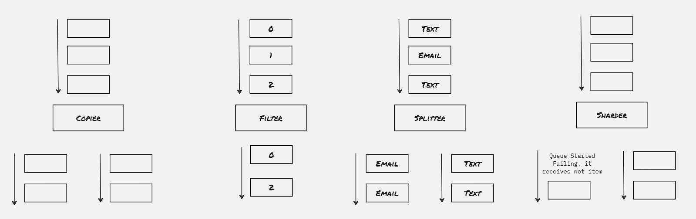
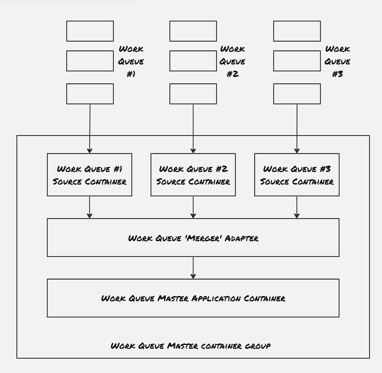
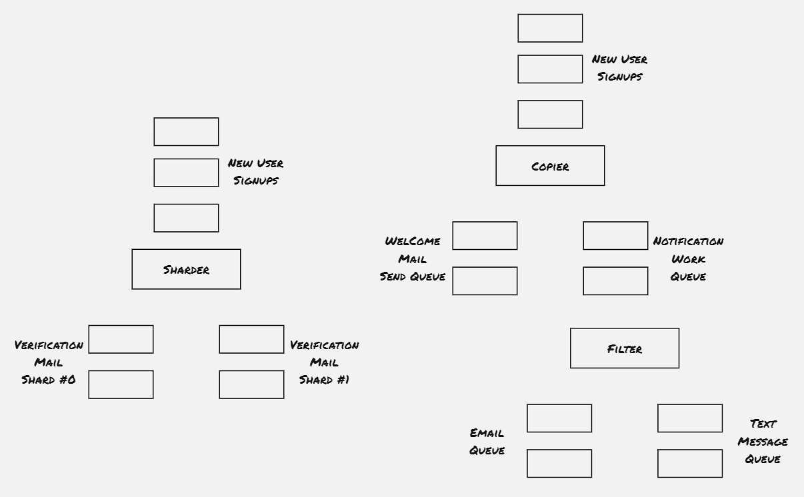
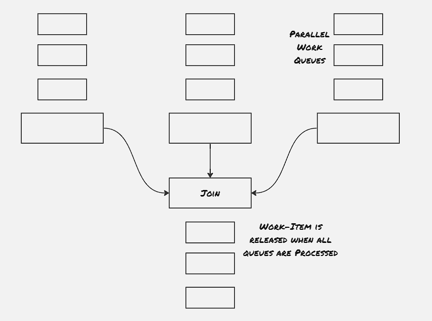

In the last couple of blog posts, we've explored patterns of distributed systems, and the majority of those pattern works on top of long-running server applications. In contrast, the batch processes are expected to handle large volume data for a short span of time. The batch processes are expected to be active for a very small amount of time, and perform a repetative task on a regualar interval. There are couple of batch processing patterns like MapReduce, which has spawed an industry itself. Here in this blogpost, we would explore batch computational patterns like this, and would also get hands on experience by building prototypes.

### Event-Driven Batch Processing
Event driven batch processing can be thought of as workflow systems, where the flow of work is a directed acyclic graph and each node of the graph represents a specific step or task that needs to be performed. This is useful for the scenarios where multiple actions are needed to be performed on the specific event, and depending upon some condition, certain steps can be omitted. This kind of systems can be thought of as output of the processing of the one stream acts as input to another stream, which is then processed by it's consumer. 




##### Copier:
Take a single stream of work items, and duplicate it to multiple streams. This is useful for the scenarios where different type of acitivity to be performed on the same work item.

##### Filter:
Reduce the work items from the stream by filtering out the work items that doesn't statisfy certain criteria

##### Splitter:
Divide the work items of the stream into two separate stream without dropping any of them

##### Sharder:
More generic form of sharder. Divide a workstream into multiple streams based upon sharding function. This is useful to spread work across multiple streams to dynamically utilize resources.

##### Merger:
Take multiple workstreams and turn them into a single workstream




##### Example 01: Building an Event-Driven Flow for New User Sign-up:



#### Hands On: Produce & Consume events:
Publisher/Subscriber is one of the most popular approach to build batch processing workflows. The publisher/subscriber system provides queue or topic, to which publishers publish messages and consumers consume messages from. The messages are stored and delivered in a reliable way so that no message is missed. Certain implementation gurantees at-least one delivery. Kafka is one such industry-standard implementation.

```sh

helm repo add rhcharts https://ricardo-aires.github.io/helm-charts/
helm repo update
helm upgrade --install kafka rhcharts/kafka


controlplane $ k exec -it kafka-0 -- /bin/kafka-topics --create replication-factor 3 --partitions 10 --topic photos-topic --bootstrap-server kafka-headless:9092
Created topic photos-topic.
controlplane $ k exec -it kafka-1 -- /bin/kafka-console-producer --bootstrap-server kafka-headless:9092 --topic photos-topic
>asd
>asdad
>asd
>sampel -1
>sample-2
>^C^Ccommand terminated with exit code 130
controlplane $ 


controlplane $ k exec -it kafka-2 -- /bin/kafka-console-consumer --bootstrap-server kafka-headless:9092 --topic photos-topic --from-beginning
asd
asdad
asd
sampel -1
sample-2
^CProcessed a total of 5 messages
^Ccommand terminated with exit code 130
controlplane $ 
```


### Coordinated Batch Processing:

##### Join (Barrier Synchronizaztion):
Join is having more strict co-ordinated primitive compared to merger. Just like the join in thread, even though work items are processed in parallel, they are released only when all the processing is completed.



##### Reduce:
Reduce merges several different work items from stream into a singel work item. In contrast to join, reduce doesn't wait for all operations to get completed to release the work items, rather optimally releases work items once they're processed and merged to form the output stream.


##### Hands On: Implement Copier

###### Create Topics:
```sh
k exec -it kafka-0 -- /bin/kafka-topics --create replication-factor 3 --partitions 10 --topic photos-topic --bootstrap-server kafka-headless:9092
k exec -it kafka-0 -- /bin/kafka-topics --create replication-factor 3 --partitions 10 --topic photos-topic-2 --bootstrap-server kafka-headless:9092
k exec -it kafka-1 -- /bin/kafka-console-producer --bootstrap-server kafka-headless:9092 --topic photos-topic
k exec -it kafka-2 -- /bin/kafka-console-consumer --bootstrap-server kafka-headless:9092 --topic photos-topic --from-beginning
pip3 install kafka-python
```

###### Producer-consumer code in python:

```python3
# Define server with port
bootstrap_servers = ['kafka-headless:9092']

# Define topic name from where the message will recieve
topicName = 'photos-topic'

# Initialize consumer variable
consumer = KafkaConsumer (topicName, group_id ='group1',bootstrap_servers=bootstrap_servers)


# Initialize producer variable
producer = KafkaProducer(bootstrap_servers = bootstrap_servers)

for msg in consumer:
    print("Topic Name=%s,Message=%s"%(msg.topic,msg.value))
    second_topic = 'photos-topic-2'
    producer.send(second_topic, msg)
```


##### Hands On: Implement Reduce:


```python3

from kafka import KafkaConsumer
from kafka import KafkaProducer
import time

# Define server with port
bootstrap_servers = ['kafka-headless:9092']

# Define topic name from where the message will recieve
topicName1 = 'photos-topic'
topicName2 = 'photos-topic-2'

# Initialize consumer variable
consumer1 = KafkaConsumer (topicName1, group_id ='group1',bootstrap_servers=bootstrap_servers)
consumer2 = KafkaConsumer (topicName2, group_id ='group2',bootstrap_servers=bootstrap_servers)


# Initialize producer variable
producer = KafkaProducer(bootstrap_servers = bootstrap_servers)

while True:
    msg1 = next(consumer1)
    msg2 = next(consumer2)
    print("Message1=%s Message2=%s"%(msg1.value, msg2.value))
    time.sleep(20)


```


```sh
controlplane $ k exec -it kafka-1 -- /bin/kafka-console-producer --bootstrap-server kafka-headless:9092 --topic photos-topic
>sample-1
>sample-3
>sample-5
>sample-6
>sample-9
>sample-12
>


controlplane $ k exec -it kafka-1 -- /bin/kafka-console-producer --bootstrap-server kafka-headless:9092 --topic photos-topic-2
>sample-2
>sample-4
>sample-7
>sample-8
>sample-10
>sample-11
>
```


### References:
1. Designing Distributed Systems: Patterns & Paradigms for Scalable, Reliable Services
2. [Batch Processing](https://aws.amazon.com/what-is/batch-processing/#:~:text=Batch%20processing%20is%20the%20method,run%20on%20individual%20data%20transactions)
3. [Kafka Helm Charts](https://ricardo-aires.github.io/helm-charts/charts/kafka/)
