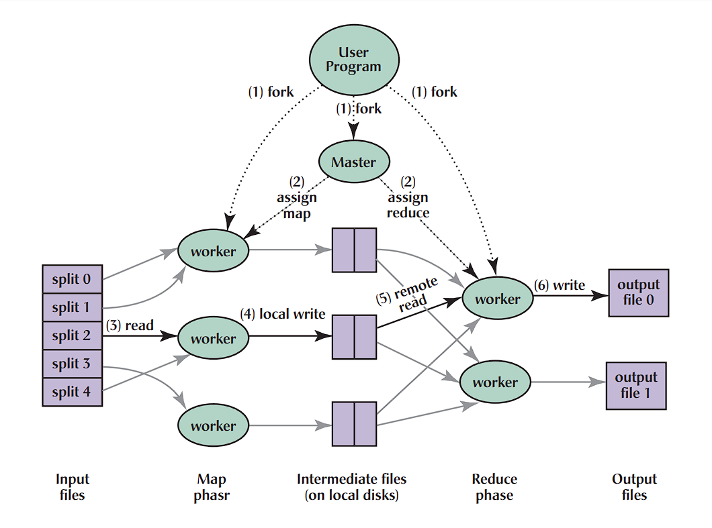
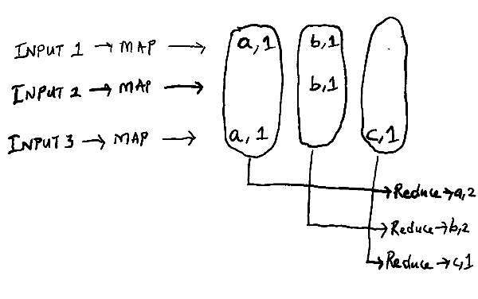

MapReduce is a programming model designed to process large amounts of data distributed across thousands of systems. The issues related to distributed computing like how to parallelize the computation, distribute the data, and perform fault tolerance are abstracted from the programmer. 

### Model:
The model takes a set of input key-value pairs and produces a set of output key-value pairs. The user of the MapReduce model needs to implement the following two functions:
1. **Map function**: Takes an input key-value pair, and produces a set of intermediate key-value pairs. The model then groups together all such intermediate values and invokes the reduce function with the list of values for a particular key.
2. **Reduce function**: Accepts the intermediate key and a set of values associated with the key. The reduce function operates on these sets of values and stitches them following the logic specified. Generally, this step emits zero or one output value.

Following are some examples of problems that are easily expressed in the MapReduce model of computation:
- Distribute GREP
- Count of URL Access Frequency
- Reverse Web-Link Graph: <target, list(source)>
- Term-Vector per Host: Computes: Frequency output in the form of <Word, Frequency>
- Distributed Sort
- Inverted Index: <word, list(document ID)>

### Execution Overview:



Step 01: The MapReduce librarry in user program splits the input file into M pieces of typilcally 16MB to 64MB
Step 02: The user program spawns multiple worker agents, one among them is assigned as master. Overall there's M map tasks and R reduce tasks to assign. The value of M and R is generally much more higher than the systems available for the cluster of MapReduce.
Step 03: The master node assigns the map tasks to the idle workers with the splitted input file. The worker reads the content of the splitted input file content. It invokes the user defined Map function with the splitted temp file name as key and the content as value. Each map function process the key-value and then generates the intermediate output. Master tries to assign the map function to a worker available on the same system splitted input is present, or to a machine nearer to it.
Step 04: The intermediate key-value outputs buffered into memory, and periodically the buffered outputs are written to the local disks paritioned into R regions. This information is then passed to the master, who is then responsible to pass these files onto reduce workers. Master tries to assign the reduce task to one of the idle worker under the same node to facilitate locality, as the network resource is considered as a scarce resource.
Step 05: When the reduce worker has read all the intermediate data, it sorts by the intermediate key, and stores on the disk using a partitioning function.
Step 06: The reduce worker then iterates over the sorted and partitioned intermediate data trhough RPC and for each intermediate key it passes the key along with the associated list of values to the user-defined Reduce function. The output of the Reduce function is stored on the final output file in a sorted manner.
Step 07: When all the Reduce functions are completed, then the master wakes up the user program, and the control is handed back to the user program. 


### Master Data Structure:
The master stores the state for each map and reduce task in the form of idle, in-progress or completed along with the identity of the worker machine.
For each map task, the master stores the location and size of the R intermediate file.
Master is supposed to take O(M+R) scheduling decisions and keeps track of O(M*R) states for a map-reduce model.

### Fault Tolerance:
1. Worker Failure: Master pings each worker periodically. Any map tasks already completed on a failed worker is reset to idle state, as their output is stored on the local disk. Reducer tasks are notified for such scenario, and in case they're notified to wait till the impacted map is re-run again.
Any map tasks currently in-progress on a failed machine is also reverted back to the idle state.
2. Master Failure: The generic implementation of Map-Reduce framework doesn't insist on having a checkpoint of the states. Map-Reduce conputation is aborted in case the master fails. Clients can check for this condition and retry if needed.

### Combiner Function:
Combiner function is executed on each system that peforms map operation after it's completed. Combiner function does partial merging on the intermediate files to reduce the networ bandwidth requirement while transferring data through RPC for reduce tasks.



### Example:
```go

import "6.5840/mr"
import "unicode"
import "strings"
import "strconv"

// The map function is called once for each file of input. The first
// argument is the name of the input file, and the second is the
// file's complete contents. You should ignore the input file name,
// and look only at the contents argument. The return value is a slice
// of key/value pairs.
func Map(filename string, contents string) []mr.KeyValue {
	// function to detect word separators.
	ff := func(r rune) bool { return !unicode.IsLetter(r) }

	// split contents into an array of words.
	words := strings.FieldsFunc(contents, ff)

	kva := []mr.KeyValue{}
	for _, w := range words {
		kv := mr.KeyValue{w, "1"}
		kva = append(kva, kv)
	}
	return kva
}

// The reduce function is called once for each key generated by the
// map tasks, with a list of all the values created for that key by
// any map task.
func Reduce(key string, values []string) string {
	// return the number of occurrences of this word.
	return strconv.Itoa(len(values))
}

```

### To be explored:
- Implementation of Map-Reduce
- Cloud Dataflow

**Note**: As of now, Google has replaced the map-reduce model with Cloud Dataflow. 

### References:
1. [MIT 6.824: Lecture 1 - MapReduce](https://timilearning.com/posts/mit-6.824/lecture-1-mapreduce/)
2. [Dean, Jeffrey, and Sanjay Ghemawat. "MapReduce: simplified data processing on large clusters." Communications of the ACM 51, no. 1 (2008): 107-113.](https://www.cs.amherst.edu/~ccmcgeoch/cs34/papers/p107-dean.pdf)
3. [Map Reduce Paper](https://pdos.csail.mit.edu/6.824/papers/mapreduce.pdf)
4. [Reducer starts before mapper has finished](https://stackoverflow.com/questions/30893970/reducer-starts-before-mapper-has-finished)
5. [How does partitioning in MapReduce exactly work?](https://stackoverflow.com/questions/17734468/how-does-partitioning-in-mapreduce-exactly-work)
6. [Google Dumps MapReduce in Favor of New Hyper-Scale Analytics System](https://www.datacenterknowledge.com/archives/2014/06/25/google-dumps-mapreduce-favor-new-hyper-scale-analytics-system)
