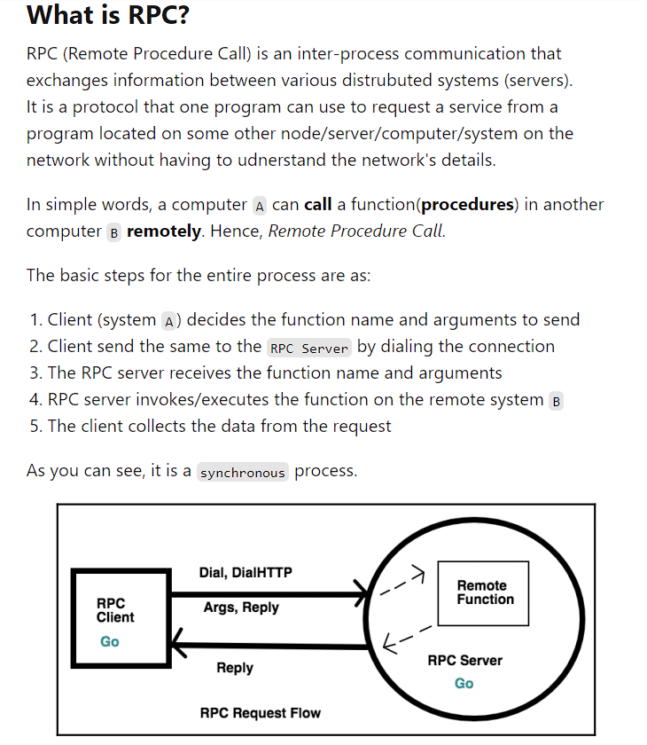

### RPC Server:
```go

package main

import (
	"fmt"
	"log"
	"net"
	"net/http"
	"net/rpc"
	"time"
)

type Args struct{}
type TimeServer int64

func (t *TimeServer) GiveServerTime(args *Args, reply *int64) error {
	// Set the value at the pointer got from the client
	*reply = time.Now().Unix()
	fmt.Println("time now: ", *reply)
	return nil
}

func main() {
	var timeserver TimeServer

	// Register the timeserver object upon which the GiveServerTime
	// function will be called from the RPC server (from the client)
	rpc.Register(&timeserver)

	// Registers an HTTP handler for RPC messages
	rpc.HandleHTTP()

	// Start listening for the requests on port 1234
	listener, err := net.Listen("tcp", ":1234")
	if err != nil {
		log.Fatal("Listener error: ", err)
	}

	// Serve accepts incoming HTTP connections on the listener l, creating
	// a new service goroutine for each. The service goroutines read requests
	// and then call handler to reply to them
	http.Serve(listener, nil)
}
```

### RPC Client:

```go

package main

import (
	"log"
	"net/rpc"
	"time"
)

type Args struct{}

func main() {

	// Address to this variable will be sent to the RPC server
	// Type of reply should be same as that specified on server
	var reply int64
	args := Args{}

	// DialHTTP connects to an HTTP RPC server at the specified network
	client, err := rpc.DialHTTP("tcp", "localhost"+":1234")
	if err != nil {
		log.Fatal("Client connection error: ", err)
	}

	for i := 0; i < 10; i++ {
		time.Sleep(10 * time.Second)

		// Invoke the remote function GiveServerTime attached to TimeServer pointer
		// Sending the arguments and reply variable address to the server as well
		err = client.Call("TimeServer.GiveServerTime", args, &reply)
		if err != nil {
			log.Fatal("Client invocation error: ", err)
		}

		// Print the reply from the server
		log.Printf("Reply from RPC server: %d", reply)
	}
}

```


### Crawler example:

```go
package main

import (
	"fmt"
	"sync"
)

type Fetcher interface {
	// Fetch returns the body of URL and
	// a slice of URLs found on that page.
	Fetch(url string) (body string, urls []string, err error)
}

type VisitedUrl struct {
	visitedMap map[string]bool
	lock       sync.Mutex
}

func (urlVisited *VisitedUrl) proceedWithUrl(url string) bool {
	urlVisited.lock.Lock()
	defer urlVisited.lock.Unlock()
	_, foundUrl := urlVisited.visitedMap[url]
	urlVisited.visitedMap[url] = true
	return !foundUrl
}

// Crawl uses fetcher to recursively crawl
// pages starting with url, to a maximum of depth.
func Crawl(url string, depth int, fetcher Fetcher, waitGroup *sync.WaitGroup, urlVisited *VisitedUrl) {
	// TODO: Fetch URLs in parallel.
	// TODO: Don't fetch the same URL twice.
	// This implementation doesn't do either:
	defer waitGroup.Done()
	if depth <= 0 {
		return
	}
	if !urlVisited.proceedWithUrl(url) {
		return
	}
	body, urls, err := fetcher.Fetch(url)
	if err != nil {
		fmt.Println(err)
		return
	}
	fmt.Printf("found: %s %q\n", url, body)
	for _, u := range urls {
		waitGroup.Add(1)
		go Crawl(u, depth-1, fetcher, waitGroup, urlVisited)
	}
	return
}

func main() {
	var waitGroup sync.WaitGroup
	urlVisited := VisitedUrl{visitedMap: make(map[string]bool)}
	waitGroup.Add(1)
	go Crawl("https://golang.org/", 4, fetcher, &waitGroup, &urlVisited)
	waitGroup.Wait()
}

// fakeFetcher is Fetcher that returns canned results.
type fakeFetcher map[string]*fakeResult

type fakeResult struct {
	body string
	urls []string
}

func (f fakeFetcher) Fetch(url string) (string, []string, error) {
	if res, ok := f[url]; ok {
		return res.body, res.urls, nil
	}
	return "", nil, fmt.Errorf("not found: %s", url)
}

// fetcher is a populated fakeFetcher.
var fetcher = fakeFetcher{
	"https://golang.org/": &fakeResult{
		"The Go Programming Language",
		[]string{
			"https://golang.org/pkg/",
			"https://golang.org/cmd/",
		},
	},
	"https://golang.org/pkg/": &fakeResult{
		"Packages",
		[]string{
			"https://golang.org/",
			"https://golang.org/cmd/",
			"https://golang.org/pkg/fmt/",
			"https://golang.org/pkg/os/",
		},
	},
	"https://golang.org/pkg/fmt/": &fakeResult{
		"Package fmt",
		[]string{
			"https://golang.org/",
			"https://golang.org/pkg/",
		},
	},
	"https://golang.org/pkg/os/": &fakeResult{
		"Package os",
		[]string{
			"https://golang.org/",
			"https://golang.org/pkg/",
		},
	},
}

```


### References:

1. [6.5840 2023 Lecture 2: Threads and RPC](https://pdos.csail.mit.edu/6.824/notes/l-rpc.txt)
2. [RPC Implementation in Go](https://dev.to/karankumarshreds/go-rpc-implementation-4731)
3. [Go Exercise: Web Crawler](https://go.dev/tour/concurrency/10)
4. [Go Exercise: Equivalent Binary Trees](https://go.dev/tour/concurrency/8)
