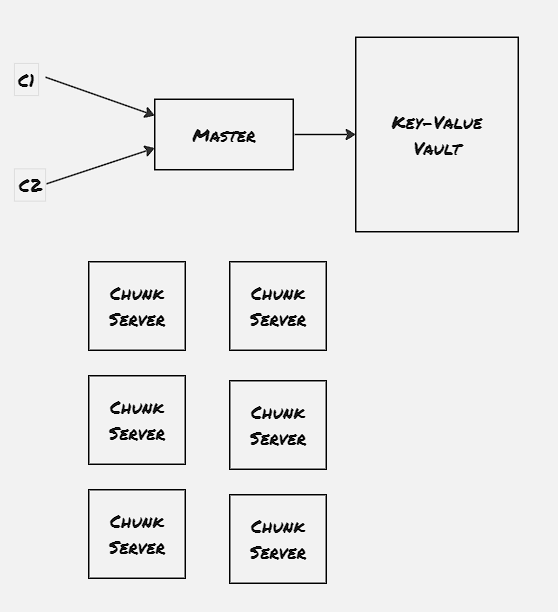
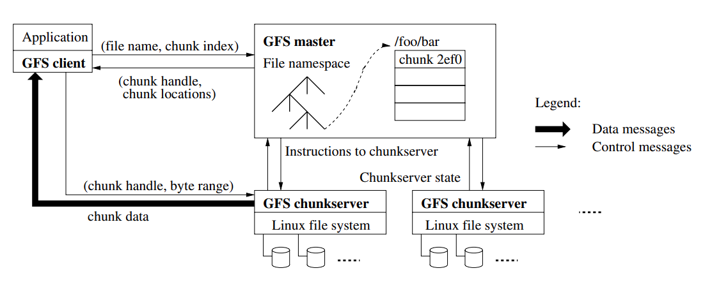
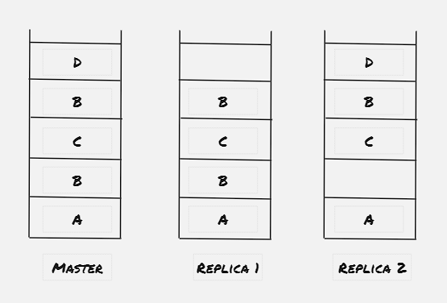

Google File System (GFS) is one of the first attempt to create a distributed file system built with fault tolerance in mind. The file system is expected to run on top of commodity hardware, and hence there's a gurantee that there would be some system in the network which wouldn't respond, and some systems might not even recover. GFS is the underlying file system for many different products, including the map-reduce designed by Google, which makes this GFS a file system which handles a major load. The paper mentiones the GFS has already supported a load of billions of objects with size around couple of KBs.

There's mainly two type of write operation a distributed filesystem has to support: write at a particular offset, and append write. The GFS is designed specially for the append write operation, though it also has the support for writing at a particular offset also.

### Architecture:

##### Properties:
- Single master server: Master server contains the metadata of the file system. Each read and write operation would pass through master first
- Multiple Chunk server: Chunk server contains the exact data. Each block of chunk server is generally replicated to two more chunk server to achieve fault tolerance
- Big sequential data access
- Internal Usage: This service is restricted to a specific data center only. As this GFS is primarily targeted for internal applications, the applications can be data center specific
- Applications should accompany the data in chunks with a checksum, to verify integrity on the application level

The master server contains only the metadata of the file-system. Each operaation first communicates with the master server, and the master server dictates which chunk servers the client application should communicate with. The master server contains two type of metadata:
1. **Filename metadata:** Maps a particular filename to a list of chunk-handlers
2. **Chunkhandler metadata:** Maps a chunk server to list of chunk servers, version number (non-volative, stored in persistent storage), primary chunk server, lease expiry timestamp

##### Write Operation:
- Check if primary chunk server is available, if not then follow the next two steps, otherwise jump to the third step
- Find the sent of chunk servers having upto-date copy, where the version number of the chunkhandler is matching
- Master server increments the version number, writes to the disk, marks one of the replica as primary and assigns lease to it
- Client sends the append request to all the primary and secondary replica chunk servers, the chunk servers write the chunk to a temporary file and reply success
- Once all the primary and secondary replica chunk server has handled the request, primary replica is made aware of the success scenario
- Primary replica selects an offset to include the chunk, and informs all the replicas to append the chunk in the same offset
- If all the secondary server returns success, the primary replica returns success state to the client
- If any of the secondary server returns failure, then the primary replica returns failure status to the client
- Client retries the same operation in case receives failure

##### Read Operation:
- Client sends a read request with filename and offset to the master server
- Master sends the chunk handler H along with the list of servers S the client can read from 

##### Relaxed consistency:
GFS offeres flexible consistency, hence depending upon replica, the client might find different data.

**NB:** Cerain times master server might come across with a chunk server with a chunk handler having higher version number than the metadata stored on the master. In that case master assumes that there were some node failure while assigning the version number, and master updates the metadata with the updated version number. Also master doesn't store the list of chunk servers for chunk handler, as it scans the chunk server and updates it metadata when the chunk server joins the network.

### References:
1. [Lecture 3: GFS](https://www.youtube.com/watch?v=EpIgvowZr00)
2. [The Google File System Paper](https://storage.googleapis.com/pub-tools-public-publication-data/pdf/035fc972c796d33122033a0614bc94cff1527999.pdf)
