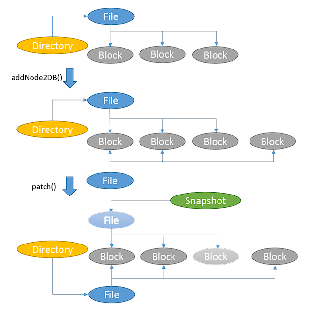
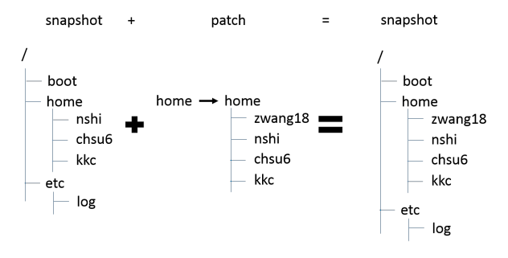
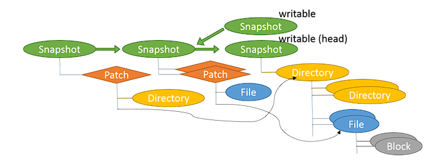

In the last week we've explored a distributed file system, Google File System (GFS), where we've got an overview of how the chunks are managed from a master node and distributed over a set of chunk-servers. However, that only provides a thousand foot view, and not the internal details. Here in this blog post, we would explore the lower level details of a file-system, such as how the directory structure is managed, and how the data is replicated across different systems.

### Directory Structure Replication:
Rsync is one of the most prominent utility to efficiently transfer and synchornize files between two systems through network. Rsync is designed with the goal of having an algorithm to transfer the files over a low bandwith network with less number of round-trips needed. Even though currently the network bandwidth of the internet backbone has increased many-fold, rsync is still in use due the efficient transfer of changed blocks to synchronize a particular file. Another reason of this wide-spread use of rsync utility is due to the fact that this utility doesn't need to have prior understanding of the specific data-structure the file-system uses, rather it deals with block level.

###### Abstract Steps:
- Rsync works with client-server architecture, client requests the changed blocks from the server for a particular file
- During the handshake, decide upon 
- Depending upon the file-size, rsync determines the block size
- Rsync uses two types of hashing function
    - A weaker hashing where the probability of collision is higher
    - A stronger hashing where the probability of collision is lower and is used to discard the false positives generated by the weak hashing
- On the server side, the file is divided into chunks of blocks, and a hash table is formed for each block with both the weaker hash and stronger hash, this table is sent back to the client
- The client then uses the hash table entries and calculates the same on the block basis, and by each byte offset if there's no match, and finds the missing blocks
- The missing block along with the sequence of block indexes are sent to the server, and server reconstructs the file with the block index and missing block indexes sent

### Snapshot of Filesystem:
A snapshot is a point-in-time copy of the file-system. Snapshots are of two types:
- **Read-only snapshot**: immutable copy of the data of the file-system
- **Writable snapshot**: writable fork of the file-system 

There's three classical aprroaches to take snapshot:
- **Split mirror**: Copies every byte of the file-system
- **Changed blocks**: Employes copy-on-write strategy

The snapshot node logs the changes since the last snapshot. The snapshot system can recover the file-system from the referenced snapshots and an array of patch object. Each patch object represents a file or directory, and contains the list of changegs on top of the previous snapshot. 
There's a special snapshot called head snapshot which is a writable snapshot and is essentially the current file-structure. Each branch points to a writable snapshot.

- **Concurrent IO**: Redirects the IO to a different location

### File-system entities:

### References:
1. [Camilo Aguilar on the Rsync Algorithm](https://www.youtube.com/watch?v=X3Stha8pxXc)
2. [Wang, Z., 2014. Design and Implementation of a Distributed Snapshot File System](https://repository.lib.ncsu.edu/bitstream/handle/1840.16/10269/etd.pdf?sequence)
