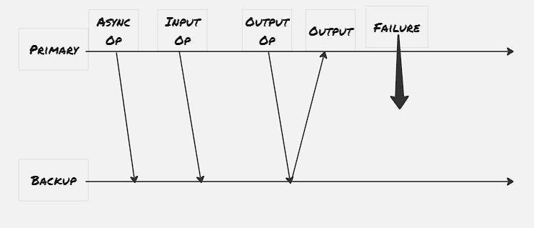
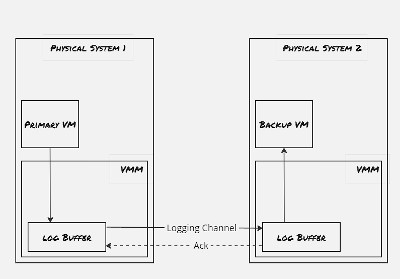

While designing large scale systems, we would need to take care of disaster scenarios as well, so that in case one of the primary server goes down, the bakcup server can take it's place. The disaster recovery handling services can be broadly catergorized into to types- Warm DR, where the backup server is fully functional along with the primary server, and the cold DR, where the backup server is started and configured only when there's some disaster strikes. Here in this blog post, we would mainly explore a research paper which has proposed a fault-tolerance mechanism for virtual machines, called VMWare FT.

There's two generic way fail-stop scenarios are handled: state transfer and replicated state machine. In the state transfer technique, as the name suggests, the change of the state of the system is transferred. The replicated state machine is based on the concept that each system can be thought of a state machine, depending upon the inputs, the state is changed. In replicated state machine, the input to the system is applied in the same sequence to the backup servers, thus making them replica of the primary server.

### Output Rule:
The VMWare FT protocol imposes a output rule to the configuration primary-backup server. The output rule dictates that the primary VM executes command as it's receiving, however it wouldn't send the output to the external world until the backup VM has received and acknowledged the same input.

This whole output rule is imposed the Virtual Machine Monitor. VMWare provides a virtual suite where it spawns virtual machines, and they're constantly monitored by the Virtual Machine Monitor. This VMM utilizes a special instruction code, to interrupt the VM, and whenever a input arrives to the primary VM, a log entry is generated by VMM with the instruction number, instruction details and associated data. This log entry is transferred to the backup VM through a dedicated logging channel.

### Logging Channel:

The hypervisors maintain a large buffer pool for the logging entries. As the primary system receives the input and executes it, the VMM generates the log entry using interrupt. The backup system acknowledges the log entry and places the log entry into it's buffer and sends back an acknowledgement, and once the acknowledgement is received, then only VMM allows the output to be sent back to the client initiated the request. 
In case the logging buffer gets full, the primary system must stop executing new operations, and when the backup system is waiting for the next set of instructuction due to an empty buffer log, then the backup system is stopped until the next set of log entry arrives. Besides these extreme measures, the VMWare FT is also having a flow-control mechanism to ensure that both the primary and the backup server are not diverging much. One point to be noted that for the non-determinstic operation, special implementation is done to log the exact instruction executed to ensure the backup server also receives the exact same operation.

### Detecting & Responding to Failure:
If the primary system fails, the backup system is supposed to leave the recording mode and start executing normally. Because the backup server acknowledges the log entry, it can still lag and waits for all the acknowledged log operations to get applied first. Once the hearbeat messages are stopped in the logging channels, the VMM for the backup server triggers to make the backup server as primary. The backup server executes an atomic Test-and-Set operation to promote itself as the primary server, and once it's successful the VMWare suite ensures that the traffic to the earlier primary system is now redirected to the newly promoted one. 

### Storage Media:
The proposed protocol is uses a shared storage device. It's to be noted that even though the storage device is shared, the primary and backup systems are on two different physical systems, to provide guard against disasters hit due to fail-stop issues, where the physical system or the rack itself got impacted. Also the shared storage device provides one more beneift to have Test-and-Set service, which is utilized to ensure that the primary system is down, and the backup system can obtain the exclusive lock and declare itself as the primary. However the same fault-tolerant protocol can be designed with non-shared storage media as well, and in that case we would need a separate Test-and-Set server to promote backup system as the primary one.

### Performance:
Emperical studies have shown that with optimized implementation of this VMWare FT, the computation performance takes around 4%-5% hit. The primary issue with the VMWare FT lies with the network bandwidth usage due to logging channels, due to which it's actually beneficial if the storage device is shared, as the network bandwidth to transfer the volume related input would be minimized.

### References:
1. [Primary-Backup Replication](https://www.youtube.com/watch?v=M_teob23ZzY)
2. [Scales, D.J., Nelson, M. and Venkitachalam, G., 2010. The design of a practical system for fault-tolerant virtual machines. ACM SIGOPS Operating Systems Review, 44(4), pp.30-39.](https://users.cs.utah.edu/~stutsman/cs6450/public/papers/scales-vm.pdf)

