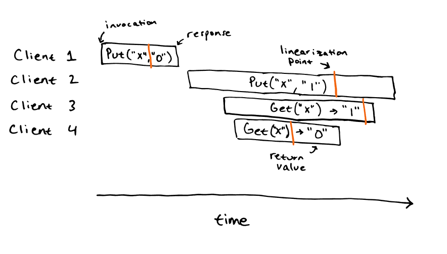
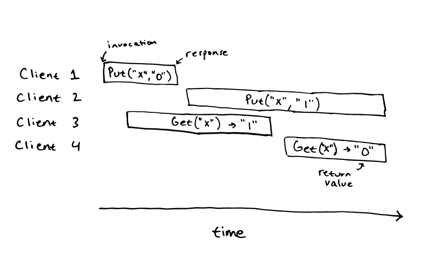

Designing a distributed system poses a significant challenge, as need to keep track of a lot of constraints including but not restricted to consistency, fault-tolerance, and performance expectations. However, once such a system is designed, it raises a question about proving the correctness of the system. To provide a foolproof method of correctness, formal methods are widely used, however writing specifications for the overall distributed system requires dedicated effort, as formal methods are more of mathematical models, which is equivalent to the coded models, and needs expertise in formal method specification. The use of formal methods is the best approach in terms of finding some subtle bugs beforehand. In opposing this, another low-effort way is to use linearizibility to test the system.

### Definition:
An execution history is supposed to be linearizable if the order of the operation matches real-time for non-concurrent operations, and each read request responds with the most recent write operation. By definition, linearizability ensures strong consistency of the distributed system.

### Linearizable:
The general approach to test linearizability is to first capture the execution history by introducing different types of faults randomly. Then the captured execution history is fed into linearizable checkers like Jespen or Knossos. 

##### Example of a linearizable execution history:

##### Example of a non-linearizable execution history:

### To be explored:
- Explore how Knossos and Jespen work, use them in application

### References:
1. [Distributed Systems Safety Tool: Knossos](https://github.com/jepsen-io/knossos)
2. [Distributed Systems Safety Research: Jespen](https://jepsen.io/)
3. [Jepsen 9: A Fsyncing Feeling • Kyle Kingsbury • GOTO 2018](https://www.youtube.com/watch?v=tRc0O9VgzB0)
4. [Testing Distributed Systems for Linearizability](https://anishathalye.com/testing-distributed-systems-for-linearizability/)

