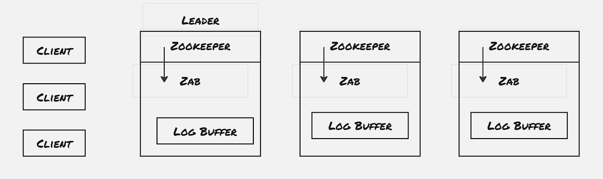
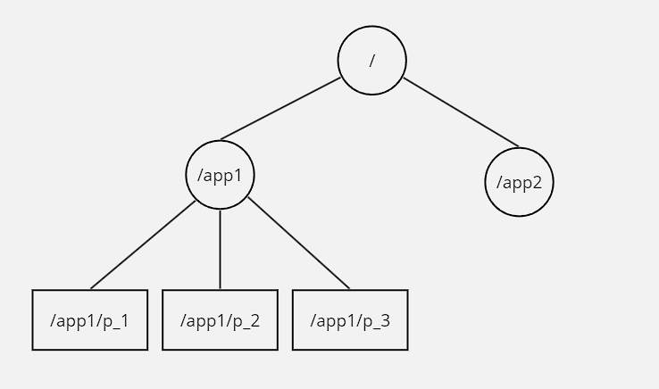
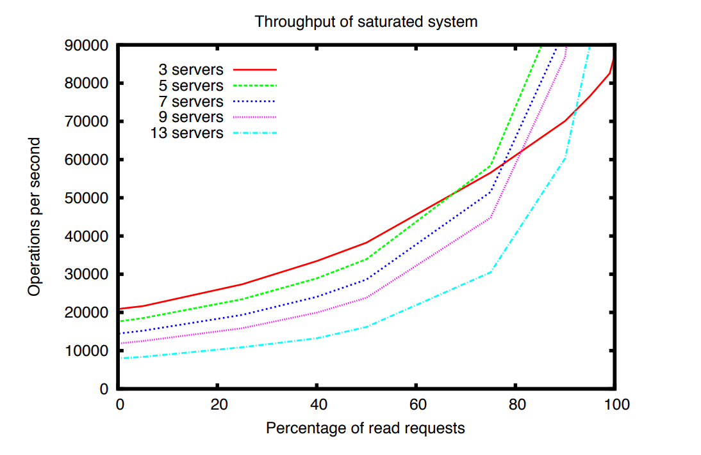

Apache Zookeeper provides highly reliable distributed co-ordination service. It helps maintain configuration information, synchronize distributed processes, and provide group membership services. Till now we've explored the Raft consensus algorithm, which is a low-level library to provide consensus for operations. Zookeeper is a well-known application built on top of it. Here in this blog post, we will learn the basic usage of Zookeeper along with its internal design and some performance aspects.

Even though Zookeeper is used as a distributed coordination service, it's to be noted that the distributed processes are prone to failure, due to severe issues ranging from network issues to process fault to server power failure. However, while designing such coordination primitives, we would need to ensure that even though the process has failed before it can fully operate the critical portion, another process can take over the workload and proceed to perform the same functionality without any further impact.



### Ordering Gurantees:
The major benefit of Zookeer lies in it's simple, general-purpose API that it provides to support new type of co-ordination primitives defined by the client. Even though Zookeeper service is not linearizable, it does provide two basic ordering gurantees:
1. **Linearizable Writes**: All the write operations are serializable and respect precedenc
2. **FIFO Client Order**: All requests from a given client is executed in the same order and the successive reads from the same client would never move backward in time.

The linearizable definition used by the Zookeeper paper is some-what deviated from the original definition of linearzable. In order to provide the first gurantee of Linearlizable write, the Zookeeper servers redirects all the write operation through the leader node, and the leader node uses Raft to commit the write only if consesus is achieved. However the read operations are performed locally, basically it's fetched from the same server with which the current session is established. To handle the property of the FIFO client order, Zookeeper client stamps a read request with the latest transaction ID response receivef from the connected server, called zxid. In case the client gets disconnected from the server, it connects with another server which is having more recent transaction committed than it, and client is bound to find such a server, as each individual write operation is committed only after it's accepted by majority of the servers.

### Client APIs:
- create(path, data, flags)
- delete(path, version)
- exists(path, watch)
- getData(path, watch)
- setData(path, data, version)
- getChildren(path, watch)
- sync(path)

It's to be noted that read operations can return stale data. Even though the Zookeeper provides sync call, which captures all the updates before sync call is issued, however, there's a chance that by the time sync update is completed, another node has become the leader, hence there's a possibility of returning stale data even after the sync call is successful.

Zookeeper also provides support of notification through watches. Watches are set at the same server where the client is connected to, and in case of server or client failure, the client re-established the session with another server, the same watches are set again. Watchess are handled locally.

### Data Objects:



Zookeeper provides support of hierarchial data structure to store metadata info. Each node in the hierarchical data structure in called znode, and it's similar to file-system. Even though znodes displays similar behaviour to UNIX file-system, it's to be noted that znode is used only to store co-ordination metadata and not the actual application data. Hence it's useful to store upto 100MBs of data, and in case GBs of data is needed to be store, we would need to check other data store alternatives.

There's two type of znode:
- Regular: Clients can manipulate znodes by explicitly invoking create and delete operation
- Ephermeral: Apart from deleting the znode explicitly, these would also get cleaned up if the session created them gets terminated
Apart from this, there's also sequential flag, the nodes created with sequential flag set gets a monotonically increaseing counter with respect to all the nodes present under the parent dir appended to it's name.

### Example of Primitives:

##### Exclusive Lock:

```py
def lock():
    n = create(l+"/lock-", EPHEMERAL|SEQUENTIAL)
    C = getChildren(l, True)
    if C is null then wait for watch event
    if C is null then go to step 2
    if n is the lowest node in C then exit
    p = znode in C ordered just before n
    if exists(p, True) then wait for watch event
    go to step 2
```

```py
def unlock():
    delete(n)
```

##### Read/Write Lock:

```py
def read_lock():
    n = create(l+"/read-", EPHEMERAL|SEQUENTIAL)
    C = getChildren(l, True)
    if C is null then wait for watch event
    if C is null or n not present in C then go to step 2
    if no write znode node before n in C then exit
    p = write znode in C ordered just before n
    if exists(p, True) then wait for watch event
    go to step 2
```

```py
def write_lock():
    n = create(l+"/write-", EPHEMERAL|SEQUENTIAL)
    C = getChildren(l, True)
    if C is null then wait for watch event
    if C is null then go to step 2
    if n is the lowest node in C then exit
    p = znode in C ordered just before n
    if exists(p, True) then wait for watch event
    go to step 2
```


### Performance:



One of the interesting experiment of throughput performance shows that the number of servers have a negative impact on the performance. The paper attributes this negative performance to the atomic broadcast protocol. However we would need to study more such applications built on top of Raft, to verify whether this is an inherent issue of Raft, in which transactions are stored on non-volatile store before returning response. 


### To be explored:
- Implement co-odrination service through Zookeeper


### References:
1. [Apache ZooKeeper](https://zookeeper.apache.org/)
2. [ZooKeeper FAQ](https://pdos.csail.mit.edu/6.824/papers/zookeeper-faq.txt#:~:text=The%20%22FIFO%20client%20order%22%20property,writes%20and%20reads%20are%20different.)
3. [ZooKeeper Paper](https://www.usenix.org/legacy/event/atc10/tech/full_papers/Hunt.pdf)
4. [MIT 6.824: Distributed Systems: Lecture 8: Zookeeper](https://www.youtube.com/watch?v=pbmyrNjzdDk)
5. [MIT 6.824: Distributed Systems: Lecture 9: More Replication, CRAQ](https://www.youtube.com/watch?v=IXHzbCuADt0)
