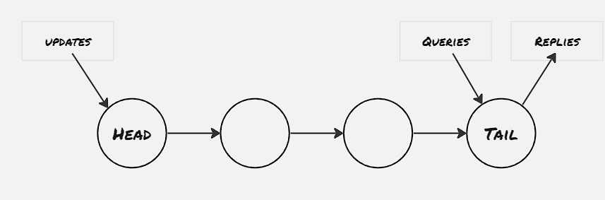

The majority of distributed systems rely on consensus algorithms for fault tolerance. There's another simple approach to designing distributed systems through chain replication, which supports high throughput and availability without sacrificing strong consistency guarantees.

Chain replication is built for storage service, which generally lies between the database system and the filesystem. Storage services provide support for the following three types of operations:
- store objects
- query operation: to return data from a chunked object
- update operation: atomically change the object data or state of the object
Query operations are generally idempotent, however, update operations might not be. In case update operations are not idempotent, the client needs to issue query operations to ensure whether the object already reflects the update.

### Architecture:

The chain replication model is achieved by connecting couple of replicated state machines through a chain. the query requests are sent to the tail, and the update operations are sent to the head node, which first computes all the necessary updation and propagates the results to the next node. Client receives the reply for both the query and update operation from the tail node. In this way it's ensured that all the nodes contain updated info. For the non-deterministic update operations, the value is computed at the head node, and then propagated through the chain.

### Server Failure:

Chain replication takes help of a master process to detect server failure. The master process is replicated to multiple hosts using some consensus algorithm for co-ordination. In case, a failure in server is detected by the master process, it performs the following operations:
- detects failure of servers
- informs each server it's new predecessor or new sucessor
- informs clients which server is head and which one is tail

Type of failures:
- Failure of head node: master process removes the head node from the chain and makes it's successor as new head node of the updated chain
- Failure of tail node: the tail node is discarded from the chain and making it's predecessor as the new tail node of the updated chain
- Failure of other node: The affected node is deleted from the chain. However to ensure no operation is getting discarded due to node failure, each server maintains two list of operations pending list and sent list. Pending list contains the list of operations yet to be performed by the server node, and sent list contains the list of operations that are perfoemed on the node and forwarded to the next server. And when the successor server sends operation completion message, the operation is discarded from the sent list of the node, and the same message is propagated to it's predecessor.

There's also provision of extending the chain by adding new servers in case the chain becomes too short, provided the rate of adding new server doesn't take long time. Theoretically the new nodes can be added at any particular position of the chain, however it's generally placed as the tail node.

### To be explored:
- Explore applications built over chain replication
- How consensus algorithms like Raft performs against chain replication

### References:
1. [Van Renesse, Robbert, and Fred B. Schneider. "Chain Replication for Supporting High Throughput and Availability." OSDI. Vol. 4. No. 91–104. 2004.](https://www.usenix.org/legacy/events/osdi04/tech/full_papers/renesse/renesse.pdf)
2. [Lecture 9: More Replication, CRAQ](https://www.youtube.com/watch?v=IXHzbCuADt0)

