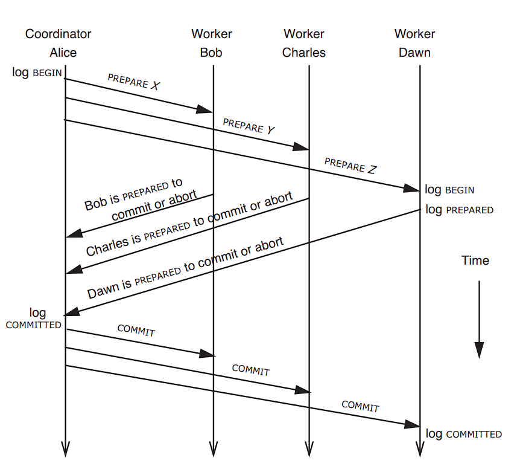

Each programming language provides support of threading to improve performance of application by concurrently running multiple thread concurrently. However this can also result in incorrect results in case multiple transactions with overlapped objects are performed in parallel. This is solved with the help of locks and semaphore. It is to be noted that even though the working mechanism of lock and semaphore is similar, lock only allows one particular thread to proceed, whereas semaphore restricts the concurrent processing to a specific number of threads. All this are supported by all the major programming languages, and they work well for the applications running on single node. However due to distributed nature of databases, transactions need to communicate with multiple worker nodes where the actual data lies, and co-ordination is needed among them to handle the overall transaction processing. Here in this particular blog we would discuss different aspects of distributed transactions.

### Atomicity:
**Definition**: An action is atomic if there is no way for a higher layerto discover the internal structure of it's implementation

There's two property of an atomic operation:
- From the point of view of a method that invokes the atomic operation, it always appears **either to complete asanticipated, or does nothing**. It also means atomic operations are rolled back in the event of any failures.
- From the perspective of a concurrent thread, it **occurs either completely before or completely after any other transaction which conflicts**. 

Before-or-After property also ensures serializability i.e. there exists some some serial order of a set of concurrent transactions that would, if followed, lead to the same ending state. However some applications might need to use a more stronger correctness than serializibility. For example, a banking application might want the transactions also to consider time sequence to ensure the first transaction it received to be completed first.

### Locking:
Even though support of lock is provided by programming language, however they're useful for the only within one process. For distributed applications, where there's a need to co-ordination in multiple similar applications, locking provides an excellent way to **control concurrency**.

Locks are generally of two types: shared lock, where multiple transactions can perform only read operation concurrently, and exlusive lock, where data item can be both read and written, however only one transaction can perform this operation at one particular time. There's a locking principle called **simple locking**, where each transaction acquires lock for each data object it reads or writes, and once the operation on the individual data object is completed, the lock is releaed and the transaction proceeds to the next statement. The primary issue with this simple locking is that it doesn't gurantee serialization.

The most popular locking mechanism is **two-phase locking**, where the the transaction follows two disctinct phases related to locks: growing phase, where the locks are either acquired or upgraded from shared to exclusive; and then shriking phase, where the locks are downgraded from exlusive to shared, or are released. All the transactions first go through the growing phase to capture the locks, and then the shriking phase by releasing the locks one after another. 

Observation suggests that lock set information can be stored in the volative storage, as they can be easily discarded in case the node crashes, rather than lock manager hunting down the non-released locks. 

### Two Phase Commit:
Two phase commit is one of the most used distributed transaction protocol, where performs the transaction in two different phases- **voting phase**, where the lower level transactions are either prepared to be committed; and the **commitment phase**, where the lower level transactions are actually committed or aborted.

In this overall design of two-phase commit protocol, co-ordinator is the single point of failure, and in case that happens, all the worker nodes must wait till it recovers. Also each component of this design is persistent sender, which ensures that even of some of the network communication is lost, eventually they will receive it.

### References:
1. [Concurrency Control](https://www.cbcb.umd.edu/confcour/Spring2014/CMSC424/Concurrency.pdf)
2. [Difference between 2-Phase Locking and 2-Phase Commit](https://stackoverflow.com/questions/68640301/difference-between-2pc-2-phase-commit-and-2-pl-2-phase-locking)
3. [Two Phase Locking Protocol](https://www.geeksforgeeks.org/two-phase-locking-protocol/)
4. [Principles Of Computer System Design: An Introduction](https://ocw.mit.edu/courses/res-6-004-principles-of-computer-system-design-an-introduction-spring-2009/pages/online-textbook/)

