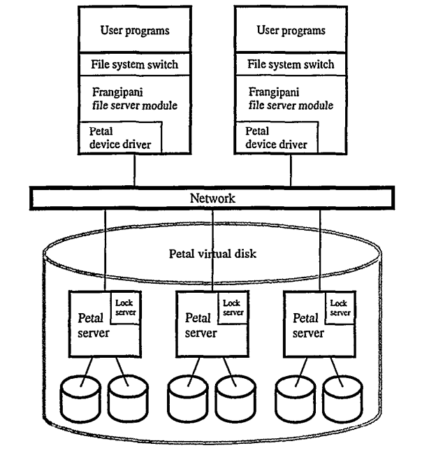
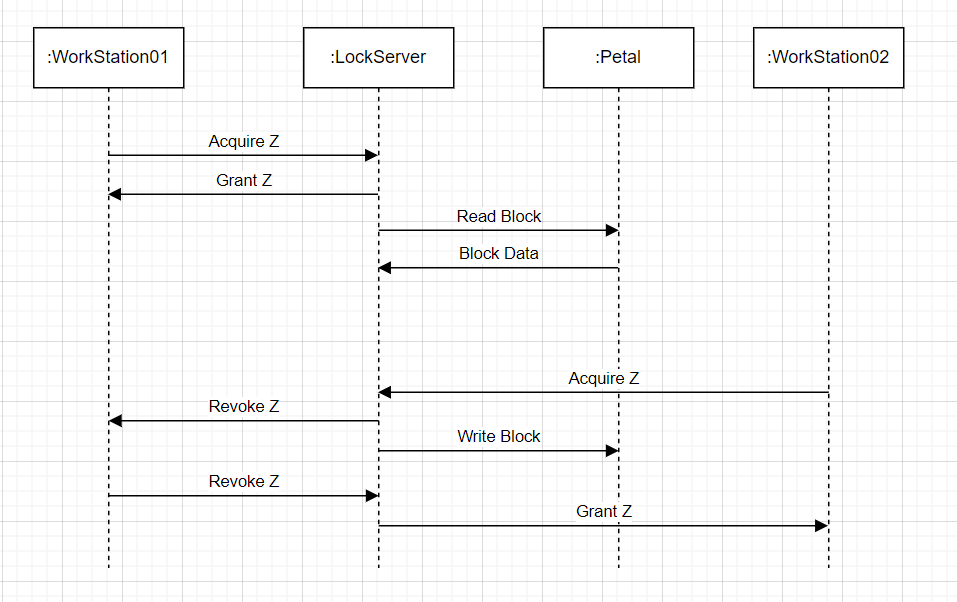
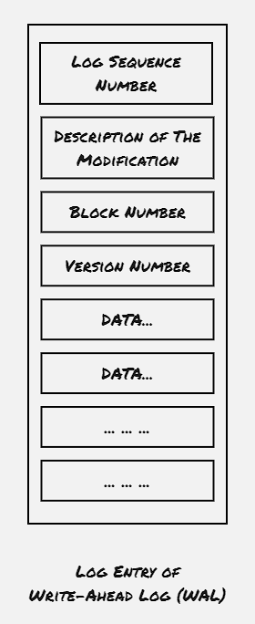

Frangipani is one of the intial attempts to create a scalable distributed file-system. This was primarily designed for the earlier generation of computers, which was primarily used on time-sharing basis, where the system is connected by multiple terminals, and different users can access the same file-system through these terminals. Even though the pattern of how systems are getting used is completely different, this Frangipani file-system was designed with certain techniques, which has paved the way to the distributed transactions.

### Architecture Overview:
Frangipani file-system is built on top of Petal, a distributed storage system that manages the underlying virtual disks, and Frangipani provides the file-system abstraction on top of the disk service. Besides that Frangipani also uses a lock service for cache coherance and atomicity.

It's to be noted that, even though the lock server is shown as residing over the same Petal disk devices in the above diagram, it's completely decoupled.

### Desirable properties of a filesystem:
- Consistency: The users should have a consistent view of the file-system
- Scalability: New servers can be added easily without much interruption to the service
- Recovery: When a node goes down, how to recover
- Backup
- Security

### Usage Pattern & Security:
Frangipani is designed with the understanding that each user is having access to one of the terminal, where the filesystem client can be installed. And the primary usage would be to operate on a limited number of files and allowing other people also to modify it. It's expected that the terminal acess would be granted to limited number of people, and Frangipani assumes the client calls are invoked over a trusted network, hence it doesn't impose any security mechanism between the components of Frangipani file-system.

### Consistency:
Frangipani file-system client is installed on each terminal that user directly access. Each update on the file-system is initially cached to the local Frangipani client, and later updated to the underlying Petal storage. However, as each client has it's own cache, the issue of handling cahche coherence also comes into picture, to ensure each client has consistent view of the filesystem, and not updating an older version.

##### Cache Coherance:
In order to ensure cache coherance, Frangipani dictates all operations on individual file or directory must be done by obtaining locks on the these file objects, and all the updates would be written back to the underlying Petal storage before releasing the lock. This approach provides support to achieve linearlizability. Frangipani can work with wide variety of lock service, they can be centralized or distributed, they can store the lock in their non-volatile storage or volatile storage. Only difference being, in case the lock-service uses volatile storage only, the crash recovery would be somewhat different.

Each Frangipani client maintains it's own lock status as well. When a lock is acquired, after the work is completed, the lock is not immediately released, rather the Frangipani client continue to hold the lock and mentions it as IDLE in it's own ledger.

Also in order to handle deadlock scenario with lock service, Frangipani first lists down all the locks needed for a particular operation, and then starts to acquire the locks in the order of the i-node address.

It's to be noted that Frangipani uses locks with two different modes: shared mode, to allow multiple clients to read from the same file object and execulsive mode, to accomodate write requests.

### Crash Recovery:
Frangipani uses write-ahead logging of metadata to simplify failure recovery. Log records are written to the petal disk servers describing the operation it needs to be performed with all the associated details. Each Frangipani client maintains it's own log records, and an operation is performed only after the log entry is updated.

When a server crash is detected, either by Frangipani client itself, or by the lock server while requesting to release the lock, the recovery demon is kicked in. The recovery demon takes responsibility of executing the remainting log entries and releasing all the logs. To ensure that no log entry is executed twice, Frangipani stamps the block with a monotonically increasing version number once operation is done, and also maintains the same version number when the log entry is written.

### Lock Server Crash:
Frangipani maintains all the lock related info on the non-volative storage, thus making it robust enough to handle any kind lock service crash. In case the lock-service maintains the lock info on volatile storage, a crash would result into wiping out the currently held lock information. In that case the lock-service can be updated with the info maintained by the Frangipani clients. However, that would have an impact on the service availability.

### Backup:
The snapshot feature supported by the underlying Petal disk storage service provides a mechanism to take backup of the whole Frangipani file-system. However, to ensure application level consistency, Frangipani uses a barrier mechanism with the help of a global lock. All the operations internally performed by the Frangipani file-system captures the lock with shared mode, whereas the snapshot process requires the lock to be acquired in exclusive mode. When a snapshot request is received, all the Frangipani clients enters into the barrier mode, and clears all the cache before the disk level snapshot process is invoked.

### Performance:
The paper compares the Frangipani file-system with the other well known file-systems used around the time. However, as the computing pattern and the underlying hardware has changed significantly. Hence the performance data would make a little sense. As currently a major portion of data is consumed by the web-services, where the data is either retrieved from database, or is fetched from the filesystem over the internet without using any terminal, thus the Frangipani style filesystem is having very limited customized usage.

### Future Work:
- To implement a barrier mechanism used for snapshot
- To extend a lock service to accomodate the cache coherence operation flow

### References:
1. [Thekkath, C.A., Mann, T. and Lee, E.K., 1997, October. Frangipani: A scalable distributed file system. In Proceedings of the sixteenth ACM symposium on Operating systems principles (pp. 224-237).](https://dl.acm.org/doi/pdf/10.1145/268998.266694)
2. [Lecture 11: Cache Consistency: Frangipani](https://www.youtube.com/watch?v=-pKNCjUhPjQ)

