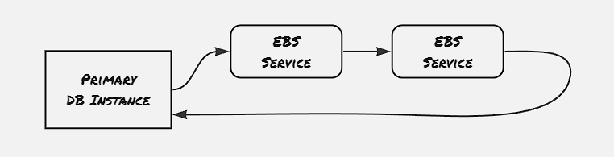
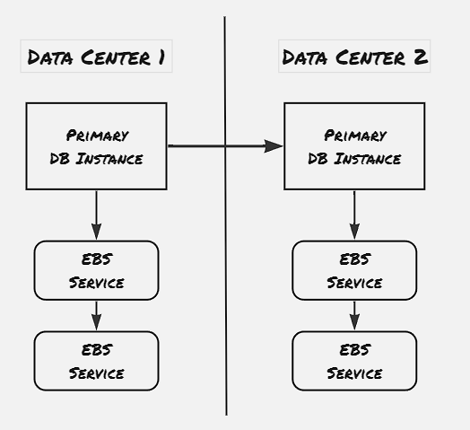
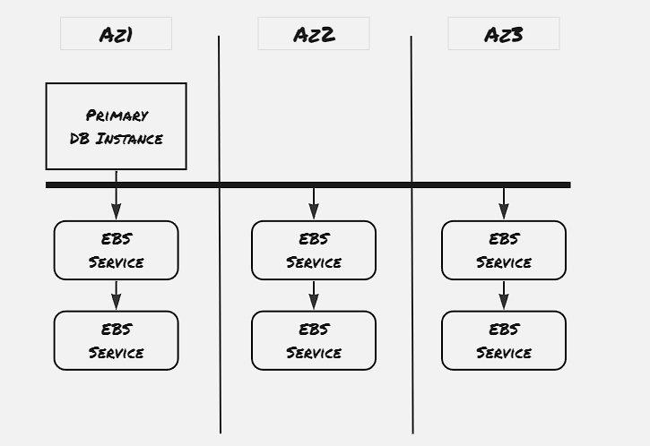
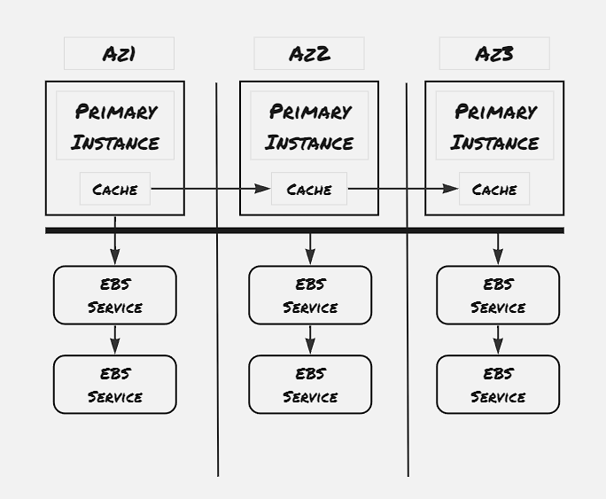

In this blogpost we would discuss about the design considerations taken for Amazon Aurora DB, a fully-managed scalable relational DB service on top of MySQL and Postgres compatible engine. We would go through the history of supporting Databases on the AWS platform and how it evolved to Aurora DB. It would provide us a recent example of how the design principles we've explored earlier got into pieces to support managed scalable service. The selling point of this architecture is that it handles 77x more load compared to traditional replicated DB systems.

### History of DB on AWS:

Initially AWS supported a compute service EC2, and two difference type of storage: block storage in form of EBS, to support file-system storage for fast-frequent access, and object storage in form of S3 to support highly persistent low-cost storage service. All the services, including web servers and database servers, were managed by the customer and installed on EC2 and storage was managed by EBS, with occasional checkpointing, also called snapshot, stored on S3. And by using a replicated EBS mirror, the fault-tolerance of this architecture can be improved

EBS storages are restricted to a particular region. Replication can be added by having EBS servers across regions. However, one disadvantage with this appraoch lies in terms of number of block changes. As one particular operation on DB is most likely to have cascading effect on the underlying blocks, and transferring these block data from one region to another causes bottleneck on network, making network usage more costly operation compared to CPU usage and memory usage.  

This is where the Aurora DB comes into picture. Aurora DB uses Write-Ahead Log (WAL) extensively. All the DB operations that are performed are stored as log entry in the WAL records, and these WAL recorded are communicated to the storage devices, which appends to it's own WAL entry and acknowedges. The Write-Ahead log not only helps with reducing the network bandwith usage, it also helps with atomicity, durability and caching performance benefit.

### Fault Tolerance Goals:
- Write operation to be performed even with one down AZ
- Read operation to be performed even with one down AZ, and another additional node down
- Operations to be perfoemd even with transient slowness

In order to support the above set of fault-tolerance goals, each AZ mantains two storage server, and the same data is replicated into two more Az with similar replication, thus mantaining total 6 copies of the same storage unit. It's to be noted that, the here we're talking about logical storage units, also known about **Protection Group (PG)**. We will discuss more about this protection group at the end.

A quoram is needed for the write operations, however read operations don't need quoram always. The DB instances keeps track of how much of the WAL entries are applied for each storage segment, and would redirect the read request to the appropriate storage server. Read quoram is needed only for recovery purpose.

### Desirable properties of a large-scale system:
- Consistency
- Scalability
- Recovery
- Backup
- Security

### Scalability:
The Aurora DB provides scalability in terms of protection groups. The storage is divided into small chunks of logical units ranging ftom 10 GB to 20 GB, which is the basis of protection group. A physical storage server maintanis logical storage unit segments of different protection groups. The instance keeps tracks of the data belonging to protection group in form of index tree, and logs are maintained for each protection group, and the WAL entry is redirected to the impacted protection groups. 

### Recovery:
The storage services use checkpointing to establish point of recovery by flushing all the dirty pages, and mantaining the checkpoint entry in the WAL. The committed transactions are also pointed by a commit entry in the WAL. In case of storage device crash, the recovery system starts from the last checkpoint, and start applying redo operation on the WAL entries. Now when the node starts, it first tries to find out any missing entry in the WAL records, and becomes chatty with other storage devices to capture these missing entry. It finds the latest point till a transaction commit for which all the entries are present, and applies this set of WAL records. 

### Consistency:

The paper specifies to add read replicas to handle the bottleneck of single DB Instance. With only the primary DB instance, all the read write operations goes through the primary instance only. However, majority use-case of web applications relies on heavy read operations. In order to support this usecase, Aurora DB also accomodates read only replicas, and the primary DB instance communicate with the read replicas to only inform the cache updates.
However this approach also makes the DB to be eventual consistent, as even though the underlying service is supporting strong consistency, in case the read replica is maintaining cache of the data item, and there's some delay to update this cache from the primary instance, then that would cause the read replica to return the earlier data.

### To be explored:
- How ARIES uses redo operation on WAL log for recovery: Implementation
- How serializibility is managed on Aurora DB

### References:
1. [Verbitski, A., Gupta, A., Saha, D., Brahmadesam, M., Gupta, K., Mittal, R., Krishnamurthy, S., Maurice, S., Kharatishvili, T. and Bao, X., 2017, May. Amazon aurora: Design considerations for high throughput cloud-native relational databases. In Proceedings of the 2017 ACM International Conference on Management of Data (pp. 1041-1052).](https://assets.amazon.science/dc/2b/4ef2b89649f9a393d37d3e042f4e/amazon-aurora-design-considerations-for-high-throughput-cloud-native-relational-databases.pdf)
2. [Lecture 10: Cloud Replicated DB, Aurora](https://www.youtube.com/watch?v=jJSh54J1s5o)

