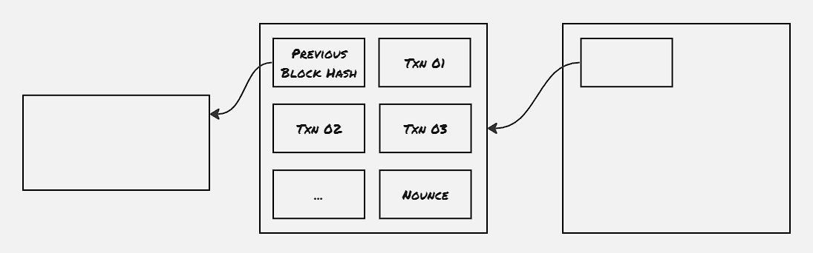

Bitcoin is one of the most popular cryptocurrencies. However, we're more interested in Bitcoin, as it's one of the first peer-to-peer electronic cash systems proposed without the use of any trusted entity. Bitcoin uses a blockchain where the transactions are blocked together and a chain of such blocks is maintained.

### Transaction:
When the owner transfers some coin, it digitally signs a hash of the previous transaction of the coin and the public key of the next owner and adds that information to the transaction ledger. Each transaction is publicly announced. When such a transaction takes place, the owner floods the transaction in the Bitcoin network.

The most crucial part of any cash transfer system is to restrict the use of double spending i.e. how to ensure the transaction owner initiated is not reverted and the same coin is not spent multiple times by the owner. There's a possibility that node X has informed a couple of peer nodes that one particular coin C is transferred to Y, and informed a couple of other nodes that the same coin C is transferred to Z. However that would be possible for a period of time. It will be clear in the next part where we discuss the proof-of-work.

### Proof-of-Work:
The discussion in the above paragraph has provided some background on double spending, and why it's important for the nodes on the Bitcoin protocol to agree with a single history. When such a transaction is announced, the nodes take note of the transaction time.

Each node starts working to make a new block out of the recently announced transactions, Each new block should have some number of 0 bits in the beginning, and the exact number of 0 bits in the prefix is determined beforehand. Each node starts working on the find out a nonce value, which is appended on the block, which results in the hash of the block satisfying the criteria of a number of 0-bits as a prefix on the hash. When such a block is created, it's announced to the whole network.

There's another standard followed by the Bitcoin nodes to restrict double-spending. All the nodes always perform a proof-of-concept operation on top of the block of the longest chain. Each new block computed also contains a hash of the previous block, thus making a chain of blocks. This is how the above scenario of double spending is restricted, as there's a possibility that for a brief period of moment, there's a forked chain, however as soon as a new block is computed, one of the forked chains gets elongated, and other nodes also switch to the same elongated chain. Hence it's always advisable to wait for a certain number of blocks containing traces of the transaction, to ensure the transaction is persistent.

There's also another property of block generation. The Bitcoin protocol agrees on the hash prefix to ensure each block gets generated within approximately 10 minutes of time.

### Security of the network:
The security of the network is ensured by ensuring that honest nodes are rewarded with their proof-of-work. The only issue is when the computation power of the malicious nodes outnumbers that of the honest nodes. By ensuring each block provides an incentive to the miner of that block, the honest nodes are incentivized not to become malicious. Also, the computation power needed to overwhelm the current network of nodes at the moment would need much more investment, and the return of that much investment would be minuscule, as as soon as such manipulation is reported, people would lose trust in the Bitcoin network, and the attacker would be worthless. Nevertheless, such a possibility still exists.

### Full Network Nodes:
There's term full network node is coined in this paper. The overall working of such nodes is not clearly defined, however, it's expected these nodes are equivalent to databases, where the latest transaction related to all the coins in circulation is stored.

### Introducing new Node:
When a new node is introduced to the network, a bitcoin application is installed and started. The Bitcoin application itself contains a set of peer lists, to ensure the node doesn't immediately start communicating with the attacker nodes, as that would overwhelm the network with more number new nodes joining the process to elongate the chain containing malicious blocks.

### To be explored:
- Distributed time-server (Eg. Adam Back's Hashcash)

### References:
1. [Nakamoto, S., 2008. Bitcoin: A peer-to-peer electronic cash system. Decentralized business review.](https://assets.pubpub.org/d8wct41f/31611263538139.pdf)
2. [Lecture 19: Bitcoin](https://www.youtube.com/watch?v=K_euhRou98Y)

