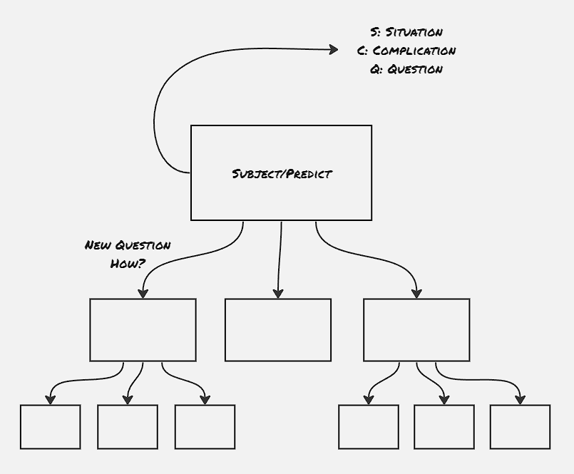
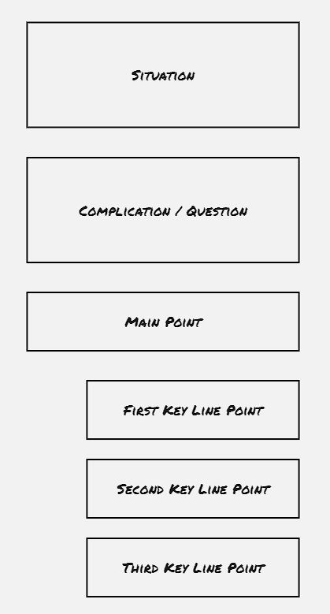

### Why a pyramid structure:
In general, people find it easier if the reading material comes to them with a pyramid structure, beginning at the top and working downward. Any grouping of ideas is easier to comprehend if it arrives presorted into its pyramid. We develop our major ideas with a bottom-up approach. However, in the reading material, it's always advised to provide the summarizing idea before discussing the individual ideas.

### The substructure within the pyramid:
The pyramid principle dictates a rigid substructure that can serve to speed the discovery process goes through a reader's mind:
- The vertical relationship between points and subpoints
- The horizontal relationship within a set of subpoints
- The narrative flow of the introduction

### How to build a pyramid structure:
Generally, it's easier to start at the top by thinking about the things that are the easiest for you to be sure of - your subject and the reader's knowledge of it, which you will remind him of in the introduction part.

Always put historical chronology in the introduction and limit it to what the reader will agree is true.

### Fine points of introduction
The introduction part establishes what the reader already knows and adds relevant questions. It narrates a story with the **situation** within which a **complication** is developed that raises the **question** to which the document is providing the answer. The situation and complication portion can each be as long as three or four paragraphs, but not more than that, as it's not supposed to take a long time to remind the readers what they already know.

Start the introduction with a self-sufficient and non-controversial statement about the subject. Introductions are meant to remind rather than to inform, thus the scope is to include whatever is necessary for full understanding.
The key lines not only provide a brief answer to the question raised by the statement of the main point, it also indicate the plan of the whole document.

Once you've moved from the introduction to the body section, you must pause periodically to let the reader know where you've been and where you next plan to go - at either the end or the beginning of each major grouping. Have to look in two directions at once - back to what has been said by referencing backward and forward to what is to be said. 

### Induction, not the deduction:
Instead of answering the "Why" question first and the "How" question second, simply reverse the order.
While mentioning recommended action, never give the findings that do not lead to conclusions, nor state conclusions that are not based on findings. The conclusions generally state the problem that the recommendations solve.

Generally, it's better to present the action before the argument, since that's what the reader cares about most of the time, unless some rare scenarios in which the argument is what the reader truly cares about. 
Note that, with inductive ideas you generally either hold the subject constant and vary the predicate, or hold the predicate constant and vary the subject.

