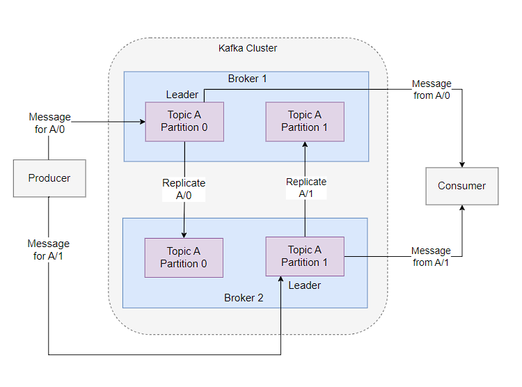
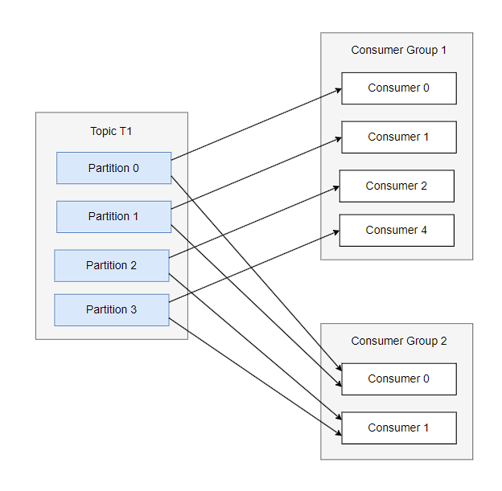
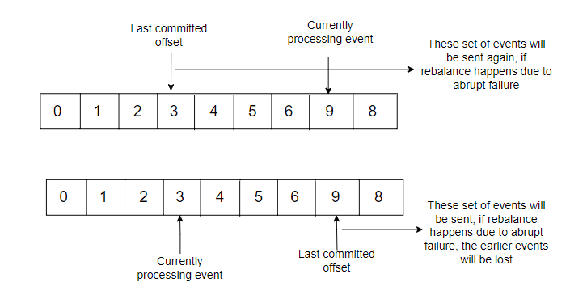

Kafka is one of the most popular distributed open-source event streaming platforms. Kafka was designed specifically to handle the continuous flow (i.e. stream) of data in a centralized way. Being a distributed system, just like databases, Kafka also relies on a distributed commit log.




### Message:
Messages are simply an array of bytes. Even though there can be serializer and deserializer on the producer and consumer side, Kafka treats all the messages as a sequence of bytes. A message can have an optional key, which is typically used to determine which partition to push the message to. When a large number of messages are getting pushed, Kafka clients generally rely on batching to combine multiple messages to reduce the round-trip latency to the broker. It's to be noted that messages are also sometimes called events and streams. A schema-registry can be used to maintain the list of the schemas used by the producer and consumer, which is useful to serialize and deserialize messages, however, these schema-registries are generally outside the jurisdiction of Kafka even though they are quite useful.


### Topic and Partition:
Topics are the building blocks of Kafka. In layman's terms, it can be thought of as an event queue, where the producers would push the event streams, and the consumers would pull such event streams. Each topic has a specific name to identify, and they typically consist of several partitions. Partitions can be hosted on different brokers, and this is one of the ways Kafka increases scalability by scaling the topic horizontally on multiple brokers. The events are pushed in a partition in an append-only fashion. It's to be noted that the message order is maintained on the partition level when consumers read the events, however the same can't be guaranteed on the partition level.

```sh
/opt/kafka/bin/kafka-topics.sh --bootstrap-server my-cluster-kafka-bootstrap:9092 --create --topic test-topic --replication-factor 2 --partitions 3
/opt/kafka/bin/kafka-topics.sh --bootstrap-server my-cluster-kafka-bootstrap:9092 --list
/opt/kafka/bin/kafka-topics.sh --bootstrap-server my-cluster-kafka-bootstrap:9092 --describe
```

### Brokers & Cluster:
Kafka is generally configured as a cluster of servers, where each server is termed a broker. The brokers receive messages from the producer, process them by assigning appropriate offsets for the targeted partition, and write them into persistent storage. Typically the partitions are distributed over the cluster of brokers, and each partition is also replicated into other brokers depending upon the replication factor. This increases the robustness of the Kafka cluster. It's to be noted that all the producers must connect to the leader partition to publish messages, however, the consumers may fetch from either the leader or any of the follower partitions.


### Producers:
Producers are the ones publishing events to topics. They push the message along with an optional key, which is used by the partitioner defined to generate a hash of the key and map it to a specific partition of the topic. This ensures that all the messages with the same non-null key are pushed to the same partition of the topic if the number of partitions is not changed. The null keys are treated separately. Generally, when the key is set to null and the default partitioner is used, the messages are sent to the available partitions at random, and in case sticky partitioning is used, then it would try to fill up a batch before sending it to a single partition before switching to the next partition. Also, the guarantee that the message with the same key is pushed to the same partition for default partitioning holds only till the time partitions remain the same. 
A customer partitioner can also be defined to ensure the messages with a set of particular keys are mapped to a specific partition, which is typically used for business use cases, where all the messages for a particular application or organization need to be consumed separately. 

There are three different ways a producer publisher pushes a message:
- Fire-and-Forget
- Synchronous send
- Asynchronous send: Typically uses a callback method in the send() method. Generally, the callbacks are also executed on the main thread, in that case, it's recommended not to use any blocking operation on the callback method itself. Instead, use another thread to perform the blocking operations concurrently. 

By default, the messages are sent uncompressed, however, there's a way to compress the messages also. Kafka supports a variety of compression algorithms, though it's beneficial to use a compression algorithm that uses less CPU overhead. Snappy compression is one such example.

There is an option to use set idempotency (enable.idempotency=true) to ensure the same message is not pushed multiple times due to retry.

Kafka treats the messages as byte-array, ensuring the messages can follow any structure and format the producers and consumers agree upon. However, writing separate serializers and deserializes for each format of the message is cumbersome, hence it's recommended to use a well-known format like JSON, Avro, Thrift, Protobuf, etc, as they have the support of robust serializer-deserializer, helping the producer-consumers to change the schema without major compatibility issues.

```sh
/opt/kafka/bin/kafka-console-producer.sh --topic test-topic --bootstrap-server localhost:9092
/opt/kafka/bin/kafka-console-consumer.sh --topic test-topic --from-beginning --bootstrap-server localhost:9092
k -n cloudflow expose service my-cluster-kafka-bootstrap --type=NodePort --port=9092   --name=my-ns
```


### Consumers:
Consumers read messages from topics. Each consumer can subscribe to one or more partitions. Consumers typically work as part of a consumer group to consume messages published on one particular topic. Each partition is exclusively allocated to only one consumer from a group, though the consumer can consume from multiple partitions in case the number of partitions is more than the number of consumers in the consumer group. When a consumer goes into a failure state, in that case, Kafka rebalances the partitions to the available set of consumers in the consumer group. Besides, Kafka keeps track of the messages read by the consumer with the help of offset, and each partition has its offset. The consumers have also a way to inform the partition how much of the messages are consumed, thus effectively committing the offset.



It's expected of Kafka consumers to perform time-consuming operations on the messages. Hence it's required to have multiple consumers to scale the message processing, and essentially it also points to scaling the partitions as well, as that allows adding additional consumers when the need arises. However please keep in mind that the poll() method can be blocked for a maximum of max.poll.interval.ms value, beyond which Kafka would treat the consumer as dead, and trigger a rebalance. 
Create a new consumer group for each application that needs the overall set of messages from one or more topics. 


There's a concept of static group membership when the consumer is configured with a unique.group.consumer.id which makes it a static member of the consumer group. It gets assigned a partition, and if they drop off and rejoin, they're assigned the same partition without triggering a rebalance.


##### Commits & Offsets:
The handling of commits of the messages read by consumers is handled somewhat differently in Kafka compared to the other messaging systems. In Kafka, the consumers commit offsets on a special _consumers_offsets topic for each partition. Just like producers sending messages, the commits performed by consumers can be performed in both synchronous and asynchronous ways. The commit should be performed only for the offsets which are already processed. If commits are performed even before the corresponding message is processed, then if the consumer terminates abruptly, those unprocessed events will not be sent again.




There's also an option to configure automatic commits to periodically commit the offset which is performed internally by the poll() method itself.
It's to be noted that before terminating a consumer, it's better to invoke the close() method, which internally commits the last polled offset, and informs the broker of its shutdown, which also helps the broker to trigger a rebalance.

MirrorMaker: used for replicating data to another cluster

### Performance due to system configuration:
- Kafka messages must be committed to local storage, hence faster disk writes would lower the producer latency
- Keep 10% of the disk capacity for overhead
- Set the noatime mount option for the mounted filesystem used to store Kafka log commits: To disable the access-time updation each time the files are accessed
The best practice is to have each Kafka broker installed on a different rack to reduce the single point of failure for infrastructure


### Installation:

```sh
kubectl create ns cloudflow
helm repo add strimzi https://strimzi.io/charts/
helm repo update
helm install strimzi strimzi/strimzi-kafka-operator --namespace cloudflow
kubectl get pods -n cloudflow -w

apiVersion: kafka.strimzi.io/v1beta2
kind: Kafka
metadata:
  name: my-cluster
  namespace: cloudflow
spec:
  kafka:
    version: 3.7.0
    replicas: 2
    listeners:
      - name: plain
        port: 9092
        type: internal
        tls: false
      - name: tls
        port: 9093
        type: internal
        tls: true
    config:
      offsets.topic.replication.factor: 2
      transaction.state.log.replication.factor: 2
      transaction.state.log.min.isr: 2
      default.replication.factor: 2
      min.insync.replicas: 2
      inter.broker.protocol.version: "3.7"
    storage:
      type: ephemeral
  zookeeper:
    replicas: 1
    storage:
      type: ephemeral
  entityOperator:
    topicOperator: {}
    userOperator: {}
```

### References:
1. [Designing and testing a highly available Kafka cluster on Kubernetes](https://learnk8s.io/kafka-ha-kubernetes)
2. [Installing Kafka with Strimzi](https://cloudflow.io/docs/current/administration/how-to-install-and-use-strimzi.html)
3. [Kafka Configuration with Strimzi](https://strimzi.io/examples/latest/kafka/kafka-ephemeral.yaml)
4. [Kafka Documentation](https://kafka.apache.org/documentation/)
