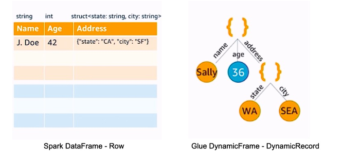
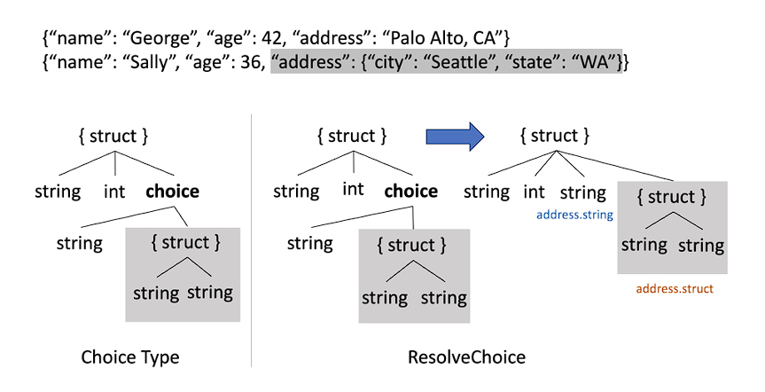
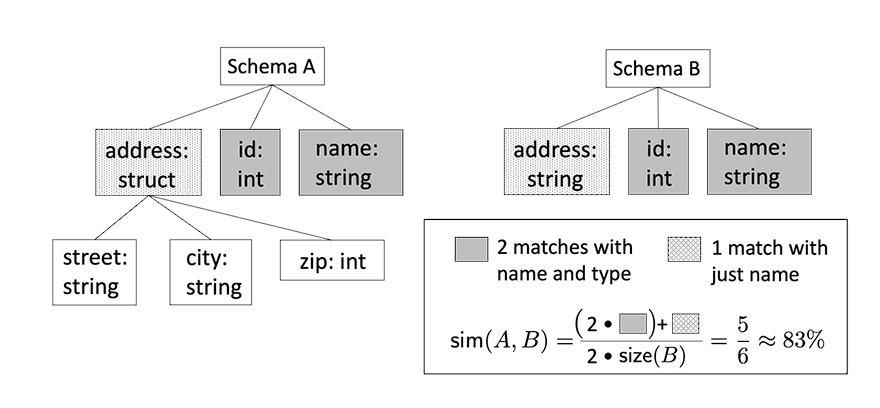

AWS Glue is one of the major offerings of AWS, where AWS provides support to run ETL (Extract-Transform-Load) jobs reliably. The main objective of AWS Glue is to support different query processors to be used as analytical engines on top of different types of data stored on different types of storage with a variety of formats and that too in a serverless way. Here in this blog post, we will mainly focus on how AWS Glue has managed to do so, especially processing data stored on different storages in a variety of formats.

### Background:
Earlier the majority of the data was stored in the relational databases, and the analytical tools were used to run ETL jobs on the databases to generate reports or to archive data on the cold storages. However, with the advent of cloud computing, and extremely cheap object storage, it became easier to achieve the data on the object storage itself. With object storage, the format of data storage is completely controlled by the application developers. It's been observed from the customer data that the majority of the data stored in object storages like S3 follows Parquet, JSON, and CSV format. Apart from this, there's also an additional layer in understanding data with the prefixes with which data is stored on these object storages, as certain organizations use partitioning key as the prefix. Now, this variety of storage also imposes additional challenges on the analytical applications, as a majority of the query processing tools like Apache Spark require the schema before the operations.

### DynamicFrame and Schema Inference:

To handle this kind of issue Glue has introduced a new concept termed **DynamicFrame**, which is a collection of Spark DynamicRecords with additional flexibility that DynamicFrame doesn't need to know the schema upfront, rather it embedded the schema information for each entry of DynamicRecord and then infers the global schema only when needed. 

Alongside this, a new schema inference algorithm is also introduced which follows that of Spark, however with the flexibility to accommodate schema conflict. A new union type called **ChoiceType** is introduced which contains all the different types taken by the field in a DynamicFrame. ChoiceTypes support an array of heterogeneous elements also. 
Apart from this, the Glue schema inference mechanism also keeps track of the absence of values with the help of NullType.

For nested structures, the structure is flattened and the nested ones are logically stored at a different table with the help of a similar concept to a foreign key.

### Parquet Writer:
One of the most requested features is to provide support for Parquet writers. Parquet is the binary columnar format and is well-supported across different analytics engines. One of the restrictions of the Parquet format is that the schema is needed upfront. The Glue Parquet writer eliminates the need for schema, rather it tries to infer the schema in-memory. Parquet writer holds around 128MB of data in memory, and once this limit is reached, the parquet writer infers the schema for this data before flushing the first chunk to the disk. Once the schema is inferred it's fixed till no conflict is encountered, and till that time the incoming blocks are stored on the same object. However as soon as a conflict arises, the new schema is inferred after reading the whole chunk of 128MB of data, and it starts writing to a different object. Though empirical data suggests that the schema doesn't change much, however at the worst case this approach can result in creating each object for an entry. The experiment shows efficient handling of this parquet writer uses only 8.9% of memory as opposed to 7.3% of memory used by DataFrames. 
It's to be noted that certain analytical engine needs separate configurable options to enable them to ingest objects having different schema.

### Crawler:
Query engines need metadata such as schemas and storage locations to plan and execute queries. A metadata store is used for this purpose, which is generally a relation datastore. Hive meta-store is one such open-source implementation, a de-facto standard for the Hadoop ecosystem for metadata management.

Glue Crawler works in two different phases:
1. Listing and Classification: The first stage, where the crawler enumerates each object listed. The objects are parsed in parallel to determine the file format and schema on the object level. Crawler only uses the first block information to do so.
2. Finalizer: Once the schema is determined for each object including the prefix as well, For the prefix level, a similarity check is added on the sibling level for each level of partitioning, and if the similarity exceeds some threshold, then it's determined as a partition, otherwise they're considered as separate tables.

Glue also allows incremental crawling to ensure only new unvisited objects are crawled.

### References:
1. [Saxena, M., Sowell, B., Alamgir, D., Bahadur, N., Bisht, B., Chandrachood, S., Keswani, C., Lee, A., Li, B., Mitchell, Z. and Porwal, V., 2023. The story of AWS Glue.](https://www.amazon.science/publications/the-story-of-aws-glue)
