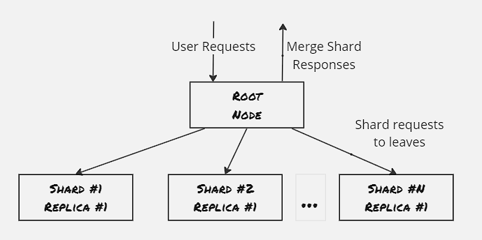
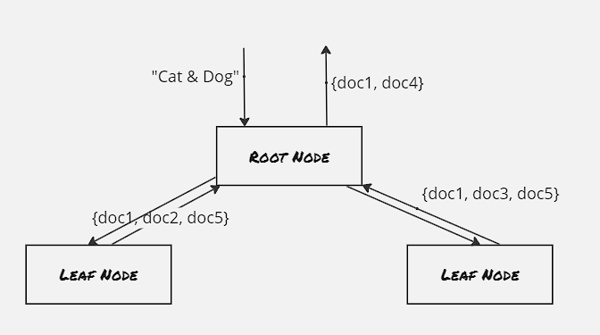
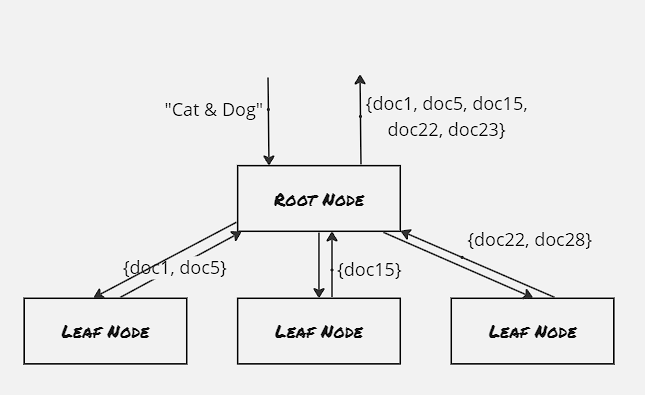
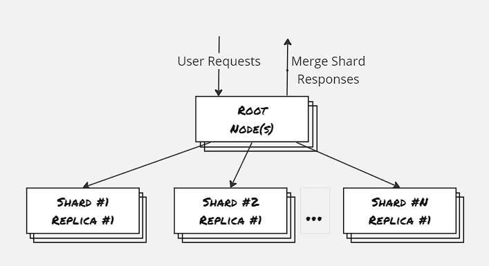
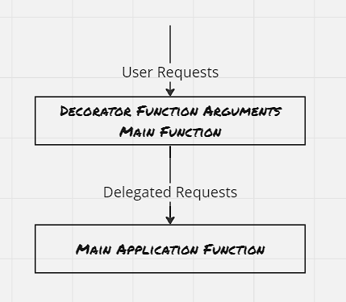

In the last blog post, we have discussed two of the major patterns for designing distributed systems. The replicated load-balanced pattern scales the system in terms of requests processed per second and the sharded data pattern scales the system in terms of size of data. Here we would discuss two more such patterns: the scatter/gather pattern which helps scale the system in terms of computation time needed and the event-driven pattern.

### Scatter/Gather:
The root node frames out the incoming requests simultaneously to all the servers. Each server node does a small amount of processing and returns the output to the root node. The root node then combines these partial outputs and returns a response to the end-user. This is helpful in scenarios where each server node can compute the requests independently.

In the simplest form of scatter/gather pattern, each leaf node is entirely homogeneous. The primary benefit here lies in distributed computing, as the bottleneck of single CPU processing is overcome here. Also, the root node can dynamically assign nodes depending on resource usage and responsiveness. 

However this replicated scatter/gather pattern is not scalable beyond a certain data size, as all the leaf node has access to the same data, hence the overall data size becomes the bottleneck here. Hence majority of the applications following this scatter/gather pattern have the leaf nodes sharded. The primary benefit here is that each leaf node has access to a disjoint set of data, Each node processes the operation on a smaller set of data loaded to the specific shard and returns the partial output to the root node, and the root node then combines all these partial outputs.

##### Points to be noted:
- Choose the right number of leaf nodes: As processing requests by a node also has an overhead, and as the leaf node increases, the computation cost reduces, however, the overhead for request processing remains the same
- Straggler problem: The overall time needed to process a request from the end-user is dictated by the response received from the slowest node, as the request is framed out to all the leaf nodes simultaneously. Straggler problem is related to both latency and availability:
    1. The leaf nodes have a 99th percentile latency in 2 secs, and there are 5 leaf nodes. Then there's a 5% chance that the overall response would take more than 2 secs. (0.99^5=0.95)
    2. If the probability of a node failing is 1% and there are 100 leaf nodes, then it's practically guaranteed that each request from the end-users will fail

The straggler problem can be overcome by having a replica of each shard. Each leaf request from the root node is load-balanced across all the healthy replicas to the shard.

### Functions & Event-Driven processing:
Function as a Service (FaaS) and event-driven applications have emerged with the advent of cluster orchestrators to handle a single event.
Even though certain times FaaS and serverless are frequently used together, however, they're different. Serverless computing can be applied to different kinds of services, where there's no need to maintain a specific set of servers, and those services may not be event-driven. Conversely, an event-driven FaaS can be run on a Kubernetes cluster container couple of servers, in which case the application becomes event-driven but not serverless.

##### Advantages of FaaS:
- Simplifies code deployment: No need to manage a cluster of servers and deploy on them
- Managed & Scaled automatically
- Good fit for responding to a temporal event

##### Disadvantages of FaaS:
- No real representation of the dependencies or interactions between different functions
- Need to adopt rigorous monitoring and alerting for how the system is behaving
- Poor fit for the compute-heavy or memory-hog activities
- Economics for pay-per-request tends to become bad as request handling becomes more frequent

##### Decorator Pattern:
FaaS is ideal for deploying simple functions that can take an input transform it into an output, and then pass it to a different service.

There's a distinct difference between requests and events, and it has to do with the notion of a session. Requests can be thought of as a part of a larger series of interactions as part of a session, whereas events tend to be single-instance and asynchronous. Events are also independent and stateless.

Use case-wise it's similar to the adapter container, that we've discussed as part of the co-scheduled pattern. However certain times we would like to have it decoupled and changed independently depending on the service consuming the output.

Example Problems:
1. Adding request defaulting before request processing
2. Implementing two-factor authentication
3. Implementing pipe-line for new-user signup

### TODO:
- Implementation is pending for these two patterns

### References:
1. Designing Distributed Systems: Patterns & Paradigms for Scalable, Reliable Services
