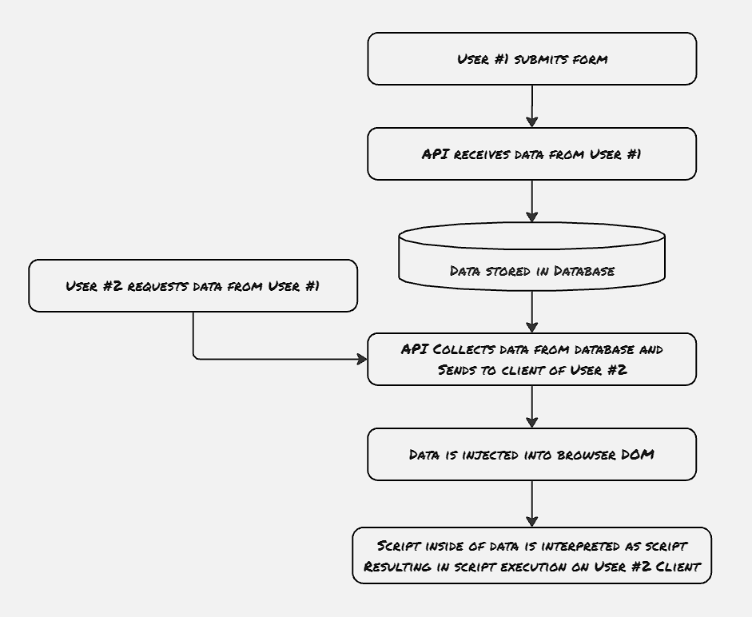
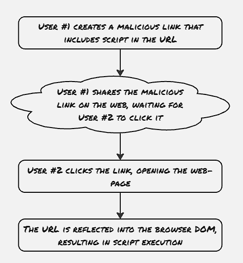

Security is a major aspect while developing any application, and web applications are more prone to attacks. Ideally, the security aspect of the application should be taken into consideration from the ideation process itself, as any security vulnerability detected at the architecture design phase itself would cost much less to resolve compared to the one found during pen-testing, or at worst case the vulnerability is exploited by some black-hat hacker. With this in mind, we will explore a couple of major categories of attacks in the next few blogs, starting with Cross-site scripting in this blog. We will explore how this cross-site script attack works, with some examples, and we will also explore some well-known mitigation techniques.

Cross-site scripting (XSS) attacks, at their core, execute a malicious script on a user's web browser. It uses the fact that all modern web browsers allow the executing of JavaScript on web browsers. Hence, most such attacks are performed with the help of JavaScript.


##### Stored XSS:

One issue with stored XSS is that some of the advanced XSS payloads are not even written in plain text, rather they're written in other formats like base64 binary, etc. On top of that, in certain scenarios, the whole payload is split and stored in multiple places and can be dangerous only when combined. Generally, this is handled with the help of a sanitizer library, which detects anomalous scripts stored on the server.

##### Reflected XSS:

Reflected XSS is much more difficult to detect since the payloads are not stored on the server side. This type of attack is directed to hit a set of users, as the malicious payload needs to be distributed separately.

##### Mutation-Based XSS:
Mutation-based XSS (mXSS) is a newer type of XSS, where the sanitizer libraries are bypassed. These are generally performed with a combination of tags and string, where the malicious script is provided as a string, however, due to browser behavior, the tags are handled separately, sometimes causing the string to get escaped, and it gets executed as script.


Protocol-relative URL (PRURL) is one of the legacy mechanisms, which allows the browser to choose the protocol to open a link. This is a security anti-pattern and should be avoided at all costs.

At certain times, the browser also attempts to correct improper quotes. ```<a>``` is one such tag, where Chrome browser tries to perform such kind of rectification, which can also result in bypassing sanitizer to convert a non-malicious script to a malicious one.`

Generally, the exploit payload changes based on which browser context it's supposed to be used. For example, the XSS payload executing under the eval() method would be significantly different than the one to be added ``` element.innerHTML```. There's also a concept of polyglot payload, where the script is written in such a way that it can be executed in a wide variety of browser contexts. One such example is posted here https://github.com/0xSobky/HackVault/blob/master/XSS-polyglot.js


### Mitigation:

The major rule to mitigate XSS attack is: **don't allow any user-supplied input data to be passed into DOM, except as string**. Such a rule can't be imposed in all the scenarios. In that case, please follow the hand rule **Never allow any unsanitized user-supplied data to be passed into DOM**.

Stay away from the following APIs related to the following HTML specifications:
- element.innerHTML/ element.outerHTML (always user innerText rather than innerHTML when appending strings or string-like objects to the DOM)
- Blob
- SVG
- document.write/document.writeIn
- DOMParser.parseFromString
- document.Implementation

Blobs and SVGs carry significant risk, as they store arbitrary data, and yet still are capable of code execution.

##### CSP:
(Following is generated from ChatGPT)
CSP stands for Content Security Policy. It is a security feature implemented by web browsers to help prevent and mitigate certain types of attacks, such as Cross-Site Scripting (XSS) and data injection attacks. CSP works by allowing website administrators to specify which sources of content are trusted and can be loaded on their web pages.

###### Key Concepts of CSP:

1. **Directives**: CSP directives define the types of content that can be loaded and executed on a web page. Common directives include:
   - `default-src`: Specifies the default policy for loading content.
   - `script-src`: Controls the sources from which scripts can be loaded.
   - `style-src`: Controls the sources from which stylesheets can be loaded.
   - `img-src`: Controls the sources from which images can be loaded.
   - `connect-src`: Controls the sources for XMLHttpRequest, WebSocket, and EventSource.
   - `font-src`: Controls the sources from which fonts can be loaded.
   - `frame-src`: Controls the sources from which frames can be loaded.
   - `object-src`: Controls the sources from which plugins can be loaded.

2. **Sources**: Sources define the allowed origins for content. Common sources include:
   - `'self'`: Allows content from the same origin (domain).
   - `'none'`: Disallows all content.
   - `'unsafe-inline'`: Allows inline scripts and styles (not recommended for security reasons).
   - `'unsafe-eval'`: Allows the use of `eval()` and similar functions (not recommended for security reasons).
   - `https:`: Allows content from HTTPS URLs.
   - `data:`: Allows content from `data:` URLs.
   - Specific domains: Allows content from specific domains (e.g., `example.com`).

3. **Report-Only Mode**: CSP can be set in "report-only" mode, where violations are reported but not enforced. This is useful for testing and debugging CSP policies without affecting the user experience.

###### Example of a CSP Header:

```http
Content-Security-Policy: default-src 'self'; script-src 'self' https://apis.example.com; style-src 'self' 'unsafe-inline'; img-src 'self' data:;
```

- **default-src 'self'**: Allows content from the same origin.
- **script-src 'self' https://apis.example.com**: Allows scripts from the same origin and `https://apis.example.com`.
- **style-src 'self' 'unsafe-inline'**: Allows styles from the same origin and inline styles.
- **img-src 'self' data:**: Allows images from the same origin and `data:` URLs.

###### Benefits of CSP:

- **Mitigates XSS Attacks**: By controlling which scripts can be executed, CSP reduces the risk of malicious scripts being injected into a page.
- **Prevents Data Injection**: By controlling which sources can be loaded, CSP helps prevent data injection attacks.
- **Improves Security Posture**: CSP provides an additional layer of security that can be used to enforce best practices and reduce the attack surface of a web application.

###### Drawbacks of CSP:

- **Complexity**: Implementing a CSP can be complex, especially for large and complex web applications.
- **Compatibility**: Some older browsers may not fully support CSP, although modern browsers generally do.
- **False Positives**: CSP can sometimes block legitimate content, leading to a poor user experience if not configured correctly.

In summary, CSP is a powerful tool for enhancing the security of web applications by controlling the sources of content that can be loaded and executed on a page. However, it requires careful configuration to balance security with functionality.


### References:
1. [Content Security Policy | How to solve content security policy error](https://www.youtube.com/watch?v=hUDUqyy0jPM)
