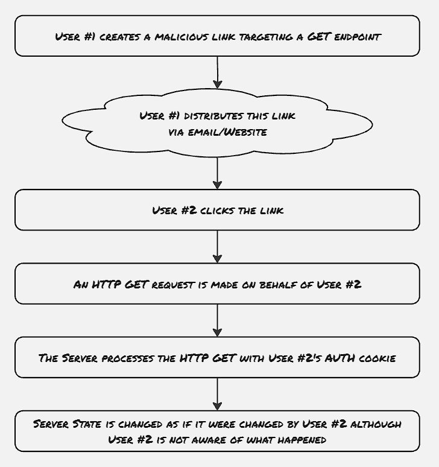
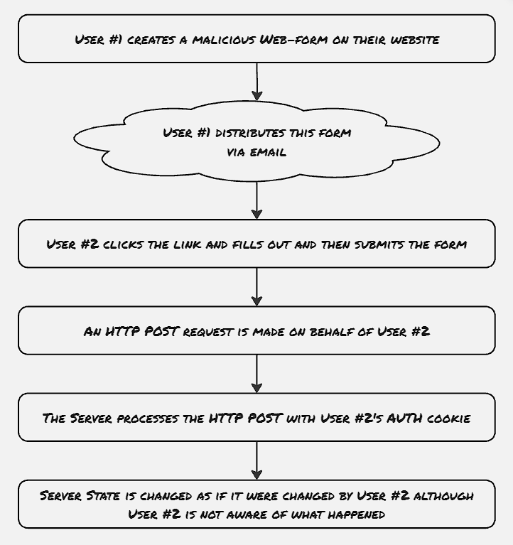

In the last blog post, we started exploring web application security, where we explored cross-site scripting attacks. Here in this blog post, we will learn about another different type of attack called Cross-site Request Forgery, which exploits a user with admin or elevated privileges into performing some action without their knowledge. Just like cross-site scripting, these CSRF attacks are also performed majorly through JavaScript code snippets, by taking advantage of the trust relationship between the browser and the web application, to perform such operation unnoticed. Because the JavaScript code snippets are integrated with the web application, they're not easily detectable by the impacted user, making it one of the most stealthy attacks. We will explore different types of CSRF attacks and will touch upon the best practices to mitigate them.


The two main identifiers of CSRF attacks are:
- Privilege escalation
- Stealthy attack (The user is unaware that such attack is initiated)

Hacker initially finds out which APIs the web application supports, and which APIs are responsible for state changes. Even though generally POST, PUT, and PATCH endpoints are supposed to create or update resources, however, there are some web applications which doesn't strictly follow this set of standards, and there might be some specific GET endpoints also which can change the state of the user. These types of attacks can also be initiated without explicitly injecting any script into the target web application directly. Rather the hacker can distribute a link to a similar-looking malicious web application, which internally triggers some API to the target web application. Now if the target user is logged on to the intended web application from a different tab, then the request initiated from the malicious web application to the target API would also contain the same cookies and session, thus essentially would clock themselves as initiated by the user in stealth. 

##### Query Tampering Technique:


Query tampering is one such example of CSRF, which utilizes non-standard GET endpoints to change the state of the user.
This is easier to deploy, as any link with ```<a>``` tag or image with `````` generates a GET endpoint without any user interaction. Hence the malicious API trigger doesn't need any interaction from the user apart from opening the link.

Iframe HTML object is also used at certain times, however it only works with GET endpoints.

##### CSR Against POST endpoint:


Web forms are one such HTML object that can initiate a POST request without any script required.

```http
 <form action="https://www.mega-bank.com/transfer" method="POST">
 <input type="hidden" name="to_user" value="hacker@hacker.com">
 <input type="hidden" name="amount" value="100000">
 <input type="submit" value="Submit">
 </form>
```

The hidden type attributes above would ensure that the input parameters wouldn't be rendered by the browser, only the submit button would be visible, which is generally disguised as a different activity. Once the end-user clicks on the submit button, the POST request will get initiated using the existing session and cookies of mega-bank if already logged in.


##### Weak validations:
1. Certain web applications utilize header validation to detect whether all the needed headers are present on the API request, and if not, then it's detected as a CSFR attempt. However, it's to be noted that employing such kind of header validation as a first line of defense is not recommended, as the headers can be easily spoofed, or manipulated.
2. Legitimate tokens can be picked up directly from a web browser sometimes, and can be attached to the malicious requests
3. Tokens should not be generated in any predictable manner


### Mitigation

##### Header Verification:
There are two specific headers to check the origin of the requests:
1. Origin header: The origin header is sent only for HTTP POST requests.
2. Refferer header: This header is set for all the requests unless the referring link has the attribute ```rel=noreferer``` set.

It's to be noted that these header verifications are just the first line of defense, as the existing JavaScript libraries don't support modifying them. However, still we need to proceed with caution, as they can be easily spoofed with other clients like Curl.


##### CSRF token:

At its core, the CSRF token defense works like this:
1. The web server sends a token, which is generated cryptographically with low collision probability. They're generally generated for the session and applied on the whole application level. These tokens generally expire after some time.
2. For each request sent to the web server, the token is returned as part of the response, and the subsequent requests also include the same token in the header. The token is verified by the server.
3. The attacker now needs to find out the live CSRF token for that specific user, which makes the CSRF attack complex.

CSRF tokens are supposed to be stateless, and should have the following properties:
1. A unique identifier for the user the token belongs to
2. A timestamp, which is used for expiration
3. A cryptographic nonce, whose key only exists on the server

Following are the best practices for these Anti-CSRF tokens:
1. Refactor the GET requests to be stateless: Stateful GET requests are always open to a potential CSRF attack
2. CSRF token should be implemented application-wide: the security of the web application is as strict as that of the weakest link
3. CSRF checking should be handled by a dedicated middleware layer to ensure they're verified for every request 

### Future work:
- How to disable other parent or child tabs from reading cookies intended for the web app


### References
1. Web Application Security by Andrew Hoffman
