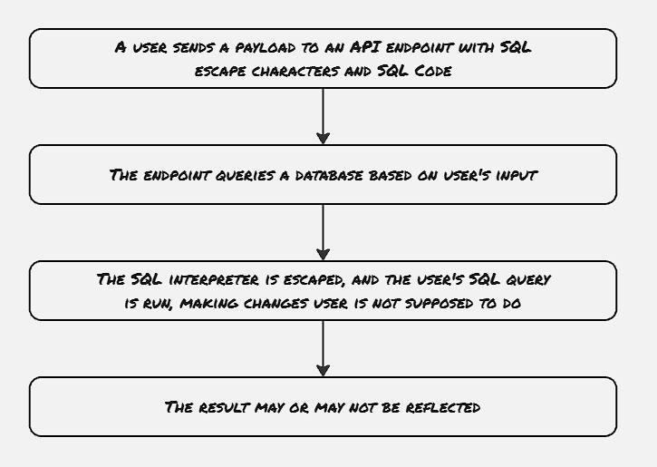
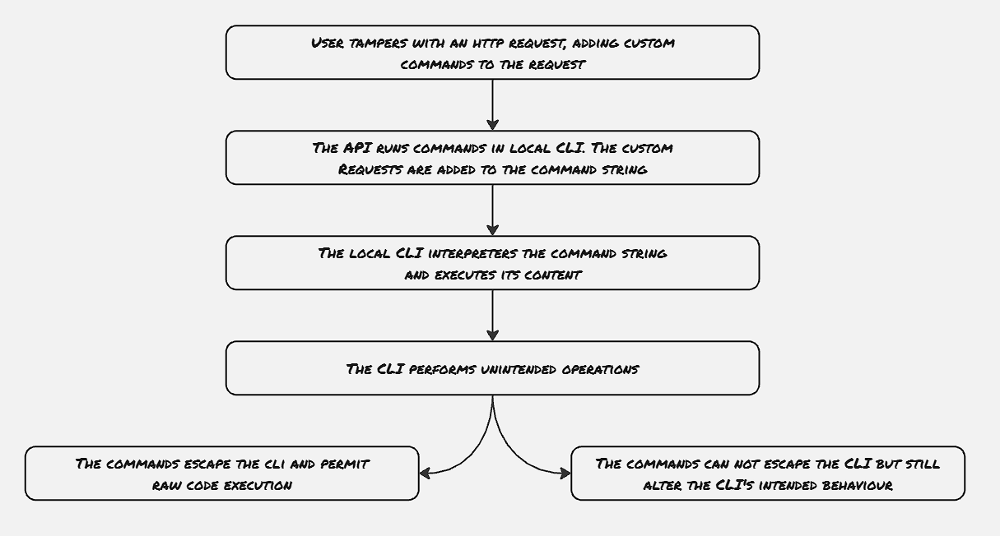

In this blog, we will explore another type of attack on web applications: injection type attack. SQL Injection is one of the most well-known attacks due to the use of databases with almost all the applications nowadays. However, other types of injection attacks are also possible targeting different internal components. Just like the earlier blogs, we will explore a different type of attacks and how to mitigate them for these types of attacks.

Ideally, the injection attacks have two major components: an interpreter and a payload. The payload is generally provided as an input.

### SQL Injection:
SQL Injection is the most popular kind of injection attack, whether attackers try to provide malicious queries as input to input forms. SQL injects became famous for targeting websites, where developers used the input provided by customers without much sanitization. 

Recently web frameworks started advocating implementation patterns to mitigate these SQL injection attacks.

### Command Injection:
With the command injection type of attacks, the user can provide the payload to execute a malicious command on the application server. Just like SQL injection, these types of attacks also exploit the web application not sanitizing user input, thus not restricting users from executing malicious commands on the server. These commands may not be direct Linux commands, but they can be thought of as some tweak, which alters the actual command that is supposed to be executed.

An example can be thought of for some video converters, where the convert operation is generally performed by some other application installed on the server, and based upon a request from the user, the web server triggers the video conversion command meant for the third-party application. Now in case the attacker can exploit certain vulnerabilities in the application code to run its commands, or alter the way the internal video convert application is supposed to be used, that would be an example of command injection.

### Code Injection:
Code injections are similar to command injection, the only difference is that rather than injecting the command, code is injected in the user payload, which in turn again defers the application from the normal operating process.

### Mitigation:

1. **Prepared statement & stored procedures:**

Prepared statements and stored procedures are two primary weapons to make the application resistive against SQL injection type of attacks.
Almost all the web frameworks now support the prepared statement. The way prepared statements are declared can vary depending upon the language or the web framework, however, majorly the way prepared statement works is that they segregate the SQL query and data. The prepared statement is compiled first, and then the values are provided, thus, the provided value will be treated as data, and not as the part of SQL query.

The stored procedures are also similar to the prepared statement, with the only difference being that stored procedures are native to the databases. Hence once the stored procedure is compiled, it can be reused multiple times, with some extra benefit in terms of performance. Hence, in the case of performance-sensitive applications, stored procedures are always recommended.

2. **Principle of least-privilege:**
Even though the term "principle of least privilege" became more famous with the advent of cloud computing, it's been getting used in the context of web applications long before that. The principle of least privilege suggests creating a specific user for the web application and providing only the required permissions, to ensure that the injected command would be ineffective even if the web application gets exploited.s

3. **Use of allowlist for whitelisted command:**
Always use allowlist to whitelist the commands intended to be run by the application. Certain times developers rely on blocklists, however, the use of blocklists is not recommended, as there's always a possibility of some commands being omitted, or the blocklist may not be that effective with later updates. Hence, it's always advisable to use a whitelist rather than a blocklist.

### References
1. Web Application Security by Andrew Hoffman
2. [https://www.programmerinterview.com/database-sql/example-of-prepared-statements-and-sql-injection-prevention/](Prepared statements)
3. [https://stackoverflow.com/questions/7296417/difference-between-stored-procedures-and-prepared-statements](Difference Between Stored Procedures and Prepared Statements?)
