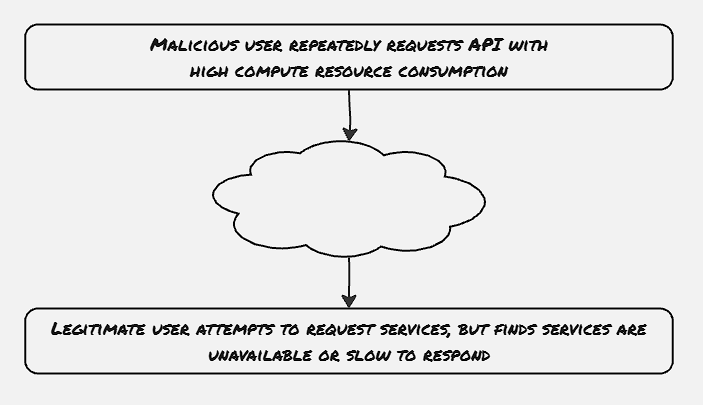
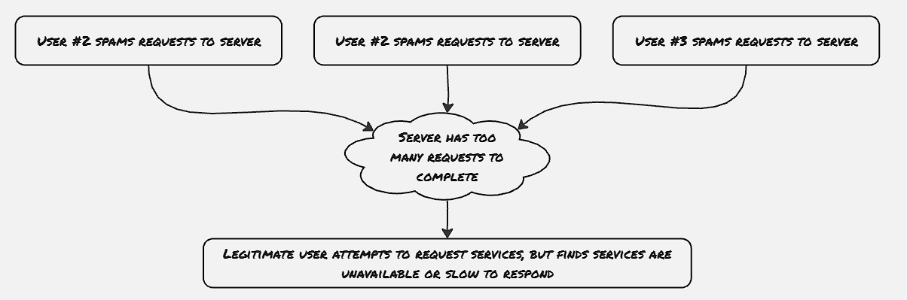
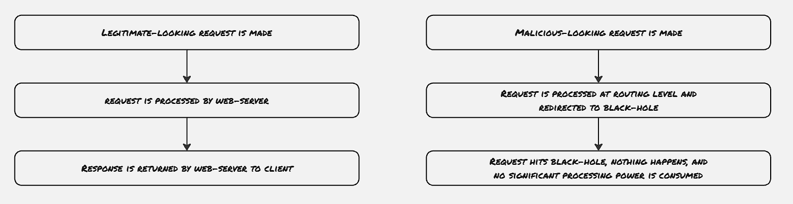

In the last couple of blogs, we've learned a couple of different types of attacks on web applications. In this blog, we will learn about DoS attacks i.e. Denial of Service attacks. DoS attacks come in different forms, though the most common one is DDoS (Distributed Denial of Service). However, there are other types of DoS attacks, which exploit the underlying logic of the application. We would know about them and will also explore how to mitigate them.

### Regex DoS:
Regular expressions are often used in web applications to validate the input texts and to check whether the provided input is following some certain pattern or not. With the support of regular expression (or regex in short) in all the major programming languages, crafting an unoptimized regex became quite simple. Exploiters can reap the benefit of such unoptimized regular expressions. The use of greedy matches in regular expressions is a major concern as the regex engine would try to go through all possible combinations to uncover all possible matches. The execution time of such a regex can quickly spiral exponentially. 

**Mitigation**
1. Look for a regex that performs significant backtracking against a repeated group
2. Make sure no places in the application accept a user-provided regex expression

### Logical DoS Vulnerability:
Logical DoS vulnerabilities are among the hardest to find and exploit, as they require some experience with how the application behaves in certain scenarios.

**Mitigation:**
Logical DoS attacks are based on resource-intensive operations. To anticipate some kind of DoS attacks, first, look for occurrences in the web application that are resource-heavy. The following might be a good place to look at:
- Any operation that operates synchronously
- Database writes
- SQL joins
- File backups
- Looping logical operations

Introducing a rate limit, or allocating more resources depending upon the type of users on such resource-intensive operations would be beneficial for such scenarios.

### DDoS Attacks:
DDoS attacks are generally initiated by a network of a large number of nodes flooding a service with requests, thus overloading the servers and rendering the service useless to the actual users. 

**Yoyo Attack**
The majority of the cloud infrastructures provide auto-scaling support to web applications, where depending upon demand, the number of servers is automatically increased. DDoS attacks in such kinds of web applications would increase the cost of cloud infrastructure significantly. Also, the CSPs auto-scale the hardware resources as soon as they get a burst of requests, and down-scaling would take some time of inactivity, DDoS attacks need not continue sending requests all the time, rather flooding requests in a burst would also achieve a similar effect.

**Proxy-based DoS**
As DDoS requires significant compute resources, at certain times the DDoS attacks are generated through other proxies. For example, by tweaking some publicly available crawler, or through other devices already compromised by the botnets.

**Mitigation**
DDoS attacks can't be prevented. However, the easiest way to handle this is to invest in a bandwidth management service. These services are capable of intercepting large quantities of network requests and filtering out against the known botnet networks.

Further study:
- How to implement rate-limiting
- How DDoS shields/Bandwidht management services work

### References
1. Web Application Security by Andrew Hoffman