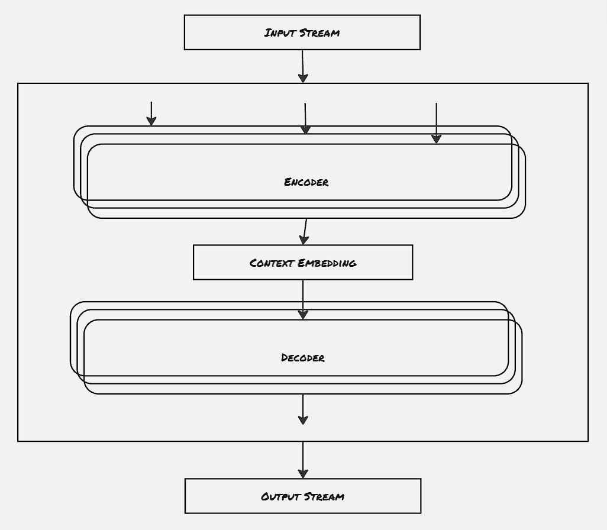
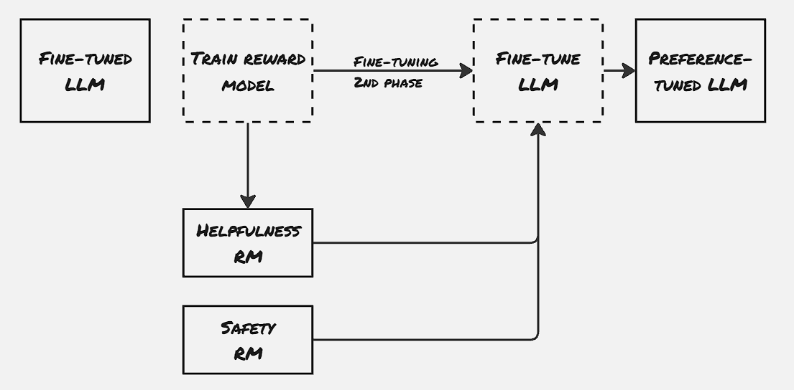

Recent large language models have opened a portal for different possibilities across domains. From a programmer perspective, it can provide a quick-fix recommendation, and answer generic questions. It's blurring the line to distinguish whether you're chatting with a human or a machine. LLMs are the new frontier of machine learning, and far more optimized LLMs with greater capabilities are getting released within a matter of weeks. Here in this blog post, we will explore the LLMs primarily from an application user perspective. We would gain some basic understanding of what LLMs are, and how they operate, and we will also see some examples on how to use different LLMs.


### Building blocks:

LLMs contain two basic building blocks: encoder and decoder. It's to be noted that LLMs operate on a numerical input stream. This is done mainly to support multi-modality i.e. to support different types of data in LLM. There are several models following vision transformer architecture like BLIP and CLIP, that operate on both images and texts.

Now, coming back to the original discussion about LLMs, the input streams are first tokenized into numerical data. This is performed by **Tokenizer**. So far, the tokenizers are also trained on the same data the actual LLMs are trained with, and hence generally each LLM has its own set of compatible tokenizers. Encoders consume the string of tokens and try to create a context embedding out of each token. The **context embedding** can be thought of as a prioritization matrix, which attempts to find out the tokens closely related to the current token.



The second building block, the decoder block is responsible for generating output. It's to be noted that not all LLMs are designed to generate output that we see generally. For example, there are some classification LLM models, like the sentiment models, which try to classify a set of tokens. This kind of model is called a **representation model**, and doesn't contain the decoder block. The ones that generate output in generic form are called **generative model**. These generative models, on the other hand, need this decoder block.

The majority of the LLMs are *text2text* generative models. These types of models consume text as an input and produce text as output. The nature of input text and output text can differ significantly. For example, in some of the models that support translating to different languages, the output will be in different languages. *Text2image*, *Text2video* models are also getting popular now-a-days.

The outputs are generated by LLM on a token-by-token basis. Once an output is generated, it's appended with the previously generated outputs along with inputs, and the whole thing is fed again to the LLM to generate the next token. There's a limit to the number of tokens that the model can be fed in one go. This is called **context window**.

The encoders are decoders built using the transformer architecture proposed by Google in the famous paper "Attention is all we need". We will explore more on the internal details of the transformer later, in some different blog posts. 


### How are they trained?

The LLMs are trained in three different phases:
- Step 01:**Language Modeling**:

This is the very first phase, where the base model is trained on massive datasets. This is where the model learns the linguistic and semantic representation from the dataset, where it tries to predict the next token more accurately. The output is the base model, which is also called the pre-trained model or foundation model.

- Step 02:**Supervised Fine-tuning (SFT)**:

The foundation model is trained to predict the next token when given a stream of input tokens. However, that is not sufficient for many day-to-day activities. LLMs are more useful when they follow specific instructions. This is where the base model is trained to follow a specific instruction set, updated to be in line with the target activity. SFT is also used for the classification task but is largely used to make a base generative model to an instruction (or chat) generative model.

The number of parameters that need to be updated on the base model is generally restricted while performing SFT. Even though all the parameters can be updated, that requires significant computation. Rather the results show that we can achieve almost similar results by allowing updates on a small subset of the overall weights. This approach is also known as **Parameter-Efficient Fine-Tuning (PEFT)**. Adapter and LoRA are two major approaches followed for PEFT.
**Adapters** are separate components added in the LLM, which are allowed for updation in the fine-tuning phase. In the case of **LoRA**, two low-rank matrices contain the details for the differential weight matrix. 

- Step 03:**Preference Tuning**:

This is the final step, where the behavior of the model is aligned with AI safety. Different reward models are maintained for different aspects.
**PPO** (Proximity Policy Optimization) is one popular technique that uses such reinforcement reward models.



However, maintaining different models has some disadvantages also. That is where **DPO** comes into the picture, where the shift between the accepted answer and rejected answer is calculated during fine-tuning itself, thus aligning the model with the expected behavior.


### Using LLMs:

##### Example 01: Using a generative model:
```py

from transformers import AutoModelForCausalLM, AutoTokenizer, pipeline

model = AutoModelForCausalLM.from_pretrained(
    "microsoft/Phi-3-mini-4k-instruct",
    device_map="cuda",
    torch_dtype="auto",
    trust_remote_code=True,
)

tokenizer = AutoTokenizer.from_pretrained("microsoft/Phi-3-mini-4k-instruct")

generator = pipeline(
    "text-generation",
    model= model,
    tokenizer= tokenizer,
    return_full_text=False,
    max_new_tokens = 500,
    do_sample=False
)

messages = [
    {"role":"user", "content":"Create a funny joke about chickens."}
]
output = generator(messages)

print(output[0]["generated_text"])

>>> ' Why did the chicken join the band? Because it had the drumsticks!'
```


##### Example 02: Fine-tuning a representation model:

```py
from transformers import AutoTokenizer, AutoModelForMaskedLM

# Load model and tokenizer
model_id = "bert-base-cased"
model = AutoModelForMaskedLM.from_pretrained(
    model_id
)
tokenizer = AutoTokenizer.from_pretrained(model_id)


def preprocess_function(examples):
    # tokenize input data
    return tokenizer(examples["text"], truncation=True)

# Tokenize train/test data
tokenized_train = train_data.map(preprocess_function, batched=True)
tokenized_train.remove_columns("label")
tokenized_test = test_data.map(preprocess_function, batched=True)
tokenized_test.remove_columns("label")

print(tokenized_train)
print(tokenized_test)


from transformers import DataCollatorForWholeWordMask

# Predicting the whole word is more complicated than predicting the next token
data_collator = DataCollatorForWholeWordMask(
    tokenizer=tokenizer,
    mlm=True,
    mlm_probability=0.15
)


from transformers import TrainingArguments, Trainer

# Define the training arguments
args = TrainingArguments(
    output_dir="model",
    learning_rate=2e-5,
    num_train_epochs=5,
    weight_decay=0.01,
    per_device_train_batch_size=16,
    per_device_eval_batch_size=16,
    # per_gpu_eval_batch_size=32,
    # warmup_steps=100,
    # fp16=True,
    # eval_steps=100,
    # logging_steps=100,
    save_strategy="epoch",
    report_to="none"
)

# Train embedding model
trainer = Trainer(
    model= model,
    args= args,
    train_dataset= tokenized_train,
    eval_dataset= tokenized_test,
    tokenizer= tokenizer,
    data_collator= data_collator,
    # compute_metrics= compute_metrics,
    # loss= train_loss,
    # evaluator= evaluator,
    # callbacks=[],  # Disable all callbacks, including ModelCardCallback
)
trainer.train()

trainer.evaluate()

# Save the model

tokenizer.save_pretrained("mlm")
model.save_pretrained("mlm")


from transformers import pipeline

# Load and create predictions
mask_filler = pipeline("fill-mask", model="bert-base-cased")
preds = mask_filler("What a horrible [MASK]!")

# Print results
for pred in preds:
    print(pred)
```

### References
1. Hands-On Large Language Models

