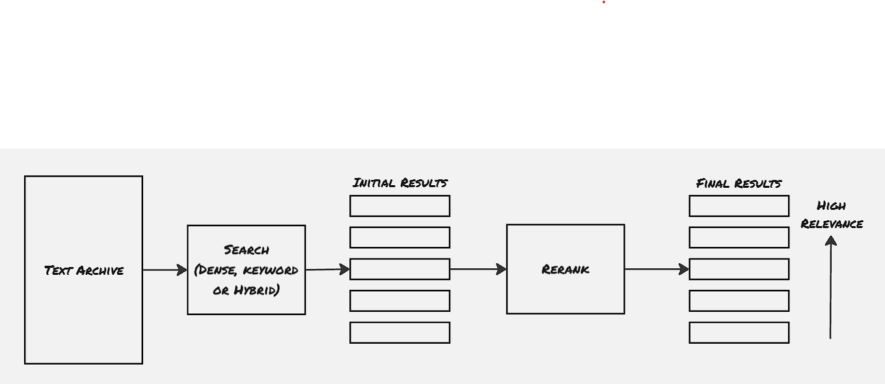

Search is one of the first areas where LLMs got their industrial use. Currently, many organizations started looking into enhancing the user experience with search by introducing LLMs. Multiple startups are formed focusing on this segment. The ability that LLM introduces in the search space is due to its ability to perform semantic search i.e. to search by meaning. So far the search engines were mainly focused on keyword matching with some sort of priority to each web link to understand how frequently people are referring to that web link. However, with the advent of LLMs, traditional search engines also started having the semantic approach as well, i.e. to search the websites not only based on keywords but rather the semantic meaning of the documents. Here in this blog post, we will discuss more about semantic search and also will explore RAG, an approach to perform semantic search.

One of the well-known problems with LLMs is its "hallucination" effect, i.e. in the absence of a proper example, the model would generate its own text, which wouldn't be factual. To handle this, retrieval-based approaches are recommended, where the relevant documents are fetched first, and the LLMs then use the relevant documents to generate factual answers by referring to those documents.

### Architecture:

Semantic search techniques are built upon three different phases.

##### Phase 01: Dense Retrieval:
Dense retrieval depends upon the concept of embedding. The embeddings of nearest neighbors would have less distance in the embedding vector space. This nearest neighbor technique can be used to find out the related documents. The language model needs to be trained on question-answer pairs to make it better at retrieval.

The process of dense retrieval is as follows:
1. Chunk the text that needs to be part of the search index and make embedding out of every individual chunk
2. Make the embeddings part of the search index
3. Retrieve the nearest embeddings for the searched query

There are two caveats to the dense retrieval:
1. How to handle hallucination?
 One way to handle such hallucinations is to set the least relevance distance heuristically. Another approach few systems picked up is having an additional filter for user activity, especially whether a particular document is preferred by the end-users.
2. What if the user wants an exact match for a specific keyword? 
 We've to rely on traditional keyword-based searches for this. This is why organizations are using a hybrid search structure, which includes both semantic search and keyword-based search.

##### Phase 02: Reranking:
This particular step is tasked with changing the order of the search results based on their relevance. This is where even the traditional web-search organizations have also started using LLMs. For example, Microsoft Bing has started using BERT-like models to rerank the web links filtered by their traditional search engine backbone infrastructure.

##### Phase 03: Retrieval-Augmented Generation (RAG):
This is where the overall output is generated by using the documented filtered and reranked through the previous two phases. Certain times RAG dictates the overall search architecture. RAG internally uses different approaches to help with finding proper results:
- Query rewriting
- Multi-query RAG: where the query is broken down into multiple queries to capture individual data, and then to aggregate them
- Multi-hop RAG: where the actual info is generated after breaking down the actual query into multiple layers. It's similar to multi-query, but in cases of multi-hop RAG, the next layer of question can be fired only after capturing the info from the previous layer.

### References
1. Hands-On Large Language Models

