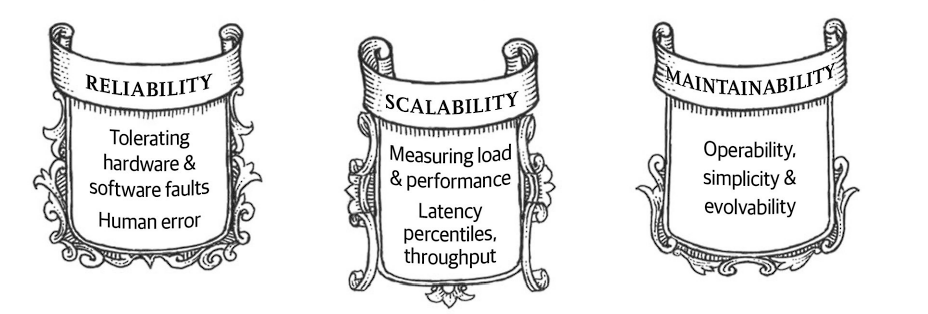

A majority portion of web applications are largely data-intensive, and not compute-intensive. The speed of fetching the overall data to process the requests is generally the limiting factor as is a general indication of data-intensive applications. One of the major issues these data-intensive applications face is ensuring data correctness even though the application faces severe issues internally. How can customer requests be served with satisfactory performance, even if a couple of systems are down? This is the question we would be asking ourselves, and will try to explore.

From a software architecture perspective, the following three concerns need to be addressed for such applications:

### 1. Reliability: 
The system should continue to work correctly even with failures and faults. Fault denotes that one or more components are facing the issue, whereas failure means the service as a whole stops providing service. Fault-tolerance mechanisms are placed to prevent faults from causing failures.

### 2. Scalability: 
It describes the system's ability to cope with an increased load. It's to be noted that scalability is multi-dimensional. We need to ask questions like "If the system grows in a certain way, what would be our option to handle such growth" and "How adding additional resources would handle the additional load?".

**Latency and response time** are two of the most used metrics to measure how scalable the system is. However, it's to be noted they're not synonymous.  Latency is the duration that a request is waiting to be handled, and response time is the delay that the customer observes in completing a request. p95, p99 and p999 are the most used percentiles to capture the metrics. For example, Amazon uses **p999 to measure the metrics**, as the slowest requests often come from users having the most data, making them high-value customers, and beyond this percentile, reducing the response time would be difficult, due to various random events that are beyond the control of web-application.

##### Approaches for coping with load:
- How  do we maintain good performance even when the load parameters increase by some amount
- Scaling up (vertical scaling) vs Scaling out (horizontal scaling)
- Common wisdom until recently is to keep the database on a single system (scale up) until scaling cost or high availability requirementsts force to make it distributed

### 3. Maintainability:
- **Operability**: Making life easy for operations
- **Simplicity**: Managing complexity
- **Evolvability**: Making future change easy

