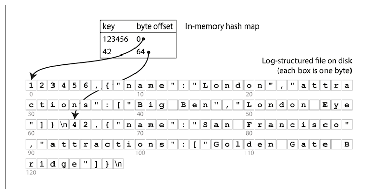
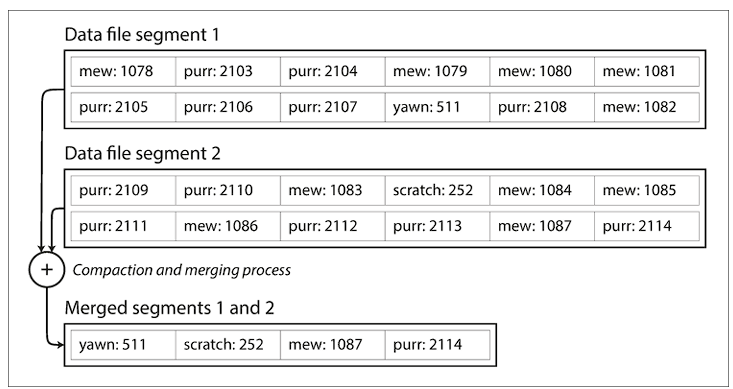
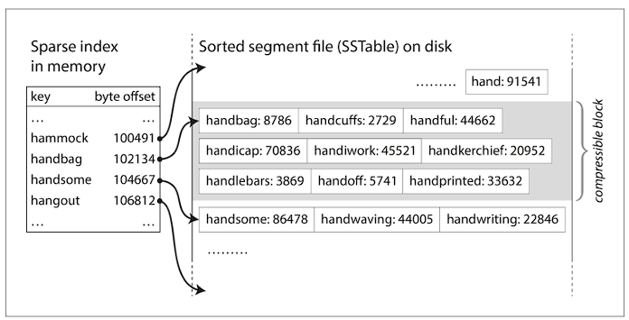
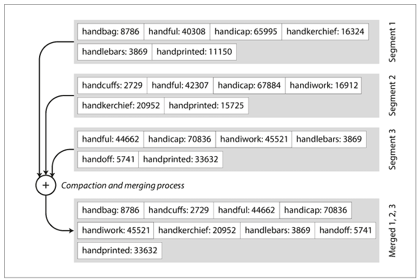
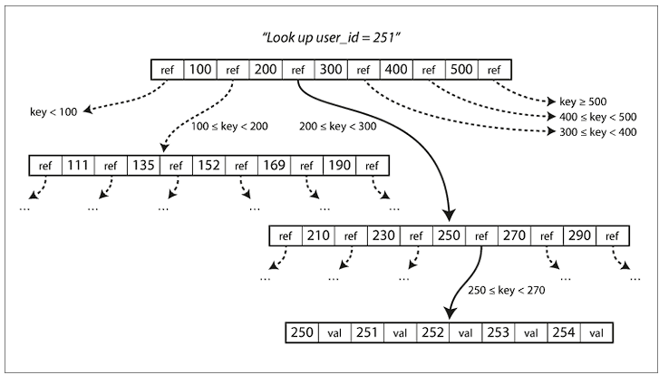

Storage and retrieval are also one of the major aspects after selecting the data model. Even though most of the developers are not going to make any changes to the storage engine, however, modern databases do provide the option to select a storage engine. This is where having a working knowledge of the internals of storage engines provides an edge. There's a big difference in the storage engine optimized for different sets of workloads, for example, transaction workload vs analytical workload.

### Choosing an index:

It's to be noted that there's a trade-off in the storage system concerning indexes. Well-chosen indexes speed up read queries, however, they also slow down write operations.

### Hash Index:

One of the most simple approach of storage engines is to use append only file, and to keep the indexes in-memory with the help of a hash-map. Hash-map contains the key and the byte-offset of the memory address. Whenever a new key-value pair is appended on the file, the key is added or updated on the in-memory hashmap.

Storage engine like *Bitcask* (default engine of Riak), uses this approach, with the limitation that the all the keys can be fit into the available RAM. These storage engines are suitable for use-cases where the value of each key is updated quite frequently, eg. view count of viral videos. 

Compaction and segmentation are used to ensure the efficiency of disk utilization. Once a segment is written, it's never modified, and once a couple of segments are created, they're merged through compaction. Once this compaction process is completed, the read requests are switched to the compact segment.

##### Implementation corner-stone of storage engine:
- *File format*
- *Deleting records*: Sometimes special deletion records are added called **tombstone entry**. When the segments are merged, the tombstone records signify the storage engine ignored the previous records for that key.
- *Crash Recovery*: Take a snapshot whenever for each segment hash-map on the disk, which can be loaded faster in case of storage engine restart. Along with it, need to parse the latest log file to have a complete hash-map. 
- *Partial written records*: Use checksum to detect corrupted parts. Also, the hash map is updated only after records are appended to the log file
- *Concurrency Control*: Only one write thread to make the writes sequential, and hence multiple read threads can read the values concurrently

##### Advantage:
- Sequential write operations are much faster than random writes
- Concurrency and crash recovery is very simplistic

##### Drawback:
- Difficult to scale up hash index via disk, as the on-disk hash map doesn't perform well
- Range queries are not efficient

### SSTables & LSM-Trees:

Segment files are sorted based on key. This format is known as Sorted String or *SSTable* for short. With this, the merging of segment files become efficient, by using an algorithm similar to merge sort. Also, there's no need to maintain the index of all the keys, a sparse index can be used with this.

##### How SSTable is used?
- When a write request comes in add the key to the in-memory balanced tree. This in-memory tree is known as **memtable**.
- When the memtable size exceeds a threshold, then flush out the memtable in the form of SSTable, and while the SSTable is getting written to disk, a new memtable instance is used for incoming write request
- When a read request is received, the current memtable instance is used to find the key in the latest segment, and if not found iteratively next older segment files are checked
- Run a merging and compaction process to combine segment files to discard overwritten and deleted records

While the SSTables are used to store the index, the actual write is happening on the storage layer in append-only format. Storage engines that follow this structure are called *Log-Structured Merge-Tree* (**LSM-Tree**).

### B-Trees:

B-Trees are most widely used for indexing structure. The major benefit of B-Tree is that it can hold large amount of data. For example, a four-level tree of 4 KB pages with a branching factor of 500 can store upto 250 TB. It's to be noted, the branching factor is decided in such a way that a node can fit in a page.

To make it crash consistent, a Write-ahead log (WAL) is used. It's an append-only file, and every modification is first applied to this WAL, before updating the B-Tree. This log, along with a snapshot can be used to easily build the B-Tree in case of a service crash. In addition, a lightweight lock, called *latch*, is used for concurrency control.

Multiple research papers tried to compare the B-Tree with LSM-Tree for index usage, however, the results are inconclusive, hence it's advisable to capture emperical data based on use-case.

### Multi-column Index:

Different databases opt for different ways to support multi-column indexes. The most common implementation is **concatenated index**, by concatenating the fields in a specific order (generally dicated by the DDL).

### Column-oriented storage:

Store all the values for each column together, instead of storing all values of the record together.
Useful for the analytical workload. Current databases either specialized on OLTP use-case or OLAP use-cases.

### Questions:
- Internal details of how compaction is implemented on storage engines like Bitcask?
- Why on-disk hash-map doesn't work well?

