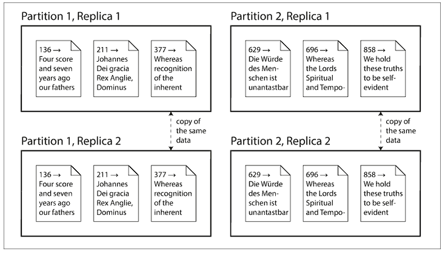
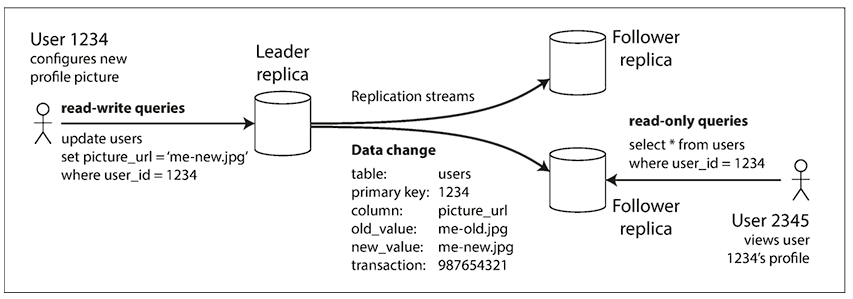
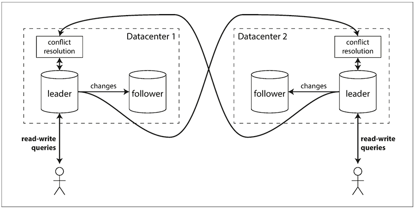
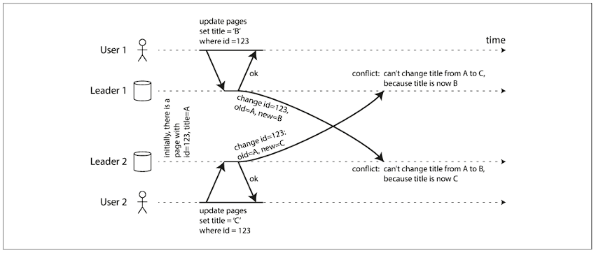
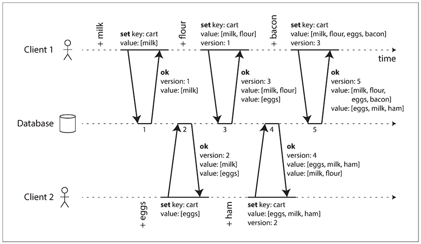

In this blog post, we would try to get an overview of the replication, and different scenarios that we would need to consider while picking up a replication solution. The discussions here would later help us to dig deep into the implementation of such replicated systems.

### Types of distributed systems:
- **Shared-memory architecture**: Many CPUs, RAM chips, and disks are joined under a single operating system and treated as a single machine. Upgrading this type of system is also known as vertical scaling or scaling up.
- **Shared-disk architecture**: Multiple systems with independent CPUs and RAMs are connected with a shared set of disks.
- **Shared-nothing architecture**: Each node is an independent system. Any coordination between them is achieved at the software level via a network. Upgrading this type of system is also known as horizontal scaling or scaling out.

##### Ways to distribute data across multiple nodes:
- **Replication**: Keeping a copy of the same data across multiple nodes, possibly around different geographical regions, to increase redundancy. This ensures data availability even in the case of node failure
- **Partitioning**: Splitting a big database into smaller subsets, so that each subset is assigned to a different node. This is also known as sharding. This process reduces the performance bottleneck.
It's to be noted that the above two ways are not mutually exclusive; rather, many distributed systems employ both techniques.

### Single leader replication

This is the most commonly used replication technique, active/passive or master-slave replication, where one replica is designated as the leader. All the clients must send write requests to the leader, as only the leader is allowed to accept written requests. And the rest of the replicas, called followers or slaves, take only the read requests. The leader can accept both read and write requests, and whenever it writes new data to its storage, the same info is propagated to the follower nodes for synchronization.

One important aspect of the replicated system is the replication process, whether it's performed synchronously or asynchronously. With synchronous followers, the leader waits for the majority of the followers to acknowledge the replication before sending a response to the write request. However, in the synchronous replication mechanism, the leader can't wait for all the followers to acknowledge the write operation, as any problematic node would impact the overall system's performance. There's a strong connection between consistency of replication and consensus.

On the other hand, in completely asynchronous replication, the leader doesn't wait for the followers to complete the write operation, with the drawback being that the write operation is not durable. 

#### Handling node outages:
The goal is to achieve high availability and to keep the impact of a node outage as little as possible.

##### Setting up a new follower node:
- Take a snapshot of the leader node, possibly without any lock, and copy the snapshot to the follower node
- Restore the snapshot to the follower node
- Configure the follower node to connect with the leader node and request the replication logs from the point snapshot was taken
- Once the follower has processed all the backlog and is caught up, it's ready to accept the replication data changes from the leader node

##### Follower Failover
- Follower replica is aware of the last transaction point in the replication log sequence
- Follower replica connects with the leader node to catch up with the replication log of the leader node

##### Leader Failover
- Determine that the leader has failed: Use a timeout, eg, 30 seconds. Each replica checks with other replicas. If the replicas don't get a response back from the leader for this timeout period, it's assumed to be dead
- Choosing a new leader: Follower nodes initiate an election process, where one of the most up-to-date replicas is voted as the leader node. Different consensus algorithms exist to make it possible
- Reconfiguring the system to use the new leader: The clients need to be reconfigured to redirect the write requests to the new leader

**Corner cases to think about:**
- What would happen if the former leader joins the network? What would happen to write operations that the leader contains? Generally, the extra write operation on the former leader is just discarded
- Discarding the excess writes on the former leader can create dangerous situations where, if other storage systems outside the database need to be coordinated with its content. For example, if a caching layer is used, and a conflict happens due to discarding the excess writes
- Split brain: What if the former leader still thinks of itself as the leader? There should be a safety mechanism to ensure the systems shut down one specific node if multiple leaders are detected

##### Implementation of Replication logs:
- **Statement-based replication**: the leader logs every write request that it executes, and sends the deterministic statement to the follower replicas. However, this approach has some drawbacks, for eg, issues with autoincrementing columns, or statements having some side-effects (triggers/stored procedures/ user-defined functions)

- **Write-ahead log (WAL) shipping**: Send the append-only WAL log contents to the follower replicas. The drawback is that WAL logs describe the data on a lower level, on a byte level. The storage engine update that affects WAL needs a downtime of the whole system.

- **Logical (row-based) replication**: A different log format is used to describe the changes on the row level. They provide enough information to uniquely identify the set of rows to apply the changes. The primary advantage of this approach is this type of replication is the replication log is decoupled from the storage engine internals.

- **Trigger-based replication**: Application code is triggered to support customized replication

##### Problems with replication lag:

Capacity of the replicated system can be increased by increasing the follower replicas. However, this is realistic only for completely asynchronous system. Even in that case also, the situation of eventual consistency arises, where there's no limit of how far a replica can be behind.

##### Reading your own writes:

Ways to achieve Read-after-write consistency, also known as read-your-write consistency
- Track the last updated time, and for one minute, make all the read requests to the leader. Prevent queries on any follower that is more than a minute behind the leader
- Client to remember the timestamp of the most recent write, and ensure that the replica serving any read for that user is updated at least until that timestamp. The timestamp can be any logical timestamp, like a log sequence number.

Additional issues to consider with cross-device-read-after-write consistency:
- How to remember the timestamp of the user's last update, as  the client connected with one device may not be aware of the other devices the same user is logged in
- If the replicas are distributed across different data centers, there's no guarantee that connections from different devices will be routed to the same data center

##### Monotonic Reads:
Monotonic reads guarantees that if a user reads a specific version of data, any subsequent reads by that same user will return either the same version or a more recent version – but never an older version. This prevents a user from seeing time moving backward when reading data.

##### Consistent Prefix Reads:
Consistent prefix reads guarantee that if a sequence of writes happens in a particular order, anyone reading those writes will see them appear in the same order. This preserves causality or sequence between related operations.

NB: Pretending that replication is synchronous when infact it's asynchrnous is a recipe for problems down the road.

### Multi-leader replication

Multi-leader replication generally makes sense with a setup of multi-datacenter operation. In case the replicated system is bounded within a single datacenter, then the multi-leader replication doesn't make sense, as the added complexity generally overwhelms the benefit. However, in case of a replicated system spanning across multiple datacenters, there's a need to have multiple leaders, each leader for each datacenter.

The downside of this configuration is that some data maybe concurrently updated on multiple datacenters, and these conflicts must be resolved. Besides, there can be other features which mayn't be exactly replicated in the leader like auto-incrementing keys, triggers, integrity constarains. Due to all these pitfalls, multi-leader replication is generally retro-fitted for specific use-case, and generally recommended to avoid.

##### Use-case:
- Clients with offline applications: eg, Calendar app. There's a local database; any changes made offline need to be synced asynchronously. Thus, they behave just like multi-leader replication
- Real-time collaborative editing: brings all the challenges of multi-leader replication, including the requirement of conflict resolution

##### Handling write conflicts:

**Approaches for Converging toward a consistent state:**
- Each write request is given a unique ID. Pick the write request with the highest ID as the winner and throw away the other writes. If any time-stamp is used, this technique is known as last write wins (LWW)
- Give each replica a unique ID, and let writes that originated at a higher-numbered replica always take precedence.
- Record the conflict in an explicit data structure, and write application code that resolves the conflict at some later time, possibly by prompting the user

**Custom conflict resolution logic:**
- On write: As soon as the system detects a conflict in the log replicated changes, the conflict handler is invoked. It is run as a background process, and can't prompt the user for conflict resolution
- On read: When a conflict is detected, all the writes are maintained, and all these versions are returned to the user. The user selects the version that needs to be retained and written back to the system.

### Leaderless replication

The client sends the write requests to several replicas, the requests are generally routed through a co-ordinator. It's to be noted that the co-ordinator doesn't enforce any ordering sequence.

When an unavailable node comes back online, there would be some stale values. In order to handle this scenario, the client reads from multiple replicas in parallel. Version numbers are used to determine which value is newer.

##### Read repair:
When a client reads from several replicas in parallel, it can detect any stale responses. The client writes the newer value back to that stale replica. This approach works well for those who are frequently reading.

##### Anti-entropy process:
Some replicated systems have a background process that constantly looks for differences and copies the missing data to the stale node. 

It's to be noted that not all the replicated systems implement an anti-entropy process.

##### Quoram:
w + r > n

Limitations:
- If sloppy quorum is used, then there's no guarantee of overlap between w writes and r reads.
- If two writes happen concurrently, then we need to have a conflict resolution mechanism in place
- The parameters w and r allow for adjusting the probability of a stale value being read; it's not a guarantee

Staleness Monitoring:
- For leader-based replication systems, it's the difference in the replication log from the leader
- In the case of a leaderless replication system, it's measured somewhat through an anti-entropy mechanism

##### Sloppy Quoram and Hinted Handoff:

If a couple of replicas are unreachable, in that case, sloppy quorum writes those writes in different nodes, which are not part of the original replicated system. Whenever the original nodes are back, the writes accepted by temporary nodes are sent to the appropriate "original" node. This is called a hinted handoff.

##### Multi-datecenter operations:
The client usually only waits for acknowledgment from a quorum of nodes within its local data center. The high-latency cross-datacenter writes are often configured to happen asynchronously, although there's some flexibility in the configuration.

# Detecting Concurrent Writes:

- Treat the keys as immutable
- The server maintains a version number for each key
- The client always reads a key before initiating a write operation. The server returns all the values with the versions that are not overwritten.
- The write request from a client must include a version number to be overwritten with a new version number and a merged set of values to be written.

With some implementation, all the previous versions are discarded with the write operation, as they're already merged into a new value.

Deletion-related operations need a "tombstone" marker with an appropriate version number to indicate that the item has been deleted when merging siblings.

### Questions & Future explorations:
- Chain replication: go into depth on how it works, and how Azure storage uses this synchronous replication technique
- CRDT data types, implementation, and how they are getting used
- How to handle concurrent writes for a stale replica?
- How anti-entropy process is implemented?
- Implementation of concurrent write conflict resolution. How are version numbers implemented and used for cross-data-center configuration?

