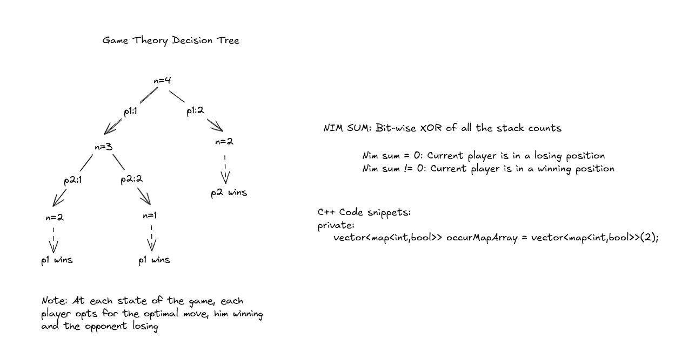

This post contains a couple of well-defined problems on game theory.



### Coins in a Line (394):

```cpp
public:
    /**
     * @param n: An integer
     * @return: A boolean which equals to true if the first player will win
     */
    bool isWinning(int playerId, int coinsLeft){
        if(occurMapArr[playerId].find(coinsLeft) != occurMapArr[playerId].end()){
            return occurMapArr[playerId][coinsLeft];
        } else if(coinsLeft<=0){
            return false;
        } else if(coinsLeft<=2){
            return true;
        } else if(playerId==0){
            occurMapArr[playerId][coinsLeft] = !isWinning(1, coinsLeft-1) || !isWinning(1, coinsLeft-2);
            return occurMapArr[playerId][coinsLeft];
        } else {
            occurMapArr[playerId][coinsLeft] = !isWinning(0, coinsLeft-1) || !isWinning(0,coinsLeft-2);
            return occurMapArr[playerId][coinsLeft];
        }
    }

    bool firstWillWin(int n) {
        // write your code here
        return isWinning(0,n);
    }

private:
    vector< map<int, bool>> occurMapArr = vector<map<int, bool>>(2);
```


### Coins in a Line II (395):

```
public:
    /**
     * @param values: a vector of integers
     * @return: a boolean which equals to true if the first player will win
     */
    bool isWinning(int playerId, vector<int> &values, int index, int value){
        if (occurMapArray[playerId].find(index) != occurMapArray[playerId].end()){
            return occurMapArray[playerId][index];
        }else if(index >= values.size()) {
            if(playerId==0 && value>=0){
                return true;
            } else if(playerId==1 && value<=0){
                return true;
            } else{
                return false;
            }
        } else {
            if(playerId==0){
                if(index+1 < values.size()){
                    occurMapArray[playerId][index] = !isWinning(1, values, index+1, value+values[index]) || 
                        !isWinning(1, values, index+2, value+values[index]+values[index+1]);
                } else {
                    occurMapArray[playerId][index] = !isWinning(1, values, index+1, value+values[index]);
                }
                return occurMapArray[playerId][index];
            } else {
                if(index+1 < values.size()){
                    occurMapArray[playerId][index] = !isWinning(0, values, index+1, value-values[index]) || 
                        !isWinning(0, values, index+2, value-values[index]-values[index+1]);
                } else {
                    occurMapArray[playerId][index] = !isWinning(0, values, index+1, value-values[index]);
                }
                return occurMapArray[playerId][index];
            }
        }
    }

    bool firstWillWin(vector<int> &values) {
        // write your code here
        return isWinning(0, values, 0, 0);
    }

private:
    vector<map<int,bool>> occurMapArray = vector<map<int,bool>>(2);
```


### Bash Game II (3735):

```cpp
    bool canWinBash(vector<int> &rocks) {
        // --- write your code here ---
        int nimSum = 0;
        for(int &val : rocks){
            nimSum ^= val;
        }
        return nimSum!=0;
    }
```