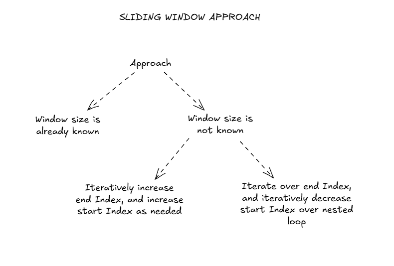

This post contains a couple of well-defined problems solved via sliding window approach.



### Minimum Swaps to Group All 1's Together (3675):

```cpp
    int countOccurance(vector<int> &arr, int val){
        int count = 0;
        for(int &elem : arr){
            if(elem == val){
                count++;
            }
        }
        return count;
    }
    
    int swapCount(vector<int> &arr){
        int windowSize = countOccurance(arr,1);

        int count1=0;
        for(int i=0;i<windowSize;i++){
            if(arr[i]==1){
                count1++;
            }
        }
        int minSwap=windowSize-count1;
        // cout<<"arr len"<<arr.size()<<" count1:"<<count1<<endl;
        for(int i=windowSize;i<arr.size();i++){
            // cout<<"index:"<<i<<" count:"<<count1<<endl;
            minSwap = min(minSwap, windowSize-count1);
            if(arr[i-windowSize]==1){
                count1--;
            }
            if(arr[i]==1){
                count1++;
            }
        }
        return minSwap;
    }

    int minSwaps(vector<int> &arr) {
        // write your code here
        return swapCount(arr);
    }
```


### Max Consecutive Ones III (3811):

```cpp
    int longestOnes(vector<int> &nums, int k) {
        // write your code here
        int swapsAvail = k;
        int currCount=0, maxCount=0;
        int start=0, end=0;
        for(end=0; end<nums.size();end++){
            if(nums[end]==1){
                currCount = end-start+1;
            } else if(nums[end]==0 && swapsAvail>0){
                swapsAvail--;
                currCount = end-start+1;
            } else {
                while(nums[start]!=0){
                    start++;
                }
                start++;
                currCount = end-start+1;
            }
            // cout<<start<<","<<end<<","<<currCount<<endl;
            maxCount = max(maxCount, currCount);
        }
        return maxCount;
    }
```


### Subarray Product Less Than K (1075):

```cpp
    int numSubarrayProductLessThanK(vector<int> &nums, int k) {
        // Write your code here
        int start=0, end=0;
        int count=0;
        long long int currVal = 1;
        for(end=0;end<nums.size();end++){
            long long int prevVal = currVal;
            currVal *= nums[end];
            while(currVal>=k && start<end){
                if(prevVal < k){
                    count += (end-start);
                }
                if(currVal != 0){
                    currVal /= nums[start];
                }
                start++;
            }
            // cout<<start<<","<<end<<":"<<currVal<<","<<count<<endl;
        }
        while(start<=end && currVal<k){
            count += (end-start);
            start++;
        }
        return count;
    }
```


### Number of Equal Count Substrings (3751):

```cpp
    int numSubarrayProductLessThanK(vector<int> &nums, int k) {
        // Write your code here
        int start=0, end=0;
        int count=0;
        long long int currVal = 1;
        for(end=0;end<nums.size();end++){
            long long int prevVal = currVal;
            currVal *= nums[end];
            while(currVal>=k && start<end){
                if(prevVal < k){
                    count += (end-start);
                }
                if(currVal != 0){
                    currVal /= nums[start];
                }
                start++;
            }
            // cout<<start<<","<<end<<":"<<currVal<<","<<count<<endl;
        }
        while(start<=end && currVal<k){
            count += (end-start);
            start++;
        }
        return count;
    }
```


### Longest Nice Subarray (3603):

```cpp
    vector<int> convertToBinary(int val){
        vector<int> array(64, 0);
        int index=0;
        while(val>0){
            array[index] = (val & 1);
            val >>= 1;
            index++;
        }
        return array;
    }

    int longestNiceSubarray(vector<int> &nums) {
        // --- write your code here ---
        int maxLen = 0;
        for(int end=0;end<nums.size();end++){
            vector<int> digitCountArray(64, 0);
            for(int start=end;start>=0;start--){
                vector<int> binArray = convertToBinary(nums[start]);
                bool isEntryValid = true;
                for(int i=0;i<64;i++){
                    if(binArray[i]>0 && digitCountArray[i]>0){
                        isEntryValid = false;
                        break;
                    }
                }
                if(!isEntryValid){
                    break;
                }
                // cout<<"valid: "<<start<<","<<end<<endl;
                for(int i=0;i<64;i++){
                    digitCountArray[i] +=  binArray[i];
                }
                maxLen = max(maxLen, end-start+1);
            }
        }
        return maxLen;
    }
```

